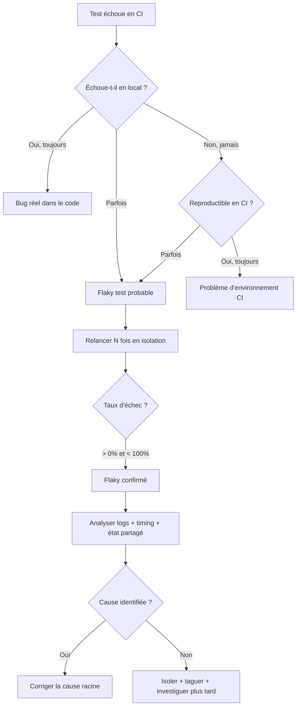

# Flaky tests : identifier, diagnostiquer et éradiquer les tests instables

## Objectifs pédagogiques

À l'issue de ce module, vous serez capable de :

- Reconnaître un flaky test et le distinguer d'un vrai bug ou d'un faux positif
- Identifier les causes les plus fréquentes d'instabilité dans une suite de tests
- Mettre en place une stratégie de diagnostic structurée face à un test non déterministe
- Appliquer les bonnes pratiques pour réduire l'instabilité dès la conception
- Décider quand isoler, corriger ou supprimer un test instable

---

## Mise en situation

Tu travailles en équipe sur une application web. Le pipeline CI tourne toutes les nuits, et chaque matin tu reçois un rapport. Vert hier, rouge aujourd'hui. Tu regardes le test qui a échoué — un test d'intégration sur le formulaire de login. Tu le relances manuellement. Il passe. Tu le relances encore. Il passe toujours. Personne n'a touché au code depuis hier soir.

Alors c'est quoi, le problème ?

C'est un flaky test. Et si l'équipe n'a pas de stratégie pour y répondre, elle va finir par ignorer les rapports CI. Quand on ignore les rapports CI, les vrais bugs passent en production. C'est exactement comme ça que ça se passe, dans cet ordre.

---

## Ce que c'est — et pourquoi c'est plus sérieux qu'il n'y paraît

Un **flaky test** est un test qui produit des résultats différents sur le même code, sans modification. Il passe parfois, échoue parfois — de façon apparemment aléatoire.

Le mot "flaky" vient de l'anglais : qui s'écaille, peu fiable. Une surface qui paraît solide mais se désagrège sous la pression. C'est une image exacte.

🧠 Un flaky test n'est pas un faux positif classique. Un faux positif signale *toujours* un problème qui n'existe pas. Un flaky test, lui, *oscille* : il peut signaler un vrai problème ou pas, selon des conditions que ni le test ni le code ne maîtrisent. C'est précisément ce qui le rend difficile à attraper — et dangereux.

Ce qui érode une équipe, ce n'est pas l'échec lui-même. C'est l'apprentissage progressif que "cet échec ne veut rien dire". Une fois ce réflexe installé, le pipeline CI devient décoratif.

> Google l'a mesuré en 2016 : sur leurs serveurs CI, **1,5 % des tests présentaient un comportement flaky**. Ces tests représentaient **84 % des faux échecs** observés dans leurs pipelines. L'effort consenti sur ce 1,5 % avait un impact disproportionné sur la confiance dans l'ensemble des suites.

---

## Pourquoi les tests deviennent instables

Un test peut très bien fonctionner en local, réussir en CI 90 % du temps, et casser le vendredi soir sans raison apparente. Les causes sont presque toujours dans l'une de ces cinq familles.

### Dépendances temporelles

Le test suppose qu'une opération asynchrone sera terminée à un instant précis. En pratique, rien ne le garantit — surtout sur une machine surchargée.

```python
# ❌ Flaky : on suppose que le chargement prend moins de 2 secondes
time.sleep(2)
assert page.find_element("result").is_displayed()

# ✅ Stable : on attend que l'élément soit effectivement présent
WebDriverWait(driver, 10).until(
    EC.visibility_of_element_located((By.ID, "result"))
)
```

⚠️ Utiliser `sleep()` pour compenser l'asynchronisme est la première cause de flakiness en tests UI. Le délai fixe crée une fenêtre arbitraire : trop courte sur une CI lente, elle provoque un échec ; trop longue, elle ralentit toute la suite sans fiabilité supplémentaire.

### Ordre d'exécution des tests

Deux tests fonctionnent parfaitement en isolation mais échouent quand ils tournent dans un certain ordre. C'est le signe classique qu'un test modifie un état global sans le nettoyer après lui.

```python
# Test A : insère un utilisateur en base
def test_create_user():
    db.insert({"id": 1, "name": "Alice"})
    assert db.count() == 1

# Test B : suppose que la base est vide
def test_user_count_empty():
    assert db.count() == 0  # ❌ Échoue si A a tourné avant
```

🧠 Chaque test doit être **hermétique** : il prépare son propre contexte, agit, vérifie, puis nettoie. Une dépendance à l'état laissé par un autre test est un couplage caché — il passera inaperçu jusqu'au jour où l'ordre d'exécution change.

### Concurrence et ressources partagées

En parallélisation, plusieurs tests accèdent simultanément à la même ressource : même port réseau, même fichier temporaire, même ligne en base de données. Le premier arrive, les autres se heurtent à un état inattendu.

Ce type de flakiness est particulièrement vicieux : le test passe systématiquement en séquentiel, et échoue de façon aléatoire dès qu'on active la parallélisation.

### Données non maîtrisées

Le test appelle une vraie API externe, s'appuie sur la date du jour, ou utilise des données qui varient selon l'environnement.

```python
# ❌ Flaky : valide seulement en décembre
assert get_promo_status() == "active"

# ✅ Stable : la date est injectée, le résultat est prévisible
assert get_promo_status(date=datetime(2024, 12, 15)) == "active"
```

Tout test qui dépend de "maintenant" produira inévitablement un résultat différent demain.

### Environnement instable

Réseau lent, machine CI surchargée, conteneur qui redémarre, base de données avec un verrou en cours... Ces causes sont *externes* au test. Elles méritent une investigation séparée de la flakiness applicative, mais leurs symptômes sont identiques : des échecs intermittents sans modification du code.

---

## Diagnostiquer un flaky test — méthode structurée

Face à un test instable, l'instinct naturel est de le relancer jusqu'à ce qu'il passe. C'est précisément ce qu'il ne faut pas faire — on masque le problème sans rien apprendre.



### Étape 1 — Reproduire de façon contrôlée

Relancez le test seul, plusieurs fois de suite. Si le taux d'échec est non nul, vous avez un flaky test. Notez ce taux — il servira à prioriser.

```bash
# Relancer 20 fois le même test pour mesurer sa stabilité
pytest tests/test_login.py --count=20 --repeat-scope=function
```

Un test qui échoue 1 fois sur 20 n'a pas la même urgence qu'un test qui échoue 1 fois sur 3. Cette mesure initiale guide tout ce qui suit.

### Étape 2 — Isoler le contexte

Trois questions à poser systématiquement :

- Le test échoue-t-il seul, ou seulement quand d'autres tests tournent avant lui ?
- Le test échoue-t-il sur toutes les machines, ou uniquement en CI ?
- Y a-t-il un pattern temporel (heure fixe, charge particulière, jour de semaine) ?

Ces réponses orientent directement vers la famille de cause.

### Étape 3 — Lire les logs avec attention

Un flaky test laisse presque toujours des traces. Ce qu'il faut chercher :

- Timeouts ou erreurs de connexion réseau
- "Element not found" ou "stale element reference" en tests UI
- Erreurs de contrainte d'unicité en base de données
- Différences de timing dans les timestamps entre les runs

💡 Activez les logs DEBUG pour les tests suspects. En Selenium, `--log-level=DEBUG` révèle souvent des tentatives de clic sur un élément qui n'était pas encore interactif — une cause que les logs INFO masquent complètement.

### Étape 4 — Catégoriser la cause

| Catégorie | Symptôme typique | Direction de correction |
|---|---|---|
| Timing / async | "Element not found", timeout | Remplacer `sleep` par attentes explicites |
| État partagé | Échoue selon l'ordre d'exécution | Isolation + teardown systématique |
| Concurrence | Échoue en parallèle, pas en séquentiel | Ressources dédiées par test |
| Données dynamiques | Échoue selon la date ou l'heure | Injecter ou mocker les dépendances |
| Environnement | Échoue uniquement en CI | Diagnostiquer l'infra CI séparément |

---

## Gérer les flaky tests dans l'équipe

Corriger un flaky test prend du temps. Ils ne peuvent pas tous être traités immédiatement. Sans politique claire, ils s'accumulent jusqu'à ce que le pipeline perde tout sens.

### Taguer pour ne pas perdre le signal

La première action n'est pas de corriger — c'est de rendre le problème visible sans bloquer l'équipe.

```python
@pytest.mark.flaky
def test_payment_webhook():
    ...
```

```bash
# Pipeline principal : exclure les flaky pour garder un signal fiable
pytest -m "not flaky"

# Pipeline de surveillance : uniquement les flaky, pour suivre leur évolution
pytest -m "flaky" --count=10
```

Cette séparation préserve la fiabilité du pipeline principal sans supprimer les tests ni perdre leur signal. Un test exclu du pipeline principal reste visible — il n'est pas oublié.

### Prioriser par taux d'échec

Le taux mesuré à l'étape de diagnostic détermine l'urgence :

- **> 20 % d'échecs** → critique — bloquer le pipeline, corriger en urgence
- **5–20 %** → haute priorité — traiter dans le sprint en cours
- **< 5 %** → taguer, surveiller, corriger quand possible

### Le piège du retry automatique

⚠️ Certaines équipes configurent le CI pour relancer automatiquement les tests en échec. C'est tentant, et ça "fonctionne" à court terme. Mais si un test passe au 3e essai, il est flaky — et le retry masque ce signal. Pire : quand un vrai bug fait échouer ce test, le retry le cache lui aussi.

Le retry automatique n'est acceptable qu'en mesure temporaire explicite, avec une date de correction planifiée. Ce n'est pas une solution — c'est un délai.

### Quand supprimer un test

Supprimer un test est une décision légitime dans deux cas précis :
1. Le test est si instable qu'il ne produit aucune information fiable, et la correction coûte plus que la valeur apportée
2. Ce que le test couvre est déjà vérifié par d'autres tests plus stables

Ne supprimez jamais sans documenter ce que le test vérifiait et pourquoi il a été retiré. Cette trace évite de réintroduire le même test six mois plus tard.

---

## Bonnes pratiques pour éviter les flaky tests dès le départ

La meilleure façon de gérer les flaky tests reste de ne pas en créer. Quelques principes qui changent tout à l'échelle d'une suite de tests.

**Construire des tests hermétiques.** Chaque test crée son contexte, agit, vérifie, nettoie. Les fixtures de setup/teardown sont là pour ça — les utiliser systématiquement, pas occasionnellement.

**Attentes explicites plutôt que délais fixes.** En tests UI ou asynchrones, attendez une condition observable (élément visible, état en base, message reçu) plutôt qu'un nombre de secondes arbitraire.

**Injecter ou mocker toute dépendance externe.** Dates, appels réseau, sources d'aléatoire — tout ce qui n'est pas sous contrôle du test doit être remplacé par une valeur déterministe. Un test qui dépend de "maintenant" ou d'une API live est un flaky test en attente.

**Ressources isolées par test.** Si vos tests touchent une base de données, utilisez des transactions annulées en teardown, ou des bases isolées par worker de CI. La contention sur une ressource partagée est la cause la plus difficile à déboguer en parallélisation.

💡 Dans une suite Selenium, le pattern **Page Object Model** réduit naturellement la flakiness : en centralisant les attentes et les interactions dans des objets dédiés, vous évitez les accès directs aux éléments bruts qui provoquent des "stale element reference".

**Surveiller le taux de flakiness dans le temps.** Un test stable qui commence à osciller est un signal d'alerte : quelque chose a changé dans l'environnement ou dans le code sous-jacent. Des outils comme Allure, BuildKite ou les dashboards GitHub Actions permettent de suivre ce taux sur la durée — et d'attraper la dérive avant qu'elle devienne un problème.

---

## Résumé

Un flaky test passe parfois, échoue parfois, sur le même code — sans modification. Sa dangerosité vient de l'érosion de confiance qu'il installe progressivement : quand l'équipe apprend à ignorer les échecs CI, les vrais bugs passent inaperçus.

Les causes sont connues et finies : dépendances au temps, état partagé entre tests, concurrence sur des ressources, données non contrôlées, environnement instable. Les diagnostiquer demande une méthode — reproduire de façon contrôlée, isoler le contexte, lire les logs, catégoriser — et surtout ne pas se contenter de relancer jusqu'au vert.

En pratique, tous les flaky tests ne peuvent pas être corrigés immédiatement. Il faut une politique : taguer, mesurer le taux d'échec, prioriser par urgence, et résister à la tentation du retry automatique qui masque le problème sans le résoudre.

La prévention reste l'investissement le plus rentable : des tests hermétiques, des attentes explicites, des dépendances injectées. Ce n'est pas plus de travail — c'est du travail mieux orienté dès le départ.

---

<!-- snippet
id: qa_flaky_definition
type: concept
tech: testing
level: intermediate
importance: high
format: knowledge
tags: flaky,tests instables,ci,non-determinisme
title: Ce qu'est un flaky test — mécanisme
content: Un flaky test produit des résultats différents sur le même code sans aucune modification. Il ne signale pas un bug constant : il oscille entre succès et échec selon des conditions non maîtrisées (timing, état partagé, environnement). Danger réel : l'équipe finit par ignorer les rapports CI, et les vrais bugs passent en production.
description: Un flaky test oscille entre succès et échec sans changement de code — il érode la confiance dans le pipeline CI.
-->

<!-- snippet
id: qa_flaky_sleep_antipattern
type: warning
tech: testing
level: intermediate
importance: high
format: knowledge
tags: flaky,sleep,async,selenium,timing
title: sleep() en test async — cause n°1 de flakiness
content: Piège : utiliser time.sleep(2) pour attendre qu'un élément soit chargé. Conséquence : sur une CI lente ou une machine chargée, 2s peut ne pas suffire — le test échoue de façon aléatoire. Correction : utiliser des attentes explicites sur une condition observable — WebDriverWait(driver, 10).until(EC.visibility_of_element_located((By.ID, "result"))).
description: Remplacer tout sleep() par une attente explicite sur une condition observable — le délai fixe ne tient pas sous charge.
-->

<!-- snippet
id: qa_flaky_hermetic_test
type: concept
tech: testing
level: intermediate
importance: high
format: knowledge
tags: isolation,setup,teardown,etat partage,hermétique
title: Test hermétique — principe d'isolation
content: Un test hermétique crée son propre contexte (setup), exécute son action, vérifie le résultat, puis nettoie (teardown). Il ne dépend d'aucun état laissé par un autre test. Si deux tests fonctionnent seuls mais échouent dans un certain ordre, c'est qu'ils partagent un état global non nettoyé — la cause la plus fréquente de flakiness liée à l'ordre d'exécution.
description: Chaque test doit créer, utiliser et nettoyer son propre contexte — toute dépendance à un état externe provoque du flakiness.
-->

<!-- snippet
id: qa_flaky_pytest_repeat
type: command
tech: pytest
level: intermediate
importance: medium
format: knowledge
tags: flaky,pytest,diagnostic,reproduction,repeat
title: Reproduire un flaky test — relancer N fois
context: Après installation de pytest-repeat (pip install pytest-repeat)
command: pytest <CHEMIN_TEST> --count=<N> --repeat-scope=function
example: pytest tests/test_login.py --count=20 --repeat-scope=function
description: Relancer le test 20 fois en isolation pour mesurer son taux d'échec réel — confirme ou infirme la flakiness.
-->

<!-- snippet
id: qa_flaky_pytest_marker
type: tip
tech: pytest
level: intermediate
importance: medium
format: knowledge
tags: flaky,pytest,marker,ci,pipeline
title: Taguer les flaky tests pour les exclure du pipeline principal
content: Ajouter @pytest.mark.flaky sur les tests instables, puis lancer pytest -m "not flaky" en CI principale et pytest -m "flaky" --count=10 dans un pipeline de surveillance séparé. Cela préserve la fiabilité du pipeline principal sans supprimer les tests ni perdre leur signal.
description: Isoler les flaky tests avec un marker pytest permet de les surveiller sans bloquer le pipeline principal.
-->

<!-- snippet
id: qa_flaky_retry_antipattern
type: warning
tech: ci-cd
level: intermediate
importance: high
format: knowledge
tags: retry,ci,flaky,pipeline,anti-pattern
title: Retry automatique en CI — solution palliative dangereuse
content: Piège : configurer le CI pour relancer automatiquement les tests en échec (ex : retries: 3 dans GitHub Actions). Conséquence : le test flaky passe au 3e essai, le pipeline est vert — et le problème sous-jacent reste invisible. Si un vrai bug fait échouer le test, le retry le masque aussi. Correction : utiliser le retry comme mesure temporaire uniquement, taguer le test et planifier la correction.
description: Le retry automatique masque le flaky test sans le corriger — à n'utiliser qu'en mesure temporaire avec une date de correction planifiée.
-->

<!-- snippet
id: qa_flaky_dynamic_data
type: warning
tech: testing
level: intermediate
importance: medium
format: knowledge
tags: flaky,données,date,mock,injection
title: Données dynamiques dans les tests — source de flakiness cachée
content: Piège : un test qui dépend de la date réelle, d'une API externe ou de données aléatoires produit un résultat différent selon le moment d'exécution. Conséquence : le test passe en décembre, échoue en janvier. Correction : injecter les données variables comme paramètre (ex : get_promo_status(date=datetime(2024,12,15))) et mocker les appels réseau avec des réponses fixes.
description: Tout test dépendant de la date, de l'heure ou d'une API live est potentiellement flaky — injecter ou mocker ces dépendances.
-->

<!-- snippet
id: qa_flaky_triage_priority
type: concept
tech: testing
level: intermediate
importance: medium
format: knowledge
tags: flaky,priorisation,taux echec,triage
title: Prioriser les flaky tests selon leur taux d'échec
content: Taux > 20% → critique, bloquer le pipeline et corriger en urgence. Taux 5–20% → haute priorité, traiter dans le sprint. Taux < 5% → taguer, surveiller, corriger quand possible. Mesurer le taux en relançant le test 10 à 20 fois en isolation avec pytest --count=N.
description: Le taux d'échec d'un flaky test (mesuré sur 10–20 runs) détermine sa priorité de correction — au-dessus de 20%, c'est urgent.
-->

<!-- snippet
id: qa_flaky_concurrency_isolation
type: tip
tech: testing
level: intermediate
importance: medium
format: knowledge
tags: flaky,concurrence,parallelisation,ressources,isolation
title: Isoler les ressources pour éviter la flakiness en parallèle
content: Quand les tests sont parallelisés, plusieurs workers accèdent simultanément aux mêmes ressources (port réseau, fichier temporaire, base de données). Solution : allouer des ressources dédiées par worker — base de données isolée, port dynamique, répertoire temporaire unique. Un test qui passe en séquentiel et échoue en parallèle signale presque toujours une contention sur une ressource partagée.
description: En parallélisation, allouer des ressources dédiées par worker — la contention sur une ressource partagée est la cause la plus difficile à déboguer.
-->

<!-- snippet
id: qa_flaky_delete_decision
type: concept
tech: testing
level: intermediate
importance: low
format: knowledge
tags: flaky,suppression,dette technique,documentation
title: Supprimer un flaky test — quand et comment décider
content: Supprimer un test est légitime dans deux cas : (1) le test est si instable qu'il ne produit aucune information fiable ET la correction coûte plus que la valeur apportée, (2) ce qu'il couvre est déjà vérifié par des tests plus stables. Dans tous les cas, documenter ce que le test vérifiait et la raison de la suppression — sans cette trace, le même test sera réintroduit six mois plus tard.
description: Supprimer un flaky test est légitime si le coût de correction dépasse sa valeur — à condition de documenter ce qu'il vérifiait.
-->
