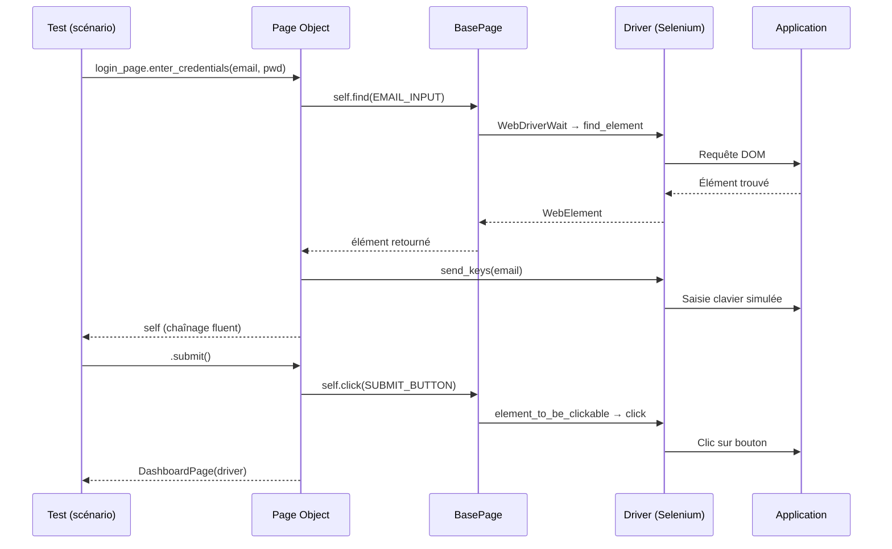

# Architecture de framework de test

## Objectifs pédagogiques

À l'issue de ce module, vous serez capable de :

1. **Identifier** les composants d'un framework de test et leur rôle respectif
2. **Structurer** un projet de tests automatisés avec une architecture maintenable
3. **Appliquer** le pattern Page Object Model pour découpler UI et logique de test
4. **Évaluer** les compromis entre flexibilité, maintenabilité et complexité d'un framework
5. **Refactorer** une suite de tests plats vers une architecture en couches

---

## Le problème que vous allez forcément rencontrer

Vous rejoignez une équipe QA qui automatise les tests d'une application e-commerce. Le code existant ressemble à ça :

```python
def test_checkout():
    driver.get("https://shop.example.com/login")
    driver.find_element(By.ID, "email").send_keys("user@test.com")
    driver.find_element(By.ID, "password").send_keys("secret123")
    driver.find_element(By.CSS_SELECTOR, ".btn-login").click()
    driver.get("https://shop.example.com/cart")
    driver.find_element(By.XPATH, "//button[@data-id='checkout']").click()
    # ... 80 lignes supplémentaires
```

Trois semaines plus tard, le designer renomme `.btn-login` en `.btn-submit`. Résultat : 23 tests cassés. Vous passez une matinée entière à chercher partout où ce sélecteur est hardcodé — dans chaque fichier, dans chaque fonction, une par une.

Ce n'est pas un problème de discipline. C'est un problème d'architecture. Et c'est exactement ce que ce module résout.

---

## Pourquoi l'architecture d'un framework de test existe

Un test non structuré fonctionne. Un temps. Puis l'application évolue, l'équipe grandit, les tests se multiplient — et ce qui était un script pratique devient un boulet de maintenance.

L'architecture d'un framework répond à une question simple : **comment organiser le code de test pour qu'il reste fiable, lisible et modifiable sur la durée ?**

La réponse n'est pas "ajouter des classes partout". C'est définir des **couches de responsabilités** claires, exactement comme on le fait dans le code de production. Un framework bien architecturé offre trois garanties concrètes :

- **Résilience** — un changement d'UI n'impacte qu'un seul endroit dans le code de test
- **Lisibilité** — un test se lit comme une spécification fonctionnelle, pas comme du XPath
- **Réutilisabilité** — les actions communes s'écrivent une fois, utilisées partout

---

## Les trois couches d'un framework

Tout framework de test, quelle que soit la technologie, repose sur les mêmes responsabilités fondamentales. Voici comment les représenter :

```
┌─────────────────────────────────────────┐
│             COUCHE TEST                 │  ← Ce que le système doit faire
│   (scénarios, assertions, données)      │
├─────────────────────────────────────────┤
│          COUCHE ABSTRACTION UI          │  ← Comment interagir avec l'interface
│     (Page Objects, composants)          │
├─────────────────────────────────────────┤
│          COUCHE INFRASTRUCTURE          │  ← Avec quoi on tourne
│   (driver, config, fixtures, logging)   │
└─────────────────────────────────────────┘
```

Ce découplage n'est pas théorique. Quand le designer renomme un bouton, seule la couche abstraction UI change. Quand les exigences métier évoluent, seule la couche test change. Les deux peuvent évoluer indépendamment, sans se bloquer mutuellement.

---

## Le pattern Page Object Model

🧠 **Le Page Object Model (POM) est le pattern architectural central de l'automatisation UI.** Il encapsule les interactions avec une page dans une classe dédiée, de sorte que les tests ne touchent jamais directement les sélecteurs.

### Sans POM — le problème concret

```python
# test_login.py — sans POM
def test_login_valid():
    driver.find_element(By.ID, "email").send_keys("admin@test.com")
    driver.find_element(By.ID, "pwd").send_keys("pass123")
    driver.find_element(By.CSS_SELECTOR, ".submit-btn").click()
    assert "Dashboard" in driver.title

def test_login_invalid():
    driver.find_element(By.ID, "email").send_keys("nobody@test.com")
    driver.find_element(By.ID, "pwd").send_keys("wrong")
    driver.find_element(By.CSS_SELECTOR, ".submit-btn").click()
    assert "Invalid credentials" in driver.find_element(By.CLASS_NAME, "error-msg").text
```

Le sélecteur `By.ID, "pwd"` est dupliqué dans deux tests. Si l'attribut `id` passe à `password`, vous modifiez chaque occurrence manuellement. Sur 30 tests, c'est une demi-journée perdue.

### Avec POM — la structure

```python
# pages/login_page.py
class LoginPage:
    # Sélecteurs centralisés — modifiés une seule fois si l'UI change
    EMAIL_INPUT    = (By.ID, "email")
    PASSWORD_INPUT = (By.ID, "pwd")
    SUBMIT_BUTTON  = (By.CSS_SELECTOR, ".submit-btn")
    ERROR_MESSAGE  = (By.CLASS_NAME, "error-msg")

    def __init__(self, driver):
        self.driver = driver

    def open(self):
        self.driver.get("https://app.example.com/login")
        return self                        # permet le chaînage fluent

    def enter_credentials(self, email, password):
        self.driver.find_element(*self.EMAIL_INPUT).send_keys(email)
        self.driver.find_element(*self.PASSWORD_INPUT).send_keys(password)
        return self

    def submit(self):
        self.driver.find_element(*self.SUBMIT_BUTTON).click()
        return DashboardPage(self.driver)  # retourne la page cible après navigation

    def get_error_message(self):
        return self.driver.find_element(*self.ERROR_MESSAGE).text
```

```python
# tests/test_login.py — avec POM
def test_login_valid(driver):
    login = LoginPage(driver).open()
    dashboard = login.enter_credentials("admin@test.com", "pass123").submit()
    assert dashboard.is_loaded()

def test_login_invalid(driver):
    login = LoginPage(driver).open()
    login.enter_credentials("nobody@test.com", "wrong").submit()
    assert "Invalid credentials" in login.get_error_message()
```

💡 Les tests ne contiennent plus aucun sélecteur. Ils lisent comme une spécification fonctionnelle. Si `By.ID, "pwd"` change demain, vous modifiez **une seule ligne** dans `LoginPage` — les deux tests continuent de fonctionner sans y toucher.

---

## Construction progressive d'un framework

Partir directement sur une architecture complexe est l'erreur la plus courante. Voici comment construire de façon incrémentale, en ajoutant de la structure uniquement quand la douleur est réelle.

### V1 — Structure minimale viable

Pour 10 à 20 tests, une structure simple suffit :

```
project/
├── tests/
│   ├── test_login.py
│   └── test_checkout.py
├── pages/
│   ├── login_page.py
│   └── checkout_page.py
├── conftest.py          ← fixtures Pytest (driver, config)
└── requirements.txt
```

La séparation `tests/` / `pages/` est déjà suffisante pour isoler les sélecteurs de la logique de test. Le `conftest.py` centralise la création du driver :

```python
# conftest.py — configuration Pytest centralisée
import pytest
from selenium import webdriver

@pytest.fixture(scope="function")  # un driver frais par test
def driver():
    options = webdriver.ChromeOptions()
    options.add_argument("--headless")       # compatible CI
    drv = webdriver.Chrome(options=options)
    drv.implicitly_wait(10)
    yield drv                                # le test s'exécute ici
    drv.quit()                               # teardown garanti même en cas d'échec
```

⚠️ Le `yield` dans la fixture est essentiel : le code après `yield` s'exécute même si le test lève une exception. `drv.quit()` n'est donc jamais oublié.

### V2 — Données et configuration externalisées

Quand les environnements se multiplient (staging, prod, local) et que les données de test commencent à se dupliquer, on ajoute deux couches :

```
project/
├── tests/
├── pages/
├── data/
│   ├── users.json       ← données de test découplées du code
│   └── products.json
├── config/
│   ├── settings.py      ← URLs, timeouts, environnement
│   └── .env             ← credentials — jamais commités
└── conftest.py
```

```python
# config/settings.py
import os
from dataclasses import dataclass

@dataclass
class Config:
    base_url: str  = os.getenv("BASE_URL", "https://staging.example.com")
    timeout:  int  = int(os.getenv("TIMEOUT", "10"))
    headless: bool = os.getenv("HEADLESS", "true").lower() == "true"
```

```json
// data/users.json
{
  "valid_user":   { "email": "qa@test.com",     "password": "Test1234!" },
  "locked_user":  { "email": "locked@test.com", "password": "Test1234!" }
}
```

Changer d'environnement revient à modifier une variable d'environnement — pas à toucher au code.

### V3 — Framework production-ready

Pour 100+ tests, une CI/CD et plusieurs environnements, la structure s'étoffe avec une `BasePage` qui centralise les attentes et les comportements communs :

```
project/
├── tests/
│   ├── e2e/             ← scénarios bout en bout
│   ├── integration/     ← tests d'intégration API
│   └── regression/      ← non-régression ciblée
├── pages/
│   ├── base_page.py     ← classe mère avec comportements communs
│   ├── login_page.py
│   └── checkout_page.py
├── components/          ← éléments réutilisables (header, modal, datepicker)
│   └── navigation.py
├── utils/
│   ├── api_client.py    ← appels API pour setup/teardown rapide
│   ├── wait_helpers.py  ← attentes explicites personnalisées
│   └── screenshot.py    ← capture auto en cas d'échec
├── data/
├── config/
├── reports/             ← ignoré par git, généré à l'exécution
├── conftest.py
└── pytest.ini
```

```python
# pages/base_page.py — comportements communs à toutes les pages
from selenium.webdriver.support.ui import WebDriverWait
from selenium.webdriver.support import expected_conditions as EC

class BasePage:
    def __init__(self, driver, config):
        self.driver = driver
        self.config = config
        self.wait   = WebDriverWait(driver, config.timeout)

    def find(self, locator):
        return self.wait.until(EC.presence_of_element_located(locator))

    def click(self, locator):
        # Attendre que l'élément soit cliquable, pas juste présent
        self.wait.until(EC.element_to_be_clickable(locator)).click()

    def take_screenshot(self, name):
        self.driver.save_screenshot(f"reports/screenshots/{name}.png")
```

Toutes les pages héritent de `BasePage`. Modifier le timeout global = changer `config.timeout`. Ajouter un comportement partagé (retry, scroll into view) = modifier `BasePage` une seule fois.

---

## Comment les couches interagissent — séquence d'un test



Le test ne voit jamais le driver directement. Il parle au Page Object, qui délègue à `BasePage`, qui parle à Selenium. Chaque couche a une responsabilité unique.

---

## Quelle architecture choisir ?

Tout dépend du volume et de la maturité de la suite.

| Contexte | Architecture | Pourquoi |
|----------|-------------|----------|
| < 20 tests, équipe solo | V1 — POM simple | Overhead minimal, itération rapide |
| 20–100 tests, 2-3 personnes | V2 — config/data externalisés | Évite la duplication, multi-environnements |
| 100+ tests, CI/CD, multi-env | V3 — framework complet | Maintenabilité, parallélisation, reporting |
| Tests API uniquement | Pas de POM — couche service | POM est spécifique à l'UI |

⚠️ **Erreur fréquente** : appliquer V3 dès le départ sur un projet de 15 tests. Vous passerez plus de temps à maintenir le framework qu'à écrire des tests utiles. Commencez simple, refactorez quand la douleur apparaît — pas par anticipation.

---

## Bonnes pratiques

**Un test = un scénario = une assertion principale.** Un test qui vérifie dix choses est impossible à déboguer. Quand il échoue, vous devez savoir immédiatement *ce qui* a échoué — pas parcourir 40 lignes d'assertions.

**Préparez l'état via API, pas via UI.** Si votre test de checkout nécessite un utilisateur connecté avec un panier rempli, créez cet état via des appels API dans le `setup` — pas en cliquant à travers trois pages. C'est dix fois plus rapide et élimine les faux positifs liés à l'UI de setup.

```python
@pytest.fixture
def authenticated_user_with_cart(api_client):
    user = api_client.create_user(email="test@qa.com")
    api_client.add_to_cart(user.id, product_id=42)
    api_client.login_session(user)          # injecte le cookie de session
    yield user
    api_client.delete_user(user.id)         # cleanup garanti
```

**Nommez vos tests comme des spécifications.** `test_login_with_invalid_password_shows_error_message` > `test_login_2`. Six mois plus tard, en CI à 2h du matin, le nom doit suffire à comprendre le scénario sans ouvrir le fichier.

**Gérez les attentes explicitement.** `time.sleep(2)` est le signal d'un framework fragile. `WebDriverWait` avec une condition précise est plus rapide *et* plus fiable — il attend exactement ce dont le test a besoin, ni plus ni moins.

```python
# ❌ fragile : 2s peut être trop court sur CI, trop long en local
time.sleep(2)
element = driver.find_element(By.ID, "result")

# ✅ attend la condition réelle, jusqu'à 10s maximum
element = WebDriverWait(driver, 10).until(
    EC.visibility_of_element_located((By.ID, "result"))
)
```

**Versionnez les données, jamais les credentials.** Les fichiers JSON dans `data/` sont commités avec le code. Les mots de passe et tokens dans `.env` ne le sont jamais — `.env` appartient au `.gitignore`.

**Centralisez les sélecteurs comme attributs de classe.** `EMAIL_INPUT = (By.ID, "email")` en haut de la classe, `find_element(*self.EMAIL_INPUT)` dans les méthodes. Si le sélecteur change, une seule ligne à toucher dans tout le projet.

---

## Cas réel — refactoring chez un retailer en ligne

Une équipe QA de 3 personnes chez un retailer e-commerce gérait 180 tests Selenium écrits sans architecture. Chaque test manipulait directement le DOM. Résultat : lors d'une refonte UI majeure (renommage de classes CSS et restructuration des formulaires), **47 tests ont cassé simultanément**. Le diagnostic et la correction ont pris 4 jours.

L'équipe a refactorisé vers une architecture V3 en deux sprints :

- **Sprint 1** : extraction des sélecteurs dans des Page Objects, création de la `BasePage`, migration de la configuration vers `settings.py`
- **Sprint 2** : externalisation des données de test en JSON, remplacement des `sleep()` par des `WebDriverWait`, ajout de la capture automatique de screenshots à l'échec

Lors de la refonte UI suivante, trois mois plus tard, **8 tests ont cassé** (contre 47) — tous corrigés en moins d'une heure, en modifiant uniquement les Page Objects concernés. La durée d'exécution de la suite est passée de 22 minutes à 14 minutes grâce à l'élimination des `sleep()`.

🧠 Le gain n'est pas visible au premier sprint. Il se mesure au troisième changement d'UI.

---

## Résumé

Un framework de test bien architecturé repose sur trois couches — infrastructure, abstraction UI, scénarios — qui évoluent indépendamment. Le **Page Object Model** est le pattern qui matérialise cette séparation : les sélecteurs vivent dans des classes dédiées, jamais dans les tests. La **BasePage** centralise les comportements communs (attentes, screenshots). Le `conftest.py` orchestre le cycle de vie du driver via `yield`.

La progression recommandée est V1 → V2 → V3 selon le volume réel, pas par anticipation. Et le critère de réussite reste le même à chaque niveau : quand l'UI change, vous modifiez **un seul endroit**. Quand un test échoue, vous comprenez **immédiatement pourquoi**.

---

<!-- snippet
id: qa_pom_structure
type: concept
tech: selenium
level: advanced
importance: high
tags: page-object-model,selenium,architecture,framework,ui-testing
title: Page Object Model — principe de fonctionnement
content: Le POM centralise les sélecteurs et les interactions d'une page dans une classe dédiée. Les tests n'accèdent jamais directement au DOM. Résultat : si By.ID "email" change en By.ID "user-email", vous modifiez uniquement LoginPage — pas chaque test. La méthode retourne généralement self (chaînage) ou la page cible après navigation.
description: Encapsule sélecteurs + interactions dans une classe par page. Changement UI = 1 seul endroit modifié.
-->

<!-- snippet
id: qa_selector_centralization
type: tip
tech: selenium
level: intermediate
importance: high
tags: selecteurs,maintenance,page-object,localisation,refactoring
title: Centraliser les sélecteurs comme attributs de classe dans le Page Object
content: Déclarer les sélecteurs en haut de la classe : EMAIL_INPUT = (By.ID, "email"). Utiliser find_element(*self.EMAIL_INPUT) avec l'unpacking *. Si le sélecteur change, une seule ligne à modifier. Ne jamais passer de By.X directement dans les méthodes de test — c'est la règle de base du POM.
description: Sélecteurs en attributs de classe (BUTTON = (By.ID, "x")) + unpacking find_element(*self.BUTTON). Changement UI = 1 ligne.
-->

<!-- snippet
id: qa_pom_return_page
type: tip
tech: selenium
level: advanced
importance: medium
tags: page-object-model,fluent-interface,navigation,chainage
title: Page Object — retourner la page cible après une action de navigation
content: Une méthode qui déclenche une navigation (ex: submit()) doit retourner une instance de la page cible : return DashboardPage(self.driver). Cela permet le chaînage fluent (login.enter_credentials(...).submit().assert_title()) et documente implicitement le flux de navigation dans le code.
description: submit() retourne DashboardPage(driver), pas self. Documente le flux de navigation et permet le chaînage fluent entre pages.
-->

<!-- snippet
id: qa_conftest_driver_fixture
type: concept
tech: pytest
level: intermediate
importance: high
tags: pytest,fixture,selenium,setup,teardown
title: conftest.py — fixture driver avec teardown garanti
content: La fixture driver dans conftest.py utilise yield pour séparer setup et teardown. Le code après yield s'exécute même si le test échoue. scope="function" crée un driver frais par test (isolation maximale). scope="session" réutilise le même driver pour toute la suite (vitesse, mais risque de pollution entre tests).
description: yield dans une fixture Pytest garantit l'exécution du teardown (drv.quit()) même en cas d'échec du test.
-->

<!-- snippet
id: qa_explicit_wait_vs_sleep
type: warning
tech: selenium
level: intermediate
importance: high
tags: selenium,wait,flaky-tests,performance,webdriverwait
title: time.sleep() dans les tests Selenium — piège de stabilité
content: Piège : time.sleep(3) pour attendre qu'un élément apparaisse → le test est lent et toujours fragile (3s peut être trop court sur CI). Conséquence : suite instable, faux positifs, temps d'exécution gonflé. Correction : WebDriverWait(driver, 10).until(EC.visibility_of_element_located((By.ID, "result"))) — attend exactement la condition nécessaire, timeout configurable.
description: sleep() = temps fixe sans garantie. WebDriverWait attend la condition réelle — plus rapide et sans faux positifs.
-->

<!-- snippet
id: qa_base_page_wait
type: concept
tech: selenium
level: advanced
importance: medium
tags: base-page,page-object,wait,architecture,selenium
title: BasePage — centraliser les attentes et comportements communs
content: La classe BasePage reçoit driver et config dans __init__ et instancie WebDriverWait(driver, config.timeout). Toutes les pages héritent de BasePage. Méthodes typiques : find(locator) avec EC.presence_of_element_located, click(locator) avec EC.element_to_be_clickable, take_screenshot(name). Modifier le timeout global = modifier uniquement config.timeout.
description: BasePage centralise WebDriverWait et les méthodes communes. Les Page Objects héritent de BasePage sans redéfinir la logique d'attente.
-->

<!-- snippet
id: qa_setup_via_api
type: tip
tech: pytest
level: advanced
importance: high
tags: fixture,api,setup,performance,test-architecture
title: Préparer l'état de test via API plutôt que via UI
content: Pour un test de checkout, créer l'utilisateur et remplir le panier via API dans la fixture (api_client.create_user(), api_client.add_to_cart()) puis injecter le cookie de session. Évite de cliquer à travers 3 pages UI à chaque test — gain de vitesse x10 et zéro faux positif lié à l'UI de setup.
description: Setup via API = 10x plus rapide que navigation UI. Utiliser api_client dans la fixture pour créer users, données, sessions.
-->

<!-- snippet
id: qa_framework_v1_structure
type: concept
tech: python
level: intermediate
importance: medium
tags: framework,structure,architecture,projet,organisation
title: Structure V1 d'un framework de test (moins de 20 tests)
content: Structure minimale viable : tests/ (scénarios), pages/ (Page Objects), conftest.py (fixtures driver/config), requirements.txt. Ajouter data/ et config/ uniquement quand la duplication de données devient douloureuse. Commencer simple et refactorer sur la douleur réelle, pas par anticipation.
description: V1 = tests/ + pages/ + conftest.py. Ajouter les couches data/config/utils uniquement quand la douleur de maintenance est réelle.
-->

<!-- snippet
id: qa_framework_progression
type: concept
tech: python
level: intermediate
importance: medium
tags: framework,architecture,progression,v1,v2,v3,décision
title: Choisir le niveau d'architecture selon le volume de tests
content: V1 (< 20 tests) : POM simple + conftest.py. V2 (20-100 tests) : ajouter data/ et config/ pour externaliser données et URLs. V3 (100+ tests, CI/CD) : BasePage, utils/, components/, pytest.ini. Critère de décision : refactorer uniquement quand la douleur de maintenance est réelle, pas par anticipation. Appliquer V3 à 15 tests = plus de temps sur le framework que sur les tests.
description: V1→V2→V3 selon le volume réel. Ne pas sur-architecturer : commencer simple, refactorer sur la douleur.
-->

<!-- snippet
id: qa_test_naming_convention
type: tip
tech: pytest
level: beginner
importance: medium
tags: nommage,lisibilité,pytest,convention,documentation
title: Nommer les tests comme des spécifications lisibles
content: Préférer test_login_with_invalid_password_shows_error_message à test_login_2 ou test_invalid. Quand un test échoue en CI à 2h du matin, le nom doit indiquer immédiatement le scénario et l'assertion attendue sans ouvrir le fichier. Convention : test_<objet>_<condition>_<résultat_attendu>.
description: Convention : test_<objet>_<condition>_<résultat_attendu>. Le nom doit suffire à comprendre le scénario sans lire le code.
-->
