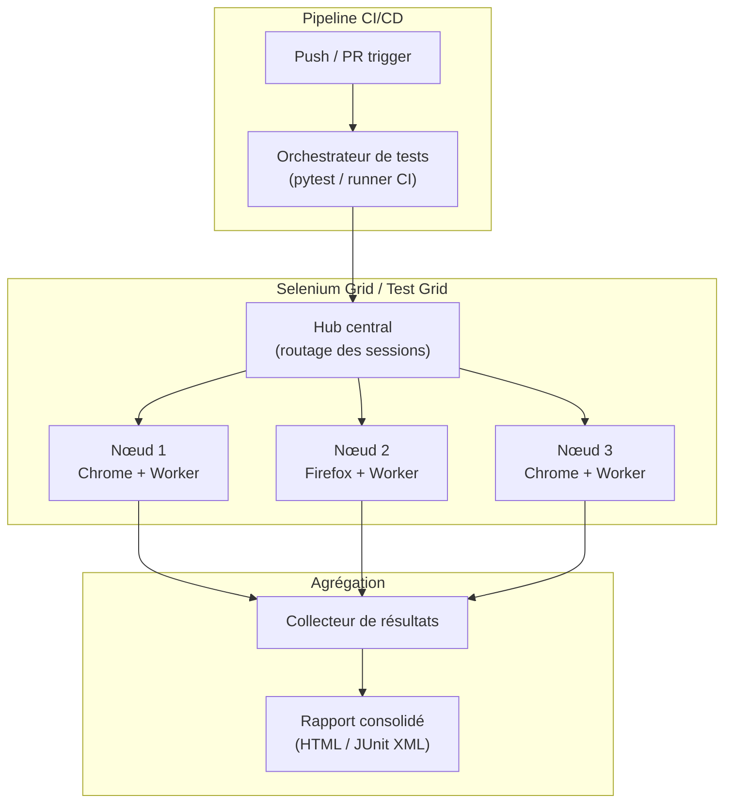

# Tests distribués & parallélisation

## Objectifs pédagogiques

À la fin de ce module, vous serez capable de :

- Expliquer pourquoi l'exécution séquentielle devient un goulot d'étranglement à partir d'un certain volume de tests
- Configurer une suite de tests pour s'exécuter en parallèle avec `pytest-xdist`
- Mettre en place un Selenium Grid pour distribuer les tests UI sur plusieurs nœuds
- Identifier et corriger les dépendances entre tests qui bloquent la parallélisation
- Intégrer des tests distribués dans un pipeline CI/CD avec groupes équilibrés par durée

---

## Mise en situation

Une équipe de 6 développeurs sur une application e-commerce. La suite de tests a grandi avec le produit : 1 200 tests fonctionnels, 300 tests UI, quelques dizaines de tests d'intégration. Sur un seul runner CI, tout ça tourne en séquence — **47 minutes**.

Le vrai problème n'est pas la durée en soi. C'est ce qu'elle provoque : les devs poussent leur code, passent à autre chose, et quand la CI plante 45 minutes plus tard, ils ont la tête ailleurs depuis longtemps. Le re-contextualisation coûte cher. Et la nuit, les régressions passent inaperçues jusqu'au lendemain matin.

Optimiser les tests un par un ne changera rien à l'échelle. Si chaque test prend 2 secondes en moyenne, il faut structurellement changer la façon de les exécuter — pas juste les rendre légèrement plus rapides. C'est là qu'entrent en jeu la **parallélisation** et la **distribution** : deux techniques différentes, souvent complémentaires, qui peuvent faire tomber ce 47 minutes à moins de 10.

---

## Pourquoi l'exécution séquentielle ne passe pas à l'échelle

Un test, c'est en grande partie du temps d'attente : appels réseau, chargements de page, requêtes base de données. Pendant qu'un test UI attend qu'un bouton apparaisse, le CPU ne fait rien. Multiplié par 1 500 tests, c'est un gaspillage massif.

```
Test 1 → [setup] [exécution] [teardown]
Test 2 →                                 [setup] [exécution] [teardown]
Test 3 →                                                                [setup] ...
```

C'est une file de caisse avec 10 clients et un seul caissier. La parallélisation, c'est ouvrir plusieurs caisses.

Deux dimensions à distinguer — les gens les confondent souvent :

**Parallélisation locale** — plusieurs workers sur la même machine, chacun exécutant un sous-ensemble des tests simultanément. Gain typique : facteur 4 à 8 selon le nombre de cœurs.

**Distribution** — les tests sont envoyés à des agents sur des machines différentes (physiques, VMs ou conteneurs). Utile quand les tests nécessitent des environnements spécifiques (Chrome, Firefox, Safari) ou quand la charge dépasse ce qu'une seule machine peut absorber.

Dans la pratique, on combine souvent les deux : chaque nœud distant exécute lui-même ses tests en parallèle.

---

## Architecture d'un système de tests distribués



| Composant | Rôle | Exemple concret |
|-----------|------|-----------------|
| **Orchestrateur** | Découpe la suite en groupes, distribue le travail | pytest-xdist, GitHub Actions matrix |
| **Hub / Router** | Reçoit les demandes de session browser et les route vers un nœud libre | Selenium Grid Hub, Selenoid |
| **Nœud worker** | Exécute réellement les tests, héberge le browser | Conteneur Docker avec Chrome |
| **Collecteur** | Agrège les résultats de tous les workers | JUnit XML merger, Allure |
| **Fixtures partagées** | État ou données communes (BDD de test, tokens…) | Fixture pytest `scope=session` |

---

## Parallélisation locale avec pytest-xdist

### Installation et premiers pas

```bash
pip install pytest-xdist
```

Lancer les tests sur 4 workers en parallèle :

```bash
pytest -n 4
```

Laisser pytest choisir le nombre de workers selon les cœurs disponibles :

```bash
pytest -n auto
```

C'est souvent le point de départ — et parfois ça suffit. Mais ça ne marche pas si les tests ne sont pas indépendants les uns des autres. C'est le prérequis fondamental, et c'est ce qu'on voit maintenant.

### Modes de distribution

`pytest-xdist` propose plusieurs stratégies pour répartir les tests entre workers :

```bash
# Distribution équilibrée (défaut) — chaque worker prend un test à la fois
pytest -n 4 --dist=load

# Par fichier — tous les tests d'un même fichier vont sur le même worker
pytest -n 4 --dist=loadfile

# Par scope défini dans les tests (marker)
pytest -n 4 --dist=loadscope
```

💡 `--dist=loadfile` est souvent le bon compromis au départ : si des tests dans le même fichier partagent un état, ils restent ensemble. C'est moins risqué qu'une distribution totalement aléatoire.

### L'isolation — là où ça se complique vraiment

La parallélisation impose une contrainte dure : **deux tests ne doivent jamais interférer l'un avec l'autre**.

```python
# ❌ PROBLÈME : deux workers modifient la même ligne en base
def test_update_user_email():
    user = get_user(id=1)
    user.email = "new@example.com"
    user.save()
    assert user.email == "new@example.com"

def test_user_email_format():
    user = get_user(id=1)
    assert "@" in user.email  # ← peut échouer si test_update a tourné en parallèle
```

La solution : chaque test crée ses propres données, avec un identifiant unique.

```python
# ✅ Chaque test crée son propre utilisateur
@pytest.fixture
def unique_user(db_session):
    user = User(email=f"user_{uuid.uuid4()}@test.com")
    db_session.add(user)
    db_session.commit()
    yield user
    db_session.delete(user)
    db_session.commit()
```

🧠 Un test est "parallélisable" s'il est **idempotent** et **hermétique** : il ne dépend d'aucun état global, ne modifie rien de visible par un autre test, et peut tourner dans n'importe quel ordre sans que son résultat change.

### Base de données par worker

Un pattern courant en entreprise : créer une base de données dédiée par worker.

```python
# conftest.py
import pytest
from sqlalchemy import create_engine

@pytest.fixture(scope="session")
def db_engine(worker_id):
    """worker_id est injecté automatiquement par pytest-xdist"""
    if worker_id == "master":
        db_name = "test_db"
    else:
        db_name = f"test_db_{worker_id}"

    engine = create_engine(f"postgresql://localhost/{db_name}")
    yield engine
    engine.dispose()
```

`worker_id` vaut `gw0`, `gw1`, `gw2`, etc. pour chaque worker parallèle. C'est automatiquement injecté par `pytest-xdist` — il suffit de nommer le paramètre ainsi dans la fixture, sans import ni déclaration supplémentaire.

---

## Distribution sur plusieurs machines avec Selenium Grid

### Pourquoi Selenium Grid et pas juste xdist ?

Les tests UI sont gourmands. Un Chrome avec Selenium consomme facilement 300–500 Mo de RAM et un cœur CPU entier. Sur une machine standard à 8 cœurs, on peut réalistement faire tourner 4 à 6 instances — pas plus.

Avec 300 tests UI à 30 secondes chacun, même 6 workers parallèles donnent encore 25 minutes. Pour passer sous 10 minutes, il faut distribuer sur plusieurs machines.

Selenium Grid joue le rôle d'un **répartiteur de charge pour browsers** : votre code demande "j'ai besoin d'un Chrome", le Grid trouve un nœud disponible et lui envoie la session.

### Mise en place avec Docker Compose

```yaml
# docker-compose.yml
version: "3.8"

services:
  selenium-hub:
    image: selenium/hub:4.18
    ports:
      - "4442:4442"
      - "4443:4443"
      - "4444:4444"
    environment:
      SE_NODE_MAX_SESSIONS: 5

  chrome-node-1:
    image: selenium/node-chrome:4.18
    depends_on:
      - selenium-hub
    environment:
      SE_EVENT_BUS_HOST: selenium-hub
      SE_EVENT_BUS_PUBLISH_PORT: 4442
      SE_EVENT_BUS_SUBSCRIBE_PORT: 4443
      SE_NODE_MAX_SESSIONS: 3
    shm_size: 2gb

  chrome-node-2:
    image: selenium/node-chrome:4.18
    depends_on:
      - selenium-hub
    environment:
      SE_EVENT_BUS_HOST: selenium-hub
      SE_EVENT_BUS_PUBLISH_PORT: 4442
      SE_EVENT_BUS_SUBSCRIBE_PORT: 4443
      SE_NODE_MAX_SESSIONS: 3
    shm_size: 2gb

  firefox-node:
    image: selenium/node-firefox:4.18
    depends_on:
      - selenium-hub
    environment:
      SE_EVENT_BUS_HOST: selenium-hub
      SE_EVENT_BUS_PUBLISH_PORT: 4442
      SE_EVENT_BUS_SUBSCRIBE_PORT: 4443
      SE_NODE_MAX_SESSIONS: 2
    shm_size: 2gb
```

Démarrer le Grid et vérifier les nœuds :

```bash
docker-compose up -d
curl http://localhost:4444/status | python -m json.tool
```

⚠️ Le paramètre `shm_size: 2gb` est **critique** pour Chrome. Sans lui, le renderer Chrome crashe aléatoirement car `/dev/shm` (mémoire partagée) est limité à 64 Mo par défaut dans Docker. C'est l'un des bugs les plus mystérieux à déboguer : les tests échouent de façon non déterministe, sans message d'erreur clair.

### Connecter les tests au Grid

```python
# conftest.py
import pytest
from selenium import webdriver
from selenium.webdriver.chrome.options import Options

@pytest.fixture(scope="function")
def driver(request):
    chrome_options = Options()
    chrome_options.add_argument("--headless")
    chrome_options.add_argument("--no-sandbox")
    chrome_options.add_argument("--disable-dev-shm-usage")

    driver = webdriver.Remote(
        command_executor="http://localhost:4444/wd/hub",
        options=chrome_options
    )
    driver.implicitly_wait(10)

    yield driver
    driver.quit()
```

Les tests eux-mêmes ne changent pas — ils utilisent la fixture `driver` exactement comme avant. Le Grid est totalement transparent pour le code de test.

```python
def test_login_page_title(driver):
    driver.get("https://myapp.example.com/login")
    assert "Connexion" in driver.title
```

Pour inspecter l'état du Grid en cours de route :

```bash
# Interface graphique
open http://localhost:4444/ui

# API JSON
curl http://localhost:4444/status

# Sessions actives
curl http://localhost:4444/se/grid/api/sessions
```

---

## Construction progressive d'une suite parallélisée

Plutôt que de tout reconfigurer d'un coup, voici comment aborder la migration en trois étapes.

**V1 — Point de départ** : tests séquentiels, aucune isolation explicite.

```bash
pytest tests/ --tb=short
# → 1200 tests, 47 minutes
```

**V2 — Parallélisation locale, sans toucher aux tests** :

```bash
pytest tests/ -n auto --dist=loadfile --tb=short
# → 1200 tests, ~12 minutes si les tests sont suffisamment isolés
```

Certains tests vont probablement casser — c'est voulu. Ces échecs révèlent les dépendances cachées que personne n'avait documentées. Chaque test qui échoue en parallèle mais passe en séquentiel est un test qui dépendait d'un effet de bord.

💡 Pour isoler rapidement les tests problématiques :

```bash
# Relancer uniquement les tests échoués, en séquentiel, pour confirmer
pytest --last-failed -n0
```

**V3 — Isolation propre + distribution sur Grid** : une fois l'isolation assurée, on peut séparer les tests par type et allouer les ressources en conséquence.

```ini
# pytest.ini
[pytest]
markers =
    ui: Tests nécessitant un vrai navigateur
    api: Tests d'API (pas de browser)
    unit: Tests unitaires rapides
```

```bash
# Trois jobs parallèles distincts en CI

# Job 1 — Tests unitaires et API (rapides, nombreux workers)
pytest -m "unit or api" -n 8

# Job 2 — Tests UI sur le Grid
pytest -m "ui" -n 4 --selenium-hub=http://grid:4444/wd/hub

# Job 3 — Tests d'intégration (souvent plus fragiles, moins de parallélisme)
pytest -m "integration" -n 2
```

Cette séparation permet d'allouer les ressources selon les besoins réels : les tests UI sont lents et gourmands, les tests unitaires sont rapides et légers.

---

## Intégration dans un pipeline CI/CD

### GitHub Actions — Matrix strategy

La `matrix` de GitHub Actions est l'outil natif pour distribuer des tests sur plusieurs runners :

```yaml
# .github/workflows/tests.yml
name: Test Suite

on: [push, pull_request]

jobs:
  test:
    runs-on: ubuntu-latest

    strategy:
      matrix:
        test-group: [unit, api, ui-chrome, ui-firefox]
        python-version: ["3.11"]
      fail-fast: false

    steps:
      - uses: actions/checkout@v4

      - name: Set up Python
        uses: actions/setup-python@v5
        with:
          python-version: ${{ matrix.python-version }}

      - name: Install dependencies
        run: pip install -r requirements.txt

      - name: Start Selenium Grid (UI tests only)
        if: startsWith(matrix.test-group, 'ui')
        run: docker-compose -f docker-compose.selenium.yml up -d

      - name: Run tests
        run: |
          pytest -m ${{ matrix.test-group }} \
            -n auto \
            --junit-xml=results-${{ matrix.test-group }}.xml

      - name: Upload results
        uses: actions/upload-artifact@v4
        if: always()
        with:
          name: test-results-${{ matrix.test-group }}
          path: results-*.xml

  merge-results:
    needs: test
    runs-on: ubuntu-latest
    if: always()
    steps:
      - uses: actions/download-artifact@v4
      - name: Merge JUnit reports
        run: |
          pip install junitparser
          junitparser merge results-*/*.xml merged-results.xml
```

⚠️ `fail-fast: false` est essentiel. Sans cette option, si les tests UI échouent, GitHub annule automatiquement les autres jobs en cours — et vous perdez des informations précieuses sur l'étendue des problèmes.

### Groupes dynamiques avec pytest-split

Décider statiquement des groupes n'est pas optimal : certains finissent en 2 minutes, d'autres en 20. Une approche plus fine utilise les timings historiques pour équilibrer les groupes en durée, pas en nombre de tests.

```bash
pip install pytest-split

# Premier run : enregistrer les durées
pytest --store-durations --durations-path=.test_durations.json

# Ensuite : diviser en N groupes de durée égale
pytest --splits=4 --group=1 --durations-path=.test_durations.json  # Runner 1
pytest --splits=4 --group=2 --durations-path=.test_durations.json  # Runner 2
pytest --splits=4 --group=3 --durations-path=.test_durations.json  # Runner 3
pytest --splits=4 --group=4 --durations-path=.test_durations.json  # Runner 4
```

Au lieu de "Runner 1 prend les 300 premiers tests", on dit "Runner 1 prend les tests qui totalisent 25% du temps total". Les 4 runners finissent à peu près en même temps — plus de runner qui traîne pendant que les autres ont fini depuis 10 minutes.

---

## Diagnostic et erreurs fréquentes

### Tests qui passent seuls mais échouent en parallèle

**Symptôme** : `PASSED` en séquentiel, `FAILED` en parallèle avec une erreur inattendue — contrainte unique en base, élément non trouvé, valeur d'assertion incorrecte.

**Cause** : le test dépend d'un état global — une ligne en base, une variable de module, un fichier temporaire avec un nom fixe.

```python
# ❌ Nom de fichier fixe — collision entre workers
def test_export():
    export_to_file(data, "/tmp/export.csv")
    assert os.path.exists("/tmp/export.csv")

# ✅ Fichier unique par test via la fixture tmp_path
def test_export(tmp_path):
    export_to_file(data, tmp_path / "export.csv")
    assert (tmp_path / "export.csv").exists()
```

### Le Grid ne répond plus en cours de session

**Symptôme** : `MaxRetryError` ou `WebDriverException: Unable to connect to remote server` après quelques minutes.

**Cause probable** : trop de sessions simultanées, ou les nœuds Chrome ont crashé (souvent `/dev/shm` trop petit).

```bash
# Vérifier l'état du Grid
curl http://localhost:4444/status | python -m json.tool

# Logs du nœud
docker-compose logs chrome-node-1 --tail=50
```

### Tests UI trop lents même en parallèle

**Symptôme** : même avec 8 workers, les tests UI prennent 30+ minutes.

**Cause fréquente** : les attentes implicites sont trop longues — chaque élément absent déclenche un timeout complet.

```python
# ❌ Chaque "élément absent" attend 30s
driver.implicitly_wait(30)

# ✅ Attente explicite ciblée sur chaque action
from selenium.webdriver.support.ui import WebDriverWait
from selenium.webdriver.support import expected_conditions as EC

wait = WebDriverWait(driver, 10)
element = wait.until(EC.element_to_be_clickable((By.ID, "submit-btn")))
```

### Ordre des tests qui change le résultat

**Symptôme** : la suite passe avec `pytest -n 4` mais échoue avec `pytest -n 4 --randomly-seed=12345`.

**Cause** : les tests ont des dépendances implicites sur l'ordre (test A crée une ressource que test B utilise).

```bash
pip install pytest-randomly
pytest -n 4 --randomly-seed=random  # Seed différent à chaque run
```

Utiliser `pytest-randomly` délibérément pendant le développement permet de détecter ces couplages avant qu'ils ne causent des problèmes en production.

---

## Cas réel en entreprise

**Contexte** : une équipe de 8 personnes sur une plateforme SaaS B2B. 800 tests automatisés — 600 API, 200 UI. Temps initial : 52 minutes sur un seul runner GitLab CI.

**Problème** : les Merge Requests restaient bloquées presque une heure. L'équipe avait pris l'habitude de merger sans attendre la CI, et les régressions n'étaient découvertes que le soir.

**Démarche** :

1. **Audit des tests** — lancer `pytest -n 4` et observer les échecs. Résultat : 23 tests avec des dépendances cachées sur des données en base.
2. **Refactoring ciblé** — passage à des fixtures `unique_*` avec UUID pour toutes les entités créées en test. Durée : 2 jours.
3. **Séparation API / UI** — deux jobs GitLab séparés. Tests API avec `pytest -n 8`, tests UI sur un Grid Docker à 3 nœuds Chrome.
4. **pytest-split** pour équilibrer les groupes sur la base des durées enregistrées sur 10 runs précédents.

**Résultats** :
- Tests API : 8 minutes (contre 35 avant)
- Tests UI : 11 minutes (contre 17 avant, avec une meilleure couverture navigateurs)
- Temps perçu par les devs : **11 minutes** — les deux jobs tournent en parallèle
- Taux de "merge sans attendre la CI" : passé de ~60% à moins de 5%

Le gain réel n'était pas que technique. C'est la confiance retrouvée dans la CI qui a changé les habitudes de l'équipe.

---

## Bonnes pratiques

**Isolation avant parallélisation** — Paralléliser des tests qui partagent un état ne résout rien, ça rend les problèmes non déterministes et difficiles à reproduire. Corriger d'abord l'isolation, paralléliser ensuite.

**`--dist=loadfile` comme point de départ** — Les tests d'un même fichier ont souvent des contextes communs. Les regrouper sur un worker réduit les risques de collision tout en conservant un bon niveau de parallélisme.

**Préfixer les logs avec le worker ID** — En parallèle, les logs entrelacés sont illisibles. Un préfixe simple règle le problème :

```python
import logging, os

def log(msg):
    worker = os.environ.get("PYTEST_XDIST_WORKER", "main")
    logging.getLogger(__name__).info(f"[{worker}] {msg}")
```

**`fail-fast: false` en CI** — Ne jamais laisser un job annuler les autres. Voir tous les problèmes d'un coup, pas les découvrir un par un.

**Conserver les artefacts même en cas d'échec** — Screenshots, vidéos Selenium, logs : toujours `if: always()` dans GitHub Actions, `when: always` dans GitLab CI.

**Monitorer la répartition des durées** — Si un groupe de tests prend systématiquement 3× plus longtemps que les autres, c'est un signal : soit les tests sont trop lourds, soit la distribution est déséquilibrée.

**Health check du Grid avant les tests UI** — Ajouter une vérification dans le pipeline pour ne pas démarrer des tests sur un Grid indisponible :

```bash
curl --retry 10 --retry-delay 3 \
  http://selenium-hub:4444/wd/hub/status \
  | python -m json.tool | grep '"ready": true'
```

**Limiter les sessions par nœud** — Un nœud Selenium qui héberge trop de sessions simultanées ralentit toutes les sessions. En pratique : 3 sessions Chrome max par nœud avec 4 Go de RAM allouée.

---

## Résumé

L'exécution séquentielle atteint ses limites bien avant que la suite soit trop grande — c'est la structure d'exécution qui devient le goulot d'étranglement. `pytest-xdist` est le premier levier : simple à activer, il révèle au passage les couplages cachés entre tests. Pour les tests UI ou les grandes suites, Selenium Grid distribue le travail sur plusieurs machines, Docker rendant le setup reproductible à l'identique. En CI, une stratégie de matrix combinée à `pytest-split` permet de viser des pipelines sous les 10 minutes même sur des suites importantes. La condition sine qua non reste l'isolation des tests : sans elle, ni la parallélisation ni la distribution ne fonctionneront de façon fiable. La prochaine étape naturelle est l'observabilité de la suite elle-même — identifier les tests les plus lents, les plus instables, et piloter leur amélioration en continu.

---

<!-- snippet
id: qa_xdist_parallel_run
type: command
tech: pytest-xdist
level: intermediate
importance: high
format: knowledge
tags: pytest,parallélisation,xdist,ci
title: Lancer les tests en parallèle avec pytest-xdist
command: pytest -n <WORKERS> --dist=<STRATEGY>
example: pytest -n auto --dist=loadfile
description: -n auto détecte les cœurs disponibles. loadfile regroupe les tests d'un même fichier sur le même worker, réduisant les risques de collision d'état.
-->

<!-- snippet
id: qa_xdist_worker_id_isolation
type: concept
tech: pytest-xdist
level: advanced
importance: high
format: knowledge
tags: pytest,isolation,parallélisation,fixtures,worker_id
title: Isolation par worker avec worker_id dans pytest-xdist
content: pytest-xdist injecte automatiquement `worker_id` (valeurs : gw0, gw1… ou "master" en mode séquentiel) dans toute fixture qui le déclare comme paramètre. Permet de créer des ressources distinctes par worker — par exemple test_db_gw0, test_db_gw1 — sans collision. Il suffit de nommer le paramètre "worker_id", sans import ni déclaration supplémentaire.
description: Nommer le paramètre "worker_id" dans une fixture suffit — xdist l'injecte automatiquement avec l'identifiant du worker courant.
-->

<!-- snippet
id: qa_selenium_grid_shm_warning
type: warning
tech: selenium-grid
level: intermediate
importance: high
format: knowledge
tags: selenium,docker,chrome,grid,shm
title: shm_size obligatoire pour Chrome dans Docker
content: Sans `shm_size: 2gb` dans docker-compose, Chrome utilise le /dev/shm par défaut de Docker (64 Mo). Le renderer crashe aléatoirement : les tests échouent de façon non déterministe, sans message d'erreur clair. Correction : ajouter `shm_size: 2gb` sur chaque nœud Chrome, ou monter un tmpfs explicite sur /dev/shm.
description: Sans shm_size:2gb sur les nœuds Chrome, le renderer crashe aléatoirement — erreurs non déterministes très difficiles à diagnostiquer.
-->

<!-- snippet
id: qa_xdist_last_failed_seq
type: command
tech: pytest-xdist
level: intermediate
importance: medium
format: knowledge
tags: pytest,debug,parallélisation,isolation
title: Rejouer les tests échoués en séquentiel pour confirmer
command: pytest --last-failed -n0
example: pytest --last-failed -n0 --tb=short
description: Après un run parallèle avec des échecs, -n0 repasse en séquentiel. Si les tests passent, la cause est un état partagé entre workers, pas un bug dans le code testé.
-->

<!-- snippet
id: qa_pytest_split_balanced_groups
type: command
tech: pytest-split
level: advanced
importance: high
format: knowledge
tags: pytest,ci,distribution,durée,équilibrage
title: Diviser la suite en groupes équilibrés par durée
context: Nécessite un premier run avec --store-durations pour générer le fichier de référence
command: pytest --splits=<N> --group=<INDEX> --durations-path=<FILE>
example: pytest --splits=4 --group=1 --durations-path=.test_durations.json
description: Répartit les tests en N groupes de durée égale (pas de nombre égal). Les runners finissent à peu près en même temps, sans groupe traînard.
-->

<!-- snippet
id: qa_gha_matrix_fail_fast
type: warning
tech: github-actions
level: intermediate
importance: high
format: knowledge
tags: github-actions,ci,matrix,fail-fast,parallélisation
title: Désactiver fail-fast dans une matrix de tests
content: Par défaut, GitHub Actions annule tous les jobs d'une matrix dès qu'un job échoue. Pour une suite de tests, c'est contre-productif : si les tests UI échouent, les jobs de tests unitaires sont annulés et on perd de l'information. Ajouter `fail-fast: false` dans la stratégie matrix pour laisser tous les groupes aller à leur
