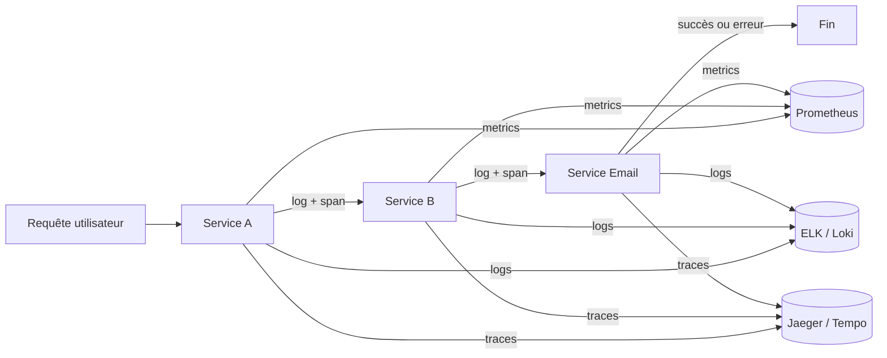

# Observabilité pour QA

## Objectifs pédagogiques

À l'issue de ce module, tu seras capable de :

- **Lire et interpréter** des logs applicatifs structurés pour identifier la cause racine d'un bug
- **Utiliser les trois piliers de l'observabilité** (logs, métriques, traces) pour diagnostiquer un comportement défaillant invisible dans l'UI
- **Distinguer** une erreur applicative d'un problème d'infrastructure à partir des signaux disponibles
- **Formuler un rapport de bug enrichi** avec des données concrètes issues des outils de monitoring
- **Collaborer efficacement** avec les développeurs et les ops en utilisant le vocabulaire et les artefacts de l'observabilité

---

## Mise en situation

Tu travailles sur une application e-commerce. Mardi matin, un client signale que sa commande "est passée" côté UI mais qu'il n'a reçu aucun email de confirmation. Le ticket remonte au QA — toi.

Tu passes une commande de test. Ça semble fonctionner. Aucune erreur visible dans l'interface.

Un QA junior s'arrête là : *"Je n'arrive pas à reproduire."* Le ticket repart en "can't reproduce" — un classique frustrant et coûteux.

Le problème, c'est que le bug est **silencieux**. Il se passe quelque chose dans le service d'envoi d'emails, probablement dans une file de messages asynchrone. L'interface ne sait même pas que ça a foiré. Sans accès aux logs et aux traces distribuées, tu n'as aucune chance de comprendre ce qui se passe réellement.

C'est exactement là qu'intervient l'observabilité : **voir ce que l'interface ne dit pas**.

---

## Contexte et problématique

L'observabilité est un concept emprunté à l'ingénierie des systèmes de contrôle. Un système est dit "observable" si l'on peut inférer son état interne uniquement à partir de ses sorties externes. En informatique, ça se traduit par trois types de signaux complémentaires — les **trois piliers de l'observabilité** :

- **Les logs** — enregistrements horodatés d'événements discrets (*ce qui s'est passé et pourquoi*)
- **Les métriques** — mesures numériques agrégées dans le temps (*combien d'utilisateurs sont impactés, depuis quand*)
- **Les traces** — chemin d'une requête à travers les services avec durée par span (*quel service est le goulot ou la source d'erreur*)

Ces trois signaux sont complémentaires, pas redondants. Pour diagnostiquer un bug, la démarche est toujours la même : les métriques pour mesurer l'impact, les logs pour trouver la cause, les traces pour localiser le service fautif.



Pourquoi le QA doit s'y intéresser ? Parce que dans une architecture moderne — microservices, queues asynchrones, APIs tierces — **l'interface peut afficher "succès" pendant qu'une erreur se propage silencieusement dans les couches profondes**. Un QA qui sait lire ces signaux transforme un "can't reproduce" en "le service email échoue avec un 503 depuis 14h22, probablement lié au déploiement de 14h15". La différence de valeur est immense.

---

## Les logs : lire entre les lignes

### Anatomie d'un log structuré

Un log n'est pas juste un message texte. Voici un exemple typique en format JSON structuré — le format que tu rencontreras dans la quasi-totalité des environnements modernes :

```json
{
  "timestamp": "2024-11-05T14:22:37.482Z",
  "level": "ERROR",
  "service": "email-service",
  "trace_id": "abc123def456",
  "message": "Failed to send confirmation email",
  "user_id": "usr_9821",
  "order_id": "ord_4471",
  "error": "SMTP connection timeout after 5000ms",
  "attempt": 3
}
```

Chaque champ a son rôle :

| Champ | Ce qu'il t'apporte |
|---|---|
| `timestamp` | Corréler avec d'autres événements, délimiter une fenêtre temporelle |
| `level` | Filtrer les signaux qui nécessitent une action |
| `service` | Savoir quel composant a produit l'événement |
| `trace_id` | Suivre une requête à travers tous les services |
| `message` | Comprendre ce qui s'est passé en langage humain |
| `error` | Cause technique réelle de l'échec |

Le champ `trace_id` est particulièrement précieux. Si chaque service partage le même identifiant pour une même requête utilisateur, tu peux **reconstituer toute la vie de cette requête** en filtrant sur cet identifiant dans n'importe quel outil de log ou de tracing.

### Les niveaux de sévérité ne sont pas décoratifs

🧠 Les niveaux de log reflètent l'impact réel sur le système — ils guident ta stratégie de filtrage :

- **DEBUG** — informations très détaillées, activées uniquement en développement. En production, tu n'en verras généralement pas.
- **INFO** — flux normal. "Commande reçue", "Email envoyé". Aucune action requise.
- **WARN** — quelque chose d'inattendu, mais l'application continue. "3e tentative de connexion". À surveiller.
- **ERROR** — une opération a échoué. L'utilisateur est probablement impacté. À investiguer systématiquement.
- **FATAL / CRITICAL** — l'application ne peut plus fonctionner. Crash imminent ou déjà en cours.

En diagnostic QA, commence toujours par filtrer sur `ERROR` puis sur `WARN` dans la fenêtre temporelle qui t'intéresse. Ne plonge dans `INFO` ou `DEBUG` que si tu n'as rien trouvé — et avec une raison précise.

### Filtrer les logs dans la pratique

Les logs centralisés sont accessibles via **Kibana** (stack ELK), **Grafana + Loki**, **Datadog**, ou directement en terminal sur les serveurs. L'interface change, la logique reste la même.

**Dans Kibana (KQL) :**
```
level: "ERROR" AND service: "email-service" AND @timestamp >= "2024-11-05T14:00:00"
```

**Dans Loki (LogQL) :**
```logql
{service="email-service"} |= "ERROR" | json | level="ERROR"
```

**En terminal :**
```bash
# Filtrer les erreurs dans un fichier de logs JSON
grep -E '"level":"ERROR"' /var/log/app/email-service.log | tail -50

# Suivre les logs en temps réel pendant un test
tail -f /var/log/app/email-service.log | grep --line-buffered "ERROR\|WARN"

# Retrouver tous les événements liés à une commande spécifique
grep '"order_id":"ord_4471"' /var/log/app/*.log | sort -k1
```

**Parser des logs JSON en ligne de commande avec `jq` :**
```bash
cat /var/log/app/email-service.log \
  | jq '. | select(.level == "ERROR") | {time: .timestamp, msg: .message, err: .error}'
```

⚠️ **Piège fréquent** : s'arrêter au premier `ERROR` trouvé. L'erreur visible est souvent une *conséquence*. La cause réelle se trouve presque toujours 2 à 5 événements **avant** dans la séquence chronologique. Dans Kibana ou Datadog, trie par timestamp ascendant sur la fenêtre `[heure_bug - 5min, heure_bug]` pour lire les événements dans l'ordre.

---

## Les métriques : la vue macro

Les métriques ne t'expliquent pas *pourquoi* un bug se produit, mais elles te montrent *quand* quelque chose a changé et *combien* d'utilisateurs sont impactés. C'est le signal d'alarme, pas l'outil de diagnostic fin.

Les métriques les plus utiles pour un QA :

| Métrique | Signal d'alerte |
|---|---|
| **Taux d'erreur (error rate)** | Pic soudain après un déploiement |
| **Latence p95 / p99** | Dégradation progressive — possible fuite mémoire |
| **Throughput** | Chute brutale — trafic bloqué quelque part |
| **Taux de succès par fonctionnalité** | Régression fonctionnelle silencieuse |
| **Queue depth** | File qui grossit = consommateur en échec |

💡 Quand tu rapportes un bug, note l'horodatage précis de ta reproduction. Avec cette heure, un dev ou un ops peut aller directement aux métriques correspondantes dans Grafana ou Datadog — sans devoir chercher dans toute la journée.

Si ton équipe expose un dashboard Grafana aux QA, concentre-toi sur trois panneaux en priorité : le **HTTP 5xx rate** (erreurs serveur), la **queue depth** si l'application utilise des files de messages, et les **external API errors** (paiement, email, SMS tiers).

---

## Les traces distribuées : suivre une requête à la loupe

C'est le pilier le plus puissant, et le moins connu des équipes QA. Dans une architecture microservices, une action utilisateur peut traverser 5, 10, voire 20 services. **Les traces te montrent exactement quel service a pris combien de temps, et où ça a planté.**

Une trace se compose de **spans** — chaque span représente une unité de travail dans un service. Visualisées ensemble, elles forment une cascade :

```mermaid
gantt
    title Trace d'une commande (trace_id: abc123)
    dateFormat x
    axisFormat %Lms

    section API Gateway
    Réception requête          :0, 5

    section Order Service
    Validation panier          :5, 45
    Appel Payment Service      :45, 280

    section Payment Service
    Autorisation carte         :50, 260

    section Email Service
    Envoi confirmation         :280, 5280
    SMTP timeout               :285, 5280
```



Dans cet exemple, tout le temps est concentré dans le **Email Service** — 5 secondes pour un envoi qui devrait prendre 200ms, avec un span "SMTP timeout" explicite. C'est exactement notre bug, localisé sans ambiguïté.

Les outils de tracing les plus courants : **Jaeger**, **Zipkin**, **Grafana Tempo**, **Datadog APM**, **Honeycomb**.

En tant que QA, tu n'as pas à configurer le tracing — les développeurs le font. Ce que tu dois maîtriser :

1. **Récupérer le `trace_id`** d'une requête problématique — visible dans les headers de réponse HTTP (`X-Trace-Id`, `X-Request-Id`, `Traceparent`) dans l'onglet **Network** des DevTools
2. **Coller ce `trace_id`** dans l'interface Jaeger, Datadog ou Grafana Tempo
3. **Lire la cascade de spans** pour identifier le goulot ou l'erreur

💡 Certaines applications exposent le `trace_id` directement dans leurs réponses JSON d'erreur, pas seulement dans les headers. Pense à regarder le corps de la réponse aussi.

---

## Diagnostiquer les quatre bugs les plus fréquents

### 1 — L'erreur silencieuse

**Symptôme** : l'UI affiche un succès, mais l'effet attendu ne se produit pas — email non reçu, notification absente, donnée non sauvegardée.

**Cause probable** : traitement asynchrone (queue de messages, job en background) qui échoue sans propager l'erreur vers l'UI.

**Démarche** :
1. Récupère le `trace_id` ou l'identifiant de ta requête (Network DevTools)
2. Dans les logs du service concerné (email, notification, etc.), filtre sur `ERROR` et `WARN` sur la période de ton test
3. Vérifie les métriques de queue depth — si elle croît, les messages ne sont pas traités

⚠️ L'UI qui affiche "succès" ne garantit *rien* sur ce qui se passe dans les services asynchrones en arrière-plan. C'est l'architecture qui crée ce découplage, pas un bug de l'interface.

---

### 2 — Le bug intermittent

**Symptôme** : le bug se produit 1 fois sur 5. Impossible à reproduire de manière systématique.

**Cause probable** : race condition, timeout aléatoire, load balancer qui route vers un nœud défaillant, ou dépendance externe instable.

**Démarche** :
1. **Ne cherche pas à le reproduire manuellement.** Cherche plutôt les occurrences passées dans les logs.
2. Filtre sur `ERROR` sur les dernières 24h pour le service concerné — compte les occurrences et leur fréquence
3. Analyse le pattern temporel : erreurs à intervalles réguliers (cron job ?) ; sous charge (problème de scalabilité ?) ; totalement aléatoires (timeout réseau ?)
4. Cherche si une instance spécifique génère plus d'erreurs que les autres (champs `host` ou `pod_name` dans les logs)

🧠 Les logs te permettent de **prouver** qu'un bug existe et de mesurer sa fréquence, même sans pouvoir le déclencher à la demande. "Non reproductible" ne veut pas dire "inexistant".

---

### 3 — La dégradation progressive des performances

**Symptôme** : l'application fonctionne, mais de plus en plus lentement. Les utilisateurs se plaignent de lenteur générale.

**Cause probable** : fuite mémoire, requêtes SQL non optimisées, index manquant, croissance du volume de données.

**Démarche** :
1. Regarde les métriques de latence sur les 7 derniers jours : la courbe monte-t-elle progressivement ?
2. Dans les traces, cherche les spans les plus longs — quel service est le goulot ?
3. Dans ce service, filtre les logs `WARN` contenant des durées ("took 3200ms", "slow query")
4. Compare la latence avant et après les derniers déploiements — pour isoler si c'est une régression de code ou un phénomène de volume

---

### 4 — La régression après déploiement

**Symptôme** : tout fonctionnait, un déploiement a eu lieu, certaines fonctionnalités cassent.

**Démarche** :
1. Récupère l'heure exacte du déploiement auprès de l'équipe DevOps ou du pipeline CI/CD
2. Compare les taux d'erreur avant et après cette heure sur les métriques
3. Filtre les logs sur `ERROR` depuis l'heure du déploiement
4. Cherche les patterns caractéristiques d'une régression : `NullPointerException`, `undefined is not a function`, erreurs de configuration, erreurs de migration de base de données

---

## Cas réel en entreprise

**Contexte** : startup SaaS, 8 développeurs, 2 QA, architecture microservices sur 5 services, monitoring Datadog.

**Situation** : les QA reçoivent des rapports clients signalant que leurs rapports PDF restent bloqués en statut "en cours" dans l'UI, indéfiniment.

**Ce que le QA a fait :**

1. Lancé une génération de rapport de test, noté l'heure précise : **14:47:23**
2. Récupéré le `request_id` dans les headers de réponse HTTP via l'onglet Network des DevTools
3. Dans Datadog, filtré les logs sur `service:report-generator AND request_id:xyz789`
4. Trouvé un `ERROR` : `"Failed to connect to LibreOffice worker: connection refused"`
5. Remonté 5 minutes en arrière dans les logs : le worker LibreOffice avait crashé suite à un fichier PDF corrompu uploadé par un autre utilisateur
6. Vérifié les métriques : taux de succès de la génération PDF à **0% depuis 14h32**
7. Corrélé avec le changelog : aucun déploiement récent → le bug est déclenché par une donnée utilisateur, pas par du code

**Rapport de bug produit :**

> **Service** : report-generator  
> **Depuis** : 14:32:00 (mesuré sur métriques Datadog)  
> **Impact** : 100% des générations PDF en échec  
> **Cause identifiée** : worker LibreOffice crashé — `connection refused` (log à 14:31:58)  
> **Trigger probable** : upload d'un fichier corrompu par `usr_7823` à 14:31:45  
> **trace_id de référence** : xyz789  
> **Résolution suggérée** : redémarrer le worker LibreOffice + ajouter une validation des fichiers uploadés en amont

Ce rapport a permis au développeur de corriger le bug en **12 minutes** au lieu des 2h habituelles pour ce type de problème. La différence ne vient pas du génie du dev — elle vient des données fournies.

---

## Bonnes pratiques

**1. Noter l'heure exacte avant chaque test susceptible de révéler un bug**  
Les logs et métriques sont indexés par le temps. Sans heure précise, tu cherches une aiguille dans une botte de foin. Note l'heure de début *et* de fin de chaque scénario important — tu délimites ainsi une fenêtre temporelle exploitable par toute l'équipe.

**2. Récupérer le trace_id dès qu'une requête échoue**  
Avant de fermer l'onglet Network des DevTools, copie le `trace_id` ou `request_id` depuis les headers de réponse. C'est ton point d'entrée universel dans Jaeger, Datadog ou Grafana Tempo — une fois l'onglet fermé, c'est perdu.

**3. Ne pas s'arrêter au premier ERROR trouvé**  
Le premier `ERROR` visible est presque toujours une conséquence. Remonte systématiquement 2 à 5 minutes avant dans les logs pour trouver l'événement déclencheur. Trie par timestamp ascendant pour lire la séquence dans l'ordre chronologique.

**4. Distinguer bug applicatif et problème d'infrastructure**  
Un `500` avec `NullPointerException` → bug applicatif, les devs.  
Un `503` avec `connection refused` ou `timeout` → problème d'infrastructure, les ops.  
Cette distinction dans ton ticket évite les allers-retours inutiles entre équipes et accélère la prise en charge.

**5. Mesurer l'impact avant de remonter un bug**  
Grâce aux métriques, tu peux souvent répondre à "combien d'utilisateurs sont impactés ?" avant même qu'on te pose la question. Un bug qui touche 100% des utilisateurs n'a pas la même priorité qu'un qui touche 0,1% d'une fonctionnalité secondaire — cette information change directement la réaction de l'équipe.

**6. Apprendre à lire les logs JSON**  
La plupart des applications modernes loggent en JSON. C'est verbeux mais structuré — chaque champ est requêtable. Entraîne-toi avec `jq` en ligne de commande pour extraire rapidement les champs utiles sans devoir lire des blocs entiers.

**7. Communiquer avec le vocabulaire de l'observabilité**  
"J'ai un ERROR dans le service email-service à 14h32 avec le trace_id abc123" est infiniment plus actionnable que "ça marche pas depuis cet après-midi". Utiliser les termes précis — niveau de log, service, trace_id, fenêtre temporelle — positionne le QA comme un partenaire de diagnostic, pas juste un rapporteur de symptômes.

---

## Résumé

L'observabilité transforme le QA d'un vérificateur d'interface en un détective système. Les logs révèlent *ce qui s'est passé*, les métriques montrent *l'ampleur et le moment*, les traces indiquent *où exactement dans la chaîne de services*. Ces trois signaux combinés permettent de diagnostiquer des bugs que l'interface ne peut pas exposer : erreurs silencieuses dans les services asynchrones, pannes intermittentes, dégradations progressives.

En pratique, tout commence par des réflexes simples : noter l'heure de ses tests, récupérer les trace_id dans les DevTools, filtrer sur `ERROR` avant de chercher plus loin. Avec ces données dans un rapport de bug, le temps de résolution passe de plusieurs heures à quelques minutes — non pas parce que les devs sont plus rapides, mais parce qu'ils n'ont plus à chercher.

---

<!-- snippet
id: qa_logs_filtrer_erreurs
type: command
tech: bash
level: intermediate
importance: high
tags: logs,debug,grep,qa,erreurs
title: Filtrer les erreurs dans les logs applicatifs
command: grep -E '"level":"ERROR"' <FICHIER_LOG> | tail -<N>
example: grep -E '"level":"ERROR"' /var/log/app/email-service.log | tail -50
description: Extrait les N dernières erreurs d'un fichier de log JSON structuré. Point de départ pour tout diagnostic de bug silencieux.
-->

<!-- snippet
id: qa_logs_temps_reel
type: command
tech: bash
level: intermediate
importance: medium
tags: logs,tail,monitoring,temps-reel
title: Suivre les logs en temps réel pendant un test
command: tail -f <FICHIER_LOG> | grep --line-buffered "ERROR\|WARN"
example: tail -f /var/log/app/order-service.log | grep --line-buffered "ERROR\|WARN"
description: Affiche en continu les nouvelles lignes de log filtrées sur ERROR et WARN — idéal pour observer ce qui se passe pendant l'exécution d'un scénario de test.
-->

<!-- snippet
id: qa_logs_correlate_id
type: command
tech: bash
level: intermediate
importance: high
tags: logs,trace-id,correlation,debug
title: Corréler les logs par identifiant de requête
command: grep '"<ID_FIELD>":"<VALEUR>"' /var/log/app/*.log | sort -k1
example: grep '"order_id":"ord_4471"' /var/log/app/*.log | sort -k1
description: Regroupe tous les événements liés à une même entité à travers tous les fichiers de logs et les trie chronologiquement pour reconstituer la séquence complète.
-->

<!-- snippet
id: qa_logs_json_jq
type: command
tech: bash
level: advanced
importance: medium
tags: logs,json,jq,parsing
title: Parser des logs JSON structurés avec jq
command: cat <FICHIER_LOG> | jq '. | select(.level == "ERROR") | {time: .timestamp, msg: .message, err: .error}'
example: cat /var/log/app/email-service.log | jq '. | select(.level == "ERROR") | {time: .timestamp, msg: .message, err: .error}'
description: Extrait uniquement les champs diagnostiques des logs JSON en filtrant sur ERROR — réduit le bruit et accélère la lecture des causes d'échec.
-->

<!-- snippet
id: qa_observabilite_trace_id
type: tip
tech: observabilite
level: intermediate
importance: high
tags: trace-id,devtools,network,debugging
title: Récupérer le trace_id depuis les DevTools navigateur
content: "Dans l'onglet Network des DevTools, clique sur la requête concernée → Headers → Response Headers. Cherche X-Trace-Id, X-Request-Id ou Traceparent. Copie cette valeur et colle-la dans Jaeger, Datadog ou Grafana Tempo pour voir l'intégralité du chemin de la requête dans tous les services. Certaines applications exposent aussi le trace_id dans le corps JSON de la réponse d'erreur."
description: Le trace_id dans les headers HTTP est le point d'entrée universel pour remonter un bug dans une architecture microservices.
-->

<!-- snippet
id: qa_observabilite_trois_piliers
type: concept
tech: observabilite
level: advanced
importance: high
tags: logs,metriques,traces,observabilite,monitoring
title: Les trois piliers de l'observabilité et leur rôle pour le QA
content: "Logs = événements discrets horodatés (ce qui s'est passé et pourquoi). Métriques = mesures numériques agrégées dans le temps (combien d'utilisateurs impactés, depuis quand). Traces = chemin d'une requête à travers les services avec durée par span (quel service est le goulot ou la source d'erreur). Démarche de diagnostic : métriques pour mesurer l'impact → logs pour trouver la cause → traces pour localiser le service fautif."
description: Trois signaux complémentaires — chacun répond à une question différente et les trois ensemble permettent un diagnostic complet.
-->

<!-- snippet
id: qa_logs_niveaux_severite
type: concept
tech: observabilite
level: beginner
importance: high
tags: logs,severite,error,warn,debug
title: Niveaux de sévérité des logs et stratégie de filtrage QA
content: "DEBUG = info de développement, absent en prod. INFO = flux normal, aucune action. WARN = inattendu mais app continue, à surveiller. ERROR = opération échouée, utilisateur probablement impacté, à investiguer. FATAL = l'app ne peut plus fonctionner. Stratégie QA : filtrer d'abord ERROR, puis WARN sur la fenêtre temporelle du bug. Ne plonger dans INFO ou DEBUG que si rien n'est trouvé, et avec une raison précise."
description: Le niveau ERROR signifie qu'une opération a échoué et qu'un utilisateur est probablement impacté — c'est toujours le filtre de départ pour un diagnostic.
-->

<!-- snippet
id: qa_diagnostic_erreur_silencieuse
type: warning
tech: observabilite
level: advanced
importance: high
tags: bug-silencieux,async,queue,diagnostic
title: Piège — UI affiche succès mais l'effet attendu ne se produit pas
content: "Dans les architectures asynchrones (queues, jobs en background), l'UI peut confirmer une action pendant qu'un service en arrière-plan échoue silencieusement. Le découplage est architectural, pas un bug de l'interface. Démarche : chercher dans les logs du service asynchrone concerné (email, notification, PDF) sur la période du test, filtrer sur ERROR et WARN. Vérifier aussi la queue depth dans les métriques — si elle augmente, les messages ne sont pas consommés."
description: Une UI qui affiche succès ne garantit pas le succès des traitements asynchrones — toujours vérifier les logs des services en arrière-plan.
-->

<!-- snippet
id: qa_diagnostic_remonter_cause
type: tip
tech: observabilite
level: intermediate
importance: high
tags: logs,diagnostic,root-cause,debugging
title: Remonter avant le premier ERROR pour trouver la vraie cause
content: "Le premier ERROR visible est presque toujours une conséquence, pas la cause racine. Systématiquement remonter 2 à 5 minutes avant dans les logs : cherche un WARN ou un ERROR précédent, un timeout, une connexion refusée, ou un événement inhabituel. Dans Kibana ou Datadog : trier par timestamp ASC sur la fenêtre [heure_bug - 5min, heure_bug] pour lire la séquence dans l'ordre chronologique."
description: La cause racine précède toujours l'erreur visible dans les logs — ne jamais s'arrêter au premier ERROR trouvé.
-->

<!-- snippet
id: qa_metriques_horodatage
type: tip
tech: observabilite
level: beginner
importance: medium
tags: metriques,monitoring,timestamp,rapport-de-bug
title: Toujours noter l'heure exacte lors de l'exécution d'un test
content: "Avant de lancer un scénario de test susceptible de révéler un bug, noter l'heure précise de début (à la seconde). Après le test, noter l'heure de fin. Cette fenêtre temporelle permet à n'importe quel dev ou ops de retrouver exactement les métriques, logs et traces correspondantes dans Grafana, Datadog ou Kibana — sans avoir à chercher dans toute la journée."
description: Une fenêtre temporelle précise dans un rapport de bug réduit le temps de diagnostic de plusieurs dizaines de minutes.
-->
