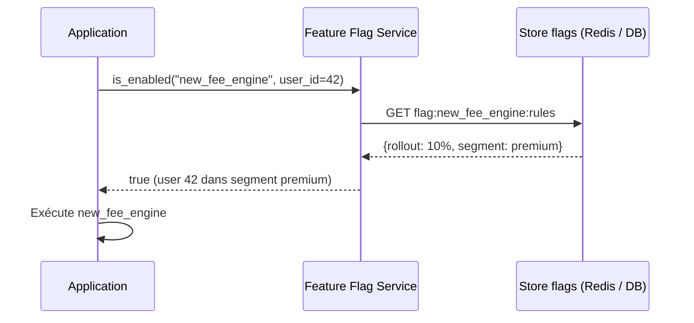
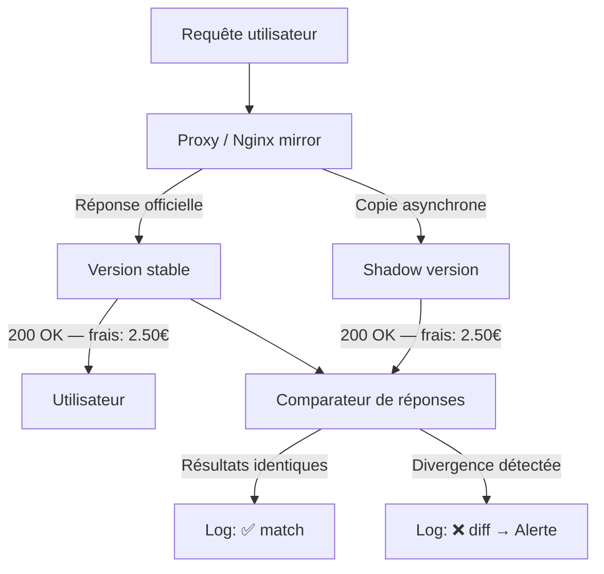

# Tests en production (safe)

## Objectifs pédagogiques

À la fin de ce module, vous serez capable de :

1. **Distinguer** les quatre patterns de tests en production et leurs profils de risque réels
2. **Concevoir** une architecture de feature flags permettant un déploiement progressif et réversible
3. **Mettre en place** un shadow testing pour valider un nouveau comportement sans impact utilisateur
4. **Interpréter** les signaux de monitoring comme des assertions continues en production
5. **Choisir** la technique adaptée selon le niveau de risque, la maturité de l'équipe et les contraintes infra

---

## Mise en situation

Vous êtes QA dans une fintech. L'application traite environ 80 000 virements bancaires par jour. L'équipe vient de refondre en profondeur le moteur de calcul des frais — une brique qui touche chaque transaction.

Le problème que tout le monde connaît déjà : la pré-production ne reproduit jamais fidèlement la prod. Les données sont anonymisées et appauvries, le trafic synthétique ne capture pas les comportements réels, et certains bugs n'émergent que sous charge réelle avec de vrais utilisateurs. Lors du dernier déploiement similaire, un edge case sur les virements en devises étrangères a affecté 3 000 transactions avant rollback. Le coût, humain et financier, a convaincu la direction de changer d'approche.

La solution naïve — "tester plus en staging" — atteint structurellement ses limites. À un moment, la seule façon de savoir si ça tient, c'est de le mettre face au monde réel. La vraie question n'est donc pas *si* on teste en production, mais *comment on le fait sans laisser un bug toucher 80 000 transactions*.

---

## Pourquoi la prod est un environnement de test à part entière

"On ne teste pas en prod" est une posture rassurante. Elle est souvent fausse. Tout déploiement est un test — la différence, c'est si ce test est contrôlé ou subi.

Les limites du staging sont connues et structurelles :

- Les données de test n'ont pas la complexité des données réelles (cas limites, historiques, combinaisons rares)
- Les intégrations tierces — PSP, API bancaires, SSO — se comportent différemment en conditions réelles
- La charge et la concurrence sont impossibles à simuler fidèlement à coût raisonnable
- Certains bugs n'existent que sous volume : race conditions, comportements de cache, saturation de pool de connexions

Le vrai sujet de ce module n'est donc pas de décider si on teste en prod, mais de comprendre les patterns qui permettent de le faire **avec un blast radius contrôlé** — c'est-à-dire en limitant l'impact potentiel à un sous-ensemble d'utilisateurs, à un type de requêtes ou à une fenêtre de temps précise.

---

## Les quatre patterns : des outils distincts, pas des variantes

Chaque technique répond à un besoin différent, avec un profil de risque et une complexité infra qui lui sont propres. Les confondre ou les empiler sans réfléchir est la première erreur à éviter.

| Pattern | Principe | Risque utilisateur | Complexité infra |
|---|---|---|---|
| **Feature flags** | Activer/désactiver une feature par segment, en temps réel | Faible — contrôle fin et réversible | Moyenne |
| **Canary release** | Router X% du trafic vers la nouvelle version | Modéré — une fraction du trafic réel est exposée | Moyenne à haute |
| **Shadow testing** | Dupliquer les requêtes vers la nouvelle version sans utiliser sa réponse | Nul — la réponse shadow est ignorée | Haute |
| **Observabilité comme filet** | Traiter les métriques prod comme des assertions continues | Faible — détection rapide, pas de prévention | Faible à moyenne |

Ces patterns se combinent naturellement. Un canary avec feature flags + alertes automatiques sur les métriques d'erreur, c'est une architecture de test en production mature. Mais on y vient progressivement.

### Vue d'ensemble du flux

```mermaid
flowchart LR
    U[Utilisateur] --> LB[Load Balancer / Router]

    LB -->|90% du trafic| V1[Version stable v1]
    LB -->|10% du trafic — canary| V2[Version candidate v2]

    V2 -->|Requête dupliquée| Shadow[Shadow service v2]
    Shadow -->|Réponse ignorée| Null[/dev/null]

    V1 --> Obs[Monitoring & Alerting]
    V2 --> Obs
    Shadow --> Obs

    Obs -->|Anomalie détectée| Alert[Alerte PagerDuty / Slack]
    Alert -->|Rollback automatique| LB
```

---

## Feature flags : découpler le déploiement de l'activation

Un feature flag, c'est une condition dans le code qui détermine quel chemin d'exécution prendre selon un critère externe — sans déployer de nouveau code. La feature existe dans le binaire, elle est juste inactive pour une partie ou la totalité des utilisateurs.

```python
# Exemple avec LaunchDarkly SDK
if feature_flags.is_enabled("new_fee_engine", user=current_user):
    fee = new_fee_engine.calculate(transaction)
else:
    fee = legacy_fee_engine.calculate(transaction)
```

Ce qui rend les flags puissants, c'est la granularité du ciblage :

- **Par utilisateur** — activer uniquement pour les testeurs internes (dogfooding)
- **Par pourcentage** — 5% des utilisateurs, puis 20%, puis 100%
- **Par segment** — comptes premium, région géographique, type de devise
- **Par contexte technique** — période creuse, plage d'IP, version de client mobile

> 💡 Les feature flags ne sont pas une technique de déploiement — c'est une technique de **découplage**. Vous pouvez déployer du code en production des semaines avant de l'activer. Le risque du déploiement tombe à zéro. Il se concentre sur l'activation du flag, que vous contrôlez entièrement et pouvez annuler en 30 secondes.

La distinction importante est entre deux architectures de flags.

**Flags en config statique** : définis dans un fichier YAML ou des variables d'environnement. Simple, mais nécessite un déploiement pour changer un flag. Acceptable en phase de démarrage.

**Flags via service dédié** (LaunchDarkly, Unleash, Flagsmith, AWS AppConfig) : la valeur est modifiée en temps réel sans déploiement, récupérée à chaque requête ou mise en cache avec un TTL court. C'est la seule approche vraiment safe en prod — vous pouvez éteindre une feature en 30 secondes si ça déraille.



> ⚠️ Le piège classique : créer des flags sans date d'expiration ni propriétaire. Après 12 mois, un codebase avec 40 flags actifs devient illisible — branches conditionnelles empilées, tests impossibles à écrire, plus personne ne sait quel flag peut être retiré. À la création de chaque flag : définir une date d'expiration et un ticket de nettoyage. Après généralisation à 100%, supprimer le flag et le code mort sous deux semaines.

Une deuxième confusion fréquente : utiliser un flag pour stocker des valeurs de configuration (timeout, URL d'API, taille de pool). Les flags répondent à "est-ce que cette feature est active pour cet utilisateur ?" — une question booléenne ou de segment. Les paramètres de config répondent à "quelle valeur utiliser ?" — ce sont deux questions différentes, qui méritent deux systèmes différents.

---

## Canary release : exposer progressivement au trafic réel

Le canary release déploie la nouvelle version sur une fraction des instances — ou du trafic — et élargit progressivement si les métriques restent dans les clous. Le nom vient des mineurs qui emmenaient des canaris dans les galeries : si le canari mourait, on rebrousse chemin.

Contrairement aux feature flags qui agissent au niveau applicatif, le canary agit au niveau infra. On route X% du trafic vers des pods qui font tourner la nouvelle version.

**Avec NGINX** — poids sur les upstreams :

```nginx
upstream backend {
    server stable-v1.internal weight=90;
    server canary-v2.internal weight=10;
}
```

**Avec Argo Rollouts** — paliers automatisés avec conditions d'arrêt :

```yaml
apiVersion: argoproj.io/v1alpha1
kind: Rollout
metadata:
  name: fee-engine
spec:
  strategy:
    canary:
      steps:
        - setWeight: 5
        - pause: {duration: 10m}
        - setWeight: 25
        - pause: {duration: 20m}
        - setWeight: 50
        - pause: {duration: 30m}
      analysis:
        templates:
          - templateName: success-rate
        args:
          - name: service-name
            value: fee-engine-canary
```

> 🧠 Un canary sans condition d'arrêt automatique, c'est juste un déploiement lent. La valeur réelle est dans le rollback automatique sur seuil : taux d'erreur > 1%, latence p99 > 800ms, taux de succès des transactions < 99.5%. Ces seuils doivent être écrits **avant** d'ouvrir le trafic — pas découverts au moment où l'alerte sonne.

Un point souvent négligé : avant d'ouvrir le moindre pourcentage de trafic, il faut disposer d'une baseline. Sept jours de métriques — taux d'erreur moyen, latence p50/p95/p99, volume de requêtes aux heures de pointe — permettent de distinguer une régression réelle d'une variation normale. Sans baseline, on compare l'inconnu à l'inconnu.

Des paliers lents valent mieux que des sauts brusques. Passer de 0% à 50% en un coup multiplie par 50 le blast radius d'un problème non encore détecté. Une progression 1% → 5% → 10% → 25% → 50% → 100% avec observation entre chaque palier laisse du temps de réaction.

---

## Shadow testing : valider sans exposer

Le shadow testing est la technique la plus safe — et la plus coûteuse en infra. Chaque requête reçue par la version stable est **dupliquée** et envoyée en parallèle à la nouvelle version. La réponse du shadow est ignorée pour l'utilisateur, mais comparée à la réponse de référence et loggée.

C'est la technique à privilégier quand :
- Le flux touche des calculs financiers ou critiques — vous ne pouvez pas vous permettre un seul utilisateur impacté
- Vous refactorisez un algorithme complexe et voulez valider que les sorties sont identiques sous charge réelle
- Vous testez une migration technologique complète (Node → Go, par exemple)



**Configuration NGINX (mirroring) :**

```nginx
location /api/transactions {
    proxy_pass http://stable-v1;

    mirror /shadow;
    mirror_request_body on;
}

location /shadow {
    internal;
    proxy_pass http://shadow-v2;
}
```

> ⚠️ Le shadow reçoit les mêmes requêtes que la prod. Si le service shadow écrit en base ou envoie des notifications, les effets se produisent deux fois — données dupliquées, emails envoyés en double, état incohérent. Le shadow doit tourner en mode read-only ou sur une base isolée dédiée. Auditer systématiquement tous les appels de type write/POST/PUT avant d'activer le mirror.

---

## L'observabilité comme infrastructure de test

Un aspect sous-estimé : en production, les métriques et les logs sont des assertions. Pas des assertions explicites comme en test unitaire, mais des assertions continues sur le comportement réel du système sous charge réelle.

Un test en staging valide qu'une fonction retourne le bon résultat sur 100 cas contrôlés. L'observabilité en prod valide que cette même fonction se comporte correctement sur 80 000 cas réels, dans des conditions que personne n'avait anticipées.

### Les métriques à traiter comme des assertions prod

| Métrique | Seuil d'alerte | Ce qu'elle signale |
|---|---|---|
| **Taux d'erreur HTTP 5xx** | > 0.5% sur 5 min | Régression fonctionnelle ou crash |
| **Latence p99** | +30% vs baseline sur 10 min | Dégradation de performance |
| **Taux de succès business** | < seuil historique J-7 | Régression métier |
| **Divergence de réponse** (shadow) | > 0.1% | Comportement différent entre versions |
| **Volume de logs ERROR** | +50% vs baseline | Exceptions non gérées |

> 💡 Définissez vos métriques de santé métier séparément des métriques techniques. Le taux d'erreur HTTP peut rester à 0% pendant qu'une régression silencieuse fausse les calculs de frais. Les métriques métier — nombre de transactions validées par minute, montant moyen, taux de conversion — détectent ce que les métriques techniques ne voient pas. Une déviation de ±15% vs la baseline J-7 à la même heure mérite une alerte.

### Alerting intelligent : éviter la fatigue

Une alerte déclenchée à chaque pic normal de trafic tue la vigilance de l'équipe en quelques semaines. Deux approches plus robustes :

**Anomaly detection** — comparer la valeur actuelle à l'historique à la même heure du même jour de la semaine. Datadog et Grafana avec ML le font nativement.

**Alertes sur dérivée** — alerter non pas sur une valeur absolue, mais sur un changement brutal. Si le taux d'erreur passe de 0.1% à 2% en deux minutes, c'est un signal fort même si 2% serait "acceptable" en absolu.

---

## Construire progressivement : de la surveillance manuelle au système automatisé

Tout n'a pas à être en place dès le premier déploiement. La valeur n'est pas dans la sophistication de l'outil — elle est dans l'habitude d'observer et de réagir.

**Version 1 — Minimum viable**

Flags simples en config YAML, activés manuellement. Déploiements en heures creuses. Surveillance manuelle des dashboards pendant 30 minutes après chaque déploiement. Procédure de rollback documentée et testée à blanc.

**Version 2 — Canary progressif**

Feature flags via service dédié (Unleash open-source ou LaunchDarkly). Canary 5% → 25% → 100% avec pauses manuelles entre les paliers. Alertes automatiques sur taux d'erreur et latence p99. Rollback automatique si seuil franchi.

**Version 3 — Production-grade**

Shadow testing sur les flux critiques avec comparateur automatique de divergences. Progressive delivery entièrement automatisée via Argo Rollouts. Métriques métier comme conditions d'arrêt du canary. Runbooks de rollback intégrés dans le pipeline CI/CD.

Chaque saut entre versions ajoute de la complexité infra et des prérequis d'observabilité. Ne pas brûler les étapes.

---

## Cas réel : la fintech qui a changé d'approche

Retour sur la fintech de la mise en situation. Après l'incident des 3 000 transactions affectées, l'équipe a adopté cette architecture pour le déploiement du nouveau moteur de frais.

**Phase 1 — Shadow testing (2 semaines).** Le nouveau moteur tournait en shadow sur 100% du trafic. Un comparateur loggait chaque divergence entre la réponse stable et la réponse shadow. Résultat : 23 divergences détectées, dont 4 sur des virements en devises étrangères — exactement le type d'edge case à l'origine de l'incident précédent. Aucun utilisateur impacté.

**Phase 2 — Canary à 5%.** Après correction des 23 divergences, déploiement canary sur 5% du trafic réel. Surveillance 48h. Métriques : 0 erreur, latence stable, 0 divergence résiduelle en shadow parallèle.

**Phase 3 — Généralisation progressive.** 5% → 20% → 50% → 100% sur 10 jours. Chaque palier déclenché manuellement après validation des métriques. Rollback automatique configuré sur taux d'erreur > 0.3%.

Résultat : déploiement sans incident. L'équipe a ensuite rendu obligatoire le shadow testing pour tout changement touchant les calculs financiers — pas comme processus bureaucratique, mais parce que les 23 divergences détectées avaient convaincu tout le monde de sa valeur.

---

## Bonnes pratiques

**Écrire la définition de "done" avant d'ouvrir le trafic.** Avant chaque canary, documenter explicitement les critères de validation : "Le déploiement est validé si, après 24h à 10%, le taux d'erreur reste < 0.5% et la latence p99 < 600ms." Sans critère écrit, la décision devient subjective sous pression.

**Tester le rollback avant d'en avoir besoin.** Un rollback non testé est un rollback qui échoue au pire moment. Déclencher régulièrement un rollback en conditions normales pour valider que le mécanisme fonctionne et que l'équipe sait exactement quoi faire.

**Isoler les effets de bord dans les tests shadow.** Tout service shadow doit tourner en mode read-only ou sur une base isolée. Auditer systématiquement les writes avant d'activer le mirroring — pas après.

**Traiter les feature flags comme du code.** Chaque flag a un propriétaire, une date de création, une date d'expiration prévue et une description dans un registre. Un flag sans date d'expiration ne sera jamais nettoyé.

**Ne pas confondre flag et config.** Les flags régissent l'activation de features. Les paramètres de configuration (timeout, URL d'API, taille de pool) ne sont pas des feature flags. Mélanger les deux crée de la confusion et des bugs difficiles à tracer.

**Inclure au moins une métrique métier dans les conditions d'alerte.** Un taux d'erreur HTTP à 0% peut coexister avec une régression silencieuse sur un calcul. Les métriques techniques mesurent le transport. Les métriques métier mesurent ce que l'utilisateur vit réellement.

**Préférer des paliers lents à des sauts brusques.** Passer de 0% à 50% multiplie par 50 le blast radius d'un problème non encore détecté. Une progression 1% → 5% → 10% → 25% → 50% → 100% donne du temps de réaction à chaque étape.

---

## Résumé

Tester en production n'est pas une prise de risque — c'est un risque maîtrisé quand l'architecture est pensée pour ça. Les quatre patterns de ce module répondent à des besoins distincts : les feature flags offrent un contrôle applicatif fin et réversible en temps réel ; le canary expose progressivement la nouvelle version à du trafic réel avec rollback automatique ; le shadow testing valide le comportement sans aucun impact utilisateur, au prix d'une complexité infra plus élevée ; l'observabilité transforme les métriques de prod en assertions continues. Ces techniques se combinent — un canary avec flags et alertes métier, c'est une architecture mature. La clé est de progresser : commencer par des flags simples et une surveillance manuelle, puis automatiser à mesure que l'équipe gagne en confiance et en visibilité sur son système.

---

<!-- snippet
id: qa_feature_flags_rollout_pattern
type: concept
tech: feature-flags
level: advanced
importance: high
format: knowledge
tags: feature-flags,production,progressive-delivery,rollout
title: Feature flags — découplage déploiement / activation
content: Un feature flag découple le déploiement du code de son activation. Le code est en prod mais inactif. L'activation se fait en temps réel via un service dédié (LaunchDarkly, Unleash), sans nouveau déploiement. Cela concentre le risque sur un bouton contrôlé, pas sur un pipeline de déploiement. Ciblage possible par utilisateur, segment, pourcentage ou contexte technique.
description: Le déploiement met le code en prod. Le flag contrôle qui l'exécute. Ces deux événements sont indépendants et séparés dans le temps.
-->

<!-- snippet
id: qa_feature_flags_cleanup_warning
type: warning
tech: feature-flags
level: intermediate
importance: high
format: knowledge
tags: feature-flags,dette-technique,maintenance,production
title: Ne pas nettoyer les feature flags = dette technique garantie
content: Piège : créer des flags sans date d'expiration ni propriétaire. Conséquence : codebase avec 40+ flags actifs, branches conditionnelles empilées, tests impossibles à écrire, plus personne ne sait ce qui peut être retiré. Correction : à la création, définir une date d'expiration et un ticket de nettoyage. Après généralisation à 100%, supprimer le flag et le code mort sous deux semaines.
description: Un flag non nettoyé après généralisation reste dans le code indéfiniment. Après 6 mois, personne ne sait s'il peut être retiré sans casser quelque chose.
-->

<!-- snippet
id: qa_canary_rollback_condition
type: concept
tech: kubernetes
level: advanced
importance: high
format: knowledge
tags: canary,rollback,argo-rollouts,progressive-delivery
title: Canary sans condition d'arrêt automatique = déploiement lent
content: Un canary release n'a de valeur que si des seuils déclenchent automatiquement le rollback. Sans ça, c'est un déploiement progressif sans filet. Dans Argo Rollouts, l'Analysis définit les conditions : success-rate < 99.5% ou latence p99 > 800ms déclenchent un rollback automatique. Ces seuils doivent être configurés avant l'ouverture du trafic, pas découverts au moment où l'alerte sonne.
description: La valeur du canary est dans le rollback automatique. Sans seuils configurés, on observe sans pouvoir réagir assez vite pour limiter l'impact.
-->

<!-- snippet
id: qa_shadow_testing_side_effects
type: warning
tech: nginx
level: advanced
importance: high
format: knowledge
tags: shadow-testing,mirroring,effets-de-bord,production
title: Shadow testing — isoler les writes pour éviter les doublons
content: Piège : activer le mirroring vers un service shadow qui écrit en base ou envoie des notifications. Conséquence : données dupliquées, emails envoyés deux fois, état incohérent. Correction : le shadow service doit tourner en mode read-only ou sur une base isolée dédiée. Auditer tous les appels write/POST/PUT avant d'activer le mirror — pas après la première anomalie constatée.
description: Le shadow reçoit les mêmes requêtes que la prod. Tout write non isolé se produit deux fois avec des conséquences réelles sur les données et les utilisateurs.
-->

<!-- snippet
id: qa_nginx_mirror_config
type: command
tech: nginx
level: advanced
importance: medium
format: knowledge
tags: nginx,shadow-testing,mirroring,configuration
title: Configurer le request mirroring avec NGINX
command: |
  location <PATH> {
      proxy_pass http://<STABLE_BACKEND>;
      mirror /shadow;
      mirror_request_body on;
  }
  location /shadow {
      internal;
      proxy_pass http://<SHADOW_BACKEND>;
  }
example: |
  location /api/transactions {
      proxy_pass http://stable-v1;
      mirror /shadow;
      mirror_request_body on;
  }
  location /shadow {
      internal;
      proxy_pass http://shadow-v2;
  }
description: NGINX duplique chaque requête vers le shadow de manière asynchrone. Seule la réponse de stable-v1 est renvoyée à l'utilisateur — la réponse shadow est ignorée.
-->

<!-- snippet
id: qa_canary_argo_rollouts_steps
type: command
tech: kubernetes
level: advanced
importance: medium
format: knowledge
tags: canary,argo-rollouts,kubernetes,progressive-delivery
title: Canary progressif avec Argo Rollouts — structure YAML
command: |
  strategy:
    canary:
      steps:
        - setWeight: <PERCENT_1>
        - pause: {duration: <DURATION_1>}
        - setWeight: <PERCENT_2>
        - pause: {duration: <DURATION_2>}
example: |
  strategy:
    canary:
      steps:
        - setWeight: 5
        - pause: {duration: 10m}
        - setWeight: 25
        - pause: {duration: 20m}
        - setWeight: 50
        - pause: {duration: 30m}
description: Chaque setWeight + pause forme un palier d'observation. Le rollout avance automatiquement si aucune Analysis ne déclenche un rollback sur le palier en cours.
-->

<!-- snippet
id: qa_prod_observability_business_metrics
type: tip
tech: monitoring
level: advanced
importance: high
format: knowledge
tags: observabilité,métriques-métier,production,alerting
title: Ajouter une métrique métier dans les conditions de rollback
content: Le taux d'erreur HTTP peut rester à 0% pendant une régression silencieuse sur un calcul — frais sous-calculés, montant incorrect, taux de conversion dégradé. Ajouter au moins une métrique métier dans les alertes : nb de transactions validées par minute, montant moyen, taux de conversion. Une déviation de ±15% vs baseline J-7 à la même heure doit déclencher une alerte.
description: Les métriques techniques mesurent le transport. Les métriques métier mesurent ce que l'utilisateur vit réellement — une régression silencieuse peut passer sous le radar des premières.
-->

<!-- snippet
id: qa_feature_flags_vs_config
type: warning
tech: feature-flags
level: intermediate
importance: medium
format: knowledge
tags: feature-flags,configuration,architecture,bonne-pratique
title: Feature flag ≠ paramètre de configuration applicative
content: Piège : utiliser un feature flag pour stocker des valeurs de config (timeout, URL d'API, taille de pool). Conséquence : le système de flags devient un fourre-tout, les dépendances deviennent opaques, les bugs sont difficiles à tracer. Correction : les flags contrôlent l'activation de features (booléen ou segment). Les paramètres de config vivent dans des fichiers de config ou variables d'environnement.
description: Un flag répond à "est-ce que cette feature est active pour cet utilisateur ?". Une config répond à "quelle valeur utiliser ?". Deux questions différentes, deux systèmes différents.
-->

<!-- snippet
id: qa_canary_baseline_metrics_required
type: tip
tech: monitoring
level: advanced
importance: high
format: knowledge
tags: canary,observabilité,baseline,production
title: Capturer la baseline AVANT d'ouvrir le canary
content: Avant tout canary, capturer sur 7 jours : taux d'erreur moyen, latence p50/p95/p99, volume de requêtes aux heures de pointe. Sans baseline, impossible de distinguer une régression d'un comportement normal. Dans Grafana, utiliser "Compare to" ou créer une annotation au moment du déploiement pour aligner les courbes avant/après.
description: Le canary révèle des problèmes seulement si vous savez à quoi ressemble "normal". Sans baseline, on compare l'inconnu à l'inconnu et les seuils d'alerte sont arbitraires.
-->

<!-- snippet
id: qa_canary_paliers_progressifs
type: tip
tech: monitoring
level: advanced
importance: medium
format: knowledge
tags: canary,progressive-delivery,blast-radius,production
title: Préférer des petits paliers pour limiter le blast radius
content: Passer de 0% à 50% en un saut multiplie par 50 le nombre d'utilisateurs exposés à
