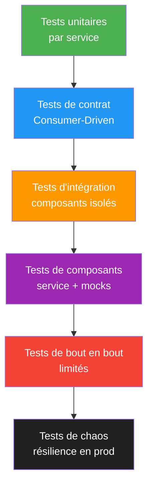
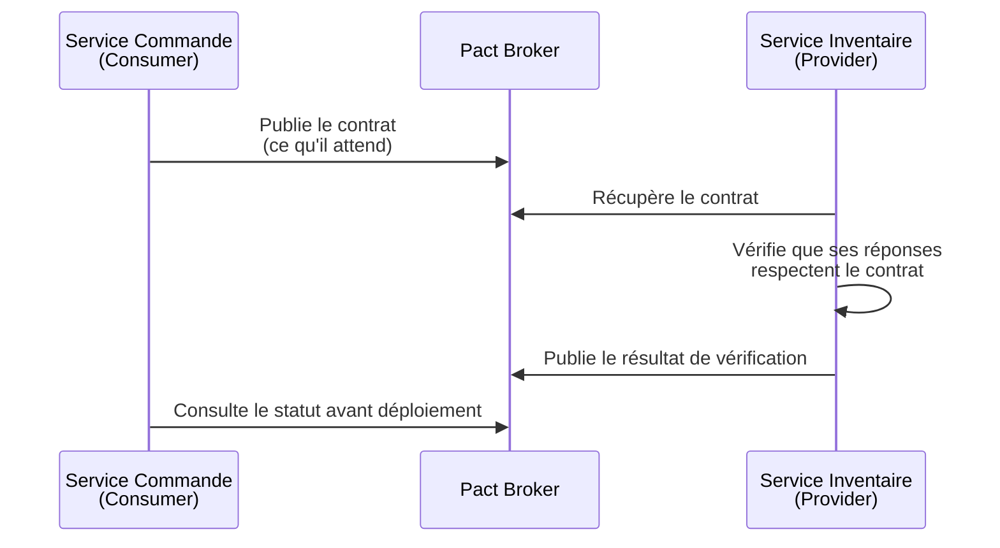

# Test de systèmes distribués

## Objectifs pédagogiques

À l'issue de ce module, vous serez capable de :

- Identifier les défaillances propres aux systèmes distribués et expliquer pourquoi les approches de test classiques sont insuffisantes
- Concevoir une stratégie de test adaptée à une architecture microservices en couvrant les contrats d'interface, la tolérance aux pannes et la cohérence des données
- Mettre en œuvre des tests de contrat avec Pact pour valider les interactions entre services sans dépendre de l'environnement entier
- Simuler des pannes réseau et des dégradations de service avec des outils de chaos engineering pour vérifier la résilience du système
- Distinguer les propriétés ACID et BASE et comprendre leur impact sur la stratégie de test

---

## Mise en situation

Vous êtes QA dans une équipe qui vient de migrer une application monolithique vers une architecture microservices. Avant, vous aviez une base de données unique, un seul processus à démarrer et des tests d'intégration qui se lançaient en deux minutes.

Maintenant ? Douze services. Quatre équipes. Des queues Kafka. Un API gateway. Et lors de votre dernier déploiement en production, une commande client a été validée côté paiement… mais jamais enregistrée côté stock.

Les tests passaient en intégration continue. Pourtant, en production, les données sont incohérentes.

Bienvenue dans le monde des systèmes distribués. Ce module vous donne les outils conceptuels et pratiques pour tester ce type d'architecture — pas en s'adaptant à la marge, mais en repensant fondamentalement l'approche.

---

## Ce que c'est — et pourquoi les tests classiques ne suffisent plus

Un système distribué, c'est un ensemble de processus qui s'exécutent sur des machines différentes et qui communiquent par le réseau pour accomplir une tâche commune. La définition est simple. Les implications, beaucoup moins.

Dans un monolithe, quand vous testez un flux de bout en bout, tout s'exécute dans le même processus. Les transactions sont atomiques, les appels internes ne tombent pas, et le temps de réponse est prévisible. Dans un système distribué, chacun de ces postulats devient faux.

Le réseau introduit trois nouvelles catégories de problèmes :

**La latence variable.** Un appel entre deux services peut prendre 2ms ou 800ms selon la charge réseau. Votre test peut passer à vide et échouer sous charge réelle.

**La défaillance partielle.** Un service peut être lent, retourner des erreurs intermittentes, ou être totalement indisponible — pendant que tous les autres continuent de fonctionner. C'est un état impossible dans un monolithe.

**La cohérence éventuelle.** Dans beaucoup de systèmes distribués, deux services peuvent temporairement voir des états différents de la même donnée. Ce n'est pas un bug. C'est une propriété architecturale.

> 🧠 **Concept clé** — Le théorème CAP (Brewer, 2000) dit qu'un système distribué ne peut garantir simultanément que deux des trois propriétés suivantes : Cohérence (Consistency), Disponibilité (Availability), Tolérance au partitionnement (Partition tolerance). En pratique, le réseau peut toujours être partitionné, donc le vrai choix se fait entre C et A.

Conséquence directe pour le QA : vos tests doivent couvrir non seulement le cas nominal, mais les dégradations, les timeouts, les réponses partielles et les états transitoires.

---

## Les catégories de défaillances à tester

Avant de parler d'outils, il faut comprendre ce qu'on cherche à provoquer. Les pannes dans un système distribué se regroupent en quelques familles.

### Défaillances réseau

```
Perte de paquets       → des messages sont perdus sans erreur explicite
Latence élevée         → les timeouts se déclenchent
Partition réseau       → deux parties du système ne peuvent plus communiquer
Connexion lente        → les buffers saturent, le service commence à rejeter
```

### Défaillances de service

Un service peut planter (crash stop), répondre lentement (dégradation), retourner des erreurs 5xx sur certaines requêtes, ou — cas le plus pernicieux — répondre avec des données corrompues ou malformées sans retourner d'erreur HTTP.

### Défaillances de données

Inconsistances entre base de données primaire et réplica, messages dupliqués dans une queue, messages traités dans le mauvais ordre, données partiellement écrites suite à une transaction distribuée échouée.

> ⚠️ **Erreur fréquente** — Beaucoup d'équipes testent uniquement les pannes franches (service down = 503). Les pannes les plus dangereuses en production sont les pannes grises : le service répond, mais lentement, ou avec des données légèrement fausses. Ces pannes grises sont invisibles dans les métriques basiques et peuvent se propager silencieusement dans tout le système.

---

## Architecture des tests pour un système distribué

Il n'y a pas une seule approche, mais une stratégie en couches. Chaque couche couvre des risques différents.



La forme de cette pyramide change par rapport à un monolithe : les tests de bout en bout complets sont beaucoup plus coûteux et fragiles, donc on en fait **moins**. En revanche, deux nouvelles couches apparaissent : les **tests de contrat** et les **tests de chaos**.

---

## Tests de contrat — tester les interfaces sans déployer tout le système

C'est probablement la technique la plus importante à maîtriser en contexte microservices.

L'idée de base : au lieu de déployer tous les services pour tester qu'ils communiquent correctement, on formalise le contrat entre consommateur et fournisseur, puis on vérifie ce contrat indépendamment de chaque côté.

### Le modèle Consumer-Driven Contract Testing



Le **consommateur** (le service qui appelle) écrit ses attentes sous forme de test : "quand j'appelle `GET /products/42`, je m'attends à recevoir un objet avec au moins les champs `id`, `name` et `stock`."

Le **fournisseur** (le service appelé) exécute ces mêmes attentes contre sa propre implémentation, sans que le consommateur soit présent.

Si le fournisseur modifie son API d'une façon qui casse le contrat du consommateur, la vérification échoue — avant le déploiement, pas après.

### Exemple avec Pact (JavaScript)

**Côté consommateur — définir le contrat :**

```javascript
// consumer.pact.test.js
const { Pact } = require('@pact-foundation/pact');

const provider = new Pact({
  consumer: 'service-commande',
  provider: 'service-inventaire',
  port: 8081,
});

describe('Contrat : service-commande → service-inventaire', () => {
  beforeAll(() => provider.setup());
  afterAll(() => provider.finalize());

  it('retourne les détails d\'un produit existant', async () => {
    // Ce qu'on attend du fournisseur
    await provider.addInteraction({
      state: 'le produit 42 existe avec du stock',
      uponReceiving: 'une requête pour le produit 42',
      withRequest: {
        method: 'GET',
        path: '/products/42',
      },
      willRespondWith: {
        status: 200,
        body: {
          id: 42,
          name: like('Widget Pro'),      // type flexible
          stock: integer(15),            // doit être un entier
          price: decimal(29.99),
        },
      },
    });

    // Appel réel du client consommateur contre le mock Pact
    const response = await inventaireClient.getProduct(42);
    expect(response.id).toBe(42);
    expect(response.stock).toBeGreaterThan(0);

    await provider.verify();
  });
});
```

**Côté fournisseur — vérifier le contrat :**

```javascript
// provider.pact.test.js
const { Verifier } = require('@pact-foundation/pact');

describe('Vérification du contrat : service-inventaire', () => {
  it('respecte les contrats publiés', () => {
    return new Verifier({
      provider: 'service-inventaire',
      providerBaseUrl: 'http://localhost:3001',
      // Récupère les contrats depuis le broker central
      pactBrokerUrl: 'https://pact-broker.monentreprise.com',
      providerStatesHandler: async (state) => {
        // Configure la base de données de test selon l'état demandé
        if (state === 'le produit 42 existe avec du stock') {
          await db.seed({ product: { id: 42, name: 'Widget Pro', stock: 15, price: 29.99 } });
        }
      },
    }).verifyProvider();
  });
});
```

> 💡 **Astuce** — Le champ `state` dans le contrat Pact ("le produit 42 existe avec du stock") est crucial : il permet au fournisseur de préparer exactement la bonne configuration de données avant d'exécuter la vérification. Sans ça, le test dépend de l'état aléatoire de la base de données de test.

---

## Tester la cohérence des données dans les flux asynchrones

Quand deux services communiquent via une queue (Kafka, RabbitMQ), la cohérence des données n'est plus immédiate. C'est la propriété **BASE** : Basically Available, Soft-state, Eventually consistent.

> 🧠 **Concept clé** — BASE est l'opposé d'ACID. Un système BASE accepte que les données soient temporairement incohérentes entre nœuds, en garantissant qu'elles convergeront vers un état cohérent. Ce n'est pas un défaut de conception — c'est souvent nécessaire pour la scalabilité.

Pour tester un flux asynchrone, le pattern classique est le **polling with timeout** :

```python
# test_commande_async.py
import time
import pytest
import requests

def attendre_etat(url, predicat, timeout=10, intervalle=0.5):
    """
    Poll une ressource jusqu'à ce qu'une condition soit satisfaite
    ou que le timeout soit atteint.
    """
    debut = time.time()
    while time.time() - debut < timeout:
        try:
            response = requests.get(url)
            if response.status_code == 200 and predicat(response.json()):
                return response.json()
        except requests.ConnectionError:
            pass
        time.sleep(intervalle)
    raise TimeoutError(f"Condition non atteinte après {timeout}s sur {url}")


def test_commande_declenche_mise_a_jour_stock():
    # Étape 1 : vérifier le stock initial
    stock_initial = requests.get("http://inventaire/products/42").json()["stock"]

    # Étape 2 : créer une commande
    commande = requests.post("http://commandes/orders", json={
        "product_id": 42,
        "quantity": 3
    })
    assert commande.status_code == 201
    order_id = commande.json()["id"]

    # Étape 3 : attendre la cohérence éventuelle
    # Le service inventaire est notifié via Kafka — pas immédiatement
    stock_final = attendre_etat(
        url="http://inventaire/products/42",
        predicat=lambda data: data["stock"] == stock_initial - 3,
        timeout=10
    )

    assert stock_final["stock"] == stock_initial - 3

    # Étape 4 : vérifier aussi que la commande est bien marquée "confirmée"
    commande_confirmee = attendre_etat(
        url=f"http://commandes/orders/{order_id}",
        predicat=lambda data: data["status"] == "confirmed",
        timeout=10
    )
    assert commande_confirmee["status"] == "confirmed"
```

Le timeout de 10 secondes n'est pas arbitraire. Il doit être calibré sur le SLA réel du flux asynchrone en production, avec une marge. Trop court → faux négatifs. Trop long → pipeline CI qui traîne.

> ⚠️ **Erreur fréquente** — Utiliser `time.sleep(5)` fixe au lieu du polling. Si le message arrive en 200ms (cas normal), le test attend quand même 5 secondes. Multiplié par des dizaines de tests async → la CI devient lente pour rien. Le polling avec timeout court-circuite dès que la condition est atteinte.

---

## Chaos Engineering — tester la résilience sous panne réelle

Les tests de contrat et d'intégration vérifient que le système fonctionne quand tout va bien. Le chaos engineering pose la question inverse : *comment le système se comporte-t-il quand quelque chose casse ?*

L'idée, popularisée par Netflix avec Chaos Monkey, est simple en théorie : introduire des défaillances contrôlées dans le système, observer le comportement, et corriger les faiblesses avant qu'une vraie panne les révèle.

### Taxonomie des injections de fautes

| Type d'injection | Ce qu'on simule | Ce qu'on vérifie |
|---|---|---|
| **Latence réseau** | Ajout de 500ms à 2s sur les appels sortants d'un service | Circuit breaker, timeout, dégradation gracieuse |
| **Perte de paquets** | 30% des requêtes HTTP sont perdues | Retry avec backoff, idempotence |
| **Crash service** | Arrêt brutal d'un pod/container | Failover, messages non perdus dans la queue |
| **Saturation ressources** | CPU à 100%, mémoire limite | Throttling, comportement sous charge |
| **Partition réseau** | Isolation de deux zones de disponibilité | Comportement split-brain, réconciliation |
| **Réponse malformée** | Le service répond 200 avec du JSON corrompu | Validation côté consommateur |

### Avec Toxiproxy — simuler des défaillances réseau

Toxiproxy (Shopify) est un proxy TCP configurable via API qui permet d'injecter des conditions réseau adverses entre deux services.

```bash
# Démarrer Toxiproxy
docker run -p 8474:8474 -p 8081:8081 shopify/toxiproxy

# Créer un proxy : tout appel vers localhost:8081 est redirigé vers service-inventaire:3001
curl -X POST http://localhost:8474/proxies \
  -H "Content-Type: application/json" \
  -d '{
    "name": "inventaire",
    "listen": "0.0.0.0:8081",
    "upstream": "service-inventaire:3001",
    "enabled": true
  }'

# Injecter une latence de 1000ms avec une variance de 200ms
curl -X POST http://localhost:8474/proxies/inventaire/toxics \
  -H "Content-Type: application/json" \
  -d '{
    "name": "latence-haute",
    "type": "latency",
    "attributes": {
      "latency": 1000,
      "jitter": 200
    }
  }'

# Après le test : supprimer la toxic pour restaurer le comportement normal
curl -X DELETE http://localhost:8474/proxies/inventaire/toxics/latence-haute
```

Et dans votre test :

```python
# test_resilience_inventaire.py
import requests
import pytest

TOXIPROXY_URL = "http://localhost:8474"
PROXY_NAME = "inventaire"

def injecter_latence(ms, jitter=100):
    requests.post(f"{TOXIPROXY_URL}/proxies/{PROXY_NAME}/toxics", json={
        "name": "latence-test",
        "type": "latency",
        "attributes": {"latency": ms, "jitter": jitter}
    })

def supprimer_latence():
    requests.delete(f"{TOXIPROXY_URL}/proxies/{PROXY_NAME}/toxics/latence-test")

def test_commande_se_degrade_gracieusement_sous_latence():
    """
    Quand le service inventaire est lent,
    le service commande doit retourner une réponse dégradée
    plutôt que d'attendre indéfiniment ou de planter.
    """
    try:
        injecter_latence(ms=3000)  # 3 secondes de latence

        # Le service commande a un timeout de 2s sur les appels à inventaire
        response = requests.post("http://commandes/orders", json={
            "product_id": 42,
            "quantity": 1
        }, timeout=5)

        # On n'attend PAS une erreur 500 — on attend une dégradation gracieuse
        # Le service doit soit accepter la commande en mode dégradé,
        # soit retourner 503 avec un message explicite
        assert response.status_code in [202, 503]

        if response.status_code == 503:
            body = response.json()
            assert "retry_after" in body, "Le service doit indiquer quand réessayer"

    finally:
        supprimer_latence()
```

> 💡 **Astuce** — Toujours envelopper l'injection de faute dans un `try/finally`. Si le test plante au milieu, la toxic reste active et tous les tests suivants seront affectés. C'est un des pièges classiques quand on commence avec Toxiproxy.

---

## Idempotence et duplication de messages

Dans un système distribué, un message peut être délivré plusieurs fois. Le réseau peut retransmettre, le producer peut rejouer, le consumer peut planter après traitement mais avant acknowledgment. Votre code doit le gérer — et vos tests doivent le vérifier.

Un traitement est **idempotent** si l'appliquer plusieurs fois produit le même résultat que l'appliquer une seule fois.

```python
def test_commande_est_idempotente():
    """
    Rejouer le même événement de commande deux fois
    ne doit pas créer deux lignes en base.
    """
    payload = {
        "idempotency_key": "commande-abc-123",  # clé d'idempotence explicite
        "product_id": 42,
        "quantity": 2
    }

    # Premier appel
    r1 = requests.post("http://commandes/orders", json=payload)
    assert r1.status_code == 201
    order_id = r1.json()["id"]

    # Second appel avec la même clé — simuler un retry réseau
    r2 = requests.post("http://commandes/orders", json=payload)

    # Le service doit reconnaître la duplication et retourner la même ressource
    assert r2.status_code in [200, 201]  # 200 OK ou 201 Created selon l'implémentation
    assert r2.json()["id"] == order_id, "La même commande doit être retournée, pas une nouvelle"

    # Vérifier que la base ne contient pas deux commandes
    commandes = requests.get(f"http://commandes/orders?idempotency_key=commande-abc-123")
    assert len(commandes.json()) == 1
```

> 🧠 **Concept clé** — L'idempotency key est un identifiant unique fourni par le client qui permet au serveur de détecter les requêtes dupliquées. C'est la base de la tolérance aux retries dans les APIs distribuées. Stripe, Braintree et la plupart des APIs de paiement l'implémentent nativement.

---

## Prise de décision — quelle couche de test pour quel risque

Tout tester à tous les niveaux est impraticable. Voici comment arbitrer :

| Risque identifié | Couche recommandée | Pourquoi |
|---|---|---|
| Un service modifie son API et casse un consommateur | Tests de contrat Pact | Détection avant déploiement, sans environnement complet |
| Un service tombe : les autres se dégradent-ils bien ? | Chaos engineering + tests de résilience | Impossible à simuler proprement sans injection de fautes |
| Un message Kafka est traité deux fois | Tests d'idempotence (intégration) | Nécessite la logique métier réelle, pas un mock |
| Les données sont cohérentes après un flux async | Tests d'intégration avec polling | Vérification de l'état final, pas du chemin |
| Un flux de bout en bout complet fonctionne | Tests E2E (rares, ciblés) | Réservé aux chemins critiques, pas systématique |
| Performance sous charge | Tests de charge (k6, Gatling) | Les pannes distribuées n'apparaissent souvent que sous load |

Quand l'architecture grandit, un piège classique est de vouloir couvrir tout avec des tests E2E parce qu'ils donnent confiance. C'est une fausse sécurité : ils sont lents, fragiles, et quand ils cassent, le diagnostic est difficile. Investissez d'abord sur les contrats et la résilience.

---

## Cas réel — migration vers microservices chez une plateforme e-commerce

**Contexte :** Une plateforme de vente en ligne migre son monolithe Rails vers une architecture de 8 microservices. L'équipe QA doit définir une stratégie de test pour la phase de migration.

**Problème initial :** Les tests E2E existants (Selenium + Cucumber) prenaient 45 minutes et tombaient une fois sur trois à cause de timeouts sur l'environnement d'intégration.

**Stratégie mise en place :**

1. **Contrats Pact** pour les 12 interfaces inter-services identifiées comme critiques. Chaque équipe publie et vérifie ses contrats dans la CI. Résultat : les incompatibilités d'API détectées avant le merge, plus après le déploiement.

2. **Tests de composant** par service : chaque service est testé avec ses dépendances mockées via WireMock. Ces tests remplacent 80% des anciens tests E2E en couvrant la même logique fonctionnelle.

3. **Tests de chaos** bihebdomadaires en environnement de staging : injection de latence et de pannes sur les services les plus sollicités. Plusieurs problèmes découverts : circuit breaker mal configuré, retry sans backoff exponentiel, message queue qui saturait sous panne prolongée.

4. **Tests E2E** réduits à 15 scénarios critiques (panier → paiement → confirmation). Durée : 8 minutes.

**Résultats mesurés :**
- Pipeline CI : 45 min → 12 min
- Taux de stabilité des tests : 67% → 94%
- Incidents liés aux incompatibilités d'API en production : 4/mois → 0 sur 6 mois après la mise en place des contrats

---

## Bonnes pratiques — ce qui fait vraiment la différence

**Versionner les contrats d'interface comme du code.** Quand un fournisseur veut modifier son API, il doit d'abord vérifier l'impact sur tous les consommateurs enregistrés dans le Pact Broker. C'est le "can I deploy ?" qu'on vérifie avant chaque release.

**Ne pas partager les bases de données de test entre services.** Chaque service doit avoir son propre jeu de données de test, géré par lui-même. Une base partagée crée des dépendances invisibles et des flaky tests inexplicables.

**Calibrer les timeouts de test sur les SLA réels.** Si votre flux Kafka prend normalement 200ms mais peut monter à 2s sous charge, votre timeout de test doit être à 5-10s — pas à 500ms (faux négatifs) ni à 30s (CI lente).

**Observer avant de tester le chaos.** Le chaos engineering n'a de valeur que si vous savez ce que vous mesurez. Avant d'injecter des fautes, définissez votre steady state : "en conditions normales, 99% des requêtes répondent en moins de 300ms, le taux d'erreur est sous 0.1%." C'est par rapport à cet état que vous évaluez l'impact de la panne.

**Tester l'idempotence systématiquement pour les opérations d'écriture.** Tout endpoint POST ou PUT qui modifie un état persistant devrait avoir un test de rejoue.

**Nettoyer les injections de fautes dans un `finally`.** Toxiproxy, Chaos Mesh ou tout outil d'injection laisse le système dans un état dégradé si le test plante à mi-chemin. Un bloc `finally` garantit la restauration même en cas d'échec inattendu.

**Limiter les tests E2E aux chemins critiques métier.** Panier → paiement → confirmation : oui. Chaque combinaison de filtres produit : non. Chaque E2E supplémentaire est un coût de maintenance qui s'accumule.

> ⚠️ **Erreur fréquente** — Lancer des tests de chaos en production sans observabilité suffisante. Si vous ne pouvez pas mesurer l'impact en temps réel (métriques, traces distribuées, logs corrélés), vous avancez à l'aveugle. Mettez en place Prometheus + Grafana ou un équivalent avant de faire du chaos.

---

## Résumé

Tester un système distribué, c'est accepter que le comportement nominal n'est qu'une partie du problème. Le réseau ment, les services tombent partiellement, les messages arrivent en double, et la cohérence des données est éventuelle plutôt qu'immédiate.

Face à ça, la stratégie repose sur trois piliers complémentaires : les **tests de contrat** pour valider les interfaces sans dépendre d'un environnement complet, les **tests de résilience** pour vérifier que le système se dégrade gracieusement plutôt que de planter, et les **tests de cohérence éventuelle** pour s'assurer que les flux asynchrones aboutissent à l'état attendu.

La pyramide des tests se reconfigure : moins de E2E fragiles, plus de contrats et de tests de composant isolés. Le chaos engineering n'est pas un gadget — c'est la seule façon de découvrir certaines classes de bugs avant la production.

L'étape suivante naturelle est d'intégrer ces pratiques dans une stratégie d'observabilité complète : traces distribuées avec OpenTelemetry, corrélation des logs entre services, alertes basées sur les SLA. Tester un système distribué et l'observer sont deux faces de la même discipline.

---

<!-- snippet
id: dist_pact_contract_testing
type: concept
tech: pact
level: advanced
importance: high
format: knowledge
tags: pact,contrat,microservices,consumer-driven,integration
title: Consumer-Driven Contract Testing avec Pact
content: Le consommateur écrit ses attentes (champs requis, types) dans un test Pact qui génère un contrat. Ce contrat est publié dans un Pact Broker. Le fournisseur exécute ce contrat contre sa propre implémentation sans que le consommateur soit déployé. Si le fournisseur casse le contrat, la CI échoue avant le déploiement. Les incompatibilités d'API sont ainsi détectées en quelques minutes, pas après un merge en staging.
description: Pact vérifie les interfaces inter-services côté fournisseur sans environnement complet — détection des breaking changes avant merge
-->

<!-- snippet
id: dist_async_polling_timeout
type: tip
tech: python
level: advanced
importance: high
format: knowledge
tags: async,kafka,cohérence éventuelle,polling,test
title: Polling avec timeout pour tester les flux asynchrones
content: Remplacer time.sleep(N) par une boucle qui poll toutes les 500ms jusqu'à timeout. Si la condition est atteinte en 200ms, le test se termine immédiatement. Si jamais atteinte après le délai configuré, une TimeoutError explicite est levée. Calibrer le timeout sur le SLA du flux en production, avec 50% de marge.
description: Le polling court-circuite dès que l'état est atteint — évite les sleep fixes qui ralentissent la CI inutilement
-->

<!-- snippet
id
