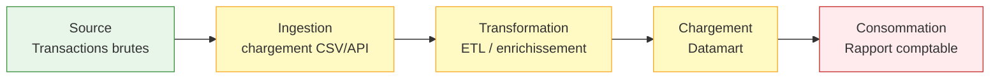

# Data quality & validation : diagnostiquer et corriger les problèmes de qualité

## Objectifs pédagogiques

À l'issue de ce module, tu seras capable de :

- Identifier les 6 dimensions de la qualité des données et déterminer laquelle est en cause dans un incident
- Construire un plan de validation structuré à partir d'une User Story ou d'une spec métier
- Diagnostiquer la source d'une anomalie (input, transformation, output) en suivant une méthode systématique
- Mettre en place des assertions de validation automatisées sur un pipeline de données
- Distinguer une dégradation acceptable d'une anomalie bloquante et communiquer son impact métier

---

## Mise en situation

Tu rejoins l'équipe QA d'une fintech qui gère des virements bancaires. Chaque nuit, un pipeline ETL collecte les transactions de la journée — environ 200 000 lignes — les enrichit avec des données de référence (devises, codes IBAN, plafonds clients), puis alimente un datamart utilisé par le service comptable.

Un matin, la comptabilité remonte une alerte : les totaux de leur rapport quotidien ne correspondent plus aux totaux affichés dans l'interface client. L'écart est de 0,3 %, soit environ 45 000 € sur les transactions de la veille. Pas d'erreur visible en production. Pas de crash. Juste des chiffres qui ne collent plus.

Ton job : trouver d'où vient le problème, démontrer ce qui est cassé, et formuler une règle de validation pour que ça ne repasse jamais sans être détecté.

---

## Pourquoi la qualité des données relève du QA

On a tendance à penser que les bugs de données, c'est l'affaire du data engineer — et que le QA, lui, teste des fonctionnalités. C'est une vision trop étroite.

Un bug de données est souvent **invisible en surface** : l'application tourne, les APIs répondent, les logs sont propres. Pourtant, en coulisse, une valeur NULL là où on attend un montant, un doublon qui double un total, une date mal parsée qui fait sauter un filtre — tout ça produit des décisions métier erronées. Dans le monde bancaire, c'est 45 000 € d'écart. Dans l'e-commerce, c'est un stock négatif commandé et livré. Dans la santé, c'est une posologie calculée sur un poids mal importé.

Le QA senior a donc deux responsabilités ici : **tester les transformations de données comme on teste du code**, et **mettre en place des filets de sécurité** qui détectent les dégradations avant que le métier ne s'en aperçoive.

---

## Les 6 dimensions de la qualité des données

Avant de diagnostiquer quoi que ce soit, il faut parler le même langage. "Les données sont mauvaises" ne veut rien dire — c'est comme dire "ça marche pas" à un médecin.

| Dimension | Ce que ça signifie concrètement | Exemple dans notre scénario |
|---|---|---|
| **Complétude** | Toutes les valeurs attendues sont présentes | Transactions sans montant (NULL) |
| **Exactitude** | Les valeurs correspondent à la réalité | Montant en USD importé comme EUR |
| **Cohérence** | Les données sont cohérentes entre elles et entre systèmes | Total interface ≠ total datamart |
| **Validité** | Les valeurs respectent le format ou domaine attendu | IBAN avec 26 caractères au lieu de 27 |
| **Unicité** | Pas de doublons non voulus | Transaction comptée deux fois |
| **Fraîcheur** | Les données sont à jour | Taux de change J-2 utilisé à la place de J |

🧠 Dans la majorité des incidents, le problème visible (cohérence) masque la cause réelle (complétude, unicité ou exactitude). Diagnostiquer sans cette grille, c'est traiter le symptôme.

Dans notre scénario, l'écart de 0,3 % sur les totaux est un problème de **cohérence**. Mais sa cause peut être n'importe laquelle des autres dimensions. C'est là que commence le vrai travail.

---

## Méthode de diagnostic : remonter le pipeline

Un pipeline de données, c'est une chaîne. Si l'output est faux, l'erreur vient d'un maillon — et pas forcément du dernier. La méthode efficace ressemble à celle d'un électricien qui teste chaque segment de câble : on ne remplace pas toute l'installation avant de savoir où est la coupure.



**Le principe : tester chaque couche indépendamment, en partant de la sortie vers la source.**

### Étape 1 — Isoler la couche fautive

Avant de toucher au code, comparer les volumes et totaux à chaque étape :

```sql
-- Volume à la source (transactions brutes)
SELECT COUNT(*), SUM(montant)
FROM transactions_raw
WHERE date_valeur = '2024-01-15';

-- Volume après ingestion
SELECT COUNT(*), SUM(montant)
FROM transactions_staging
WHERE date_valeur = '2024-01-15';

-- Volume dans le datamart
SELECT COUNT(*), SUM(montant)
FROM fact_transactions
WHERE date_valeur = '2024-01-15';
```

Si les chiffres divergent entre deux étapes consécutives, tu as localisé le maillon cassé. Si tout est cohérent jusqu'au datamart mais que le rapport est faux — le problème est dans la requête du rapport, pas dans le pipeline.

💡 Garde ces requêtes de contrôle dans un dossier `qa/data-checks/`. Elles te serviront à chaque incident et alimenteront plus tard tes assertions automatisées.

### Étape 2 — Caractériser l'anomalie

Une fois le maillon identifié, qualifier le problème avec précision :

```sql
-- Chercher des doublons (unicité)
SELECT transaction_id, COUNT(*) AS occurrences
FROM transactions_staging
WHERE date_valeur = '2024-01-15'
GROUP BY transaction_id
HAVING COUNT(*) > 1;

-- Chercher des NULLs sur les champs critiques (complétude)
SELECT
    COUNT(*)                                              AS total,
    SUM(CASE WHEN montant IS NULL THEN 1 ELSE 0 END)     AS montants_null,
    SUM(CASE WHEN devise IS NULL THEN 1 ELSE 0 END)      AS devises_null
FROM transactions_staging
WHERE date_valeur = '2024-01-15';

-- Chercher des valeurs hors domaine (validité)
SELECT devise, COUNT(*)
FROM transactions_staging
WHERE date_valeur = '2024-01-15'
GROUP BY devise
ORDER BY COUNT(*) DESC;
-- Si tu vois 'EUR', 'USD', 'eur', 'Eur' → problème de normalisation
```

### Étape 3 — Quantifier l'impact métier

Trouver le bug, c'est bien. Savoir si c'est bloquant, c'est ce qui permet de prioriser.

```sql
-- Quantifier l'impact financier des doublons
WITH doublons AS (
    SELECT transaction_id
    FROM transactions_staging
    WHERE date_valeur = '2024-01-15'
    GROUP BY transaction_id
    HAVING COUNT(*) > 1
)
SELECT
    COUNT(*)       AS nb_transactions_doublonnees,
    SUM(montant)   AS montant_surdeclare
FROM transactions_staging t
JOIN doublons d ON t.transaction_id = d.transaction_id;
```

Dans notre cas, cette requête retourne 312 transactions doublonnées pour un total de 44 800 €. On a notre 0,3 % — et une cause précise : des doublons introduits lors de l'ingestion, probablement par une relance de job sans déduplication.

⚠️ S'arrêter à "il y a des doublons" sans calculer l'impact est une erreur fréquente. Le ticket de bug doit contenir : combien de lignes, quel montant, depuis quand, quels clients affectés. Sans ça, l'équipe ne peut pas prioriser.

---

## Construire des règles de validation automatisées

Diagnostiquer une fois, c'est du réactif. L'objectif QA, c'est de passer en **détection proactive** : définir les règles métier une fois, les exécuter à chaque run du pipeline, alerter dès qu'un seuil est dépassé.

### La structure d'une règle de validation

Chaque règle suit la même logique :

```
QUOI vérifier (dimension)
+ SUR quoi (table, colonne, périmètre)
+ CONDITION d'échec
+ SEUIL acceptable (tolérance zéro ou X%)
+ ACTION en cas d'échec (bloquer / alerter / logger)
```

### Exemple avec Great Expectations (Python)

[Great Expectations](https://greatexpectations.io/) est l'outil de référence pour les assertions de qualité de données en Python. Le principe : tu déclares ce que tu attends de tes données, et l'outil vérifie à chaque exécution.

```python
import great_expectations as gx

# Charger le contexte et la datasource
context = gx.get_context()

# Créer un batch sur les données à tester
batch = context.get_batch(
    datasource_name="transactions_db",
    data_asset_name="transactions_staging",
    batch_identifiers={"date_valeur": "2024-01-15"}
)

# Règle 1 — Complétude : montant ne doit jamais être NULL
batch.expect_column_values_to_not_be_null(
    column="montant",
    meta={"description": "Un virement sans montant est invalide"}
)

# Règle 2 — Validité : devise doit appartenir à un ensemble connu
batch.expect_column_values_to_be_in_set(
    column="devise",
    value_set=["EUR", "USD", "GBP", "CHF"],
    mostly=1.0  # tolérance zéro — aucune devise inconnue acceptée
)

# Règle 3 — Unicité : transaction_id doit être unique
batch.expect_column_values_to_be_unique(
    column="transaction_id"
)

# Règle 4 — Cohérence volumétrique : entre 150 000 et 300 000 transactions par jour
batch.expect_table_row_count_to_be_between(
    min_value=150_000,
    max_value=300_000,
    meta={"description": "Volume anormalement bas = probable problème d'ingestion"}
)

# Règle 5 — Validité de format IBAN
batch.expect_column_values_to_match_regex(
    column="iban_beneficiaire",
    regex=r"^[A-Z]{2}[0-9]{2}[A-Z0-9]{11,30}$",
    mostly=0.999  # tolérance de 0,1% pour les cas edge légitimes
)

# Valider et afficher les résultats
results = batch.validate()
print(f"Succès : {results.success}")
print(f"Résultats par règle : {results.statistics}")
```

Si une règle échoue, la sortie ressemble à ça :

```
Succès : False
Résultats par règle :
  - expect_column_values_to_be_unique (transaction_id) : FAILED
    → 312 valeurs non-uniques sur 198 450 lignes (0.16%)
    → Exemples : TXN-2024-0115-88241, TXN-2024-0115-88299...
```

💡 Le paramètre `mostly` est puissant mais dangereux. Sur une colonne de montant financier, `mostly=1.0` (zéro tolérance) est la seule option acceptable. Réserver `mostly=0.999` aux champs secondaires ou aux données provenant de sources tierces qu'on ne maîtrise pas.

### Intégrer les validations dans le pipeline

Une règle de validation isolée dans un script ne sert à rien si elle n'est pas exécutée automatiquement. Voici le pattern avec Airflow :

```python
from airflow import DAG
from airflow.operators.python import PythonOperator, BranchPythonOperator

def run_data_quality_checks(**context):
    """Retourne 'proceed_to_load' ou 'alert_and_stop' selon les résultats."""
    results = validate_staging_transactions(
        date=context['ds']  # date d'exécution du DAG
    )

    if results.success:
        return 'proceed_to_load'
    else:
        failed_checks = [r for r in results.results if not r.success]
        context['task_instance'].xcom_push(
            key='failed_checks',
            value=[str(r) for r in failed_checks]
        )
        return 'alert_and_stop'

with DAG('transactions_pipeline') as dag:

    ingest = PythonOperator(task_id='ingest_raw_data', ...)

    quality_gate = BranchPythonOperator(
        task_id='data_quality_gate',
        python_callable=run_data_quality_checks
    )

    proceed = PythonOperator(task_id='proceed_to_load', ...)
    alert   = PythonOperator(task_id='alert_and_stop', ...)

    ingest >> quality_gate >> [proceed, alert]
```

Le concept ici, c'est le **quality gate** : une porte conditionnelle dans le pipeline qui bloque la suite si les données ne satisfont pas les règles métier. Exactement comme un portique de sécurité à l'aéroport — pas de décollage si quelque chose cloche.

---

## Définir les seuils : tolérance zéro vs acceptable

Vouloir 100 % de conformité sur tout est irréaliste et paralyserait un pipeline en production. La bonne question est toujours la même : **quelle est la conséquence métier si cette règle est violée ?**

| Type de règle | Exemple | Seuil recommandé | Comportement en cas d'échec |
|---|---|---|---|
| Critique — impact financier direct | Montant NULL sur virement | 0 % de tolérance | Bloquer le pipeline, alerter P1 |
| Critique — conformité réglementaire | IBAN invalide | < 0,01 % | Bloquer, isoler les lignes fautives |
| Importante — cohérence reporting | Devise inconnue | < 0,1 % | Alerter, pipeline continue avec flag |
| Secondaire — enrichissement | Libellé vide | < 5 % | Logger, pas de blocage |
| Volumétrique | Nb de transactions / jour | ±20 % vs moyenne 30j | Alerter si hors plage |

🧠 Un seuil de tolérance, c'est un contrat entre le QA et le métier. Il doit être **validé explicitement** par le product owner ou le responsable comptable — pas décidé unilatéralement par l'équipe technique. Si le métier peut accepter 0,1 % d'IBANs invalides dans leurs rapports sans impact opérationnel, c'est une décision métier documentée. Pas une approximation technique.

---

## Tests de régression sur les données

Un pipeline évolue. Chaque modification — nouveau champ, changement de format source, mise à jour d'une règle de gestion — peut introduire une régression silencieuse. La bonne pratique : **freezer un jeu de données de référence** et l'utiliser comme golden dataset.

```python
import pandas as pd
import json
from datetime import date

def create_golden_snapshot(df: pd.DataFrame, output_path: str) -> dict:
    """
    Sauvegarde les statistiques clés d'un DataFrame validé.
    Ce snapshot devient la référence pour les prochains runs.
    """
    snapshot = {
        "generated_at": str(date.today()),
        "row_count": len(df),
        "column_checksums": {
            col: df[col].sum() if df[col].dtype in ['float64', 'int64']
                 else df[col].nunique()
            for col in df.columns
        },
        "null_rates": {
            col: float(df[col].isna().mean())
            for col in df.columns
        },
        "value_distributions": {
            col: df[col].value_counts(normalize=True).head(10).to_dict()
            for col in df.select_dtypes(include='object').columns
        }
    }
    with open(output_path, 'w') as f:
        json.dump(snapshot, f, indent=2)
    return snapshot


def compare_against_golden(
    df: pd.DataFrame,
    golden_path: str,
    tolerance: float = 0.05
) -> list:
    """
    Compare un DataFrame contre le snapshot de référence.
    tolerance : % de variation acceptable sur les sommes et counts.
    """
    with open(golden_path) as f:
        golden = json.load(f)

    issues = []

    # Vérifier le volume
    row_delta = abs(len(df) - golden["row_count"]) / golden["row_count"]
    if row_delta > tolerance:
        issues.append({
            "type": "volume_drift",
            "expected": golden["row_count"],
            "actual": len(df),
            "delta_pct": round(row_delta * 100, 2)
        })

    # Vérifier les checksums financiers
    for col, expected_sum in golden["column_checksums"].items():
        if col in df.columns and df[col].dtype in ['float64', 'int64']:
            actual_sum = df[col].sum()
            delta = abs(actual_sum - expected_sum) / max(abs(expected_sum), 1)
            if delta > tolerance:
                issues.append({
                    "type": "checksum_drift",
                    "column": col,
                    "expected": expected_sum,
                    "actual": actual_sum,
                    "delta_pct": round(delta * 100, 2)
                })

    return issues
```

⚠️ Attention à ne pas utiliser les données de production comme golden dataset sans anonymisation. En fintech, le RGPD l'interdit : le jeu de données de test doit être synthétique ou masqué. Des outils comme [Faker](https://faker.readthedocs.io/) génèrent des données réalistes et non-personnelles.

---

## Cas réel : la dérive silencieuse des recommandations Spotify

En 2020, Spotify a documenté un problème de data drift sur son pipeline de recommandations musicales. Le modèle ML recevait des données d'écoute correctes en apparence, mais un changement de format dans l'API d'un partenaire avait introduit une normalisation différente sur les durées d'écoute — toujours numériques, toujours dans un range plausible, mais sur une échelle différente.

Résultat : les recommandations se dégradaient progressivement, sans erreur technique. Les métriques de satisfaction baissaient de 2 à 3 % par semaine. Aucune alerte ne s'était déclenchée parce que personne n'avait de règle de validation sur la **distribution statistique** des valeurs — seulement sur leur présence et leur format.

La correction : introduction de tests de distribution (Kolmogorov-Smirnov, détection de mean shift) en complément des validations classiques. Chaque jour, la distribution des nouvelles données est comparée à la distribution de référence. Si elle s'éloigne trop, alerte automatique avant que le modèle soit impacté.

C'est l'illustration parfaite qu'une donnée peut être **techniquement valide et métier incorrecte** — et c'est là le vrai challenge du QA data senior.

---

## Bonnes pratiques

**Définir les règles avec le métier, pas pour lui.** Les seuils de tolérance doivent être validés explicitement par le product owner ou le responsable métier avant d'être codés. Un seuil non contractualisé engage la responsabilité du QA en cas d'incident.

**Nommer les règles avec le contexte métier.** `montant_virement_jamais_null` est infiniment plus exploitable que `check_col_montant` dans un rapport d'incident ou un post-mortem à 2h du matin.

**Versionner les suites de validation avec le code du pipeline.** Une règle qui change doit être tracée dans Git au même titre qu'un changement de transformation. Sinon, impossible de savoir quel comportement était attendu à quelle date.

**Mettre en place un data quality dashboard.** Taux de conformité par règle, évolution sur 30 jours, tendances. Un taux qui baisse lentement est souvent plus dangereux qu'une rupture brutale — et invisible sans historique.

**Conserver les rapports d'exécution, même en succès.** Ils permettent de détecter une dérive progressive en post-mortem et de prouver que le pipeline fonctionnait correctement avant un changement donné.

**Documenter chaque incident dans un post-mortem structuré** : cause racine, dimension qualité impactée, règle qui aurait permis de le détecter, règle ajoutée suite à l'incident.

**Toujours commencer par la volumétrie.** COUNT et SUM par couche permettent de localiser le maillon cassé en quelques minutes. Plonger dans les lignes avant d'avoir isolé la couche fautive, c'est chercher une aiguille dans une botte de foin au lieu de d'abord identifier le bon tas.

💡 Chaque incident non détecté par le système est une règle de validation manquante. Tenu sur 6 mois, ce backlog d'incidents permet de construire une suite de validation qui reflète les vrais modes d'échec de tes pipelines — pas une checklist théorique.

---

## Résumé

La qualité des données ne se résume pas à vérifier que les colonnes ne sont pas NULL. Elle couvre six dimensions (complétude, exactitude, cohérence, validité, unicité, fraîcheur) dont les violations peuvent être invisibles en surface pendant des jours.

La méthode de diagnostic efficace part toujours de la couche de sortie vers la source, avec des requêtes de volumétrie avant toute investigation de détail. Une fois l'anomalie localisée, l'étape critique est de quantifier son impact métier — sans ça, impossible de prioriser.

L'objectif final est de transformer ce travail réactif en détection proactive : des règles de validation automatisées, intégrées dans le pipeline comme des quality gates, avec des seuils de tolérance validés par le métier. Et quand les données évoluent silencieusement sans déclencher d'alerte — comme dans le cas Spotify — les tests de distribution statistique prennent le relais là où les validations classiques s'arrêtent.

---

<!-- snippet
id: qa_data_dimensions_qualite
type: concept
tech: data-quality
level: advanced
importance: high
format: knowledge
tags: data-quality,validation,dimensions,qa,pipeline
title: Les 6 dimensions de la qualité des données
content: Complétude (valeurs présentes), Exactitude (valeurs correctes), Cohérence (pas de contradiction entre systèmes), Validité (format/domaine respecté), Unicité (pas de doublons), Fraîcheur (données à jour). Un incident visible (ex : totaux incohérents) relève souvent de la cohérence, mais sa cause est dans une autre dimension — le plus souvent unicité ou complétude.
description: Cadre de diagnostic : identifier quelle dimension est violée avant de chercher la cause technique. Évite de traiter le symptôme plutôt que la cause.
-->

<!-- snippet
id: qa_data_diagnostic_volumetrie
type: tip
tech: sql
level: advanced
importance: high
format: knowledge
tags: diagnostic,sql,pipeline,data-quality,incident
title: Localiser un bug data avec COUNT + SUM à chaque couche
content: Avant de chercher ligne par ligne, comparer COUNT(*) et SUM(montant) entre chaque couche du pipeline (source → staging → datamart). Si staging = source mais datamart ≠ staging → le bug est dans la transformation ou le chargement. 80% des incidents data se diagnostiquent avec 3 requêtes.
description: Méthode de triage rapide : isoler le maillon cassé avant toute investigation de détail. Economise des heures de débogage.
-->

<!-- snippet
id: qa_data_doublons_detection
type: command
tech: sql
level: intermediate
importance: high
format: knowledge
tags: sql,doublons,unicite,validation,diagnostic
title: Détecter les doublons sur une clé fonctionnelle
command: SELECT <CLE>, COUNT(*) FROM <TABLE> WHERE <FILTRE> GROUP BY <CLE> HAVING COUNT(*) > 1;
example: SELECT transaction_id, COUNT(*) FROM transactions_staging WHERE date_valeur = '2024-01-15' GROUP BY transaction_id HAVING COUNT(*) > 1;
description: Retourne uniquement les valeurs non-uniques avec leur nombre d'occurrences. À compléter avec un JOIN + SUM(montant) pour quantifier l'impact financier.
-->

<!-- snippet
id: qa_data_doublons_impact
type: command
tech: sql
level: intermediate
importance: high
format: knowledge
tags: sql,doublons,impact,validation,diagnostic
title: Quantifier l'impact financier des doublons
command: WITH doublons AS (SELECT <CLE> FROM <TABLE> WHERE <FILTRE> GROUP BY <CLE> HAVING COUNT(*) > 1) SELECT COUNT(*), SUM(<MONTANT>) FROM <TABLE> t JOIN doublons d ON t.<CLE> = d.<CLE>;
example: WITH doublons AS (SELECT transaction_id FROM transactions_staging WHERE date_valeur = '2024-01-15' GROUP BY transaction_id HAVING COUNT(*) > 1) SELECT COUNT(*) AS nb_doublons, SUM(montant) AS montant_surdeclare FROM transactions_staging t JOIN doublons d ON t.transaction_id = d.transaction_id;
description: Transforme un constat technique (il y a des doublons) en argument métier (X lignes, Y euros). Indispensable pour prioriser un ticket de bug.
-->

<!-- snippet
id: qa_data_great_expectations_null
type: command
tech: great-expectations
level: advanced
importance: high
format: knowledge
tags: great-expectations,python,validation,completude,pipeline
title: Assertion de complétude avec Great Expectations
command: batch.expect_column_values_to_not_be_null(column="<COLONNE>")
example: batch.expect_column_values_to_not_be_null(column="montant", meta={"description": "Un virement sans montant est invalide"})
description: Échoue si au moins une valeur NULL est présente. Pour une tolérance partielle, ajouter mostly=0.999 — réserver mostly=1.0 aux champs critiques financiers ou réglementaires.
-->

<!-- snippet
id: qa_data_great_expectations_unique
type: command
tech: great-expectations
level: advanced
importance: high
format: knowledge
tags: great-expectations,python,unicite,doublons,validation
title: Assertion d'unicité avec Great Expectations
command: batch.expect_column_values_to_be_unique(column="<COLONNE>")
example: batch.expect_column_values_to_be_unique(column="transaction_id")
description: Bloque le pipeline si des doublons existent sur la clé fonctionnelle. Le résultat d'échec inclut des exemples de valeurs dupliquées — directement exploitables pour l'investigation.
-->

<!-- snippet
id: qa_data_great_expectations_set
type: command
tech: great-expectations
level: advanced
importance: medium
format: knowledge
tags: great-expectations,python,validite,domaine,validation
title: Assertion de domaine de valeurs avec Great Expectations
command: batch.expect_column_values_to_be_in_set(column="<COLONNE>", value_set=[<VALEURS>], mostly=<SEUIL>)
example: batch.expect_column_values_to_be_in_set(column="devise", value_set=["EUR", "USD", "GBP", "CHF"], mostly=1.0)
description: Vérifie que toutes les valeurs appartiennent à un ensemble autorisé. mostly=1.0 pour zéro tolérance, mostly=0.999 pour accepter de rares exceptions documentées.
-->

<!-- snippet
id: qa_data_seuil_tolerance_metier
type: warning
tech: data-quality
level: advanced
importance: high
format: knowledge
tags: data-quality,tolerance,gouvernance,qa,pipeline
title: Un seuil de tolérance doit être validé par le métier
content: Piège : décider unilatéralement qu'on accepte 0,1% d'IBANs invalides. Conséquence : si un incident survient, le QA est responsable d'un seuil non contractualisé. Correction : faire approuver par écrit chaque seuil de tolérance par le product owner ou le responsable métier avant de le coder. Un seuil non validé est une décision technique qui engage la responsabilité du Q
