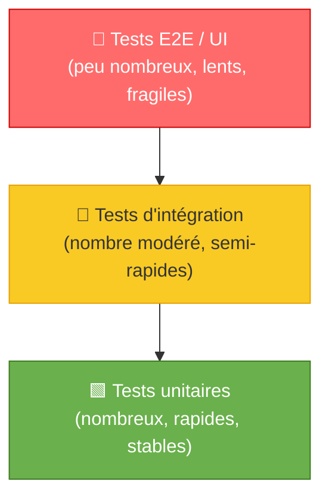
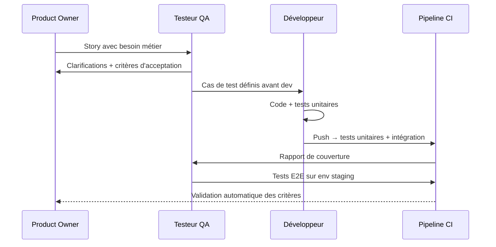
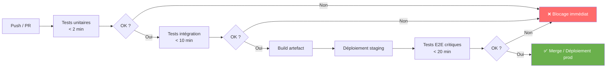

# Stratégie QA entreprise

## Objectifs pédagogiques

À l'issue de ce module, vous serez capable de :

- **Concevoir** une stratégie QA cohérente adaptée à un contexte organisationnel donné
- **Positionner** les différents types de tests dans une pyramide de tests réaliste
- **Intégrer** le QA dans un pipeline CI/CD sans créer de goulot d'étranglement
- **Arbitrer** entre couverture, coût et vélocité selon les contraintes d'un projet
- **Identifier** les anti-patterns stratégiques qui sabotent la qualité à l'échelle

---

## Mise en situation

Une équipe de 15 développeurs livre en production toutes les deux semaines. Les bugs arrivent en prod, les tests manuels prennent trois jours avant chaque release, et les deux QA engineers sont débordés. La réponse intuitive : "on va automatiser."

Six mois plus tard : 800 tests automatisés, 45 minutes de CI, des échecs aléatoires pour des raisons sans rapport avec de vraies régressions, et personne ne maintient vraiment la suite. La situation est pire qu'avant.

Ce scénario se répète dans presque toutes les équipes qui n'ont pas de **stratégie QA explicite**. Automatiser n'est pas une stratégie. Tester davantage non plus. Une stratégie, c'est savoir **quoi tester, à quel niveau, à quel moment, avec quels outils, et pourquoi**.

Ce module construit cette vision de A à Z.

---

## Ce qu'est une stratégie QA — et ce qu'elle n'est pas

Une stratégie QA d'entreprise est un **ensemble de décisions structurelles** qui définissent comment la qualité est produite, vérifiée et maintenue à travers le cycle de développement. Elle répond à des questions concrètes : qui est responsable de quoi ? à quel moment les tests entrent-ils en jeu ? quelle proportion de tests doit être automatisée ? comment la qualité s'intègre-t-elle dans le flux de livraison ?

Ce n'est **pas** un plan de tests pour un projet donné, ni une liste d'outils. Deux équipes peuvent utiliser exactement les mêmes outils avec des résultats radicalement différents selon leur stratégie — ou son absence.

🧠 La stratégie QA est un artefact d'**organisation**, pas d'outillage. Elle définit des règles du jeu que toute l'équipe — dev, QA, PO — respecte collectivement.

---

## Pourquoi formaliser la stratégie devient indispensable à l'échelle

Dans une petite équipe, les conventions implicites suffisent. Tout le monde sait ce qui est testé, par qui, et quand. Dès que le produit grandit — plus de features, plus de développeurs, plus de dépendances — l'informel se délite. Un testeur ne peut plus "tout savoir". Les décisions de test doivent être documentées pour être reproductibles.

Sans stratégie définie, chaque équipe invente ses propres règles. Résultat : chevauchements à certains niveaux, angles morts complets à d'autres, dette de qualité qui grossit silencieusement jusqu'à la première crise en production.

Il y a aussi un enjeu économique direct. Le coût de détection d'un bug croît de façon exponentielle selon le moment où il est trouvé :

```
Détection en développement            →  x1
Détection en intégration              →  x6
Détection en recette (UAT)            →  x15
Détection en production               →  x100 (voire plus selon l'impact)
```

C'est la justification économique centrale de toute démarche QA structurée : maximiser la détection tôt, minimiser ce qui doit être vérifié manuellement tard dans le cycle.

<!-- snippet
id: qa_strategy_bug_cost_concept
type: concept
tech: qa
level: intermediate
importance: high
format: knowledge
tags: cout,risque,strategie,detection,prod
title: Coût de détection d'un bug selon le moment
content: Le coût de détection d'un bug est multiplicatif selon la phase : x1 en développement, x6 en intégration, x15 en recette UAT, x100 (ou plus) en production. C'est la justification économique centrale du shift-left et de l'investissement en tests automatisés précoces.
description: Détection en dev = x1. En prod = x100. Chaque étape retardée multiplie le coût de correction par un facteur 5 à 10.
-->

---

## La pyramide de tests — lire entre les couches

La pyramide de tests est le modèle de référence pour répartir l'effort de test. L'idée centrale : plus un test est bas dans la pyramide, plus il est rapide, stable et peu coûteux à maintenir. Plus il est haut, plus il est réaliste — mais lent, fragile et coûteux.



La répartition souvent citée en contexte agile — **70% unitaires / 20% intégration / 10% E2E** — n'est pas une loi gravée dans le marbre. C'est un principe de gravité. Quand la pyramide s'inverse, on parle de **cône de glace** : tout est lourd, tout est lent, tout casse souvent.

| Niveau | Ce qu'on teste | Qui écrit | Durée typique | Fragilité |
|--------|----------------|-----------|---------------|-----------|
| Unitaire | Une fonction, une classe en isolation | Développeur | < 1 ms | Très faible |
| Intégration | Deux composants ensemble (service + BDD, API + mock) | Dev ou QA | 100 ms – 5 s | Faible à modérée |
| Système / E2E | Un parcours utilisateur complet | QA (automatisé) | 10 s – 2 min | Haute |
| Exploratoire | Comportements inattendus, scénarios limites | QA humain | Variable | N/A |

⚠️ Considérer les tests E2E comme les "vrais" tests et les unitaires comme un détail d'implémentation est l'erreur la plus coûteuse en QA. C'est l'inverse : les unitaires forment le filet de sécurité principal. Les E2E valident des parcours critiques, pas toute la logique métier.

<!-- snippet
id: qa_strategy_pyramid_concept
type: concept
tech: qa
level: advanced
importance: high
format: knowledge
tags: pyramide,tests,architecture,strategie,unitaire
title: Pyramide de tests — répartition et logique
content: La pyramide de tests recommande ~70% unitaires / 20% intégration / 10% E2E. Plus un test est bas, plus il est rapide, stable et peu coûteux à maintenir. L'inversion (beaucoup d'E2E, peu d'unitaires) produit le "cône de glace" : pipeline lent, tests fragiles, diagnostic difficile.
description: Répartition cible : 70% unitaires (< 1ms, très stables) / 20% intégration / 10% E2E. L'inverser génère un cône de glace.
-->

<!-- snippet
id: qa_strategy_antipattern_e2e_warning
type: warning
tech: qa
level: advanced
importance: medium
format: knowledge
tags: e2e,antipattern,pyramide,maintenance,strategie
title: Tests E2E seuls — le cône de glace
content: Piège : considérer les tests E2E comme les "vrais" tests et négliger les unitaires. Conséquence : pipeline lent (> 30 min), tests fragiles (environnement, timing, données), diagnostic difficile quand ça casse. Correction : les E2E couvrent les parcours critiques uniquement (< 10% du volume). La logique métier se teste en unitaire.
description: Les tests E2E valident des parcours, pas la logique. Sans tests unitaires, le pipeline devient lent et fragile — c'est le cône de glace.
-->

---

## Shift-left : intégrer le QA au plus tôt

"Shift-left" signifie littéralement déplacer les activités de test vers la gauche sur la timeline du développement — c'est-à-dire **plus tôt**. Au lieu de tester après le code, on teste pendant, voire avant (TDD, ATDD, BDD).

Concrètement, ça change plusieurs choses dans l'organisation.

**Le QA entre dans la story dès la phase de définition.** Le testeur ne reçoit pas une feature "terminée" à valider — il contribue à définir les critères d'acceptation avec le PO et les développeurs. C'est là que les ambiguïtés se règlent, avant que du code soit écrit.

**Les développeurs écrivent des tests.** Le QA n'est plus le seul responsable de la qualité. Il définit la stratégie et les cas critiques ; les développeurs assurent la couverture unitaire et intégration sur leur propre code.

**Les environnements de test existent tôt.** Un développeur ne devrait pas livrer une feature sans avoir pu la tester dans un environnement proche de la prod — ce qui implique des investissements infra concrets : feature flags, environnements éphémères, conteneurs.



💡 Le shift-left ne signifie pas "le QA fait le travail des devs". Il signifie que la responsabilité de la qualité est **partagée et distribuée dans le temps**, pas concentrée à la fin du sprint.

<!-- snippet
id: qa_strategy_shiftleft_concept
type: concept
tech: qa
level: advanced
importance: high
format: knowledge
tags: shift-left,qa,cycle-de-vie,sprint,strategie
title: Shift-left QA — ce que ça change concrètement
content: Shift-left = faire intervenir le QA dès la définition des stories, avant que le code soit écrit. Le QA contribue aux critères d'acceptation avec le PO et les devs. Résultat : les ambiguïtés sont résolues avant l'implémentation, et les cas de test existent avant le code. Ce n'est pas "le QA fait le travail des devs" — c'est une responsabilité partagée distribuée dans le temps.
description: Le QA entre dans la story dès le refinement, co-définit les critères d'acceptation, et pose les cas de test avant le développement.
-->

---

## Intégration QA dans un pipeline CI/CD

Un pipeline CI/CD sans stratégie QA intégrée finit toujours de la même façon : soit on déploie sans filet (rapide, risqué), soit on bloque le pipeline sur des tests trop longs et trop fragiles (lent, frustrant). Les deux situations finissent par dégrader la qualité.

La clé est de **stratifier les tests par vitesse et par criticité**, et de les distribuer dans le pipeline selon ce principe :



La règle d'or : **un pipeline qui prend plus de 30 minutes sera contourné**. Les développeurs trouvent des moyens de bypasser, ou poussent sans attendre les résultats. La qualité doit aller vite, sinon elle est perçue comme un obstacle — et traitée comme tel.

Pour maintenir des temps raisonnables à mesure que le volume de tests croît, trois leviers principaux :

- **Parallélisation** : faire tourner les tests sur plusieurs agents simultanément
- **Sélection intelligente** : n'exécuter que les tests liés aux fichiers modifiés (test impact analysis)
- **Quarantine** : isoler les tests instables plutôt que les laisser polluer le signal global

⚠️ Ajouter tous les tests au même stage du pipeline sans les stratifier est le chemin le plus direct vers 45 minutes de CI et une équipe qui n'attend plus les résultats. La stratification — fast-first, slow-later — est non négociable dès que le volume monte.

<!-- snippet
id: qa_strategy_pipeline_warning
type: warning
tech: ci-cd
level: advanced
importance: high
format: knowledge
tags: pipeline,ci-cd,performance,stratification,qa
title: Pipeline QA sans stratification — le piège des 45 minutes
content: Piège : ajouter tous les tests au même stage du pipeline. Conséquence : pipeline > 30 min, développeurs qui bypassent ou n'attendent pas les résultats, signal de qualité dégradé. Correction : stratifier en 3 stages — unitaires < 3 min (bloquants sur PR), intégration < 10 min, E2E critiques < 20 min sur staging seulement.
description: Un pipeline > 30 min est contourné en pratique. Stratifier : unitaires < 3 min / intégration < 10 min / E2E < 20 min sur staging.
-->

<!-- snippet
id: qa_strategy_flaky_tip
type: tip
tech: qa
level: advanced
importance: medium
format: knowledge
tags: flaky,pipeline,stabilite,quarantine,ci
title: Gérer les tests flakys — quarantine avant suppression
content: Un test qui échoue de façon aléatoire (flaky) dégrade plus le signal qualité que son absence. Action : mettre en quarantine immédiatement (tag @flaky ou suite dédiée hors pipeline principal), investiguer la cause dans les 48h (timing, données partagées, ordre d'exécution), corriger ou supprimer. Ne jamais laisser un test flaky dans le pipeline principal.
description: Un test flaky dans le pipeline principal crée de la défiance sur l'ensemble des résultats. Quarantine en 48h, investigation, correction ou suppression.
-->

---

## Arbitrer entre couverture, coût et vélocité

Il n'existe pas de stratégie QA universellement optimale. Chaque organisation doit arbitrer selon ses contraintes réelles — et ces contraintes évoluent avec le produit.

**Couverture vs vélocité.** Plus on teste, plus on ralentit — si c'est mal structuré. La couverture à 100% est un mythe coûteux. L'objectif est de couvrir les **chemins à risque**, pas tous les chemins possibles.

**Automatisation vs exploration.** Tout automatiser coûte cher en maintenance. Tout faire manuellement ne scale pas. La bonne proportion dépend du produit : une application critique (banque, santé) automatise plus agressivement ; un produit en early-stage peut se permettre davantage d'exploration manuelle.

**Qualité interne vs qualité perçue.** Des tests unitaires exhaustifs n'empêchent pas un parcours utilisateur cassé. Des tests E2E bien ciblés ne compensent pas une logique métier trouée. Les deux dimensions doivent coexister.

| Situation | Priorité recommandée |
|-----------|----------------------|
| Produit en phase de discovery (MVP) | Exploration manuelle, peu d'automatisation |
| Produit stable avec releases fréquentes | Pyramide équilibrée, CI/CD automatisé |
| Produit réglementé (santé, finance) | Couverture haute, traçabilité exigée |
| Système legacy sans tests existants | Commencer par intégration/E2E, puis descendre vers l'unitaire |
| Équipe QA restreinte (1-2 personnes) | Automatiser les régressions critiques, explorer les nouvelles features |

🧠 La stratégie QA doit **évoluer avec le produit**. Ce qui est adapté à un MVP ne l'est plus à un produit en production utilisé par des milliers d'utilisateurs. La réviser tous les 6 mois est une bonne pratique — pas un luxe.

---

## Gouvernance QA : qui fait quoi, et comment c'est mesuré

Une stratégie sans gouvernance reste un document théorique. La gouvernance définit les **rôles, les règles et les indicateurs** qui font vivre la stratégie dans le quotidien des équipes.

### Répartition des responsabilités

| Rôle | Responsabilité QA |
|------|-------------------|
| Développeur | Tests unitaires et intégration sur son périmètre, correction des bugs de CI |
| QA Engineer | Stratégie de test, cas critiques, automatisation E2E, suivi de la qualité |
| Tech Lead | Standards de couverture, revue des pratiques de test, dette technique QA |
| Product Owner | Critères d'acceptation, priorisation des cas de test par valeur métier |
| QA Lead / Manager | Gouvernance, métriques, alignement entre équipes |

### Mesurer la santé du système QA

Les métriques QA doivent mesurer la santé du **système de qualité**, pas seulement le volume de tests. Quelques indicateurs utiles :

- **Taux de défauts échappés** (escaped defects) : bugs trouvés en prod vs bugs trouvés avant. C'est le KPI le plus révélateur.
- **Temps moyen de détection** : délai entre l'introduction d'un bug et sa détection.
- **Stabilité du pipeline** : ratio vrais échecs / échecs flakys.
- **Couverture de code** : utile comme signal, dangereux comme objectif.
- **Durée du pipeline** : > 30 minutes signale un problème structurel.

💡 Méfiez-vous des métriques qui peuvent être "gamées". Si l'objectif affiché est "80% de couverture", les développeurs écriront des tests qui exécutent le code sans vérifier le comportement métier. Préférez les métriques comportementales — escaped defects, mean time to detect — aux métriques de volume.

<!-- snippet
id: qa_strategy_escaped_defects_tip
type: tip
tech: qa
level: advanced
importance: high
format: knowledge
tags: metriques,kpi,qualite,gouvernance,escaped-defects
title: KPI QA — privilégier les escaped defects au coverage
content: Le taux de défauts échappés (bugs trouvés en prod / bugs totaux) est le KPI QA le plus révélateur. La couverture de code est un proxy trompeur : du code peut être exécuté sans que le comportement métier soit vérifié. Suivre aussi : mean time to detect (délai entre introduction et détection du bug) et stabilité du pipeline (ratio vrais échecs / échecs flakys).
description: Escaped defects = bugs prod / bugs totaux. Plus révélateur que la couverture de code, qui peut être gamée avec des assertions creuses.
-->

<!-- snippet
id: qa_strategy_coverage_warning
type: warning
tech: qa
level: advanced
importance: medium
format: knowledge
tags: couverture,metrics,qualite,assertions,tests
title: Couverture de code ≠ couverture fonctionnelle
content: Piège : fixer un objectif de couverture de code (ex: 80%). Les développeurs écrivent des tests qui exécutent le code sans vérifier le comportement (assert response is not None). Résultat : couverture haute, bugs non détectés. La couverture est un signal, pas un objectif. Préférer des assertions précises sur le comportement attendu.
description: Un test qui exécute le code sans vérifier le résultat métier fait monter la couverture sans apporter de sécurité réelle.
-->

---

## Anti-patterns stratégiques à éviter

Quelques configurations qui semblent raisonnables de loin mais qui sabotent la qualité à l'échelle.

**Le QA en bout de chaîne.** Le testeur reçoit la feature la veille de la release. Résultat : tests superficiels, pression maximale, dette accumulée. Le QA doit être en amont, pas en aval.

**L'automatisation comme objectif.** "On veut 500 tests automatisés d'ici la fin du trimestre." 500 tests mal ciblés sont pires que 100 tests bien ciblés : ils cassent souvent, pour de mauvaises raisons, et ça décourage tout le monde de les maintenir.

**La pyramide inversée.** Beaucoup de tests E2E, peu d'unitaires. Chaque test E2E couvre un périmètre large mais teste une infime partie des combinaisons possibles. Et quand ça casse, diagnostiquer *pourquoi* prend souvent plus de temps que corriger le bug.

**L'équipe QA en silo.** Une équipe QA séparée du reste du développement génère des frictions, des délais et une mauvaise compréhension mutuelle. Le QA moderne est intégré dans l'équipe produit, pas adjacent à elle.

**Des tests qui ne testent pas.** Des tests qui passent toujours, même quand le comportement attendu est cassé. Ça arrive avec des assertions trop larges (`assert response is not None` sans vérifier le contenu), ou des mocks mal configurés qui simulent un succès fictif. La couverture monte, les bugs passent.

---

## Cas réel : refonte de la stratégie QA chez une scale-up SaaS

**Contexte** : une entreprise SaaS B2B, 30 développeurs, 2 QA engineers, releases bi-hebdomadaires. Pipeline CI à 55 minutes. Bugs en production en hausse de 40% sur 6 mois. Les deux QA engineers passent 80% de leur temps en régression manuelle.

**Diagnostic** :
- 90% des tests sont des tests E2E — cône de glace caractérisé
- Aucun test unitaire dans 60% des services
- Tests E2E flakys à 30% (échec aléatoire)
- Le QA n'intervient qu'en fin de sprint, jamais en refinement

**Actions sur 3 mois** :

1. **Audit de la suite existante** : suppression des tests E2E flakys, identification des 40 parcours critiques à conserver
2. **Definition of Done QA** : toute story doit avoir ses tests unitaires écrits par le dev avant merge
3. **Formation des devs** : 3 sessions sur l'écriture de tests unitaires et d'intégration
4. **Stratification du pipeline** : unitaires < 3 min, intégration < 8 min, E2E critiques < 15 min
5. **Shift-left** : le QA engineer participe aux refinements pour co-définir les critères d'acceptation

**Résultats à 3 mois** :
- Pipeline : 55 min → 18 min
- Escaped defects : −55%
- Temps QA en régression manuelle : 80% → 25%
- Les 2 QA engineers ont pu basculer vers l'automatisation de nouveaux parcours et le test exploratoire

Ce qui a réellement fait la différence n'est pas l'outillage — il n'a quasiment pas changé. C'est la **redistribution des responsabilités** et la stratification du pipeline.

<!-- snippet
id: qa_strategy_dod_tip
type: tip
tech: qa
level: advanced
importance: medium
format: knowledge
tags: definition-of-done,gouvernance,equipe,workflow,qa
title: Ancrer la qualité via la Definition of Done QA
content: Ajouter dans la DoD de chaque story : tests unitaires écrits par le dev avant merge, critères d'acceptation documentés par le QA en refinement, et zéro test flaky introduit. Cette règle fait de la qualité une condition de livraison, pas une étape optionnelle après le dev. À réviser en rétrospective tous les 2 sprints au démarrage.
description: Intégrer dans la DoD : tests unitaires obligatoires avant merge + critères d'acceptation définis en refinement avec le QA.
-->

---

## Bonnes pratiques pour construire une stratégie QA durable

**Commencer par le risque, pas par l'outil.** Avant de choisir un framework d'automatisation, identifiez quelles parties du produit ont le plus d'impact si elles cassent. Testez ça en priorité — le reste peut attendre.

**Rendre la stratégie visible.** Documentez-la dans le wiki de l'équipe. Un document vivant révisé tous les trimestres vaut mieux qu'une stratégie parfaite dans la tête du QA lead.

**Investir dans la maintenabilité des tests.** Des tests mal structurés deviennent rapidement un fardeau. Appliquez aux tests les mêmes standards qu'au code de production : revue de code, zéro duplication, séparation des données de test et de la logique de test.

**Mesurer pour décider, pas pour reporter.** Les métriques QA existent pour prendre de meilleures décisions. Si un indicateur ne génère aucune action concrète, il ne sert à rien — il rassure.

**Traiter les tests flakys sans attendre.** Un test qui échoue aléatoirement dégrade plus le signal qualité que son absence. Quarantine immédiate, investigation dans les 48h, correction ou suppression. Jamais dans le pipeline principal.

**Réviser la stratégie à mesure que le produit évolue.** Ce qui est adapté à un MVP ne l'est plus à un produit en production à grande échelle. Une revue formelle tous les 6 mois — en rétrospective ou en session dédiée — évite que la stratégie devienne obsolète sans que personne ne s'en aperçoive.

**Accepter l'imperfection stratégique.** Une stratégie QA à 80% appliquée vaut mieux qu'une stratégie parfaite jamais déployée. Commencez simple, itérez.

---

## Résumé

Une stratégie QA d'entreprise est l'ensemble des décisions structurelles qui définissent comment la qualité est produite et maintenue à travers le cycle de développement. Elle répond à trois questions : quoi tester (pyramide, priorisation par risque), quand tester (shift-left, intégration CI/CD), et qui teste quoi (gouvernance, responsabilités partagées).

Sans stratégie explicite, les équipes convergent naturellement vers des anti-patterns coûteux — pyramide inversée, QA en silo, automatisation désordonnée. La justification économique est simple : le coût d'un bug croît d'un facteur 100 entre sa détection en développement et sa détection en production.

La maturité d'une stratégie QA se mesure à sa capacité à évoluer avec le produit et à son ancrage dans les pratiques quotidiennes — pas à son exhaustivité théorique.
