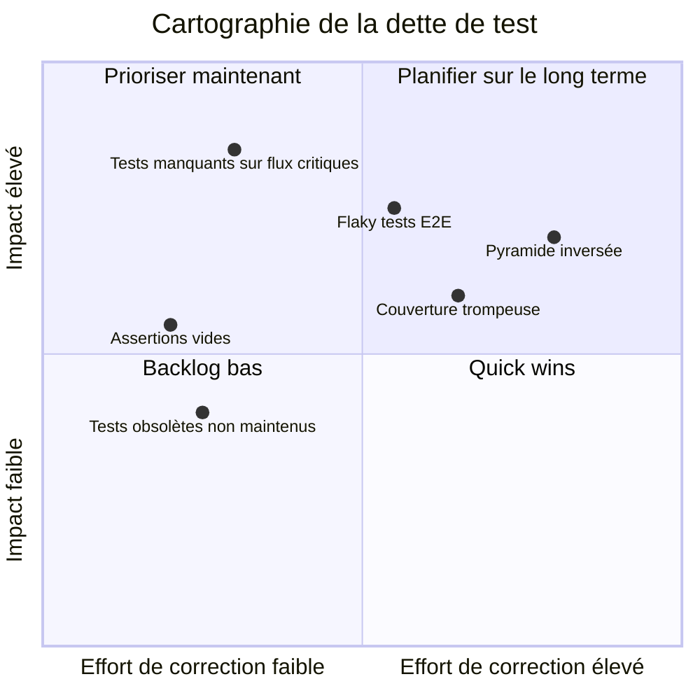

# Dette de test

## Objectifs pédagogiques

À l'issue de ce module, vous serez capable de :

1. **Identifier** les symptômes d'une dette de test dans un projet réel
2. **Distinguer** les différentes formes de dette de test et leur impact respectif
3. **Diagnostiquer** les causes racines d'une dette de test accumulée
4. **Prioriser** les actions de remédiation selon le risque et la valeur métier
5. **Argumenter** auprès d'une équipe ou d'un PO pour allouer du temps à la réduction de cette dette

---

## Mise en situation

Vous rejoignez une équipe sur un projet qui tourne depuis 18 mois. Le produit fonctionne, les releases partent toutes les deux semaines — mais à chaque sprint, l'équipe passe autant de temps à "déboguer les tests" qu'à tester réellement le produit.

Les tests end-to-end tombent en rouge pour des raisons sans rapport avec le code testé. Personne ne sait exactement ce que couvre la suite de tests. Quand un bug arrive en production, tout le monde hoche la tête et dit "on aurait dû avoir un test pour ça". Mais ajouter un nouveau test prend deux fois plus de temps qu'avant, parce qu'il faut comprendre une architecture de test qui n'a jamais été pensée globalement.

C'est la dette de test. Et elle est silencieuse jusqu'au moment où elle ne l'est plus du tout.

---

## Ce que c'est — et pourquoi ça coûte plus cher qu'on ne le croit

La **dette de test** est l'accumulation de décisions sous-optimales prises dans la conception, la rédaction ou la maintenance des tests — décisions qui semblaient raisonnables sur le moment, mais qui freinent progressivement la capacité d'une équipe à livrer avec confiance.

Le terme vient de la **dette technique**, concept introduit par Ward Cunningham : vous empruntez du temps aujourd'hui en prenant un raccourci, mais vous payez des intérêts sous forme de complexité croissante jusqu'à ce que vous remboursez. La dette de test, c'est la même logique appliquée spécifiquement à l'effort de test.

Ce qui la rend traître, c'est qu'elle n'est **pas visible dans le code métier**. Un développeur peut voir immédiatement qu'un module est trop couplé ou qu'une classe fait trop de choses. Mais une suite de tests mal structurée, c'est invisible depuis l'extérieur — jusqu'à ce que les tests commencent à coûter plus cher qu'ils ne rapportent.

🧠 La dette de test n'est pas synonyme de "tests absents". On peut avoir une couverture à 85% et une dette de test catastrophique si ces tests sont fragiles, lents, non maintenables ou mal ciblés.

---

## Les formes de dette de test

La dette de test n'a pas une seule tête. En pratique, elle se manifeste sous plusieurs formes qui coexistent — et se renforcent mutuellement.

### Tests manquants

La forme la plus évidente. Des pans entiers du produit ne sont pas couverts : modules anciens jamais testés, fonctionnalités ajoutées en urgence, cas limites jamais considérés. Chaque modification dans ces zones est un saut dans le vide.

### Tests fragiles (flaky tests)

Des tests qui passent et échouent de manière aléatoire, sans que le code ait changé. Ils dépendent de l'ordre d'exécution, d'une ressource externe instable, d'un timing réseau, ou d'un état global mal réinitialisé. Résultat : l'équipe apprend à **ignorer les échecs**, ce qui est exactement le contraire de ce qu'un test est censé produire.

⚠️ Face à un test flaky, la réaction classique est de le relancer jusqu'à ce qu'il passe, puis de l'oublier. C'est l'équivalent de débrancher le détecteur de fumée parce qu'il sonne trop souvent. Le test flaky est un signal à investiguer, pas à contourner.

### Tests trop couplés à l'implémentation

Des tests unitaires qui vérifient le comportement interne d'une classe — l'ordre des appels de méthodes, les détails d'une structure interne — plutôt que son comportement observable. À chaque refactoring, même sans changer le comportement, ces tests cassent. Ils coûtent cher à maintenir pour une valeur proche de zéro.

### Tests non maintenus

Des cas de test dont le contexte original n'existe plus. Les données de test ne correspondent plus au domaine actuel. Les assertions vérifient des formats obsolètes. Personne n'ose toucher à ces tests parce que personne ne comprend plus ce qu'ils étaient censés valider.

### Couverture trompeuse

Des métriques de couverture qui semblent rassurantes mais masquent une réalité différente : des tests qui traversent du code sans rien vérifier, des assertions vides ou trop permissives, une couverture concentrée sur les chemins heureux et absente sur les cas d'erreur.

### Pyramide inversée

Une suite de tests sur-représentée en tests end-to-end et sous-représentée en tests unitaires. Chaque test E2E est 10 à 100 fois plus lent, plus fragile et plus coûteux à maintenir qu'un test unitaire équivalent. Quand la pyramide est inversée, les feedbacks sont lents et les diagnostics difficiles.

```mermaid
graph TB
    subgraph Pyramide saine
        U1["Tests unitaires\nnombreux, rapides"]
        I1["Tests intégration\nquelques-uns"]
        E1["Tests E2E\nrares, ciblés"]
        U1 --> I1 --> E1
    end

    subgraph Pyramide inversée — dette
        E2["Tests E2E\ntrop nombreux"]
        I2["Tests intégration\nquelques-uns"]
        U2["Tests unitaires\nquasi absents"]
        E2 --> I2 --> U2
    end

    style U1 fill:#4CAF50,color:#fff
    style I1 fill:#FF9800,color:#fff
    style E1 fill:#F44336,color:#fff
    style E2 fill:#F44336,color:#fff
    style I2 fill:#FF9800,color:#fff
    style U2 fill:#9E9E9E,color:#fff
```

Ces six formes se combinent rarement seules. Un projet avec une pyramide inversée développe presque mécaniquement du flakiness — et le flakiness non traité mène à la perte de confiance dans la suite, ce qui freine la maintenance, ce qui aggrave tout le reste. La dette de test est un système, pas une liste de problèmes indépendants.

---

## Diagnostiquer la dette de test sur un projet réel

Reconnaître la dette de test, c'est savoir lire les signaux. Voici comment procéder concrètement quand vous arrivez sur un projet ou que vous suspectez un problème.

### Les signaux d'alerte à surveiller

| Signal | Ce qu'il révèle | Comment le mesurer |
|--------|----------------|-------------------|
| Durée de la suite de tests > 20 min | Pyramide inversée ou tests mal isolés | CI/CD — temps d'exécution par étape |
| Taux de flakiness > 2% | Tests fragiles, dépendances cachées | Historique des runs CI sur 30 jours |
| Fréquence de "skip" sur des tests | Tests trop cassants ou obsolètes | Git log sur les fichiers de tests |
| Bugs en prod sans test associé | Couverture insuffisante sur les chemins critiques | Croisement tickets/couverture |
| Temps de rédaction d'un nouveau test > 2h | Architecture de test trop complexe | Estimation sprint vs réel |
| Couverture élevée mais bugs fréquents | Assertions trop faibles, couverture trompeuse | Audit manuel d'un échantillon de tests |

### La question à poser à l'équipe

Plutôt que de commencer par des outils, posez cette question à l'équipe : **"Quand un test passe au rouge, est-ce que vous faites confiance à ce signal ?"**

Si la réponse est "ça dépend" ou "pas vraiment", la dette de test est là — peut-être pas dans les chiffres, mais dans la culture. Une suite de tests qui n'est plus crue est une suite de tests qui a cessé d'exister fonctionnellement.

### Cartographier la dette

Une fois les signaux identifiés, l'objectif est de les positionner selon deux axes : **l'impact sur la qualité** et **l'effort de remédiation**. Cette cartographie détermine l'ordre d'intervention.



💡 Pour les tests manquants sur des flux critiques, partez de la cartographie des risques métier, pas de la couverture de code. Un module à 10% de couverture sur le tunnel de paiement est infiniment plus urgent qu'un module à 40% sur une page d'aide.

---

## Les causes racines — pourquoi la dette s'accumule

Comprendre les symptômes ne suffit pas. Pour rembourser la dette durablement, il faut comprendre pourquoi elle s'est formée — parce que les mêmes causes reproduiront la même dette si on ne les adresse pas.

**La pression temporelle** est la cause la plus citée — et elle est souvent réelle. Mais elle cache fréquemment une cause plus profonde : l'absence de définition partagée de "terminé". Si "done" signifie "le dev est mergé" sans inclure explicitement la couverture de test, alors les tests seront toujours la variable d'ajustement sous pression. Ce n'est pas un problème de discipline, c'est un problème de contrat d'équipe absent.

**L'absence de standards** est une autre source majeure. Si chaque développeur organise ses tests à sa façon, si les conventions de nommage varient d'un fichier à l'autre, si les fixtures sont dupliquées à dix endroits — la maintenabilité s'effondre progressivement. Le problème n'est pas la compétence individuelle, c'est l'absence de règle commune.

**La non-priorisation de la maintenance des tests** vient du fait qu'on traite souvent le code de test comme un citoyen de seconde zone. Le refactoring s'applique au code de production, rarement aux tests eux-mêmes. Résultat : le code de production évolue proprement, pendant que les tests deviennent une jungle de plus en plus difficile à traverser.

**La mauvaise métrique**, enfin, c'est la couverture de code utilisée comme objectif absolu. "Atteindre 80% de couverture" pousse à écrire des tests qui traversent du code sans le vérifier, uniquement pour faire monter un chiffre. La couverture est un indicateur parmi d'autres — elle ne dit rien sur la qualité de ce qui est vérifié.

---

## Stratégie de remédiation — comment on rembourse

La dette de test ne se rembourse pas en un sprint miraculeux. Elle se rembourse progressivement, avec méthode, en intégrant la réduction de dette dans le rythme normal de travail — pas en dehors de lui.

### Règle du Boy Scout appliquée aux tests

Quand vous modifiez un module, améliorez les tests qui l'entourent. Pas besoin de tout refaire — juste de laisser la zone dans un état légèrement meilleur qu'à l'arrivée. C'est lent, mais c'est durable et ça ne nécessite pas de négocier un sprint dédié.

### Triage par criticité métier

Tout ne mérite pas le même niveau de remédiation. Établissez une carte des zones à risque :

1. **Zone rouge** — Flux critiques (paiement, authentification, données sensibles) : couverture obligatoire, tests stables, revus régulièrement
2. **Zone orange** — Fonctionnalités fréquemment utilisées : couverture suffisante, flakiness à zéro
3. **Zone verte** — Fonctionnalités secondaires ou stables : maintien de l'existant, pas d'investissement prioritaire

### Traiter les flaky tests sans attendre

Les tests fragiles sont une dette à remboursement urgent — pas parce qu'ils sont techniquement compliqués, mais parce que chaque test flaky qui reste en place dégrade la confiance de toute l'équipe dans la suite. La politique à adopter est simple : **un test flaky identifié = ticket créé dans le sprint courant, pas dans le backlog lointain**.

### Mettre en place un budget de dette explicite

Dans chaque sprint, réservez un pourcentage du temps à la maintenance des tests — généralement 10 à 15%. Ce n'est pas du temps perdu, c'est un investissement explicite pour que la suite de tests reste un actif, pas un passif.

💡 Pour convaincre un PO ou un manager, ne parlez pas de "qualité de code de test". Parlez de **délai de livraison** : une suite de tests qui met 40 minutes à s'exécuter et produit 15% de faux positifs coûte X heures par semaine à l'équipe. Mettez un chiffre dessus, et la conversation change.

---

## Cas réel — Refactoring d'une suite E2E héritée

Une équipe e-commerce découvre que sa suite de tests end-to-end met 55 minutes à s'exécuter sur la CI. 30% des runs contiennent au moins un test en rouge qui passe si on relance. Les développeurs ont pris l'habitude de merger sans attendre le résultat complet.

**Diagnostic initial :**
- 180 tests E2E, 12 tests d'intégration, 45 tests unitaires → pyramide totalement inversée
- 40 tests marqués `@skip` dans le code, sans commentaire d'explication
- 3 fixtures de données copiées-collées dans 15 fichiers différents
- Aucune politique de nommage cohérente

**Actions menées sur 8 semaines :**

| Semaine | Action | Résultat |
|---------|--------|----------|
| 1-2 | Audit et cartographie — identifier les 20 tests les plus flaky | Liste priorisée, cause identifiée (timing réseau) |
| 3-4 | Suppression des 40 tests skippés après validation métier | −40 tests inutiles, suite allégée |
| 5-6 | Refactoring des fixtures en helpers partagés | Duplication réduite de 70% |
| 7-8 | Réécriture de 30 tests E2E en tests d'intégration + ajout de 60 tests unitaires | Couverture maintenue, temps de CI réduit |

**Résultats mesurés :**
- Temps de CI : 55 min → 18 min
- Taux de flakiness : 30% → 1,5%
- Confiance de l'équipe dans les signaux de test : restaurée (confirmée en rétrospective)

Ce qui a rendu ce refactoring possible, c'est d'abord la décision de **ne pas tout refaire d'un coup**. L'équipe a priorisé par impact, traité les flaky tests avant de toucher à l'architecture, et n'a supprimé des tests qu'après validation explicite avec le métier. Sans cette méthode, le chantier aurait été abandonné à mi-chemin.

---

## Bonnes pratiques — ce qui fait la différence

**Inclure la qualité des tests dans la définition of done.** Un test qui passe mais qui ne vérifie rien n'est pas un test, c'est du bruit. La DoD doit inclure explicitement : couverture des cas critiques, absence d'assertions vides, nommage lisible. Sans critère explicite, les tests seront toujours sacrifiés en fin de sprint.

**Nommer les tests pour qu'ils documentent.** `test_checkout_fails_when_stock_is_zero_for_all_items()` est un test. `test_checkout_3()` est une bombe à retardement. Un bon nom de test dit ce qui est testé, dans quelle condition, et quel comportement est attendu — sans avoir à lire le corps du test.

**Ne jamais ignorer un test flaky.** Si le test ne mérite pas d'être fiabilisé, il ne mérite pas d'exister. Le supprimer est une décision légitime. Le garder et l'ignorer est le pire des deux mondes : il occupe de la place, ralentit la CI, et entraîne l'équipe à ignorer les signaux rouges.

**Mesurer ce qui compte vraiment.** La couverture de code est un indicateur parmi d'autres. Plus révélateurs en pratique : le taux de flakiness sur 30 jours glissants, le temps d'exécution de la suite, le délai entre un bug et sa détection (MTTD — Mean Time to Detect). Ces trois métriques ensemble décrivent la santé réelle d'une suite de tests.

**Traiter le code de test avec le même soin que le code de production.** Refactoring, revue de code, conventions de nommage — tout ce qui s'applique au code métier s'applique aux tests. Un test écrit à la va-vite est de la dette immédiate.

⚠️ Confondre "ajouter des tests" avec "réduire la dette de test" est une erreur fréquente. On peut ajouter 100 tests fragiles et mal ciblés et aggraver la situation. La réduction de dette, c'est améliorer la qualité des tests existants autant que leur quantité — parfois, supprimer un test est le meilleur acte de remédiation possible.

🧠 La dette de test est un révélateur de la maturité d'une équipe QA. Les équipes qui la gèrent bien ne cherchent pas la couverture parfaite — elles cherchent une suite de tests en laquelle elles ont confiance. C'est une différence de posture, pas de compétence technique.

---

## Résumé

La dette de test est l'accumulation de décisions sous-optimales sur la qualité, la structure ou la maintenance des tests — décisions qui semblent innocentes sur le moment, mais qui dégradent progressivement la capacité d'une équipe à livrer avec confiance. Elle prend de nombreuses formes : tests manquants, tests fragiles, couverture trompeuse, pyramide inversée, tests non maintenus — et ces formes se renforcent mutuellement.

Elle ne se diagnostique pas uniquement avec des métriques : le signe le plus fiable reste la question "est-ce que l'équipe fait confiance à ses tests ?" Quand la réponse est non, la dette est déjà là, quelle que soit la couverture affichée.

La rembourser demande de la méthode : trier par criticité métier, traiter les flaky tests en priorité, intégrer un budget de maintenance dans chaque sprint, et traiter le code de test avec le même soin que le code de production. Ce n'est pas glamour, mais c'est ce qui sépare une équipe QA qui ralentit un projet d'une équipe QA qui le protège.

---

<!-- snippet
id: qa_dette_flaky_test
type: warning
tech: testing
level: advanced
importance: high
format: knowledge
tags: flaky-tests,dette-test,fiabilite,ci-cd,qualite
title: Un test flaky ignoré dégrade toute la suite
content: Piège : relancer un test flaky jusqu'à ce qu'il passe, puis merger. Conséquence : l'équipe apprend à ignorer les échecs CI → les vrais bugs passent inaperçus. Correction : tout test flaky identifié → ticket créé dans le sprint courant, pas dans le backlog.
description: Un test flaky non traité brise la confiance dans la suite entière — les équipes finissent par ignorer tous les signaux rouges.
-->

<!-- snippet
id: qa_dette_couverture_trompeuse
type: concept
tech: testing
level: advanced
importance: high
format: knowledge
tags: couverture-code,assertions,qualite,dette-test,metriques
title: Couverture élevée ≠ tests fiables
content: La couverture de code mesure les lignes traversées pendant les tests, pas les comportements vérifiés. Un test peut traverser une fonction sans aucune assertion et faire monter le compteur. Résultat : 85% de couverture avec des assertions vides ou trop permissives = fausse sécurité. Indicateurs plus fiables : taux de flakiness, MTTD (Mean Time to Detect), nombre de bugs arrivés en prod sans test associé.
description: Une couverture à 85% peut masquer une suite de tests qui ne vérifie presque rien — traverser du code n'est pas le valider.
-->

<!-- snippet
id: qa_dette_pyramide_inversee
type: warning
tech: testing
level: advanced
importance: high
format: knowledge
tags: pyramide-tests,e2e,tests-unitaires,performance,dette-test
title: Pyramide inversée : E2E en majorité = dette structurelle
content: Piège : accumuler des tests E2E parce qu'ils semblent "complets". Conséquence : suite lente (>20 min), flakiness élevé, diagnostics difficiles. Un test E2E coûte 10 à 100× plus cher à maintenir qu'un test unitaire équivalent. Correction : identifier les tests E2E qui peuvent être descendus en tests d'intégration ou unitaires — commencer par les plus lents et les plus fragiles.
description: Une majorité de tests E2E ralentit la CI, augmente le flakiness et rend les diagnostics impossibles — signal classique de dette de test structurelle.
-->

<!-- snippet
id: qa_dette_definition_done
type: tip
tech: testing
level: intermediate
importance: high
format: knowledge
tags: definition-of-done,qualite,equipe,processus,dette-test
title: Intégrer la qualité des tests dans la DoD
content: Action concrète : ajouter dans la Definition of Done de l'équipe — (1) cas critiques couverts, (2) aucune assertion vide, (3) nom de test lisible (format : test_<comportement>_quand_<condition>), (4) aucun nouveau test flaky. Sans critère explicite, les tests sont toujours la variable d'ajustement sous pression.
description: Sans DoD incluant explicitement la qualité des tests, les tests seront systématiquement sacrifiés en fin de sprint sous la pression des délais.
-->

<!-- snippet
id: qa_dette_nommage_test
type: tip
tech: testing
level: intermediate
importance: medium
format: knowledge
tags: nommage,lisibilite,maintenance,documentation,tests
title: Nommer les tests pour qu'ils documentent
content: Format recommandé : test_<comportement_attendu>_quand_<condition>. Exemple : test_checkout_fails_when_stock_is_zero_for_all_items(). Un test bien nommé dit ce qu'il teste, dans quelle condition, et ce qui est attendu — sans lire le corps du test. Un test nommé test_checkout_3() est de la dette immédiate.
description: Un nom de test illisible force à lire le code du test pour comprendre ce qu'il vérifie — coût invisible qui s'accumule à chaque maintenance.
-->

<!-- snippet
id: qa_dette_budget_maintenance
type: tip
tech: testing
level: advanced
importance: medium
format: knowledge
tags: dette-test,sprint,maintenance,organisation,equipe
title: Réserver 10-15% du sprint à la maintenance des tests
content: Pratique concrète : dans chaque sprint planning, budgéter explicitement 10 à 15% du temps à la maintenance des tests (refactoring de fixtures, suppression de tests obsolètes, fiabilisation de flaky tests). Argument PO : chiffrer le coût actuel — ex. "notre suite CI prend 40 min et produit 15% de faux positifs = X heures/semaine perdues par l'équipe".
description: Sans budget de maintenance explicite dans le sprint, la dette de test ne fait que croître — traiter ça comme une dépense courante, pas une dette à rembourser plus tard.
-->

<!-- snippet
id: qa_dette_signal_confiance
type: concept
tech: testing
level: advanced
importance: high
format: knowledge
tags: dette-test,confiance,diagnostic,equipe,qualite
title: Le vrai diagnostic : l'équipe fait-elle confiance à ses tests ?
content: Question à poser en arrivant sur un projet : "Quand un test passe au rouge, est-ce que vous faites confiance à ce signal ?" Si la réponse est "ça dépend" ou "pas vraiment", la dette de test est présente même si la couverture est élevée. Une suite de tests en laquelle l'équipe n'a plus confiance est fonctionnellement inexistante — elle ne protège plus rien.
description: La métrique de confiance de l'équipe dans ses tests est plus révélatrice que n'importe quel pourcentage de couverture.
-->

<!-- snippet
id: qa_dette_flakiness_seuil
type: tip
tech: testing
level: advanced
importance: medium
format: knowledge
tags: flaky-tests,metriques,ci-cd,seuil,qualite
title: Mesurer le taux de flakiness sur 30 jours glissants
content: Méthode concrète : extraire l'historique des runs CI sur 30 jours et calculer le ratio (tests en échec non reproductible / total des runs). Seuil acceptable : < 2%. Au-delà, la confiance de l'équipe commence à s'éroder. Outils : la plupart des CI (GitHub Actions, GitLab CI, CircleCI) permettent d'exporter les résultats de test en JSON ou JUnit XML pour analyser les patterns d'échec.
description: Un taux de flakiness > 2% sur 30 jours est le seuil à partir duquel l'équipe commence à ignorer les signaux CI — mesure simple à mettre en place immédiatement.
-->

<!-- snippet
id: qa_dette_causes_racines
type: concept
tech: testing
level: advanced
importance: high
format: knowledge
tags: dette-test,causes,definition-of-done,standards,equipe
title: Les quatre causes racines de la dette de test
content: (1) Pression temporelle sans DoD explicite → les tests sont la variable d'ajustement. (2) Absence de standards d'équipe → chaque dev organise ses tests différemment, la maintenabilité s'effondre. (3) Code de test traité comme citoyen de seconde zone → pas de refactoring, pas de revue. (4) Couverture de code utilisée comme objectif absolu → pousse à écrire des tests qui traversent sans vérifier. Adresser les causes, pas seulement les symptômes.
description: Sans traiter les causes racines, la dette de test se reconstitue après chaque effort de remédiation — même avec une bonne couverture.
-->

<!-- snippet
id: qa_dette_boy_scout
type: tip
tech: testing
level: intermediate
importance: medium
format: knowledge
tags: dette-test,refactoring,amelioration-continue,methode,equipe
title: Règle du Boy Scout appliquée aux tests
content: Principe : à chaque modification d'un module, laisser les tests associés dans un état légèrement meilleur qu'à l'arrivée. Pas besoin de tout refaire — corriger un nom de test illisible, extraire une fixture dupliquée, supprimer un test obsolète. Cumulé sur plusieurs sprints, cet effort progressif est plus durable qu'un sprint de refactoring massif qui nécessite de négocier du temps hors backlog.
description: L'amélioration continue des tests, intégrée au flux normal de travail, est plus durable que les sprints de "remboursement" ponctuels.
-->
