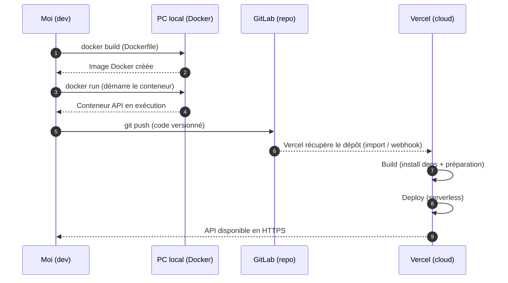
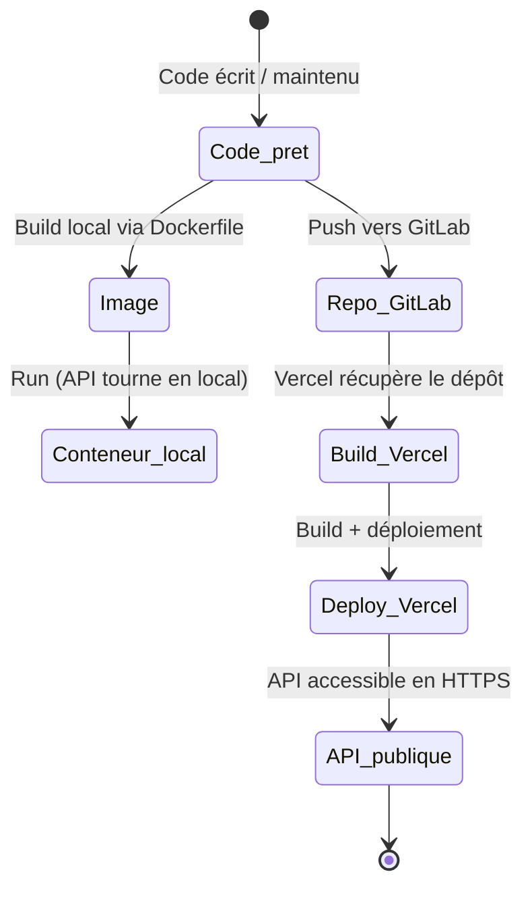
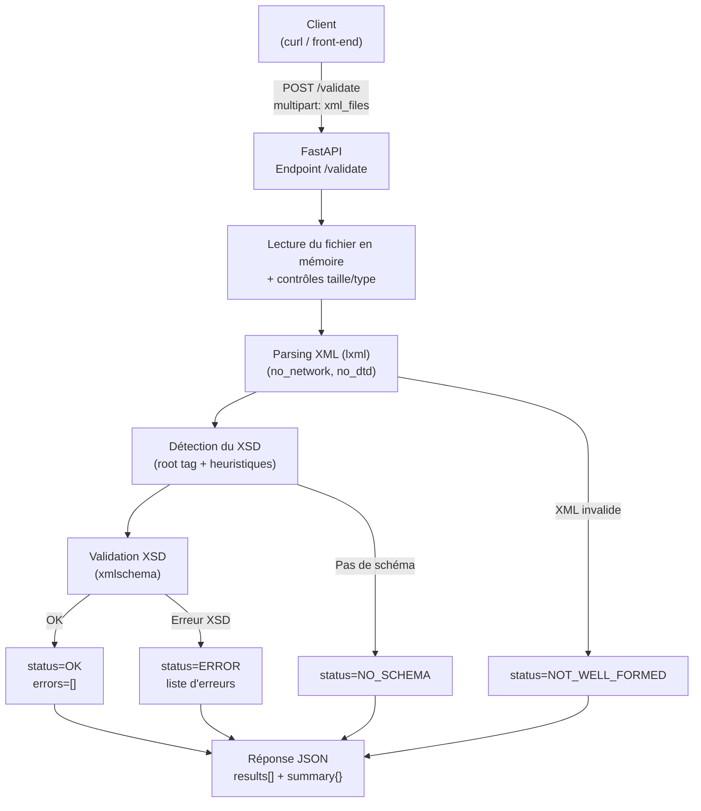

# 🧩 Mon projet : API FastAPI d’analyse XML S1000D (Docker + Vercel)

Ce module est mon **mémo complet** : si j’ai un trou de mémoire, je veux pouvoir relire et retrouver **ce que j’ai fait**, **pourquoi**, **avec quels fichiers**, et **comment tout s’enchaîne**.

---

## 🎯 Objectif du projet

Mon but était de **concevoir et déployer une API REST** capable de :

- recevoir des fichiers **XML techniques**,
- **détecter** le schéma **XSD** adapté,
- **valider** le XML contre ce XSD,
- renvoyer un **rapport JSON** clair (statut, erreurs, statistiques),
- et exposer un endpoint **/health** pour vérifier l’état du service.

Le tout devait être :

- testable **en local** (dev),
- et accessible **en cloud** (prod/serverless).

---

## 🧱 Ce que j’ai construit (les composants)

### 1) Le code de l’API (FastAPI)

- **Framework** : FastAPI (Python)
- **Serveur** : Uvicorn
- **Traitement XML** :
    - parsing en mémoire (ex: `lxml`)
    - validation XSD (ex: `xmlschema`)

### 2) Les schémas XSD

- Un dossier de **schémas** (S1000D / XSD)
- Chargés de manière à éviter de tout recharger à chaque requête (logique “chargement au démarrage” quand possible)

### 3) La conteneurisation (Docker)

- Un **Dockerfile** : la recette pour construire l’image
- Un **docker-compose.yml** : une manière simple de lancer le conteneur en local

### 4) Le déploiement cloud (Vercel)

- Repo Git relié à Vercel
- Déploiement automatique à chaque push
- API exposée publiquement en HTTPS

---

## 🗂️ Structure typique de mon repo

> (Le nom exact des dossiers peut varier, mais l’idée est celle-ci)
> 

```
/mon-api-s1000d
  /app
    main.py
    ...
  /schemas
    ...
  requirements.txt
  Dockerfile
  docker-compose.yml
  .gitignore
  README.md

```

---

## 🧠 Comprendre le rôle de Dockerfile vs Docker Compose

### ✅ Dockerfile = “comment je fabrique l’image”

- Je pars d’une base `python:slim`
- J’installe les dépendances système utiles au XML (libxml2 / libxslt…)
- J’installe mes dépendances Python via `requirements.txt`
- Je copie **mon code** + **mes schémas XSD** dans l’image
- Je définis la commande de démarrage (`uvicorn ...`)

👉 Résultat : **une image Docker autonome** (portable, reproductible)

### ✅ docker-compose.yml = “comment je lance le conteneur (facilement)”

Dans mon compose, le point clé est généralement :

```yaml
services:
  api:
    build: .
    ports:
      - "8000:8000"

```

📌 **Le lien Dockerfile ↔ Compose est ici : `build: .`**

Ça signifie : “construis l’image en utilisant le Dockerfile du dossier courant”.

👉 Résultat : je peux démarrer en local sans me retaper une longue commande `docker run`.

---

## 🔧 Commandes que j’utilisais (local)

### Lancer en local avec Compose

```bash
docker compose up --build

```

### Lancer en arrière-plan

```bash
docker compose up -d --build

```

### Logs

```bash
docker compose logs -f

```

### Stop + suppression des conteneurs

```bash
docker compose down

```

---

## ✅ Tests que je faisais

### Healthcheck

```bash
curl http://localhost:8000/health

```

### Validation (exemple générique)

```bash
curl -X POST "http://localhost:8000/validate" \
  -F "file=@./exemples/mon_fichier.xml"

```

Ensuite je vérifie :

- le **statut HTTP**
- le **JSON retourné**
- les **logs** (pour comprendre erreurs XSD, XML mal formé, etc.)

---

## 🔐 Points d’attention (ce que j’ai pris en compte)

- **Gestion d’erreurs** :
    - XML mal formé
    - schéma XSD absent / non détecté
    - erreurs de validation XSD
- **Sécurité** :
    - limites de taille (éviter qu’on m’envoie un fichier énorme)
    - désactiver ce qui pourrait ouvrir des accès réseau via XML (selon libs/options)
    - prudence sur DTD / entités externes
- **Performance** :
    - éviter de recharger les XSD à chaque requête si possible

---

# 🧭 Diagrammes (Mermaid)

J’utilise Mermaid pour figer ma compréhension (architecture, flux, interactions). Les types de diagrammes utiles pour ce genre de cours : flowchart, séquence, architecture. 
idée de graphes

---

## Diagramme 1 — Diagramme de séquence “Validation XML” (à garder)



---

## Diagramme 2 — Diagramme d'état “Validation XML” (à garder)



---

## Diagramme 3 — Flux fonctionnel “Validation XML” (à garder)



---

# 🧾 Récap mémo (ultra court)

- J’ai construit une **API FastAPI** qui valide des XML S1000D via XSD.
- J’ai écrit un **Dockerfile** pour créer une **image** reproductible (code + dépendances + XSD).
- J’ai ajouté **docker-compose.yml** pour lancer facilement en local (`build: .` = lien vers le Dockerfile).
- J’ai déployé sur **Vercel** via le repo Git (déploiement auto, HTTPS, serverless).
- Je testais avec **curl**, et je m’aidais des logs pour comprendre les erreurs.