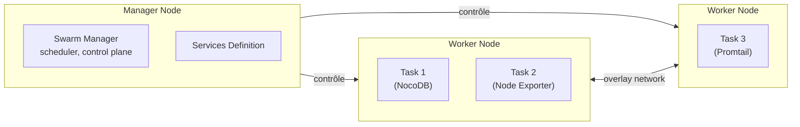
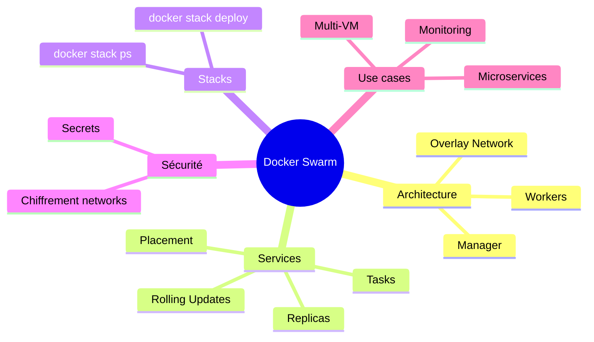

# 🐳 **Module : Docker Swarm – Orchestration distribuée**

*Orchestration simple, native Docker, idéale pour multi-VM en équipe*

---

# 1. 🎯 **Objectifs du cours**

À la fin du module, tu seras capable de :

- Comprendre **pourquoi Docker Swarm existe** (vs Docker Compose + vs Kubernetes).
- Installer un **cluster Swarm complet** (manager + worker).
- Déployer une stack avec `docker stack deploy`.
- Utiliser les notions fondamentales :
    
    **Service, Task, Node, Stack, Overlay Network, Secrets, Replicas, Rolling Update**.
    
- Superviser et diagnostiquer un cluster.
- Déployer ton **projet NocoDB + monitoring + Postgres** sur EC2.

---

# 2. 🧠 **Introduction — Pourquoi Docker Swarm ?**

Docker Compose te permet de gérer plusieurs conteneurs… mais **seulement sur une machine** (orchestrateur local)

Docker lui-même ne sait **pas** :

- répartir des conteneurs sur plusieurs serveurs,
- maintenir un nombre de réplicas,
- survivre à la panne d’une machine,
- mettre à jour sans downtime,
- créer un réseau distribué sécurisé.

👉 C’est exactement là qu’intervient **Docker Swarm**.

---

# 3. 🐝 **Qu’est-ce que Docker Swarm ?**

Docker Swarm = le *mode cluster* de Docker.

C’est un orchestrateur simple, intégré, prêt à l’emploi.

Il ajoute à Docker les super-pouvoirs :

| Capacité | Description |
| --- | --- |
| **Multi-server** | Plusieurs machines = 1 cluster |
| **Services & replicas** | Auto-scaling, tolérance aux pannes |
| **Rolling updates** | Mises à jour progressives sans coupure |
| **Réseaux overlay** | Communication sécurisée inter-VM |
| **Secrets** | Stockage sécurisé des mots de passe |
| **Scheduler** | Placement intelligent des conteneurs |

Swarm est souvent vu comme :

> 🔥 “Le Kubernetes simple”
> 
> 
> (moins puissant, mais plus rapide à apprendre et parfait pour les projets d’école, petites équipes, PoC ou projets internes)
> 

---

# 4. 🏗️ **Architecture Docker Swarm**

Voici un schéma clair :



### Les rôles essentiels :

### 🟢 **Manager node**

- orchestre le cluster
- prend les décisions de placement
- maintient l’état désiré
- stocke la configuration du Swarm

### 🔵 **Worker node**

- exécute les tâches (tasks)
- reçoit des instructions du manager

### 🔶 **Service**

La définition logique (comme dans Compose).

### 🔷 **Task**

L’instance d’un conteneur, exécutée sur un Worker.

---

# 5. ⚙️ **Installation de Docker Swarm**

Avant tout : **Docker doit être installé sur toutes les VM** (référence installation Docker → module Docker de ton cours ).

Ensuite, tu vas créer :

- 1 VM **manager**
- 1 ou plusieurs VM **workers**

## 5.1 Initialiser le cluster (sur le manager)

```bash
docker swarm init --advertise-addr <IP_publique_du_manager>

```

Résultat :

```
Swarm initialized: current node (xxxxx) is now a manager.

docker swarm join --token SWMTKN-xxxxx <IP_manager>:2377

```

Ce token est **la clé secrète** nécessaire pour rejoindre le cluster.

## 5.2 Ajouter un node worker

Sur chaque worker :

```bash
docker swarm join --token SWMTKN-xxxxx <IP_manager>:2377

```

Vérification (sur le manager) :

```bash
docker node ls

```

---

# 6. 🔗 **Concepts fondamentaux à maîtriser**

## 6.1 Service

Equivalent à `docker run`, mais distribué.

Exemple :

```bash
docker service create --name web --replicas 3 nginx

```

## 6.2 Replicas

Nombre d’instances désirées :

```bash
docker service scale web=5

```

## 6.3 Task

Une instance “vivante” d’un service sur un Worker.

## 6.4 Overlay networks

Réseau inter-VM sécurisé pour que les services communiquent.

```bash
docker network create -d overlay mynet

```

## 6.5 Stack (fichier Compose version Swarm)

Equivalent à un `docker-compose.yml` mais déployé sur plusieurs machines :

```bash
docker stack deploy -c docker-compose.yml mystack

```

## 6.6 Secrets

Pour stocker des mots de passe :

```bash
echo "password123" | docker secret create db_password -

```

---

# 7. 📦 **Créer ton premier Swarm Service**

### Nginx avec 3 réplicas :

```bash
docker service create \
  --name nginx \
  --replicas 3 \
  --publish 8080:80 \
  nginx

```

### Vérification :

```bash
docker service ls         # liste des services
docker service ps nginx   # où sont placées les tasks

```

---

# 8. 🧰 **Déployer une Stack avec docker-compose.yml**

Docker Swarm utilise un fichier **Compose**, mais avec des options spécifiques.

Exemple complet :

```yaml
version: "3.9"

services:
  web:
    image: nginx
    deploy:
      replicas: 3
      update_config:
        parallelism: 1
        delay: 5s
      restart_policy:
        condition: on-failure
    networks:
      - frontend

networks:
  frontend:
    driver: overlay

```

Déploiement :

```bash
docker stack deploy -c docker-compose.yml mystack

```

Listage :

```bash
docker stack ls
docker stack services mystack
docker stack ps mystack

```

---

# 9. 🧱 **Les options essentielles (bien expliquées)**

## 9.1 deploy.update_config

Contrôle le **rolling update** :

```yaml
update_config:
  parallelism: 1   # 1 conteneur mis à jour à la fois
  delay: 5s        # pause entre chaque update

```

## 9.2 deploy.restart_policy

Contrôle la manière dont un service redémarre :

- `none`
- `on-failure`
- `any`

## 9.3 deploy.placement

Contrôle où les conteneurs s’exécutent.

Exemples :

### Exécuter seulement sur un worker :

```yaml
placement:
  constraints:
    - node.role == worker

```

### Label personnalisé :

```bash
docker node update --label-add type=db node-2

```

YAML :

```yaml
placement:
  constraints:
    - node.labels.type == db

```

---

# 10. 🔐 **Docker Secrets — indispensable en production**

Créer un secret :

```bash
echo "mypassword" | docker secret create db_pass -

```

Le référencer :

```yaml
services:
  db:
    image: postgres
    secrets:
      - db_pass

secrets:
  db_pass:
    external: true

```

Dans le conteneur, le secret apparaît dans :

```
/run/secrets/db_pass

```

---

# 11. 🛡️ **Réseaux Overlay – le cœur du Swarm**

Crée un réseau inter-VM :

```bash
docker network create -d overlay --attachable monitoring

```

Attachable = permet aux conteneurs non-stack de rejoindre le réseau (utile pour debug).

---

# 12. 📊 **Monitoring du cluster**

### Liste des nodes :

```bash
docker node ls

```

### Status détaillé :

```bash
docker node inspect node-1 --pretty

```

### Journaux :

```bash
docker service logs -f nginx

```

---

# 13. 🧪 **Tester ton cluster Swarm (TP rapide)**

## 13.1 Test de tolérance aux pannes

1. Déploie Nginx avec 3 réplicas.
2. Coupe un worker :

```bash
sudo shutdown -h now

```

1. Observe :

```bash
docker service ps nginx
docker node ls

```

➡️ Swarm recalcule automatiquement l’état désiré et redéploie ailleurs.

---

# 14. 🏭 **Déployer ton projet NocoDB sur Swarm (exemple complet)**

Voici une stack adaptée à ton projet :

```yaml
version: "3.9"

services:
  nocodb:
    image: nocodb/nocodb:latest
    ports:
      - "8080:8080"
    environment:
      NC_DB: "pg://root_db:5432?u=postgres&p=password&d=root_db"
    deploy:
      replicas: 1
      update_config:
        parallelism: 1
        delay: 5s
    networks:
      - internal
      - ingress

  promtail:
    image: grafana/promtail
    deploy:
      replicas: 1
    networks:
      - internal

  nodeexporter:
    image: prom/node-exporter
    deploy:
      mode: global
    networks:
      - internal

networks:
  internal:
    driver: overlay
  ingress:
    driver: overlay

```

Déploiement :

```bash
docker stack deploy -c swarm.yml nocostack

```

---

# 15. 🎨 **Mindmap récapitulative**



---

# 16. 🧠 **Résumé général (style formateur)**

- Docker Swarm = **orchestrateur multi-serveurs natif Docker**, plus simple que Kubernetes.
- Il introduit : **services**, **réplicas**, **rolling updates**, **overlay networks**, **secrets**.
- Il se déploie en **10 minutes** contre plusieurs heures pour Kubernetes.
- Parfait pour ton stack AWS :
    
    **1 VM DB + 1 VM Swarm Manager + 1 Worker**.