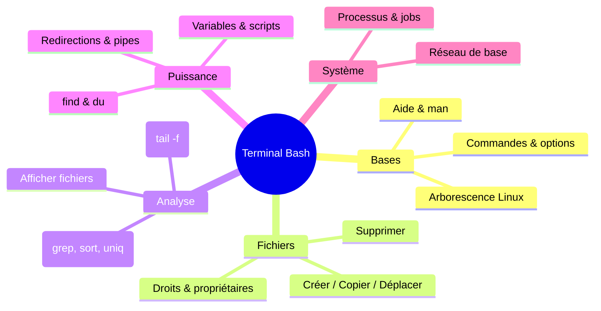
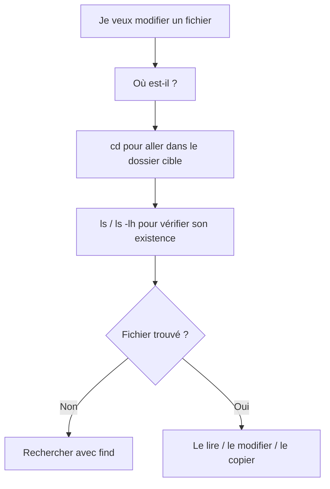

# 🧰 Commencer avec le Terminal (Bash)

---

## 0. Vue d’ensemble du module 🧠

Cette carte mentale te donne la **vision globale** de ce que tu vas apprendre dans ce module :



---

## 1. Objectifs 🎯

À la fin de ce module, tu seras capable de :

- te déplacer dans une arborescence Linux **uniquement au clavier** ;
- créer, copier, déplacer et supprimer des fichiers/dossiers en ligne de commande ;
- afficher, filtrer et analyser des fichiers (notamment des **logs**) ;
- enchaîner des commandes avec **redirections** et **pipes** pour construire de vrais mini-workflows ;
- chercher des fichiers en fonction de leur nom, leur taille, leur date ;
- gérer les **droits** (chmod / chown) et comprendre les utilisateurs/groupes ;
- manipuler des processus (lister, tuer, envoyer en arrière-plan) ;
- poser les bases pour écrire des **scripts Bash** réutilisables.

---

## 2. Contexte : c’est quoi “le terminal” et pourquoi Bash ? 💡

Un terminal, c’est :

> Une fenêtre dans laquelle tu tapes des commandes qui sont interprétées par un shell (Bash, zsh, PowerShell, etc.).
> 

### 2.1 Bash vs les autres environnements

- **Linux / macOS** → Bash (ou zsh, très proche)
- **Windows** :
    - `cmd.exe` : très limité, syntaxe vieillotte
    - **PowerShell** : moderne, mais différent de Bash
    - **WSL** (Windows Subsystem for Linux) : te permet de lancer **un vrai Bash Linux** sous Windows
    - Git Bash : mini environnent Bash fourni avec Git

👉 Pour tout ce qui est **DevOps / Linux / serveurs / conteneurs**, c’est Bash que tu retrouveras **partout**.

### 2.2 Où utiliser Bash concrètement ?

- dans un **Vagrant** / VM Debian ;
- dans un conteneur Docker en `bash` ou `sh` ;
- sur une VM cloud (AWS, GCP, Azure) en SSH ;
- dans les scripts d’automatisation (`.sh`) appelés par tes pipelines CI/CD.

---

## 3. Anatomie d’une commande Bash 🧱

```bash
commande [options] [arguments]

```

- **commande** : programme que tu appelles (`ls`, `cp`, `grep`, `docker`, `kubectl`…)
- **options** : modifient son comportement (`l`, `r`, `h`…)
- **arguments** : ce sur quoi la commande va agir (chemins, fichiers, motifs, etc.)

Exemples :

```bash
ls -lh /var/log           # commande = ls, options = -lh, argument = /var/log
grep -ni "error" app.log  # commande = grep, options = -ni, argument = app.log

```

### 3.1 Enchaîner les commandes : &&, ||, ;, pipes

- `cmd1 ; cmd2` → exécute `cmd2` **quoi qu’il arrive**
- `cmd1 && cmd2` → exécute `cmd2` **uniquement si cmd1 a réussi** (code retour = 0)
- `cmd1 || cmd2` → exécute `cmd2` **uniquement si cmd1 a échoué**

Le pipe `|` **transmet la sortie de la première commande comme entrée de la suivante** :

```bash
cat app.log | grep ERROR | sort | uniq -c

```

On y revient plus en détail plus loin.

---

## 4. Arborescence Linux & navigation 🧭

Avant d’apprendre les commandes, il faut **comprendre le terrain de jeu** : le système de fichiers.

### 4.1 Les répertoires importants

- `/` : racine
- `/home/<user>` : dossiers personnels
- `/etc` : fichiers de configuration
- `/var/log` : logs
- `/tmp` : fichiers temporaires
- `/usr/bin`, `/bin` : exécutables

### 4.2 Commandes de base

```bash
pwd                     # chemin du dossier courant
ls                      # liste les fichiers/dossiers
ls -lh                  # détails lisibles (taille, date, droits)
ls -la                  # inclut les fichiers cachés (.fichier)
cd /chemin/vers/dir     # aller dans un dossier
cd ..                   # remonter d'un niveau
cd ~                    # aller dans ton HOME
cd -                    # revenir au dossier précédent

```

### 4.3 Diagramme de “routine de navigation”



---

## 5. Manipuler des fichiers & dossiers 📂

### 5.1 Créer des fichiers/dossiers

```bash
mkdir mon_dossier
mkdir -p a/b/c                 # crée toute la chaîne
touch notes.txt                 # crée un fichier vide ou met à jour la date

```

### 5.2 Copier / déplacer / renommer

```bash
cp source.txt dest.txt
cp -r dossier/ sauvegarde/     # recopie un dossier (récursif)
cp -a dossier/ sauvegarde/     # conserve droits, dates, etc.

mv ancien_nom.txt nouveau_nom.txt
mv *.log logs/                 # déplace tous les .log dans logs/

```

### 5.3 Supprimer (⚠️ pas de corbeille)

```bash
rm fichier.txt
rm -r dossier                  # dossier + contenu
rm -rf dossier                 # DANGEREUX : ne demande jamais de confirmation

```

💡 **Réflexe de sécurité :**

```bash
# Avant :
rm -rf /var/log/*.log

# Fais :
echo rm -rf /var/log/*.log     # pour vérifier l'expansion

```

### 5.4 Liens symboliques

Pratique pour avoir un **raccourci vers un fichier ou dossier**.

```bash
ln -s /vrai/chemin mon_lien

```

---

## 6. Lire et explorer des fichiers (surtout les logs) 📖

Dans la vie réelle, tu vas **surtout lire des fichiers** (logs d’app, configs…).

### 6.1 Affichage simple

```bash
cat fichier.txt          # affiche tout d'un coup
tac fichier.txt          # à l'envers (dernière ligne en premier)
nl -ba fichier.txt       # affiche avec numéros de lignes

```

### 6.2 Lire tranquillement : less

```bash
less -N fichier.txt      # -N = numéros de lignes

```

Dans `less` :

- `↑` / `↓` / `PgUp` / `PgDn` pour naviguer
- `/mot` pour chercher `mot` (n suivant, N précédent)
- `q` pour quitter

### 6.3 Début / fin

```bash
head -n 20 fichier.txt   # 20 premières lignes
tail -n 50 fichier.txt   # 50 dernières lignes
tail -f app.log          # suit le fichier en temps réel (logs)

```

---

## 7. Filtrer et analyser du texte (grep, sort, uniq, wc…) 🔍

Ici on commence à **exploiter vraiment la puissance** de Bash.

### 7.1 `grep` — rechercher du texte

```bash
grep "ERROR" app.log
grep -n "ERROR" app.log     # numéros de lignes
grep -ri "erreur" .         # récursif, insensible à la casse
grep -v "DEBUG" app.log     # tout sauf les lignes contenant DEBUG
grep -E "WARN|ERROR" app.log  # regex simples (WARN ou ERROR)

```

### 7.2 `sort` — trier

```bash
sort fichier.txt            # tri alphabétique
sort -r fichier.txt         # inverse
sort -h tailles.txt         # comprend 1K, 2M, 3G

```

### 7.3 `uniq` — gérer les doublons

```bash
sort erreurs.log | uniq     # supprime les doublons consécutifs
sort erreurs.log | uniq -c  # compte les occurrences

```

### 7.4 `wc` — compter

```bash
wc -l fichier.txt           # nombre de lignes
wc -w fichier.txt           # nombre de mots
wc -c fichier.txt           # nombre d'octets

```

### 7.5 Mini recette : top 10 des erreurs

```bash
grep -h "ERROR" *.log | sort | uniq -c | sort -nr | head -n 10

```

- `grep -h "ERROR" *.log` → récupère toutes les lignes contenant ERROR
- `sort` → trie
- `uniq -c` → compte
- `sort -nr` → ordonne du plus fréquent au moins fréquent
- `head -n 10` → affiche les 10 premiers

---

## 8. Redirections & pipes : construire des mini-pipelines 🛠️

Ici on assemble tout.

### 8.1 Redirections

```bash
cmd > out.txt          # remplace le fichier
cmd >> out.txt         # ajoute à la fin
cmd 2> err.txt         # redirige les erreurs
cmd &> tout.txt        # stdout + stderr dans le même fichier
cmd < input.txt        # lit depuis un fichier au lieu du clavier

```

### 8.2 Pipelines

> cmd1 | cmd2 | cmd3 : cmd1 produit, cmd2 transforme, cmd3 résume.
> 

```bash
cat app.log | grep ERROR | sort | uniq -c | sort -nr | head

```

### 8.3 Diagramme de flux d’un pipeline


Chaque bloc prend la sortie du précédent et la transforme.

---

## 9. Jokers (globbing) & quotes ✨

### 9.1 Jokers

```bash
echo *.log               # tous les fichiers se terminant par .log
echo log?.txt            # log1.txt, logA.txt, etc.
echo file{1..3}.txt      # file1.txt file2.txt file3.txt
echo {dev,staging,prod}.yaml

```

### 9.2 Quotes

```bash
echo "Hello $USER"       # $USER est interprété
echo 'Hello $USER'       # affiché tel quel

```

💡 Règle d’or : **toujours mettre les variables entre guillemets** `"${var}"` pour éviter les surprises avec les espaces.

---

## 10. Chercher des fichiers : find & compagnie 🧨

### 10.1 `find` par nom, type, taille, date

```bash
find . -type f -name "*.log"
find /var -type f -size +100M
find . -mtime -1                   # modifié il y a moins d'1 jour
find . -maxdepth 1 -type d         # dossiers seulement au 1er niveau

```

### 10.2 `find` avec action

```bash
find /var/log -type f -name "*.gz" -delete

find . -type f -name "*.log" -exec gzip -9 {} \;

find . -type f -print0 | xargs -0 grep -n "ERROR"

```

---

## 11. Espace disque & archives 💽

### 11.1 Vue globale

```bash
df -h              # systèmes de fichiers montés (+ espace libre)

```

### 11.2 Taille des dossiers

```bash
du -sh .           # taille du dossier courant
du -sh * | sort -h # classe les éléments par taille

```

### 11.3 Archiver / compresser

```bash
tar -czf archive.tgz dossier/  # créer une archive
tar -xzf archive.tgz           # extraire
tar -tvf archive.tgz           # lister

gzip -9 fichier                # compresser -> fichier.gz
gunzip fichier.gz              # décompresser

zip -r archive.zip dossier/    # zip récursif
unzip archive.zip

```

---

## 12. Droits & propriétaires 🔐

### 12.1 Comprendre grossièrement les permissions

Sur `ls -l` :

```
-rw-r--r-- 1 user group  1234 date fichier.txt

```

- premiers 10 caractères : type + droits
    - `rw-r--r--`
    - `r` = read, `w` = write, `x` = execute
    - 3 blocs : **user / group / others**

### 12.2 Modifier les permissions

```bash
chmod 644 fichier      # rw-r--r--
chmod 755 script.sh    # rwxr-xr-x
chmod -R 755 dossier   # récursif

```

### 12.3 Propriétaire & groupe

```bash
chown user:group fichier
chown -R www-data:www-data /var/www

```

### 12.4 Qui suis-je ?

```bash
whoami         # utilisateur courant
id             # uid / gid
groups         # groupes

```

---

## 13. Processus & jobs ⚙️

### 13.1 Voir ce qui tourne

```bash
ps aux | grep nginx
top                  # vue temps réel
pgrep -fl nginx      # PID des processus nommés nginx

```

### 13.2 Tuer un processus

```bash
kill -TERM 1234      # arrêt propre
kill -9 1234         # forcer (dernier recours)

```

### 13.3 Jobs en arrière-plan

```bash
cmd &                # lance en arrière-plan
jobs                 # liste des jobs
fg                   # ramène au premier plan
bg                   # relance un job stoppé en arrière-plan
nohup cmd &          # survit à la déconnexion

```

---

## 14. Réseau en un coup d’œil 🌐

Quelques commandes utiles en contexte DevOps :

```bash
ip addr show                     # adresses IP locales
ip route                         # routes
ss -tulpen                       # ports TCP/UDP en écoute
ping -c 4 8.8.8.8                # tester la latence
curl -I https://example.org      # en-têtes HTTP
curl -s ifconfig.me              # IP publique
dig +short A example.org         # résolution DNS
scp fichier user@hote:/chemin/   # copie via SSH
rsync -a --delete src/ dst/      # synchronisation

```

---

## 15. Variables & petites briques de scripts 🧩

### 15.1 Variables simples

```bash
NAME="Alice"
echo "Hello $NAME"
export PATH="$HOME/bin:$PATH"

```

### 15.2 Substitutions utiles

```bash
DATE="$(date +%F)"           # 2025-11-30
echo $(( 2 + 3 ))            # 5

echo "${VAR:-defaut}"        # VAR ou "defaut" si non définie
echo "${#VAR}"               # longueur de VAR

```

### 15.3 Squelette de script fiable

```bash
#!/usr/bin/env bash
set -euo pipefail
IFS=$'\n\t'

echo "Script: $0"
echo "Arguments: $@"
echo "Nombre d'arguments: $#"

```

---

## 16. Aide, introspection & auto-formation 📚

### 16.1 Trouver de l’aide

```bash
man ls                 # manuel complet
ls --help              # aide rapide
man -k "network"       # chercher dans les man (apropos)
type ls                # builtin, alias, binaire ?
which ls               # chemin de la commande

```

### 16.2 Historique

```bash
history                # affiche toutes les commandes passées
# !123                 # rejouer la commande n°123
# Ctrl + r             # recherche dans l’historique (incrémentale)

```

---

## 17. Scénarios pratiques (recettes) 🍳

### 17.1 Faire le ménage dans les logs

Objectif : **supprimer les logs de plus de 30 jours** dans `/var/log`.

```bash
sudo find /var/log -type f -mtime +30 -delete

```

### 17.2 Trouver les 20 plus gros éléments d’un dossier

```bash
du -ah . | sort -h | tail -n 20

```

### 17.3 Remplacer une chaîne dans tous les `.conf`

```bash
grep -RIl --include="*.conf" "ancien" . | xargs sed -i 's/ancien/nouveau/g'

```

---


## 18. Scripts Bash (bases solides)

### 18.1 Squelette sûr & options de sécurité

```bash
#!/usr/bin/env bash
set -euo pipefail               # stop sur erreur/var non définie/pipe défaillant
IFS=$'\n\t'                     # séparateurs sûrs pour read/for

```

### 18.2 Arguments, tests, boucles, fonctions

```bash
echo "Script: $0  args: $@  count: $#"

if [[ -f "fichier" ]]; then echo "existe"; fi    # -d dossier, -x exécutable, -s >0 octets
if [[ "$x" =~ ^[0-9]+$ ]]; then echo "numérique"; fi

for f in *.log; do echo "$f"; done

while IFS= read -r line; do
  printf '%s\n' "$line"
done < input.txt

sum(){ echo $(( $1 + $2 )); }
sum 2 3

trap 'echo "Abort"; rm -f /tmp/tmpfile' INT TERM EXIT

```

---

## 19. Bons réflexes & pièges à éviter ⚠️

- Toujours vérifier **où tu es** avant de lancer une commande destructrice :
    - `pwd` puis `ls`
- Utiliser `history` + `Ctrl + r` pour **réutiliser** au lieu de retaper
- **`|` n’est pas un “et ensuite”** : pour dépendre du succès, utilise `&&` (`rm -r txt && mkdir logs`).
- **Quoting partout** : `"$var"` protège les espaces/caractères spéciaux.
- **`rm -rf`** : toujours vérifier le chemin. Astuce : commence par **afficher** la commande ou utilise `echo *.log` pour voir l’expansion.
- **Tri/locale** : pour des tris ASCII rapides et prévisibles, `LC_ALL=C sort`.
- **CSV compliqués** : `awk/sed` suffisent pour simple ; sinon `xsv`, `mlr`, `csvkit`.
- Garder un réflexe : **“est-ce que je peux faire ça avec un pipe ?”** → plus tu pipelines, plus tu t’approches de la pensée DevOps

---
[← Module précédent](M01_vagrant-bases-utiles.md) | [Module suivant →](M01_sed-utilisation.md)
---
