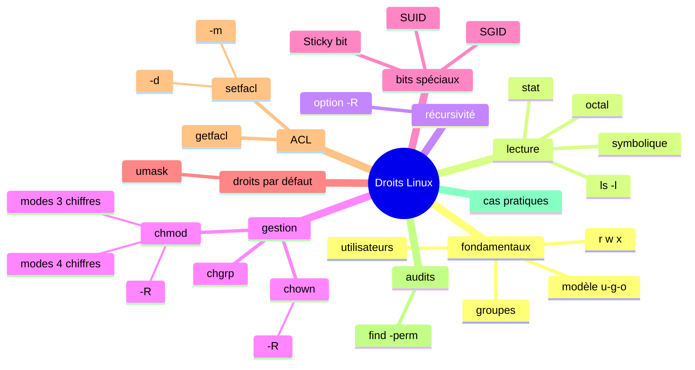
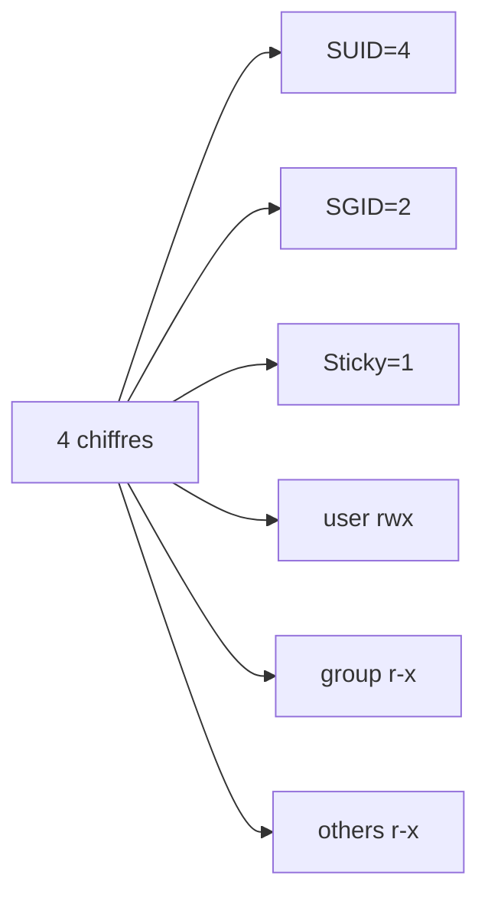

# 🔐 Cours — Comprendre & maîtriser les droits Linux

---

# 0. Vue d’ensemble du module 🧠



---

# 1. Pourquoi Linux utilise des permissions ? 🎯

Linux gère plusieurs utilisateurs *simultanément* (humains + services).

Les permissions servent à :

- protéger les fichiers sensibles ;
- éviter qu’un service écrase le travail d’un autre ;
- limiter les dégâts si un utilisateur se trompe (rm, écriture, script…) ;
- organiser la collaboration via les groupes.

En DevOps, comprendre les permissions est **indispensable** pour :

- sécuriser un serveur,
- configurer un conteneur,
- restreindre des accès,
- déployer des projets collaboratifs,
- manipuler /var/www, /etc, /srv, ~/.ssh…

---

# 2. Utilisateurs, groupes, modèle u/g/o 👤👥

Chaque fichier/dossier possède :

- **Un propriétaire** → “user” (u)
- **Un groupe** → “group” (g)
- **Les autres utilisateurs** → “others” (o)

### Les droits possibles (r, w, x)

| Lettre | Sur un fichier | Sur un dossier |
| --- | --- | --- |
| **r** | lire | lister le contenu |
| **w** | écrire, modifier | créer, renommer, supprimer des fichiers |
| **x** | exécuter script/binaire | **traverser** (entrer dans le dossier) |

💡 Sur un dossier, **x ≠ exécution**, mais **accès au contenu**.

---

# 3. Lire les permissions 🔍

### `ls -l`

```bash
ls -l script.sh

```

Exemple :

```
-rwxr-xr-- 1 alice devops 812 Nov 30 10:00 script.sh
^ ^^^ ^^^ ^^^
| |   |   └ others = r--
| |   └──── group  = r-x
| └──────── user   = rwx
└────────── type (- = fichier)

```

### `stat`

```bash
stat script.sh

```

Affiche :

- permissions octales
- propriétaire, groupe
- dates
- type exact du fichier

---

# 4. Permissions symboliques 🧩

### Syntaxe

```bash
chmod u+rwx fichier
chmod g-w fichier
chmod o=r fichier
chmod a-rwx fichier   # a = all (u, g, o)

```

Chaque lettre est expliquée :

- **u** = propriétaire (user)
- **g** = groupe
- **o** = autres
- **a** = tous
- **+** → ajouter un droit
- → retirer un droit
- **=** → remplacer tous les droits

---

# 5. Permissions octales (3 chiffres et 4 chiffres) 🔢

## 5.1 Conversion rwx → octal

```
r = 4
w = 2
x = 1

```

| Forme | Valeur | Signification |
| --- | --- | --- |
| --- | 0 | aucun droit |
| r-- | 4 | lecture |
| rw- | 6 | lecture + écriture |
| rwx | 7 | lecture + écriture + exécution |

### Exemple

```bash
chmod 755 script.sh

```

→ user : 7 (rwx)

→ group : 5 (r-x)

→ others : 5 (r-x)

## 5.2 Pourquoi parfois 4 chiffres ? 🤔

Parce que Linux peut appliquer des **permissions spéciales** :

| Bit spécial | Valeur | Rôle |
| --- | --- | --- |
| **SUID** | 4 | exécuter avec l’UID du propriétaire |
| **SGID** | 2 | exécuter avec GID du groupe / hériter du groupe |
| **Sticky** | 1 | empêcher de supprimer les fichiers des autres |

Donc un mode **à 4 chiffres** :

```
[SPÉCIAL] [USER] [GROUP] [OTHERS]

```

### Exemple :

```bash
chmod 4755 programme

```

= SUID (4) + 755

= `rwsr-xr-x`

Schéma :



---

# 6. Récursivité `R` (super important) 🌲

L’option **`-R`** signifie :

> appliquer l’action au dossier ET à tout son contenu, à tous les niveaux.
> 

Elle existe dans :

- `chmod -R`
- `chown -R`
- `chgrp -R`
- `cp -R`
- `rm -R`

### Exemple :

```bash
chmod -R 755 /srv/app

```

→ modifie `/srv/app`

→ tous les sous-dossiers

→ tous les fichiers

→ etc.

⚠️ Danger réel :

```bash
sudo chmod -R 755 /

```

→ système détruit.

---

# 7. chown & chgrp 🧑‍🔧

### Changer propriétaire

```bash
sudo chown alice fichier

```

### Changer propriétaire + groupe

```bash
sudo chown alice:devops fichier

```

### Changer groupe

```bash
sudo chgrp devops fichier

```

### Récursif

```bash
sudo chown -R www-data:www-data /var/www

```

---

# 8. Bits spéciaux 🔥

## 8.1 SUID (4xxx)

Un programme s’exécute avec les droits du **propriétaire**.

```bash
chmod 4755 /usr/bin/outil

```

Affiché :

```
rwsr-xr-x

```

Le `s` remplace le `x` dans la colonne user.

## 8.2 SGID (2xxx)

### Sur fichier

→ exécution avec le **GID du groupe**.

### Sur dossier

→ **héritage automatique du groupe**.

Super utile en équipe :

```bash
sudo chgrp -R devops /srv/projet
sudo chmod 2775 /srv/projet

```

## 8.3 Sticky bit (1xxx)

Empêche les suppressions croisées.

```bash
chmod 1777 /srv/partage

```

Comme `/tmp`.

---

# 9. UMASK — droits par défaut 🎯

Voir la valeur :

```bash
umask

```

Exemple : `umask 022`

- fichiers → 666 - 022 = **644**
- dossiers → 777 - 022 = **755**

Changer :

```bash
umask 027

```

---

# 10. ACL — Access Control Lists (droits avancés) 🎛️

ACL permet des droits **granulaires** : par utilisateur ou groupe spécifique.

## 10.1 Lire l’ACL

```bash
getfacl fichier

```

## 10.2 Modifier une ACL → option **`m`**

- `m` = **modify** (modifier / ajouter une entrée ACL)

```bash
setfacl -m u:alice:r fichier
setfacl -m g:devops:rw dossier

```

Signification :

- **u:** → utilisateur
- **g:** → groupe
- **rwx** → droits
- **m** → modifier l’ACL

## 10.3 ACL par défaut → option **`d`**

- `d` = **default ACL** (héritage pour les nouveaux fichiers dans un dossier)

```bash
setfacl -d -m g:devops:rwx /srv/projet

```

Ce que ça signifie :

- tous les *nouveaux* fichiers créés dans `/srv/projet` reçoivent automatiquement `rwx` pour `devops`.

## 10.4 Retirer une ACL

```bash
setfacl -x u:alice fichier

```

- `x` = **remove** (supprime une entrée ACL).

---

# 11. Trouver des permissions problématiques (audit) 🛡️

### Fichiers world-writable

```bash
find . -type f -perm -o+w

```

### Fichiers SUID

```bash
find / -type f -perm -4000 2>/dev/null

```

### Remettre une arborescence propre

```bash
find site/ -type d -exec chmod 755 {} \;
find site/ -type f -exec chmod 644 {} \;

```

---

# 12. Conditions pour exécuter un script 🧩

Pour faire :

```bash
./script.sh

```

Il faut :

1. le fichier a le droit **x**.
2. tous les dossiers du chemin ont **x**.

Ou :

```bash
bash script.sh

```

→ nécessite seulement la lecture.

---

# 13. Sudo & sudoers 🔐

Toujours éditer avec :

```bash
sudo visudo

```

Exemples :

```bash
sudo systemctl restart nginx
sudo -u postgres psql
sudo chown alice:devops fichier

```

Objectif : privilégier **le moindre privilège**.

---

# 14. Cas pratiques (scénarios complets) 🧪

### Cas 1 : projet collaboratif

```bash
sudo groupadd devops
sudo mkdir -p /srv/projet
sudo chgrp -R devops /srv/projet
sudo chmod 2775 /srv/projet        # SGID
sudo setfacl -d -m g:devops:rwx /srv/projet

```

### Cas 2 : sécurisation clé SSH

```bash
chmod 600 ~/.ssh/id_rsa

```

### Cas 3 : limiter les suppressions

```bash
chmod 1777 /srv/partage

```

### Cas 4 : corriger permissions d’une app

```bash
find /var/www/site -type d -exec chmod 755 {} \;
find /var/www/site -type f -exec chmod 644 {} \;

```

---

# 15. Feuille mémoire des commandes 📄

```bash
# Lecture
ls -l
ls -ld dossier
stat fichier

# chmod
chmod u+x fichier
chmod 755 fichier
chmod 4755 fichier
chmod -R 755 dossier/

# chown / chgrp
sudo chown alice fichier
sudo chown alice:devops fichier
sudo chgrp devops fichier
sudo chown -R www-data:www-data /var/www

# ACL
getfacl fichier
setfacl -m u:alice:rw fichier
setfacl -d -m g:devops:rwx dossier
setfacl -x u:alice fichier

# Audit
find . -perm -o+w
find / -perm -4000 2>/dev/null

```

# 16. Checklist sécurité avant production ✔️

- Aucun fichier `777`
- Clés privées → `600`
- Dossiers de projet → SGID & ACL par défaut
- Aucun SUID inutile
- Aucun fichier world-writable
- `umask` correct (022 ou 027)
- sudo → règles strictes, pas de `NOPASSWD` global
- Les bons groupes affectés aux bons utilisateurs

---
[← Module précédent](M02_scripting-bash.md) | [Module suivant →](M02_cron-automatisation.md)
---
