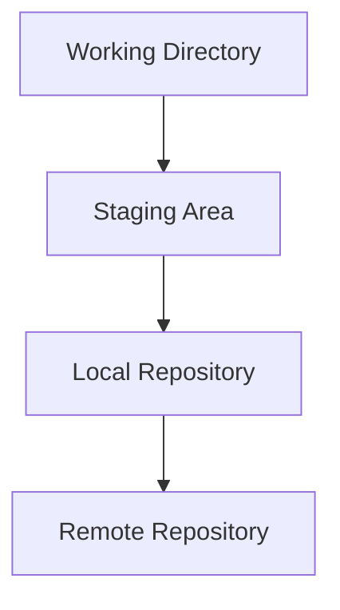
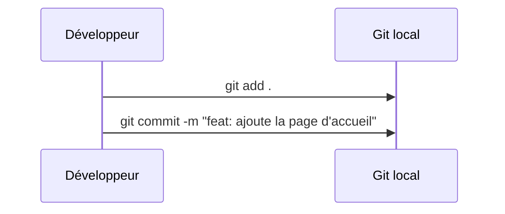

# 🧠 GIT — MANIPULATION SANS STRESS

---

## 1. Introduction — Pourquoi Git est indispensable en DevOps ?

Git est un **système de gestion de versions décentralisé**.  
Il permet à plusieurs développeurs de **travailler simultanément sur un même projet** sans écraser les changements des autres.

> 🎯 En DevOps, Git est la **colonne vertébrale** de la collaboration et de l’automatisation (CI/CD).  
> Chaque modification du code déclenche des **pipelines** de test, de build ou de déploiement.

---

## 2. Fonctionnement général de Git

Git fonctionne comme un **historique complet du projet**, stocké localement et synchronisable avec un dépôt distant (GitHub, GitLab, etc.).



| Zone | Rôle |
|------|------|
| **Working Directory** | Fichiers en cours d’édition |
| **Staging Area (Index)** | Zone temporaire avant le commit |
| **Local Repository** | Historique local des commits |
| **Remote Repository** | Copie partagée (GitLab, GitHub) |

---

## 3. Configuration initiale

Avant toute utilisation, configure ton identité :

```bash
git config --global user.name "Ton Nom"
git config --global user.email "toi@example.com"
git config --global init.defaultBranch main
git config --global core.editor "nano"     # ou "vim", "code --wait"
```

👉 Ces paramètres sont stockés dans `~/.gitconfig`.

---

## 4. Démarrer un dépôt (local ou distant)

### 🧱 Créer un nouveau dépôt local

```bash
mkdir mon-projet && cd mon-projet
git init
echo "# Mon projet" > README.md
git add README.md
git commit -m "init: premier commit"
```

### 🌍 Cloner un dépôt existant

```bash
git clone https://github.com/utilisateur/projet.git
cd projet
git status
```

> `git status` t’indique toujours où tu en es (fichiers modifiés, indexés, ou propres).

---

## 5. Cycle de travail — De la modification au commit

Chaque commit est un **instantané cohérent** du projet, accompagné d’un message clair.



### Étapes typiques :

```bash
git status                   # voir l’état des fichiers
git add fichier.txt           # ajouter à l’index
git commit -m "feat: description claire"
git log --oneline --graph --decorate --all
```

> 🧠 Astuce : un bon message de commit = **quoi + pourquoi** (style Conventional Commits).

---

## 6. Gestion des branches — Travailler sans casser le reste

Les **branches** permettent de développer des fonctionnalités isolées sans perturber la branche principale.

```bash
git switch -c feat/login   # création et bascule sur une nouvelle branche
git branch                 # liste les branches
git switch main            # retour sur la branche principale
```

### Fusionner ou mettre à jour :

| Action | Commande | Description |
|--------|-----------|-------------|
| **Fusion (merge)** | `git merge feat/login` | Conserve tout l’historique |
| **Rebase** | `git rebase main` | Rejoue les commits pour un historique linéaire |

> 🟡 Utilise **merge** pour les branches partagées, **rebase** pour nettoyer avant publication.

---

## 7. Synchronisation avec le dépôt distant

Associe ton projet local à un distant (GitLab, GitHub…) :

```bash
git remote add origin https://gitlab.com/utilisateur/projet.git
git push -u origin main
```

### Mettre à jour ou publier :

```bash
git fetch               # récupère les changements distants sans les fusionner
git pull                # fetch + merge ou rebase
git push                # envoie tes commits
```

> 🔧 Configure un pull linéaire :  
> `git config --global pull.rebase true`

---

## 8. Résolution de conflits (fusion ou rebase)

Lorsqu’un même fichier a été modifié par deux personnes :

```text
<<<<<<< HEAD
ta version
=======
leur version
>>>>>>> autre-branche
```

### Étapes de résolution :
```bash
# 1. Ouvre et corrige les fichiers
git add <fichier>
# 2. Valide selon le contexte
git commit             # merge
git rebase --continue  # rebase
# 3. Ou abandonne
git merge --abort
git rebase --abort
```

> 🧩 Conseil : fais des petits commits → moins de conflits à gérer.

---

## 9. Sauvegarder un travail temporaire (stash)

Met ton travail en pause pour changer de branche sans perdre tes modifs :

```bash
git stash push -m "WIP: refonte CSS"
git stash list
git stash pop      # réapplique et retire du stash
git stash apply    # réapplique sans retirer
```

> Option `-u` inclut les fichiers non suivis.

---

## 10. Annuler proprement

| Objectif | Commande | Effet |
|-----------|-----------|--------|
| Annuler un commit public | `git revert <hash>` | Crée un commit inverse |
| Annuler un commit local | `git reset --soft HEAD~1` | Garde l’index |
| Retirer du staging | `git restore --staged <fichier>` | Retire du commit à venir |
| Restaurer fichier | `git restore <fichier>` | Reviens à HEAD |

> ⚠️ `--hard` supprime les modifications locales. À utiliser avec précaution.

---

## 11. Rechercher et identifier les versions (tags)

Crée un tag pour marquer une release :

```bash
git tag -a v1.0.0 -m "release 1.0.0"
git push origin --tags
```

> Les tags sont utiles pour les déploiements CI/CD.

---

## 12. Nettoyage et hygiène du dépôt

### Ignorer les fichiers inutiles :
`.gitignore` :
```
node_modules/
.env
dist/
```

### Nettoyer le dépôt :
```bash
git clean -fdxn   # simulation
git clean -fdx    # exécution
```

### Normaliser les fins de ligne :
`.gitattributes` :
```
* text=auto
```

---

## 13. Kit de survie Git

```bash
# État et historique
git status
git log --oneline --graph --decorate

# Ajout / retrait / restauration
git add -p
git restore --staged <fichier>
git restore <fichier>

# Commit
git commit -m "feat: message clair"
git commit --amend --no-edit

# Branches
git switch -c feat/x
git switch main
git merge --no-ff feat/x
git branch -d feat/x

# Distant
git fetch
git pull --rebase
git push

# Stash
git stash push -m "WIP"
git stash pop

# Annuler / récupérer
git revert <commit>
git reset --mixed HEAD~1
git reflog

# Tags
git tag -a v1.0.0 -m "release"
git push origin --tags
```

---

## 14. Résumé — Les fondamentaux à retenir

| Concept | Description |
|----------|-------------|
| **Commit** | Photo de l’état du projet avec message |
| **Branche** | Espace de travail isolé |
| **Merge** | Fusion d’historiques |
| **Rebase** | Réécriture linéaire (avant push) |
| **Revert** | Annule proprement un commit public |
| **Reset** | Recul local de HEAD |
| **Reflog** | Sauvegarde tous les mouvements de HEAD |

---

## 15. En résumé — Git au cœur du DevOps

> Git est la **colonne vertébrale de l’intégration continue**.  
> Chaque commit, chaque branche et chaque tag déclenche les automatisations CI/CD.

Il te permet de :
- collaborer sans perte,
- expérimenter sans risque,
- livrer plus souvent et plus sereinement.

---

🎉 Félicitations !  
Tu maîtrises maintenant les **bases solides de Git** : tu peux créer, versionner, fusionner et restaurer ton code en toute confiance.

---
[Module suivant →](M03_git-manipulation.md)
---
