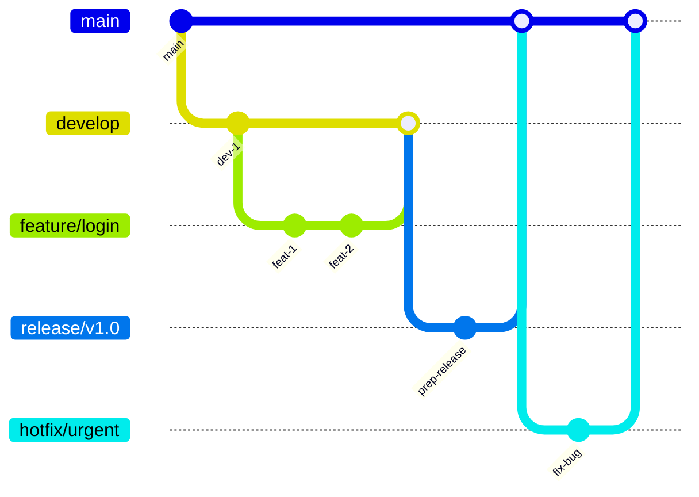

# 🧩 GIT — WORKFLOWS COLLABORATIFS ET STRATÉGIES DEVOPS

---

## 1. Introduction — Pourquoi un workflow est essentiel

Un **workflow Git** définit **comment une équipe s’organise autour de Git** :  
qui crée les branches, comment elles sont fusionnées, quand le code part en production.

> 🎯 En DevOps, un workflow bien pensé garantit :  
> - un historique clair et maîtrisé,  
> - une intégration continue fluide,  
> - et des déploiements sécurisés.

---

## 2. Les grands modèles de workflow

| Workflow | Principe | Avantages | Inconvénients | Adapté à |
|-----------|-----------|------------|----------------|----------|
| **Git Flow** | Branches `develop`, `release`, `hotfix` | Cycle structuré, versioning clair | Complexité, maintenance élevée | Équipes produit classiques |
| **Feature Branch** | Une branche par fonctionnalité | Simple, CI rapide | Multiplication des branches | Petites / moyennes équipes |
| **Trunk-Based** | Tout converge vers `main`, merges fréquents | Déploiement continu, feedback rapide | Demande tests automatiques robustes | Équipes DevOps matures |
| **GitHub Flow** | `main` + branches courtes + PR | Collaboration rapide, agile | Pas de gestion de versions formelle | Projets web et agiles |

---

## 3. Les branches typiques d’un projet professionnel

| Branche | Rôle | Fréquence d’usage |
|----------|------|------------------|
| `main` / `master` | Code de production stable | Continue |
| `develop` | Intégration / staging | Continue |
| `feature/x` | Nouvelle fonctionnalité | Temporaire |
| `hotfix/x` | Correctif urgent en production | Occasionnelle |
| `release/x` | Préparation d’une version stable | Régulière |

### Visualisation (Git Flow simplifié)



---

## 4. Intégration du workflow à la CI/CD

Dans un pipeline GitLab ou GitHub Actions, le workflow détermine **quand et comment** les jobs s’exécutent.

### Exemple (GitLab CI)

```yaml
stages: [test, build, deploy]

test:
  stage: test
  script:
    - pytest
  rules:
    - if: '$CI_COMMIT_BRANCH == "develop"'

build:
  stage: build
  script:
    - npm run build
  only:
    - main

deploy_prod:
  stage: deploy
  script:
    - ./deploy.sh
  only:
    - tags
```

> 💡 **develop** → environnement de test  
> **main** → production  
> **tags** → release versionnée

---

## 5. Bonnes pratiques de collaboration

| Bonne pratique | Description |
|----------------|-------------|
| **Branches courtes** | Limite les conflits et facilite la revue |
| **Rebase avant merge** | Garde un historique propre |
| **Pull Request claire** | Message, screenshots, tests passés |
| **Protection des branches** | `main` et `develop` verrouillées (CI + review) |
| **Nom cohérent** | `feat/`, `fix/`, `hotfix/`, `release/` |
| **Conventional Commits** | Standardise les messages (`feat:`, `fix:`, etc.) |

---

## 6. Exemple concret d’un cycle complet (Git Flow + CI/CD)

### Étapes
1. Le développeur crée une branche :  
   ```bash
   git switch -c feature/login
   ```
2. Il code, commit et push :  
   ```bash
   git push -u origin feature/login
   ```
3. Une **Merge Request** déclenche la **pipeline CI** : tests, lint, build.  
4. Une fois validée, la branche est fusionnée dans `develop`.  
5. En fin de sprint : `develop` → `release/x` → `main`.  
6. Le pipeline `deploy` envoie automatiquement la release en production.

---

## 7. Cas d’usage selon le type d’entreprise

| Type d’équipe | Workflow conseillé | Pourquoi |
|----------------|--------------------|-----------|
| **Start-up agile** | GitHub Flow | Rapidité, déploiements fréquents |
| **Équipe produit stable** | Git Flow | Versioning clair et gestion de release |
| **Équipe DevOps CI/CD mature** | Trunk-Based | Intégration continue et déploiement en continu |
| **Projet open source** | Feature Branch + PR | Collaboration externe et revue ouverte |

---

## 8. Exemples de conventions de nommage

| Type | Exemple | Description |
|------|----------|-------------|
| **Feature** | `feat/auth-login` | Nouvelle fonctionnalité |
| **Fix** | `fix/header-overlap` | Correction de bug |
| **Hotfix** | `hotfix/payment-crash` | Urgence en production |
| **Release** | `release/v2.1.0` | Préparation d’une version |
| **Experiment** | `exp/ui-theme` | Prototype ou test interne |

---

## 9. Workflow et stratégie de déploiement

| Étape | Branche concernée | Action CI/CD |
|--------|------------------|--------------|
| Développement | `feature/*` | Tests unitaires + Lint |
| Intégration | `develop` | Tests d’intégration + Build staging |
| Préproduction | `release/*` | Tests QA + Validation |
| Production | `main` + tags | Déploiement automatisé + Release note |

---

## 10. Règles d’or DevOps pour un bon workflow Git

✅ **Automatise les contrôles** : lint, tests, build, déploiement  
✅ **Favorise la fréquence de merge** : petites PR, feedback rapide  
✅ **Ne garde pas les branches trop longtemps**  
✅ **Tag chaque release** (ex : `v1.2.0`)  
✅ **Utilise `--force-with-lease` si tu dois réécrire une branche privée**  
✅ **Documente la stratégie** dans un fichier `CONTRIBUTING.md`

---

## 11. Exemple de configuration GitLab pour branches protégées

Dans les **paramètres du dépôt GitLab** :  
- Protège `main` et `develop`  
- Active les règles :  
  - ✅ “Pipeline must succeed before merge”  
  - ✅ “Require approval from at least 1 reviewer”  
  - ✅ “No direct push to main”  

> Ces règles assurent la qualité du code avant mise en production.

---

## 12. En résumé — Workflow Git & DevOps : la clé de la fluidité

> “Un bon workflow, c’est une organisation claire, des branches maîtrisées, et une CI/CD qui automatise la confiance.”

### À retenir :
- Git Flow → structure stable, long cycle de release  
- Feature Branch → simple et efficace pour la plupart des équipes  
- Trunk-Based → pour les équipes CI/CD matures  
- Chaque workflow doit **servir la fréquence et la fiabilité des livraisons.**

---

🎉 **Félicitations !**  
Tu sais maintenant choisir, adapter et appliquer un **workflow Git professionnel** parfaitement intégré à une approche DevOps.
