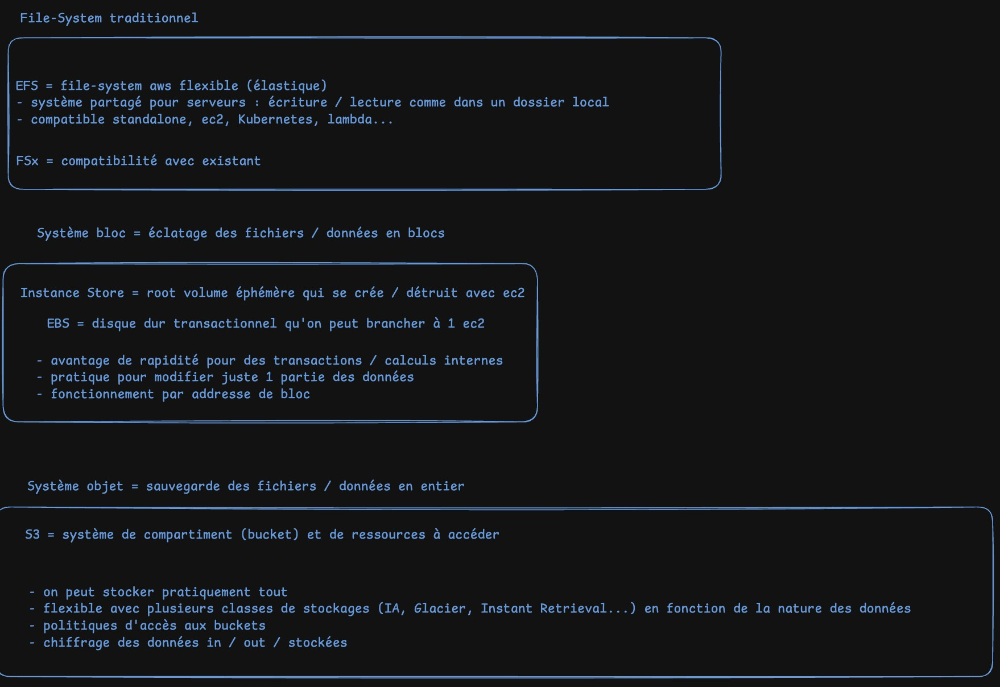

# 🧩 **Cours complet : AWS Storage**

*File Storage – Block Storage – Object Storage*

---

# 1️⃣ Introduction : Pourquoi autant de types de stockage ?

Dans AWS (comme dans tout cloud), on ne stocke pas tout au même endroit. Chaque type de stockage est **optimisé pour un usage précis** :

| Type | Fonctionnement | Performances | Idéal pour |
| --- | --- | --- | --- |
| **File Storage** | Arborescence fichiers/dossiers | Bon throughput, accès partagé | Applications, CMS, partage fichiers, home directories |
| **Block Storage** | Données découpées en blocs adressables | Latence très basse, IOPS élevées | Bases de données, systèmes, VM, workloads transactionnels |
| **Object Storage** | Objets (data + metadata) dans des buckets | Scalabilité infinie, haute durabilité | Média, backups, data lakes, analyses |

➡️ *Chaque type a son architecture interne, ses performances, et ses usages.*

➡️ *Bien comprendre ces trois catégories = fondamental en DevOps / architecte cloud.*

---

# 2️⃣ File Storage (Stockage de fichiers)

## 🔍 Fonctionnement technique

- Données stockées sous forme de **fichiers** dans une **hiérarchie arborescente** (dossiers, sous-dossiers).
- Accessible via des **protocoles réseau** (NFS, SMB).
- Peut être monté simultanément sur plusieurs EC2.
- Métadonnées : nom du fichier, taille, date, permissions POSIX/ACL.

👉 *C’est comme un NAS dans le cloud.*

---

## 🎯 Exemples d’utilisation

- Applications nécessitant un système de fichiers partagé
    
    (WordPress, Drupal, CMS, monolithes traditionnels)
    
- Analyses Big Data lisant/écrivant dans des dossiers
- Home directories utilisateurs (SMB)
- Traitement de médias nécessitant un accès partagé

---

## 🔧 Services AWS de File Storage

### **1. Amazon EFS (Elastic File System)**

File system NFS **automatiquement scalable**, “set-and-forget”.

✔️ Multi-AZ (résilience)

✔️ 1000+ instances peuvent y accéder

✔️ Pas de capacité à provisionner

✔️ Paiement à l’usage

**Les 4 classes de stockage :**

| Classe | Zones | Usage |
| --- | --- | --- |
| **EFS Standard** | Multi-AZ | Production |
| **EFS Standard-IA** | Multi-AZ | Accès peu fréquent |
| **EFS One Zone** | Single AZ | Dev / staging |
| **EFS One Zone-IA** | Single AZ | Archives basse fréquence |

---

### **2. Amazon FSx**

FSx propose **quatre systèmes de fichiers premium**, optimisés selon le besoin :

| FSx | Pour quoi ? |
| --- | --- |
| **FSx for Lustre** | HPC, data analytics, machine learning. Très haut débit (1 TB/s). |
| **FSx for Windows File Server** | Workloads Microsoft, SMB natif, AD. |
| **FSx for NetApp ONTAP** | Snapshots avancés, clones, NAS pro. |
| **FSx for OpenZFS** | Systèmes ZFS Linux, faible latence, snapshots efficients. |

➡️ FSx = File Storage *managé*, premium, haute performance.

---

# 3️⃣ Block Storage (Stockage en bloc)

## 🔍 Fonctionnement technique

- Les fichiers sont **découpés en blocs** de taille fixe.
- Chaque bloc a sa **propre adresse**, ce qui permet :
    - lecture/écriture ultra rapide,
    - modification d’une partie d’un fichier sans réécrire le tout.
- Pas de métadonnées riches.
- Peut être “formaté” en NTFS, EXT4, XFS…

👉 *Identique à un SSD ou un disque de SAN dans un datacenter.*

---

## 🎯 Exemples d’utilisation

- Bases de données transactionnelles (MySQL, Postgres, Oracle).
- Disques système (boot volumes).
- Big data nécessitant IOPS élevées.
- Conteneurs nécessitant stockage rapide.
- Applications transactionnelles critiques.

---

## 🔧 Services AWS de Block Storage

### **1. Instance Store EC2**

- Stockage local **éphémère** (perdu si instance stop/terminate)
- Très rapide (NVMe local)
- Idéal pour :
    - caches,
    - buffers,
    - clusters type Hadoop,
    - scratch data.

---

### **2. Amazon EBS (Elastic Block Store)**

Volume attaché à une EC2, **persistant** et managé.

✔️ Durabilité

✔️ Snapshot (sauvegardé dans S3)

✔️ Peut être détaché/attaché à une autre EC2

✔️ Peut changer taille / IOPS / type à chaud

---

## ⭐ Types de volumes EBS

### SSD (IOPS)

| Type | Usage |
| --- | --- |
| **gp3** | général, équilibre prix/perf |
| **gp2** | ancienne génération |
| **io1 / io2** | IOPS provisionnées |
| **io2 Block Express** | Ultra hautes performances |

### HDD (Throughput)

| Type | Usage |
| --- | --- |
| **st1** | gros throughput → big data |
| **sc1** | froid, peu fréquent |

---

## 📈 Mise à l’échelle EBS (scaling)

Deux méthodes :

### 1️⃣ **Vertical scaling**

Augmenter la taille du volume existant (max 64 TiB).

### 2️⃣ **Horizontal scaling**

Attacher plusieurs volumes à une EC2.

---

## 📸 Snapshots EBS

- Sauvegardes **incrémentielles**.
- Stockées dans **S3** (automatique, invisible pour l’utilisateur).
- Permettent :
    - restauration,
    - clonage,
    - copie inter-AZ/inter-Région,
    - création de nouvelles volumes.

---

# 4️⃣ Object Storage (Stockage par objets)

## 🔍 Fonctionnement technique

- Données stockées sous forme **d’objets** dans des **buckets**.
- Chaque objet =
    
    **données + metadata + identifiant unique**.
    
- Pas d’arborescence réelle (simulée via préfixes).
- Très durable (11 9’s) et scalable.

👉 *Excellent pour les médias, fichiers statiques, backups, archives, data lakes.*

---

## 🎯 Exemples d’utilisation

- Stockage de vidéos, photos, documents
- Backups et restaurations
- Data lakes et analytics
- Static hosting (sites web statiques)
- Contenu CDN via CloudFront
- Log storage

---

## 🔧 Amazon S3 : Concepts clés

| Concept | Description |
| --- | --- |
| **Bucket** | Conteneur global, nom unique |
| **Object** | Fichier stocké |
| **Key** | Chemin + nom du fichier |
| **Prefix** | Faux dossier utilisé pour organiser |
| **Region** | Emplacement du bucket |

---

## 📛 Nommage d’un bucket

- Globalement unique dans la partition AWS
- 3 à 63 caractères
- minuscules, chiffres, hyphens, points
- pas de format IP

Exemple :

`http://testbucket.s3.amazonaws.com/2022-03-01/AmazonS3.html`

- Bucket name : `testbucket`
- Prefix : `2022-03-01`
- Object key : `AmazonS3.html`

---

# 5️⃣ Classes de stockage S3 (et **exemples d’utilisation**)

| Classe | Usage |
| --- | --- |
| **S3 Standard** | Accès fréquent, sites web, médias |
| **S3 Intelligent-Tiering** | Accès variable, usage inconnu |
| **S3 Standard-IA** | Backups accessibles rapidement |
| **S3 One Zone-IA** | Archives peu sensibles, single AZ |
| **S3 Glacier Instant Retrieval** | Archives + besoin accès en ms |
| **S3 Glacier Flexible Retrieval** | Archives long terme, accès minutes |
| **S3 Glacier Deep Archive** | Archives > 7 ans, accès 12h |
| **S3 Outposts** | Object storage on-prem |

---

# 6️⃣ Versioning S3

But :

- éviter la suppression accidentelle,
- éviter l’écrasement accidentel,
- conserver un historique.

3 états possibles :

- Unversioned (par défaut)
- Versioning-enabled
- Versioning-suspended

---

# 7️⃣ Lifecycle S3 (Cycle de vie)

Automatise un workflow :

Exemple fourni dans tes notes → reformaté :

| Temps | Action |
| --- | --- |
| J0 | S3 Standard |
| J+30 | Transition vers S3 Standard-IA |
| +60 jours | Transition vers Glacier Instant Retrieval |
| +365 jours | Suppression |

👉 Parfait pour logs, archives, médias, data lakes.

---

# 8️⃣ Résumé : Quel stockage pour quel besoin ?

| Besoin | Service |
| --- | --- |
| Base de données MySQL sur EC2 | **EBS** |
| Fichiers partagés entre plusieurs EC2 | **EFS**, FSx |
| HPC, throughput extrême | **FSx for Lustre** |
| Stockage objet massif, médias, archives | **S3** |
| Cache temporaire sur EC2 | **Instance Store** |
| Workloads Windows | **FSx Windows** |
| Apps nécessitant snapshots & clones NAS | **FSx ONTAP / OpenZFS** |

---

# 9️⃣ Réponses aux questions (le cours t’y prépare parfaitement)

## ❓ 1. *En tant que développeur prévoyant de transcoder de gros fichiers médias avec AWS Lambda, où stocker les fichiers originaux et transcodés ?*

👉 **Réponse : Amazon S3**

**Pourquoi ?**

- Media → fichiers volumineux = parfait pour S3
- Accès depuis n’importe où
- Déclenchement automatique de Lambda via S3 Event
- Scalabilité infinie
- Pas de limite de taille signifiante (jusqu'à 5 TB / objet)

---

## ❓ 2. *Base MySQL sur EC2 : où stocker les données transactionnelles fréquemment mises à jour ?*

👉 **Réponse : Amazon EBS**

**Pourquoi ?**

- Base MySQL = workload **transactionnel → IOPS → Block Storage**
- EBS = faible latence, durable
- Peut être attaché/détaché à une EC2
- Supporte snapshots + haute disponibilité intra-AZ
- Optimisé pour bases de données

---

# 🏁 Conclusion

Tu as maintenant un **cours complet, précis et opérationnel** sur AWS Storage.

Il couvre :

- Les différences entre File / Block / Object
- Le fonctionnement interne
- Les services AWS associés
- Les types de stockage EFS / FSx / EBS / S3
- Les classes de stockage
- Versioning / lifecycle
- Cas d’utilisation réels
- Réponses aux questions d’examen / d'interview

<!-- snippet
id: aws_s3_concept
type: concept
tech: aws
level: beginner
importance: high
format: knowledge
tags: s3,object-storage,bucket,stockage
title: Amazon S3 – Object Storage AWS
context: stocker et servir des fichiers à grande échelle sur AWS
content: S3 (Simple Storage Service) est le service d'object storage d'AWS. Les données sont stockées sous forme d'objets (données + metadata + identifiant unique) dans des buckets. Durabilité de 11 nines (99,999999999%). Scalabilité quasi infinie. Utilisé pour : médias, backups, data lakes, static hosting, logs, CDN avec CloudFront. Pas un file system : pas de montage NFS/SMB, accès via HTTP/API.
-->

<!-- snippet
id: aws_ebs_concept
type: concept
tech: aws
level: beginner
importance: high
format: knowledge
tags: ebs,block-storage,ec2,volumes
title: Amazon EBS – Block Storage pour EC2
context: attacher un disque persistant à une instance EC2
content: EBS (Elastic Block Store) est un volume de stockage en blocs attaché à une instance EC2. Persistant (survit au stop de l'instance), durable (répliqué dans l'AZ). Types : gp3/gp2 (usage général SSD), io1/io2 (IOPS provisionnées), st1 (throughput HDD), sc1 (froid HDD). Les snapshots EBS sont sauvegardés dans S3. Un volume peut être détaché et reattaché à une autre EC2.
-->

<!-- snippet
id: aws_efs_concept
type: concept
tech: aws
level: intermediate
importance: high
format: knowledge
tags: efs,file-storage,nfs,multi-az
title: Amazon EFS – File System partagé multi-EC2
context: partager un système de fichiers entre plusieurs instances EC2
content: EFS (Elastic File System) est un NFS managé accessible simultanément par des centaines d'instances EC2 ou conteneurs. Multi-AZ par défaut (Standard), scalabilité automatique, paiement à l'usage. Idéal pour : applications CMS (WordPress), home directories, conteneurs nécessitant un stockage partagé. FSx propose des variantes premium : FSx for Lustre (HPC, ML), FSx for Windows (SMB, AD).
-->

<!-- snippet
id: aws_s3_storage_classes
type: concept
tech: aws
level: intermediate
importance: high
format: knowledge
tags: s3,glacier,classes,coûts,archive
title: Classes de stockage S3 – Optimiser les coûts
context: choisir la bonne classe S3 selon la fréquence d'accès
content: S3 Standard (accès fréquent, production), S3 Intelligent-Tiering (accès variable, AWS gère automatiquement le tier), S3 Standard-IA (backups peu fréquents mais accès rapide), S3 Glacier Instant Retrieval (archives + accès en ms), S3 Glacier Flexible Retrieval (archives long terme, récupération en minutes à heures), S3 Glacier Deep Archive (retention légale > 7 ans, récupération en 12h, le moins cher). Utiliser le Lifecycle pour automatiser les transitions.
-->

<!-- snippet
id: aws_instance_store_concept
type: warning
tech: aws
level: beginner
importance: high
format: knowledge
tags: instance-store,éphémère,ec2,cache
title: Instance Store – Stockage éphémère EC2
context: comprendre les risques du stockage local éphémère sur EC2
content: L'Instance Store est un stockage local NVMe directement sur le hardware de l'hôte EC2. Très rapide et gratuit (inclus dans l'instance). MAIS entièrement non persistant : toutes les données sont perdues si l'instance est stoppée, terminée ou si l'hôte tombe en panne. Utiliser uniquement pour : caches, buffers temporaires, scratch data, clusters Hadoop. Ne jamais stocker de données importantes sur Instance Store.
-->

<!-- snippet
id: aws_s3_versioning_lifecycle
type: concept
tech: aws
level: intermediate
importance: medium
format: knowledge
tags: s3,versioning,lifecycle,automatisation
title: S3 Versioning et Lifecycle
context: protéger les données S3 contre les suppressions accidentelles et automatiser les transitions
content: Le versioning S3 conserve toutes les versions d'un objet, protégeant contre les suppressions et écrasements accidentels. 3 états : Unversioned (défaut), Enabled, Suspended. Le Lifecycle automatise les transitions entre classes (ex : J0 Standard → J+30 Standard-IA → J+90 Glacier → J+365 suppression). Indispensable pour les logs, archives et médias afin de réduire les coûts automatiquement.
-->

<!-- snippet
id: aws_storage_decision_guide
type: tip
tech: aws
level: beginner
importance: high
format: knowledge
tags: s3,ebs,efs,stockage,architecture
title: Guide de choix du stockage AWS
context: choisir rapidement le bon service de stockage AWS
content: Base de données MySQL sur EC2 → EBS (block, faible latence). Fichiers partagés entre plusieurs EC2 Linux → EFS (NFS managé). Stockage objet, médias, backups, site statique → S3. Cache temporaire ultra rapide sur EC2 → Instance Store (éphémère). Workloads Windows avec SMB/AD → FSx for Windows. HPC et Machine Learning → FSx for Lustre. On-premises avec object storage → S3 Outposts.
-->

---
[Module suivant →](M27_Content-delivery-network.md)
---
