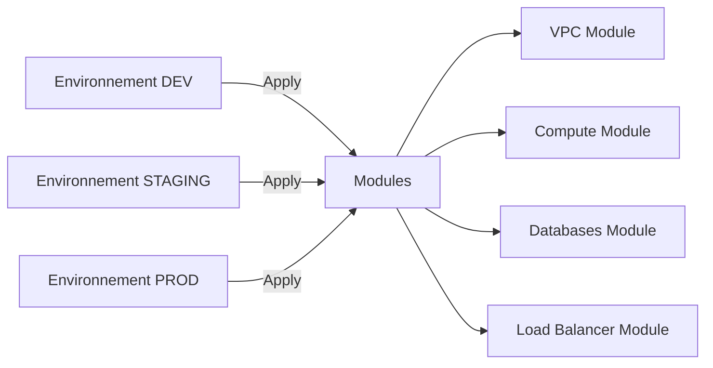
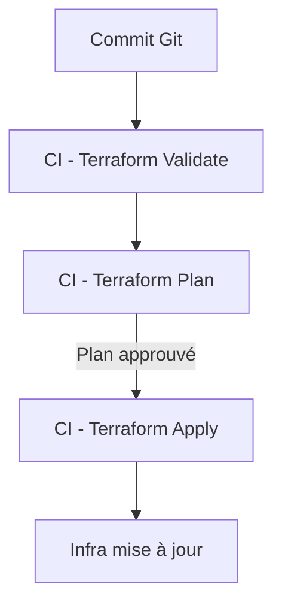
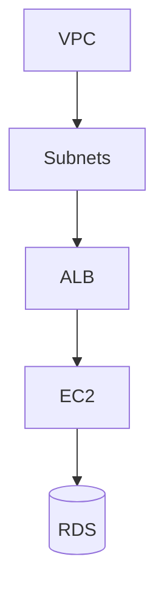

# 🚀 **TERRAFORM AVANCÉ — maîtriser les environnements, les modules et la gestion d’état**

> Formation avancée DevOps – style formateur Goose 🧑‍🏫
> 
> 
> *Tu vas passer de “je sais utiliser Terraform” à “je construis une vraie plateforme d’infrastructure modulaire, multi-environnements et collaborative”.*
> 

---

# 1. 🎯 Objectifs du cours avancé

À la fin, tu sauras :

- **Structurer un projet Terraform professionnel** : modules, layers, patterns, DRY, organisation multi-dossiers.
- **Gérer des environnements propres** : dev / staging / prod grâce aux workspaces, aux tfvars, aux modules et à l’interpolation dynamique.
- **Maîtriser l’état Terraform** : backends distants, verrouillage, récupération, déplacements de ressources.
- **Construire et publier tes propres modules** (internes ou Registry).
- **Utiliser les features avancées** :
    
    – fonctions Terraform,
    
    – lifecycle rules,
    
    – dependencies explicites (`depends_on`),
    
    – provisioners correctement,
    
    – dynamic blocks,
    
    – expressions conditionnelles et for-each avancés.
    
- **Industrialiser Terraform** dans un vrai pipeline CI/CD.
- **Sécuriser Terraform** (states, variables sensibles, secrets, accès Cloud, RBAC).

---

# 2. 🧭 Vision d’ensemble — L’infra modulaire Terraform (graph)

Pour introduire la logique, voici un graphe "architecture modulaire" adapté à ton format :



---

# 3. 🔐 Gestion d’état avancée

## 3.1. Pourquoi l’état est critique en entreprise ?

L’état Terraform est :

- la **source de vérité** de ton infra,
- la **liaison** entre ton code et les ressources cloud,
- une **cible de sécurité très sensible** (contient des infos privées).

👉 **En production : on utilise TOUJOURS un backend distant sécurisé.**

Les options possibles :

- S3 + DynamoDB (AWS) (le plus répandu)
- Terraform Cloud (collaboration + verrouillage natif)
- Google GCS
- Azure Blob Storage

---

## 3.2. Backend distant professionnel (ex : S3 + DynamoDB)

```hcl
terraform {
  backend "s3" {
    bucket         = "my-company-tfstates"
    key            = "project/prod/terraform.tfstate"
    region         = "eu-west-1"
    encrypt        = true
    dynamodb_table = "terraform-locks"
  }
}

```

### Pourquoi DynamoDB ?

Il gère le **verrouillage d’état** pour éviter :

• deux apply simultanés

• corruption du state

• pertes de ressources

---

## 3.3. Bouger une ressource entre states (`terraform state mv`)

Très utile quand tu modularises *après coup*.

```bash
terraform state mv aws_instance.web module.compute.aws_instance.web

```

👉 Permet de déplacer sans détruire/recréer.

---

## 3.4. Importer une ressource existante (`terraform import`)

Cas typique : tu récupères un ancien projet où les ressources ont été créées “à la main”.

Exemple :

```bash
terraform import aws_vpc.main vpc-0a12bc34d56ef789

```

---

## 3.5. Examiner / réparer l’état

```bash
terraform state list       # Tout ce que Terraform suit
terraform state show res   # Détail de la ressource
terraform show             # Aperçu lisible du state

```

---

# 4. 🧱 Architecture modulaire avancée

Tu connais la notion de module dans les fondamentaux.

Ici, on va **professionnaliser l’organisation**.

## 4.1. Structure "réelle" d’un projet Terraform d’entreprise

```
/terraform
  /modules
    /network
    /compute
    /database
    /monitoring
  /environments
    /dev
      main.tf
      variables.tf
      dev.tfvars
    /staging
      main.tf
      staging.tfvars
    /prod
      main.tf
      prod.tfvars

```

👉 **Chaque environnement a son propre dossier**, ses propres valeurs, mais **réutilise les mêmes modules**.

---

## 4.2. Appel d’un module avec inputs organisés

```hcl
module "network" {
  source = "../../modules/network"

  cidr_block = var.cidr_block
  azs        = var.azs
  tags       = local.tags
}

```

---

## 4.3. Outputs entre modules (communication inter-modules)

```hcl
module "compute" {
  source     = "../../modules/compute"
  subnet_ids = module.network.private_subnet_ids
}

```

👉 Tu relies proprement tes couches d’infrastructure.

---

## 4.4. Modules Registry vs modules internes

### 🔸 Modules Registry

Avantages : robustes, maintenus, standardisation.

Exemples :

```
terraform-aws-modules/vpc/aws
terraform-aws-modules/ec2-instance/aws

```

### 🔸 Modules internes

Avantages :

- adaptés à ton entreprise
- homogénéité totale
- contrôles avancés (tags, naming, sécurité)

---

# 5. ⚙️ Logique avancée des modules

## 5.1. Variables complexes (map, object, list)

Exemple d’object complexe :

```hcl
variable "db_config" {
  type = object({
    engine   = string
    size     = string
    multi_az = bool
  })
}

```

### Usage :

```hcl
engine   = var.db_config.engine
instance = var.db_config.size
multi_az = var.db_config.multi_az

```

---

## 5.2. Dynamic Blocks (génération dynamique)

Exemple classique : security groups.

```hcl
dynamic "ingress" {
  for_each = var.ingress_rules
  content {
    from_port   = ingress.value.port
    to_port     = ingress.value.port
    cidr_blocks = ingress.value.cidr
  }
}

```

➡️ Très utilisé pour rendre un module flexible.

---

## 5.3. for_each sur les modules (multi-ressources auto)

```hcl
module "compute" {
  for_each = var.instances

  source = "../../modules/compute"
  name   = each.key
  type   = each.value.type
  subnet = each.value.subnet
}

```

---

# 6. 🧪 Terraform Workspaces avancés

Tu connais le principe de base.

Maintenant : les **vraies pratiques pro**.

---

## 6.1. Ne JAMAIS mettre dev/staging/pro dans un seul workspace si :

❌ tu as des backends différents

❌ tu as des réseaux différents

❌ tu as des modules différents

Les workspaces ne remplacent PAS les environnements.

Ils servent pour :

- blue/green
- sandboxes
- tests temporaires
- clonage d’un environnement

---

## 6.2. Interpolation du workspace

```hcl
resource "aws_s3_bucket" "example" {
  bucket = "myapp-${terraform.workspace}"
}

```

Exemples d’usage :

- préfixe de nommage
- taille variable selon workspace
- activation/désactivation de ressources

---

# 7. 🔄 Lifecycle avancé (très utilisé en prod)

Exemple :

```hcl
resource "aws_instance" "web" {
  ami           = var.ami
  instance_type = var.type

  lifecycle {
    create_before_destroy = true
    prevent_destroy       = true
    ignore_changes        = [ tags ]
  }
}

```

## 🎯 Cas d’usage :

- empêcher la suppression accidentelle
- forcer un remplacement propre
- ignorer des attributs gérés manuellement (ex : tags, SG externes)

---

# 8. 🔐 Sécurité avancée Terraform

## 8.1. Ne jamais mettre de secrets en clair

Utiliser :

### 🔐 Variables sensibles

```hcl
variable "db_password" {
  type      = string
  sensitive = true
}

```

### 🔐 Stockage sécurisé :

- AWS SSM Parameter Store
- AWS Secrets Manager
- Vault
- Terraform Cloud Variables (maskées)

---

## 8.2. Chiffrement de l’état

Toujours activer `encrypt = true` (S3).

Toujours chiffrer le backend.

---

## 8.3. Droits IAM : principe du moindre privilège

---

# 9. 🧰 Terraform dans un pipeline CI/CD (pro-level)

## 9.1. Workflow GitLab CI (exemple adapté à ton projet)

```yaml
stages:
  - validate
  - plan
  - apply

validate:
  script:
    - terraform init -backend=false
    - terraform validate

plan:
  script:
    - terraform init
    - terraform plan -out=plan.tfplan
  artifacts:
    paths:
      - plan.tfplan

apply:
  script:
    - terraform apply -auto-approve plan.tfplan
  when: manual

```

👉 Toutes les actions Terraform sont versionnées, auditées, approbables.

---

# 10. 📊 Graphique d’un pipeline Terraform de production



---

# 11. 🔍 Debug avancé Terraform

## 11.1. Afficher toutes les variables interpolées

```bash
terraform console

```

Exemples :

```
> var.instance_type
> local.tags
> module.vpc.private_subnets

```

---

## 11.2. Logs Terraform

```bash
export TF_LOG=DEBUG
terraform apply

```

---

# 12. 🧱 Exemple complet d’architecture avancée (SaaS / API)

```
/terraform
  /modules
    /vpc
    /alb
    /instances
    /database
    /monitoring
  /environments
    /prod
    /staging
    /dev

```

### Interconnexion :



---

# 13. 📦 Publier un module interne (pour ton entreprise)

Structure obligatoire :

```
modules/
  mymodule/
    main.tf
    variables.tf
    outputs.tf
    README.md

```

Exemple de versionnage :

```
git tag v1.0.0

```

Dans l’appel :

```hcl
source = "git::https://github.com/company/terraform-modules.git//mymodule?ref=v1.0.0"

```

---

# 14. 🧠 Patterns d’architecture Terraform (indispensables)

| Pattern | Description | Usage |
| --- | --- | --- |
| **Mono-repo + multi-environment** | Un repo, plusieurs dossiers env | Projets homogènes |
| **Multi-repo + modules partagés** | Repo modules séparé | Équipes multiples |
| **Layering** | Network → Compute → App → Monitoring | Grandes infrastructures |
| **Terraform Cloud + workspaces** | Un workspace = un env | Collaboration poussée |
| **Immutable infra** | Toujours remplacer, jamais modifier | Haute disponibilité |

---

# 15. 📌 Résumé du formateur (style Goose 🧑‍🏫✨)

➡️ **Ce qui te fait passer au niveau avancé :**

- Tu ne codes plus de l'infra :
    
    **tu construis une plateforme modulaire**.
    
- Tu maîtrises l’état, tu le sécurises, tu le déplaces, tu le versionnes.
- Tu écris des modules propres, réutilisables, robustes.
- Tu gères plusieurs environnements sans copier/coller de code.
- Tu prépares Terraform pour CI/CD, pour ton équipe, pour la production.
- Tu appliques des stratégies de nommage, de sécurité, de maintenance.
- Tu deviens capable de scale une infra entière proprement.

**Bref : tu ne fais plus du Terraform. Tu fais de l’IaC professionnelle.**

---
[← Module précédent](M34_terraform.md)
---
