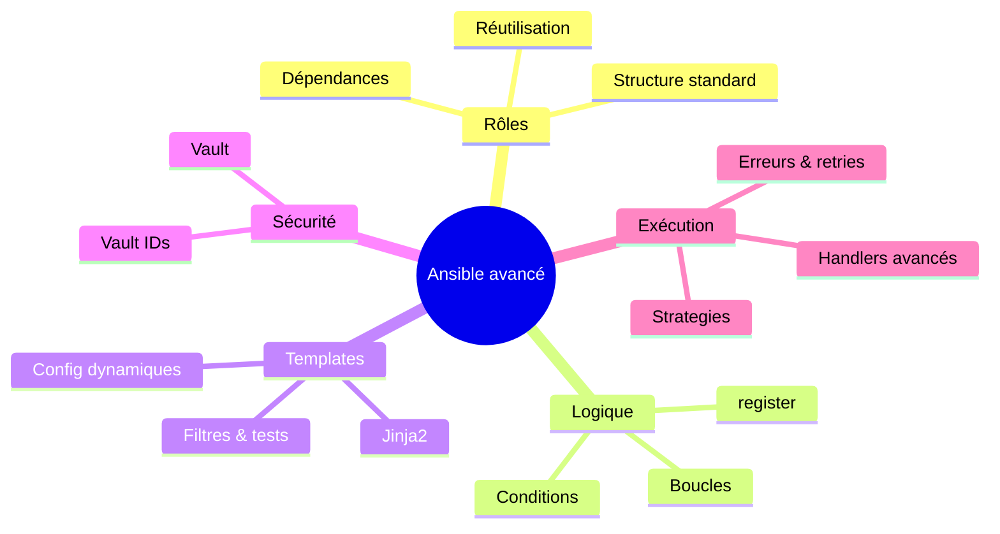
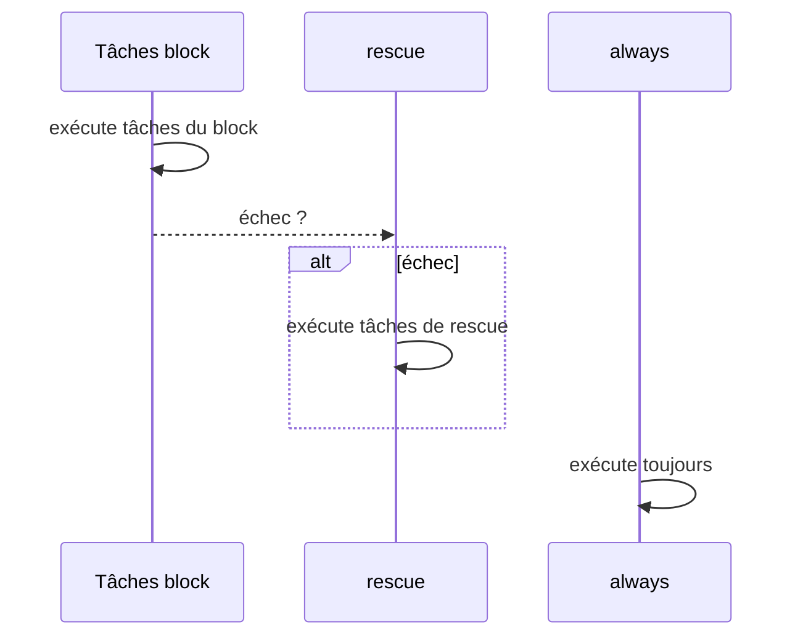

# 🧠 Ansible avancé — rôles, logique et bonnes pratiques

---

## 1. Contexte : après les playbooks “simples”

Avec le cours fondamental, tu sais déjà :

- écrire un **playbook** avec `hosts`, `tasks`, `handlers`,
- utiliser quelques **modules** (`apt`, `copy`, `service`, `template`…),
- gérer un **inventaire** et des **variables**,
- lancer `ansible-playbook` et des **commandes ad-hoc**.

C’est suffisant pour des petits projets ou des labos.

Dès que tu passes sur :

- plusieurs environnements (`dev`, `staging`, `prod`),
- plusieurs équipes,
- une infra créée par **Terraform** (VM, bastion, DB, etc.) et configurée ensuite par Ansible
- des stacks réutilisées (web, monitoring, bastion, S1000D, etc.),

… tu as besoin d’Ansible **structuré** et **sérieux** :

- **rôles** propres et réutilisables,
- **boucles** et **conditions** pour éviter le copié-collé,
- **templates Jinja2** pour adapter les configs selon l’environnement,
- **Vault** pour les secrets,
- une vraie **gestion des erreurs** et des **handlers** pour garder l’idempotence.

C’est exactement ce que couvre ce module.

---



---

## 2. Rôles Ansible : passer du playbook “script” au “module” réutilisable

### 2.1 Pourquoi utiliser des rôles ?

Sans rôles, tu as vite un gros playbook :

- 300+ lignes,
- mélanges de tâches `common`, `web`, `db`…
- difficile à maintenir, tester, réutiliser.

Les **rôles** te permettent de :

- **modulariser** : un rôle = une responsabilité (nginx, users, bastion, postgres, app S1000D…),
- **réutiliser** : même rôle utilisé dans plusieurs projets,
- **standardiser** : même structure partout,
- **partager** : via un dépôt Git ou Ansible Galaxy.

---

### 2.2 Structure standard d’un rôle

L’image que tu as partagée correspond à la structure “canonique” d’un rôle :

```
roles/
  my_role/
    tasks/
      main.yml
    handlers/
      main.yml
    templates/
      ntp.conf.j2
    files/
      file.ext
    vars/
      main.yml
    defaults/
      main.yml
    meta/
      main.yml
    libraries/
      script.py

```

- `tasks/` : les tâches principales (obligatoire).
- `handlers/` : handlers spécifiques au rôle.
- `templates/` : templates Jinja2.
- `files/` : fichiers statiques.
- `vars/` : variables **fortes** du rôle (priorité haute).
- `defaults/` : variables **par défaut**, facilement surchargées.
- `meta/` : dépendances, infos de rôle.
- `libraries/` : modules/plugins Python custom.

Tu peux aussi trouver dans certains rôles :

- `tests/` : scénarios de test,
- `docs/` : documentation interne,
- `molecule/` : tests avec Molecule.

---

### 2.3 Créer un rôle proprement

Avec la CLI :

```bash
ansible-galaxy init roles/webserver

```

Cela crée automatiquement tous les dossiers.

> 💡 Bonne pratique : toujours passer par ansible-galaxy init pour garder une structure homogène dans tous tes projets.
> 

---

### 2.4 Contenu typique des fichiers principaux

### `roles/webserver/tasks/main.yml`

```yaml
---
- name: Installer nginx
  apt:
    name: nginx
    state: present
    update_cache: yes
  notify: restart nginx

- name: Déployer la config nginx
  template:
    src: nginx.conf.j2
    dest: /etc/nginx/nginx.conf
  notify: restart nginx

- name: S'assurer que nginx est démarré
  service:
    name: nginx
    state: started
    enabled: true

```

### `roles/webserver/handlers/main.yml`

```yaml
---
- name: restart nginx
  service:
    name: nginx
    state: restarted

```

### `roles/webserver/defaults/main.yml`

```yaml
---
nginx_port: 80
nginx_server_name: localhost
nginx_docroot: /var/www/html

```

> defaults/ = variables “soft” : tu peux facilement les surcharger dans l’inventaire ou le playbook.
> 

### `roles/webserver/meta/main.yml` (dépendances)

```yaml
---
dependencies:
  - role: common
  - role: monitoring

```

Quand tu appelles `webserver`, Ansible exécutera d’abord les rôles `common` puis `monitoring`.

---

### 2.5 Utiliser un rôle dans un playbook

Playbook minimal :

```yaml
- hosts: webservers
  become: true

  roles:
    - role: common
    - role: webserver

```

Tu peux aussi passer des variables au rôle :

```yaml
- hosts: webservers
  become: true

  roles:
    - role: webserver
      vars:
        nginx_port: 8080
        nginx_server_name: app.example.com

```

---

## 3. Boucles & conditions avancées

Les boucles & conditions permettent de remplacer des dizaines de tâches répétitives par quelques blocs propres.

### 3.1 Boucles modernes : `loop` (recommandé)

Exemple simple (install de paquets) :

```yaml
- name: Installer des paquets
  apt:
    name: "{{ item }}"
    state: present
  loop:
    - git
    - tree
    - vim

```

### 3.2 Boucle sur une liste d’objets (dicts)

```yaml
vars:
  users:
    - name: alice
      uid: 1001
    - name: bob
      uid: 1002

tasks:
  - name: Créer les utilisateurs
    user:
      name: "{{ item.name }}"
      uid: "{{ item.uid }}"
      shell: /bin/bash
    loop: "{{ users }}"

```

### 3.3 `loop_control` pour rendre la boucle lisible

```yaml
- name: Créer les dossiers applicatifs
  file:
    path: "/opt/apps/{{ item.name }}"
    state: directory
    owner: "{{ item.owner }}"
  loop: "{{ apps }}"
  loop_control:
    label: "{{ item.name }}"

```

---

### 3.4 Conditions avec `when`

Exécution conditionnelle :

```yaml
- name: Redémarrer apache si config modifiée
  service:
    name: apache2
    state: restarted
  when: httpd_config.changed

```

Tu peux conditionner :

- sur des variables (`when: env == 'production'`)
- sur des facts (`when: ansible_os_family == 'Debian'`)
- sur des résultats (`when: result.rc != 0`)

---

### 3.5 `register` + conditions

```yaml
- name: Vérifier si le fichier existe
  stat:
    path: /etc/passwd
  register: file_stat

- name: Afficher un message si le fichier existe
  debug:
    msg: "Le fichier existe 👍"
  when: file_stat.stat.exists

```

---

### 3.6 Combiner boucles & conditions

```yaml
- name: Déployer plusieurs webservers (ex: multi-régions)
  include_role:
    name: deploy_webserver
  loop: "{{ web_servers }}"
  loop_control:
    loop_var: web
  when: web.region == 'europe'

```

Ici :

- `web_servers` est une liste d’objets,
- chaque item est passé au rôle avec la variable `web`,
- on ne déploie que ceux qui sont en `region == 'europe'`.

---

### 3.7 `failed_when` / `changed_when` pour contrôler le résultat

```yaml
- name: Vérifier un code de retour
  command: "/usr/local/bin/check_app_status"
  register: check_result
  failed_when: check_result.rc not in [0, 2]
  changed_when: false

```

- ❌ La tâche échoue **si** RC ∉ {0, 2},
- ✅ La tâche n’est jamais considérée comme “changed” (utile pour les checks).

---

## 4. Templates Jinja2 avancés

Les templates vivent dans `roles/<role>/templates/` et sont rendus avec le module `template`.

### 4.1 Rappels de base

Exemple de template `nginx.conf.j2` :

```
server {
  listen {{ nginx_port }};
  server_name {{ nginx_server_name }};

  root {{ nginx_docroot }};

  location / {
    try_files $uri $uri/ =404;
  }
}

```

Et la task :

```yaml
- name: Déployer config nginx
  template:
    src: nginx.conf.j2
    dest: /etc/nginx/nginx.conf
  notify: restart nginx

```

---

### 4.2 Boucles & conditions dans Jinja2

```
# users.yml.j2


{{ user.name }}:
  uid: {{ user.uid }}

  roles:
    - admin




```

Task :

```yaml
- name: Générer la config des utilisateurs
  template:
    src: users.yml.j2
    dest: /etc/app/users.yml

```

---

### 4.3 Filtres utiles

- `default()` : valeur par défaut
- `join()` : concaténer une liste
- `lower`, `upper`, `capitalize`
- `to_nice_json`, `to_yaml`

Exemple :

```
debug_mode: {{ debug | default(false) | lower }}
allowed_hosts: {{ allowed_hosts | default(['localhost']) | join(', ') }}

```

---

### 4.4 Conditions d’environnement

```

debug: false
log_level: "INFO"

debug: true
log_level: "DEBUG"


```

Tu peux ainsi générer des configs différentes pour `dev`, `staging`, `prod` sans dupliquer les fichiers.

---

## 5. Ansible Vault — usage avancé

Tu as déjà vu :

- `ansible-vault create`,
- `encrypt`, `decrypt`, `edit`,
- `-ask-vault-pass`.

Ici on structure ça proprement pour des vrais projets.

### 5.1 Où mettre les secrets ?

Pattern classique :

```
group_vars/
  all/
    vault.yml          # secrets communs
  dev/
    vault.yml
  prod/
    vault.yml

```

Chaque `vault.yml` est **chiffré** :

```bash
ansible-vault encrypt group_vars/prod/vault.yml

```

Exemple de contenu (avant chiffrement) :

```yaml
db_password: "SuperSecretProd"
api_key_s1000d: "abc123"

```

---

### 5.2 Utilisation dans les playbooks

```yaml
- hosts: app
  become: true

  vars_files:
    - group_vars/{{ env }}/vault.yml

  tasks:
    - name: Utiliser le mot de passe DB
      debug:
        msg: "Mot de passe = {{ db_password }}"

```

Lancement :

```bash
ansible-playbook site.yml -e "env=prod" --ask-vault-pass

```

---

### 5.3 `-vault-id` et plusieurs vaults

Pour gérer plusieurs mots de passe :

```bash
ansible-playbook site.yml \
  --vault-id dev@prompt \
  --vault-id prod@prompt

```

ou avec un script :

```bash
ansible-playbook site.yml \
  --vault-id dev@.vault-dev-pass \
  --vault-id prod@.vault-prod-pass

```

---

### 5.4 Bonnes pratiques Vault 🔐

- ne jamais commit les **mots de passe en clair**,
- stocker les fichiers `vault` **chiffrés** dans Git,
- protéger les fichiers `.vault-*` (chmod 600, pas dans Git),
- changer régulièrement les mots de passe,
- centraliser la gestion des secrets (Vault HashiCorp, AWS Secrets Manager…) et n’utiliser Ansible Vault que comme “support” d’intégration.

---

## 6. Gestion avancée des erreurs & retries

### 6.1 `ignore_errors`

Utile quand une erreur est acceptable :

```yaml
- name: Supprimer un fichier non critique
  file:
    path: /tmp/old.log
    state: absent
  ignore_errors: yes

```

---

### 6.2 `block / rescue / always`

```yaml
- name: Mettre à jour la configuration web
  block:
    - name: Sauvegarder l'ancienne conf
      copy:
        src: /etc/webserver/conf.d/app.conf
        dest: /etc/webserver/conf.d/app.conf.bak
        remote_src: yes

    - name: Déployer la nouvelle conf
      template:
        src: app.conf.j2
        dest: /etc/webserver/conf.d/app.conf

  rescue:
    - name: Restaurer la conf précédente
      copy:
        src: /etc/webserver/conf.d/app.conf.bak
        dest: /etc/webserver/conf.d/app.conf
        remote_src: yes

  always:
    - name: Redémarrer le service
      service:
        name: webserver
        state: restarted

```



---

### 6.3 `until` + `retries` + `delay`

Pour les services qui mettent du temps à démarrer :

```yaml
- name: Vérifier que l'API répond
  uri:
    url: "http://localhost:8000/health"
    status_code: 200
  register: api_check
  until: api_check.status == 200
  retries: 10
  delay: 5

```

---

## 7. Stratégies d’exécution & parallélisme

### 7.1 `strategy: linear` (par défaut)

Exécution tâche par tâche sur tous les hôtes :

```yaml
- hosts: all
  strategy: linear
  tasks:
    - name: Installer httpd
      apt:
        name: apache2
        state: present

```

### 7.2 `strategy: free`

Chaque hôte avance à son rythme :

```yaml
- hosts: all
  strategy: free
  tasks:
    - name: Vérifier l'espace disque
      command: df -h

```

### 7.3 Rolling update avec `serial`

```yaml
- hosts: webservers
  serial: 2          # 2 hôtes à la fois
  tasks:
    - name: Déployer nouvelle version applicative
      include_role:
        name: app_deploy

```

Tu peux aussi contrôler l’ordre :

```yaml
- hosts: webservers
  order: shuffle
  serial: 3

```

---

## 8. Handlers & déclencheurs avancés

### 8.1 Notifier plusieurs handlers

```yaml
- name: Mettre à jour la conf app
  template:
    src: app.conf.j2
    dest: /etc/app/app.conf
  notify:
    - restart app
    - reload monitoring

```

```yaml
handlers:
  - name: restart app
    service:
      name: my_app
      state: restarted

  - name: reload monitoring
    service:
      name: prometheus-node-exporter
      state: restarted

```

---

### 8.2 Handlers “groupés” avec `listen`

```yaml
handlers:
  - name: reload nginx
    listen: "webserver_changed"
    service:
      name: nginx
      state: reloaded

  - name: reload firewall
    listen: "webserver_changed"
    service:
      name: ufw
      state: reloaded

```

Et dans tes tâches :

```yaml
- name: Changer une règle firewall liée au web
  ufw:
    rule: allow
    port: 80
  notify: webserver_changed

```

Tous les handlers qui “écoutent” `webserver_changed` seront exécutés **une seule fois** chacun en fin de play.

---

### 8.3 Forcer l’exécution immédiate : `meta: flush_handlers`

```yaml
- name: Appliquer immédiatement les handlers (avant la suite)
  meta: flush_handlers

```

Pratique quand tu as besoin d’un restart “tout de suite” avant de continuer d’autres tâches dépendantes.

---

## 9. Mini-projet : rôle `common` + `webserver` + Vault + Jinja2

Idée simple à réutiliser dans tes cours / labs :

1. **Rôle `common`**
    - crée l’utilisateur `engineer`,
    - installe `htop`, `vim`, `curl`,
    - configure `bashrc` via template.
2. **Rôle `webserver`**
    - installe nginx,
    - déploie un `index.html` qui affiche `env` + `version`,
    - template nginx avec `server_name` depuis `group_vars`.
3. **Secrets**
    - `group_vars/prod/vault.yml` chiffré,
    - contient `basic_auth_password` pour protéger un `/admin`.
4. **Playbook**

```yaml
- hosts: webservers
  become: true

  vars_files:
    - group_vars/{{ env }}/vault.yml

  roles:
    - common
    - webserver

```

1. **CI/CD**
    - Terraform génère `inventory` avec IPs,
    - pipeline lance :
        - `ansible-lint`,
        - `ansible-playbook ... --check`,
        - puis `ansible-playbook` réel.

---

## 10. En résumé

Avec ce module avancé tu sais :

- organiser ton code en **rôles** réutilisables,
- utiliser **boucles**, **conditions**, `register`, `failed_when` pour une logique propre,
- produire des configs dynamiques avec **Jinja2** (filtres, tests, conditions),
- sécuriser tes secrets avec **Ansible Vault** et les intégrer dans les playbooks,
- gérer **erreurs, retries, stratégies d’exécution et handlers** pour garder un comportement fiable et idempotent.

---
[← Module précédent](M35_ansible.md)
---
