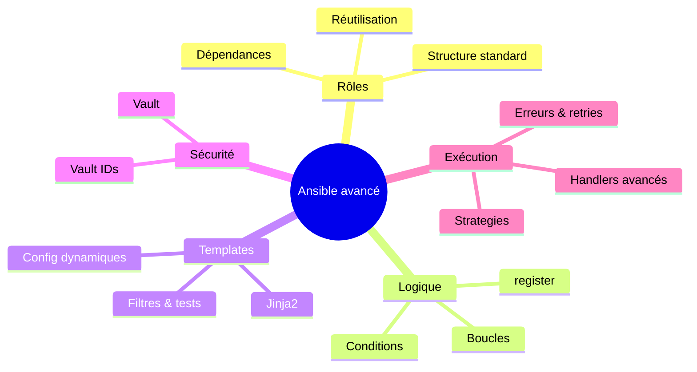

# 🧠 Ansible avancé — rôles, logique et bonnes pratiques

---

## Intro : après les playbooks “simples”

Avec le cours fondamental, tu sais déjà :

- écrire un **playbook** avec `hosts`, `tasks`, `handlers`,
- utiliser quelques **modules** (`apt`, `copy`, `service`, `template`…),
- gérer un **inventaire** et des **variables**,
- lancer `ansible-playbook` et des **commandes ad-hoc**.

C’est suffisant pour des petits projets ou des labos.

Dès que tu passes sur :

- plusieurs environnements (`dev`, `staging`, `prod`),
- plusieurs équipes,
- une infra créée par **Terraform** (VM, bastion, DB, etc.) et configurée ensuite par Ansible
- des stacks réutilisées (web, monitoring, bastion, S1000D, etc.),

… tu as besoin d’Ansible **structuré** et **sérieux** :

- **rôles** propres et réutilisables,
- **boucles** et **conditions** pour éviter le copié-collé,
- **templates Jinja2** pour adapter les configs selon l’environnement,
- **Vault** pour les secrets,
- une vraie **gestion des erreurs** et des **handlers** pour garder l’idempotence.

C’est exactement ce que couvre ce module.

---



---

## 1. Rôles Ansible — comment les créer, les organiser, les utiliser

### 1.1. Idée générale

Un rôle, c’est juste une **façon standardisée d’organiser ton code Ansible** :

- Sans rôle : 1 gros playbook avec toutes les tâches.
- Avec rôles :
    - `role common` (users, packages de base),
    - `role webserver` (nginx, conf),
    - `role postgres`,
    - `role bastion`, etc.

👉 Tu écris chaque “brique” de config une fois, tu la réutilises dans tous tes projets.

Les **rôles** te permettent de :

- **modulariser** : un rôle = une responsabilité (nginx, users, bastion, postgres, app S1000D…),
- **réutiliser** : même rôle utilisé dans plusieurs projets,
- **standardiser** : même structure partout,
- **partager** : via un dépôt Git ou Ansible Galaxy.

---

### 1.2. Créer un rôle pas à pas

#### Étape 1 — Structure de base

Dans ton projet :

```bash
mkdir -p ansible
cd ansible
ansible-galaxy init roles/webserver

```

Ça va créer :

```
roles/webserver/
  tasks/main.yml
  handlers/main.yml
  templates/
  files/
  vars/main.yml
  defaults/main.yml
  meta/main.yml
  libraries/

```

> Important : Ansible sait automatiquement qu’il doit :
> 
> - exécuter `tasks/main.yml` quand tu appelles le rôle,
> - chercher les handlers dans `handlers/main.yml`,
> - etc.
>     
>     Tu n’as pas besoin d’“inclure” ces fichiers à la main.
>     

---

### 1.3. Que mettre dans chaque dossier ? (et comment)

#### a) `tasks/` — le cœur du rôle

But : écrire **la suite de tâches** qui réalise la fonction du rôle.

`roles/webserver/tasks/main.yml` :

```yaml
---
- name: Installer nginx
  apt:
    name: nginx
    state: present
    update_cache: yes
  notify: restart nginx

- name: Déployer la config nginx
  template:
    src: nginx.conf.j2
    dest: /etc/nginx/nginx.conf
  notify: restart nginx

- name: S'assurer que nginx tourne
  service:
    name: nginx
    state: started
    enabled: true

```

Ce fichier est **obligatoire**.

Tu peux le découper en plusieurs fichiers et les inclure :

```yaml
# main.yml
- include_tasks: install.yml
- include_tasks: config.yml
- include_tasks: service.yml

```

---

#### b) `handlers/` — ce qu’on déclenche “en réaction”

`roles/webserver/handlers/main.yml` :

```yaml
---
- name: restart nginx
  service:
    name: nginx
    state: restarted

```

Ce handler ne sera appelé **QUE** si une tâche l’a notifié (`notify: restart nginx`).

On y revient plus loin, mais retiens :

> Tâche → notify → Handler → exécuté en fin de play et au maximum une fois.
> 

---

#### c) `templates/` — fichiers dynamiques

Ici tu mets des fichiers `.j2` (Jinja2).

Exemple : `roles/webserver/templates/nginx.conf.j2`.

Ansible les “remplit” avec les variables de ton inventaire / rôle / extra-vars.

On détaillera la syntaxe Jinja2 plus loin.

---

#### d) `files/` — fichiers statiques

Tout ce que tu veux copier tel quel sur la machine distante.

Exemple : `roles/webserver/files/index.html`.

Dans `tasks/main.yml` :

```yaml
- name: Déployer la page d'accueil
  copy:
    src: index.html         # cherche dans roles/webserver/files
    dest: /var/www/html/index.html

```

---

#### e) `defaults/` vs `vars/` — vraiment important pour comprendre **comment surcharger**

- `defaults/main.yml` :
    
    → variables **par défaut**, priorité faible, facilement surchargées.
    
- `vars/main.yml` :
    
    → variables **fortes**, priorité haute, difficiles à surcharger.
    

En pratique :

```yaml
# defaults/main.yml
nginx_port: 80
nginx_docroot: /var/www/html

```

```yaml
# vars/main.yml
nginx_user: www-data

```

Si dans ton inventaire tu définis `nginx_port: 8080`, c’est cette valeur qui gagne (car inventaire > defaults).

Par contre, si tu définis `nginx_user` dans l’inventaire, **la valeur définie dans vars l’emporte** (priorité plus forte).

> Conseil :
> 
> - tout ce que tu veux rendre facilement personnalisable → `defaults`
> - ce qui ne doit presque jamais changer dans ce rôle → `vars` (avec parcimonie)

---

#### f) `meta/` — déclarer des dépendances entre rôles

`roles/webserver/meta/main.yml` :

```yaml
---
dependencies:
  - role: common
  - role: monitoring

```

Quand tu appelles `webserver`, Ansible va automatiquement :

1. exécuter `common`,
2. puis `monitoring`,
3. puis `webserver`.

Très utile pour dire :

> “Avant d’installer nginx, assure-toi que le rôle common (users, sudo, paquets de base) est passé.”
> 

---

#### g) `libraries/` — modules Python custom

Si un jour tu écris un module Python maison (ex. `my_company_ldap`), tu peux :

- mettre `script.py` dans `roles/my_role/libraries/`,
- puis appeler ce module dans tes tasks, **comme un module Ansible normal**.

Ça évite d’imposer à tout le monde de modifier le `ANSIBLE_LIBRARY` global.

---

### 1.4. Comment utiliser un rôle dans un playbook ?

Playbook à la racine du projet, par ex. `site.yml` :

```yaml
- hosts: webservers
  become: true

  roles:
    - role: common
    - role: webserver

```

Tu peux passer des variables **pour ce rôle seulement** :

```yaml
- hosts: webservers
  become: true

  roles:
    - role: webserver
      vars:
        nginx_port: 8080
        nginx_server_name: "app.example.com"

```

Autre façon plus fine : `include_role` dans une task (avec loop/when, etc.) :

```yaml
- name: Déployer le rôle webserver pour chaque item
  include_role:
    name: webserver
  loop: "{{ web_servers }}"
  loop_control:
    loop_var: web
  vars:
    nginx_server_name: "{{ web.name }}"

```

---

## 2. Boucles & conditions — bien les écrire et bien les comprendre

L’objectif ici n’est pas de juste “voir la syntaxe”, mais de comprendre **comment Ansible évalue les conditions** et **ce qu’il y a vraiment dans les variables**.

---

### 2.1. Rappel : une condition, c’est une **expression Jinja2** qui doit retourner un booléen

Quand tu écris :

```yaml
when: env == 'production'

```

Ansible évalue ça comme du Jinja2 :

- il regarde la valeur de la variable `env`,
- compare à la chaîne `'production'`,
- si c’est vrai → il exécute la tâche.

Tu peux utiliser :

- `==`, `!=`,
- `and`, `or`, `not`,
- `in`, `is defined`, `is succeeded`, etc.

---

### 2.2. Boucles modernes avec `loop`

#### Cas simple : liste de chaînes

```yaml
- name: Installer plusieurs paquets
  apt:
    name: "{{ item }}"
    state: present
  loop:
    - git
    - tree
    - vim

```

**Comment ça marche ?**

1. Ansible prend la tâche,
2. remplace `{{ item }}` par chaque élément de la liste,
3. exécute la tâche 3 fois.

---

#### Boucle sur des objets plus complexes

```yaml
vars:
  users:
    - name: alice
      uid: 1001
      admin: true
    - name: bob
      uid: 1002
      admin: false

tasks:
  - name: Créer les utilisateurs
    user:
      name: "{{ item.name }}"
      uid: "{{ item.uid }}"
      shell: /bin/bash
    loop: "{{ users }}"

```

Ici `item` est un **dictionnaire** :

- `item.name` → `"alice"`
- `item.uid` → `1001`
- `item.admin` → `true`/`false`

---

#### Voir ce que contient `item` (debug indispensable)

Quand tu n’es pas sûr de ce qu’il y a dans `item` :

```yaml
- name: Debug item
  debug:
    var: item
  loop: "{{ users }}"

```

Ca t’évite de te battre à l’aveugle 😄

---

### 2.3. `loop_control` pour des boucles lisibles

```yaml
- name: Création de répertoires
  file:
    path: "/opt/apps/{{ item.name }}"
    state: directory
  loop: "{{ apps }}"
  loop_control:
    label: "{{ item.name }}"

```

`label` te donne un affichage plus lisible dans la sortie Ansible (au lieu de te montrer tout le dict).

---

### 2.4. Conditions avec `when` (et comment ne pas se faire avoir)

#### Condition simple sur une variable

```yaml
- name: Activer la conf prod
  template:
    src: app.prod.conf.j2
    dest: /etc/app/app.conf
  when: env == 'production'

```

Attention aux types :

- `env: production` dans YAML → c’est une **string**
- `debug: true` dans YAML → c’est un **booléen**

Donc :

```yaml
when: debug == true      # ok
when: debug              # ok (test implicite)
when: debug == 'true'    # faux si debug est un bool

```

---

#### Condition sur les **facts** (ex: OS)

```yaml
- name: Installer httpd sur RedHat
  yum:
    name: httpd
    state: present
  when: ansible_os_family == "RedHat"

```

Les facts sont accessibles sous `ansible_...` (`ansible_facts` dans les nouvelles versions).

Pour voir ce qui existe : `ansible all -m setup | less`

---

### 2.5. `register` + conditions : le combo standard

#### 1. On exécute une commande

```yaml
- name: Vérifier l'état de l'app
  command: /usr/local/bin/check_app
  register: app_status
  ignore_errors: yes

```

#### 2. On inspecte ce qui est stocké

```yaml
- debug:
    var: app_status

```

Typiquement tu retrouves :

- `app_status.rc` : code de retour (0,1,2...)
- `app_status.stdout` / `stderr`
- `app_status.changed`

#### 3. On fait une condition dessus

```yaml
- name: Alerter si check_app ne renvoie pas 0
  debug:
    msg: "L'application est en échec"
  when: app_status.rc != 0

```

---

### 2.6. `failed_when` et `changed_when` — pour reprendre la main

Par défaut :

- une commande qui renvoie un code ≠0 → `failed`
- beaucoup de modules décident eux-mêmes si la tâche `changed` ou pas.

Tu peux redéfinir ça.

#### Exemple : considérer que `rc=2` est OK

```yaml
- name: Vérifier l'état de l'app
  command: /usr/local/bin/check_app
  register: app_status
  failed_when: app_status.rc not in [0, 2]
  changed_when: false

```

- La tâche ne sera marquée comme failed que si le RC n’est **ni 0 ni 2**.
- `changed_when: false` → elle n’apparaîtra jamais en “changed” (juste info).

---

### 2.7. Combiner boucles & conditions

```yaml
- name: Créer les comptes admins uniquement
  user:
    name: "{{ item.name }}"
    groups: admin
  loop: "{{ users }}"
  when: item.admin | bool

```

Note la syntaxe :

- `item.admin | bool` → convertit la valeur en booléen
    - `"yes"`, `"true"`, `1` → `True`
    - `"no"`, `"false"`, `0` → `False`

---

## 3. Vault — comment sécuriser **vraiment** tes secrets

L’idée : tu veux que **tes playbooks soient dans Git**, mais **pas tes mots de passe en clair**.

Vault sert à **chiffrer un fichier entier** (souvent YAML) qui contient des secrets.

---

### 3.1. Workflow *complet* typique (par environnement)

Imaginons :

```
group_vars/
  all/
    main.yml
  dev/
    vault.yml
  prod/
    vault.yml

```

#### Étape 1 — Créer un fichier de secrets

```bash
cd ansible
ansible-vault create group_vars/prod/vault.yml

```

Ansible te demande un mot de passe, puis ouvre un éditeur.

Tu écris **du YAML normal** :

```yaml
db_user: "prod_user"
db_password: "SuperSecretProd"
api_key_s1000d: "abcd-1234-xyz"

```

Tu sauvegardes → ce fichier est maintenant **chiffré**.

Même toi, si tu fais `cat group_vars/prod/vault.yml`, tu vois du texte illisible.

---

#### Étape 2 — Lire/modifier plus tard

```bash
ansible-vault edit group_vars/prod/vault.yml

```

Tu redonnes le mot de passe → Ansible déchiffre, ouvre l’éditeur, rechiffre à la sortie.

---

#### Étape 3 — Utiliser ces variables dans un playbook

```yaml
- hosts: app
  become: true

  vars_files:
    - group_vars/{{ env }}/vault.yml

  tasks:
    - name: Afficher l'utilisateur DB (pour debug)
      debug:
        msg: "DB user = {{ db_user }}"

```

Lancement :

```bash
ansible-playbook site.yml -e "env=prod" --ask-vault-pass

```

- `-ask-vault-pass` : Ansible te demande le mot de passe Vault au début,
- il déchiffre le fichier **en mémoire**, utilise les variables,
- le fichier reste chiffré sur le disque et dans Git.

---

#### 3.2. Encrypter un fichier déjà existant

Tu as un fichier `secrets.yml` en clair et tu veux le chiffrer :

```bash
ansible-vault encrypt secrets.yml

```

Pour le repasser en clair (rare, mais possible) :

```bash
ansible-vault decrypt secrets.yml

```

---

#### 3.3. Gérer plusieurs Vaults avec `-vault-id`

Exemple : un mot de passe Vault pour `dev`, un autre pour `prod`.

```bash
ansible-playbook site.yml \
  --vault-id dev@prompt \
  --vault-id prod@prompt

```

Impossible de déchiffrer le prod avec le mot de passe dev.

---

#### 3.4. Bonnes pratiques Vault

- les fichiers *chiffrés* (`vault.yml`) peuvent aller dans Git,
- **les fichiers avec les mots de passe** (`.vault-pass` éventuels) ne doivent **jamais** être commit,
- utiliser des mots de passe solides,
- en équipe : passer par un gestionnaire de secrets (1Password, Vault HashiCorp…) pour partager les passwords Vault.

---

## 4. Templates Jinja2 — comment en construire des “intelligents”

### 4.1. Syntaxe de base

```txt
- `{{ ... }}` → afficher une valeur (expression)
- `` → exécuter une instruction (for, if, etc.)
- `{# ... #}` → commentaire dans le template (non rendu)
```

---

### 4.2. Template simple expliqué

`templates/app.conf.j2` :

```
[app]
env = {{ env }}
debug = {{ debug | default(false) }}

[database]
host = {{ db_host }}
user = {{ db_user }}
password = {{ db_password }}

```

Comment ça se remplit ?

- Ansible prend toutes les variables visibles (inventaire, group_vars, host_vars, defaults, etc.),
- les injecte dans le moteur Jinja2,
- rend le fichier avec les valeurs :

```
[app]
env = production
debug = False

[database]
host = db.internal
user = prod_user
password = SuperSecretProd

```

---

### 4.3. Conditions dans un template

```

debug = false
log_level = INFO

debug = true
log_level = DEBUG


```

Tu contrôles la sortie du fichier **en fonction de tes variables**.

---

### 4.4. Boucles dans un template

```

[{{ user.name }}]
uid = {{ user.uid }}

role = admin

role = standard




```

Avec `users` défini dans Ansible :

```yaml
users:
  - name: alice
    uid: 1001
    admin: true
  - name: bob
    uid: 1002
    admin: false

```

---

### 4.5. Filtres utiles (vraiment pratiques)

Quelques filtres que tu vas utiliser tout le temps :

- `default` : valeur par défaut si variable absente
    
    ```
    timeout = {{ timeout | default(30) }}
    
    ```
    
- `join` : concaténer une liste
    
    ```
    allowed_hosts = {{ allowed_hosts | join(",") }}
    
    ```
    
- `to_yaml`, `to_nice_json` : sérialiser des structures complex
    
    ```
    data: |
      {{ my_dict | to_yaml }}
    
    ```
    

---

### 4.6. Vérifier ce que donne un template

Tu peux faire un `--check` :

```bash
ansible-playbook site.yml --check

```

Ou faire un debug d’une variable compliquée pour voir ce qu’il y a dedans :

```yaml
- debug:
    var: my_var

```

---

## 5. Gestion avancée des erreurs et tentatives

### 5.1. `ignore_errors` — continuer malgré tout (en conscience)

```yaml
- name: Supprimer un fichier optionnel
  file:
    path: /tmp/old.log
    state: absent
  ignore_errors: yes

```

À utiliser **seulement** si :

- l’erreur est attendue et non bloquante,
- ou tu as un plan B derrière (ex : block/rescue).

---

### 5.2. `block`, `rescue`, `always` — essayer, récupérer, nettoyer

Structure :

```yaml
- name: Mettre à jour la config web avec rollback
  block:
    - name: Sauvegarder l’ancienne config
      copy:
        src: /etc/webserver/app.conf
        dest: /etc/webserver/app.conf.bak
        remote_src: yes

    - name: Déployer la nouvelle config
      template:
        src: app.conf.j2
        dest: /etc/webserver/app.conf

  rescue:
    - name: Rétablir l’ancienne config
      copy:
        src: /etc/webserver/app.conf.bak
        dest: /etc/webserver/app.conf
        remote_src: yes

  always:
    - name: Redémarrer le service
      service:
        name: webserver
        state: restarted

```

Logique :

- si **tout dans `block` réussit** → `rescue` ignoré, `always` exécuté,
- si **une task du `block` échoue** → `rescue` exécuté, puis `always`.

---

### 5.3. `retries` + `until` + `delay` — retenter jusqu’à succès

```yaml
- name: Attendre que l’API réponde
  uri:
    url: "http://localhost:8000/health"
    status_code: 200
  register: api_check
  until: api_check.status == 200
  retries: 10
  delay: 5

```

Lecture :

- exécuter la task,
- si `api_check.status != 200` → attendre 5 secondes et recommencer,
- répéter au maximum 10 fois,
- si jamais ça n’atteint pas le status 200 → tâche failed.

---

## 6. Stratégies d’exécution & parallélisme

### 6.1. `strategy: linear` (par défaut)

- Ansible exécute :
    - **tâche 1** sur tous les hôtes,
    - puis **tâche 2** sur tous les hôtes, etc.

C’est le mode le plus simple et le plus prévisible.

---

### 6.2. `strategy: free` — chaque hôte avance à son rythme

```yaml
- hosts: all
  strategy: free
  tasks:
    - name: vérifier l’espace disque
      command: df -h

```

- chaque hôte ne bloque pas les autres,
- utile pour des tâches longues non dépendantes.

---

### 6.3. `serial` — rolling update

```yaml
- hosts: webservers
  serial: 2
  tasks:
    - name: Mettre à jour le code
      git:
        repo: 'https://example.com/app.git'
        dest: '/var/www/app'

```

- Ansible applique les tâches sur **2 hôtes à la fois**,
- puis passe aux 2 suivants, etc.

Ça permet de faire : 2 serveurs mis à jour, testés, puis 2 autres, etc.

---

### 6.4. `order` — contrôle de l’ordre des hôtes

```yaml
- hosts: webservers
  order: shuffle
  serial: 2

```

Options possibles :

- `inventory` (par défaut) : dans l’ordre de ton inventaire,
- `reverse_inventory`,
- `shuffle` (aléatoire).

---

## 7. Handlers & déclencheurs — idempotence “réactive”

### 7.1. Comment ça marche exactement ?

1. Une tâche fait quelque chose (ex : copie un fichier).
2. Si **elle change réellement l’état** → Ansible la marque “changed”.
3. Si elle a un `notify: nom_du_handler` → le handler est mis dans une liste “à exécuter plus tard”.
4. À la fin du play, tous les handlers sont exécutés **une seule fois chacun**.

C’est ça qui :

- évite de redémarrer nginx 15 fois,
- assure que tu ne redémarres que si quelque chose a réellement changé.

---

### 7.2. Exemple complet

```yaml
# tasks/main.yml
- name: Mettre à jour httpd.conf
  copy:
    src: httpd.conf
    dest: /etc/httpd/conf/httpd.conf
  notify: restart httpd

- name: Mettre à jour un autre fichier dépendant
  copy:
    src: vhost.conf
    dest: /etc/httpd/conf.d/vhost.conf
  notify: restart httpd

```

```yaml
# handlers/main.yml
- name: restart httpd
  service:
    name: httpd
    state: restarted

```

Même si les 2 tâches changent des fichiers, **le handler n’est appelé qu’une fois**.

---

### 7.3. Handlers avec `listen` (plusieurs noms, regroupement logique)

```yaml
handlers:
  - name: restart nginx
    listen: "webserver_changed"
    service:
      name: nginx
      state: restarted

  - name: reload firewall
    listen: "webserver_changed"
    service:
      name: ufw
      state: reloaded

```

Et dans les tâches :

```yaml
- name: Modifier règles firewall liées au web
  ufw:
    rule: allow
    port: 80
  notify: webserver_changed

```

Un seul `notify` → plusieurs handlers qui écoutent le même “événement”.

---

### 7.4. Forcer l’exécution immédiate des handlers

Par défaut, les handlers attendent la **fin du play**.

Tu peux forcer :

```yaml
- name: Appliquer les handlers maintenant
  meta: flush_handlers

```

Pratique si, par exemple, tu :

1. modifies la conf d’un service,
2. veux redémarrer **tout de suite**,
3. puis lancer des tâches qui supposent que le service tourne déjà avec la nouvelle conf.

---

## 8. Ce que tu sais vraiment faire maintenant

Tu sais **non seulement** écrire les bouts de YAML, mais surtout :

- **comment structurer un rôle** et où mettre quoi,
- **comment Ansible évalue vraiment** boucles et conditions,
- **comment utiliser `register`, `failed_when`, `changed_when`** pour maîtriser la logique,
- **comment sécuriser tes secrets** avec Vault dans un vrai projet (par environnement),
- **comment écrire des templates Jinja2 intelligents** (variables, boucles, conditions, filtres),
- **comment rendre tes playbooks robustes** avec block/rescue/always + retries,
- **comment contrôler l’exécution** (linear/free/serial/order),
- **comment utiliser les handlers** pour garder l’idempotence tout en ayant des comportements réactifs propres.

## 9. Mini-projet : rôle `common` + `webserver` + Vault + Jinja2

Idée simple à réutiliser dans tes cours / labs :

1. **Rôle `common`**
    - crée l’utilisateur `engineer`,
    - installe `htop`, `vim`, `curl`,
    - configure `bashrc` via template.
2. **Rôle `webserver`**
    - installe nginx,
    - déploie un `index.html` qui affiche `env` + `version`,
    - template nginx avec `server_name` depuis `group_vars`.
3. **Secrets**
    - `group_vars/prod/vault.yml` chiffré,
    - contient `basic_auth_password` pour protéger un `/admin`.
4. **Playbook**

```yaml
- hosts: webservers
  become: true

  vars_files:
    - group_vars/{{ env }}/vault.yml

  roles:
    - common
    - webserver

```

1. **CI/CD**
    - Terraform génère `inventory` avec IPs,
    - pipeline lance :
        - `ansible-lint`,
        - `ansible-playbook ... --check`,
        - puis `ansible-playbook` réel.

---

## 10. En résumé

Avec ce module avancé tu sais :

- organiser ton code en **rôles** réutilisables,
- utiliser **boucles**, **conditions**, `register`, `failed_when` pour une logique propre,
- produire des configs dynamiques avec **Jinja2** (filtres, tests, conditions),
- sécuriser tes secrets avec **Ansible Vault** et les intégrer dans les playbooks,
- gérer **erreurs, retries, stratégies d’exécution et handlers** pour garder un comportement fiable et idempotent.

---
[← Module précédent](M35_ansible.md)
---
