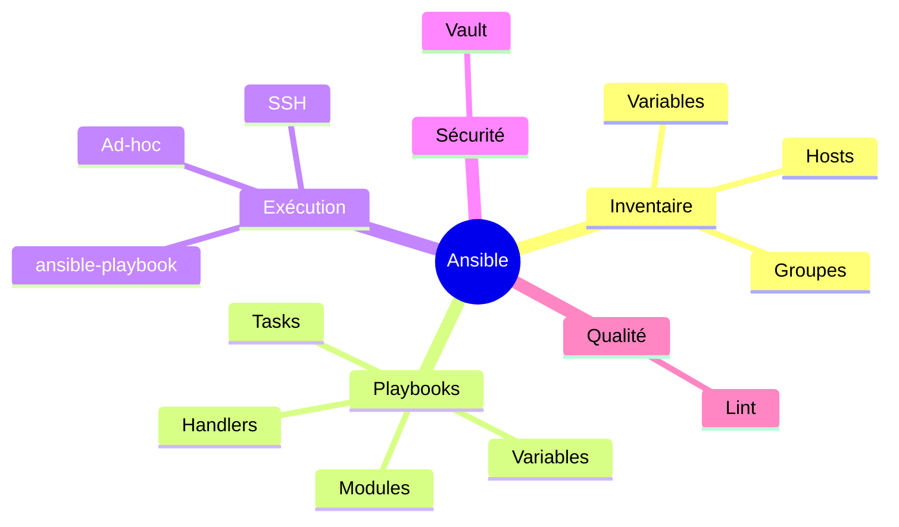
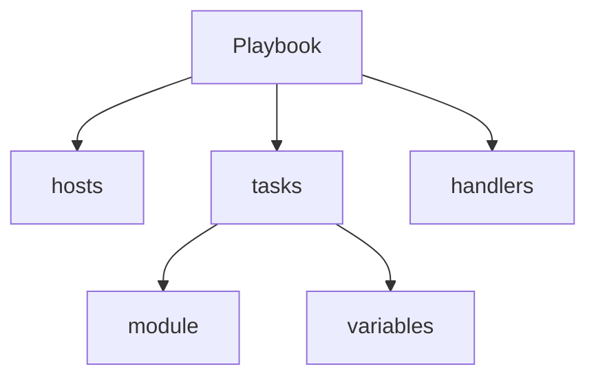
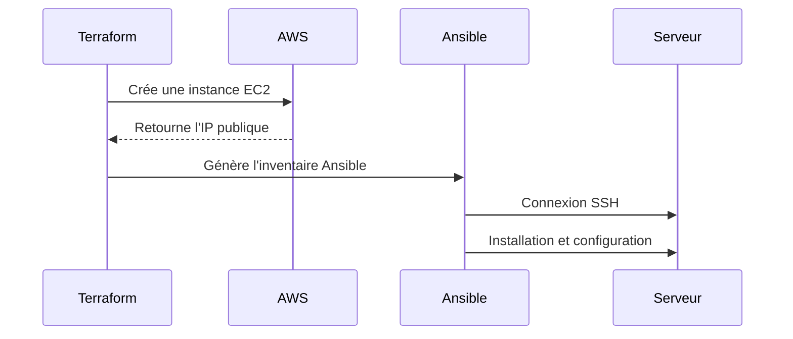

# 🧠 ANSIBLE — Automatisation déclarative & complément naturel de Terraform

---

## 1. Introduction — pourquoi Ansible dans une stack DevOps moderne ?

Quand tu mets en place une infrastructure cloud avec **Terraform**, tu crées :

- ⚙️ des machines virtuelles,
- 🕸️ un VPC,
- 📡 des sous-réseaux,
- 🔐 des groupes de sécurité,
- 📦 des bases de données,
- 🚀 un cluster Kubernetes…

👉 **Mais Terraform ne configure pas l’intérieur des serveurs.**

C’est là qu’**Ansible** intervient.

Il prend le relais quand l’infrastructure *existe*, afin de :

- installer des paquets,
- créer des utilisateurs,
- déployer une application,
- configurer un service web,
- modifier des fichiers,
- appliquer des politiques de sécurité.

### 🧩 **Terraform gère *l’infrastructure*. Ansible gère *la configuration*.**

Ils sont complémentaires et souvent utilisés ensemble dans toutes les équipes DevOps.

Voici le cycle classique :


---

## 2. Contexte & philosophie d’Ansible

Ansible fonctionne avec trois principes clés :

### 2.1 🧩 **Agentless**

Contrairement à Puppet, Chef ou SaltStack :

👉 **aucun agent à installer** sur les serveurs gérés.

Il suffit que la machine cible accepte une connexion SSH (ou WinRM pour Windows).

### 2.2 🧩 **Déclaratif**

Tu décris *l’état final souhaité* :

> “nginx doit être installé et démarré”.
> 

Ansible s’assure que l’état est respecté.

### 2.3 🧩 **Idempotent**

Exécuter le même playbook 10 fois :

👉 **résultat identique**.

Pas de doublons, pas de réinstallations inutiles.

---

## 3. Les briques fondamentales d’Ansible



---

# 🧱 4. L’inventaire Ansible (source de vérité)

L’inventaire est **le cœur d’Ansible**.

Il recense **toutes les machines cibles** : serveurs, bastion, docker hosts, VM Terraform, bases de données, etc.

Ansible sait *où* agir grâce à lui.

### 4.1 Inventaire simple (INI)

```
mail.example.com

[webservers]
www.example.com
172.65.48.255

[dbservers]
database.example.com
172.65.48.254

```

### 4.2 Inventaire avec variables par hôte

```
[webservers]
web1 ansible_host=54.12.88.10 ansible_user=admin
web2 ansible_host=54.12.88.11 ansible_user=admin

```

### 4.3 Inventaire structuré en YAML (recommandé)

```yaml
all:
  hosts:
    bastion:
      ansible_host: 51.12.33.44

  children:
    webservers:
      hosts:
        web1:
          ansible_host: 10.0.1.10
        web2:
          ansible_host: 10.0.1.11

    database:
      hosts:
        db1:
          ansible_host: 10.0.2.20

```

### 4.4 Variables dans host_vars / group_vars

Arborescence :

```
inventory/
  hosts.yml
  group_vars/
    webservers.yml
  host_vars/
    db1.yml

```

Exemple :

**group_vars/webservers.yml**

```yaml
nginx_port: 8080
env: production

```

**host_vars/db1.yml**

```yaml
postgres_version: 15

```

👉 **Cela permet d’avoir un inventaire propre, lisible et scalable.**

---

# 🧱 5. Playbooks — le “programme” qu’Ansible exécute

Un playbook est un fichier **YAML** qui décrit :

- les hôtes ciblés
- les tâches à exécuter
- les variables
- les handlers
- les tags

Format minimal :

```yaml
- hosts: webservers
  become: true
  tasks:
    - name: installer nginx
      apt:
        name: nginx
        state: present

```

### 5.1 Structure d’un Playbook (schéma simple)



---

# 🧱 6. Tasks — l’unité d’action

Une **task** = une action idempotente.

Exemples :

### Installer un paquet

```yaml
- name: Installer nginx
  apt:
    name: nginx
    state: present

```

### Copier un fichier de configuration

```yaml
- name: Copier la conf nginx
  copy:
    src: nginx.conf
    dest: /etc/nginx/nginx.conf

```

### Démarrer un service

```yaml
- name: Démarrer nginx
  service:
    name: nginx
    state: started
    enabled: true

```

---

# 🧱 7. Modules Ansible — les “fonctions” à appeler

Quelques modules essentiels :

| Module | Rôle |
| --- | --- |
| `apt` | gérer les packages Debian/Ubuntu |
| `yum` | gérer les packages CentOS/RHEL |
| `service` | gérer les services systemd |
| `copy` | copier un fichier |
| `template` | templating Jinja2 |
| `shell` | exécuter une commande shell |
| `user` | créer/modifier des utilisateurs |
| `file` | gérer permissions, dossiers |

Exemple avec `template` (Jinja2) :

```yaml
- name: Template de configuration
  template:
    src: app.conf.j2
    dest: /etc/app/app.conf

```

---

# 🧱 8. Handlers — exécutés uniquement lorsqu’un changement survient

Exemple :

```yaml
tasks:
  - name: Modifier la configuration
    copy:
      src: nginx.conf
      dest: /etc/nginx/nginx.conf
    notify: restart nginx

handlers:
  - name: restart nginx
    service:
      name: nginx
      state: restarted

```

👉 L’intérêt : éviter les redémarrages inutiles.

Si le fichier n’a pas changé → handler non appelé.

---

# 🧱 9. Exécution d’un playbook

Commandes :

```bash
ansible-playbook -i inventory/hosts.yml site.yml

```

Afficher plus de détails :

```bash
ansible-playbook -i hosts.yml site.yml -vvv

```

Forcer une variable :

```bash
ansible-playbook -e "env=prod"

```

Dry run :

```bash
ansible-playbook --check

```

---

# 🧱 10. Commandes ad-hoc (actions rapides)

Pour tester, sans écrire de playbook :

### Ping

```bash
ansible all -i hosts.yml -m ping

```

### Uptime

```bash
ansible webservers -m shell -a "uptime"

```

### Installer un paquet

```bash
ansible dbservers -m apt -a "name=htop state=present" -b

```

---

# 🧱 11. Variables : rendre la configuration dynamique

Définition dans un playbook :

```yaml
vars:
  username: engineer
  home: /home/engineer

tasks:
  - name: print variables
    debug:
      msg: "User : {{ username }} | Home : {{ home }}"

```

Définition depuis la CLI :

```bash
ansible-playbook -e "env=prod region=eu-west-1"

```

---

# 🧱 12. Ansible Vault — gérer les secrets

Vault permet de **chiffrer** des fichiers YAML :

- mots de passe,
- clés API,
- credentials DB,
- secrets cloud…

### 12.1 Créer un fichier chiffré

```bash
ansible-vault create secrets.yml

```

### 12.2 Chiffrer un fichier existant

```bash
ansible-vault encrypt vars.yml

```

### 12.3 Modifier un fichier

```bash
ansible-vault edit vars.yml

```

### 12.4 Déchiffrer temporairement lors d’un playbook

```bash
ansible-playbook site.yml --ask-vault-pass

```

Ou :

```bash
ansible-playbook site.yml --vault-password-file .vault-pass

```

---

# 🧱 13. Qualité : Ansible Lint

Outil indispensable dans une démarche DevOps CI/CD.

### Installation

```bash
pip install ansible-lint

```

### Vérification d’un projet

```bash
ansible-lint .

```

Cela détecte :

- mauvaises pratiques,
- erreurs YAML,
- handlers inutiles,
- modules obsolètes,
- syntaxe améliorables.

---

# 🧱 14. Interaction Terraform ↔ Ansible (essentiel)

Voici la manière **propre** d’enchaîner les deux outils.

### 14.1 Terraform crée l’infra…

Exemple :

```hcl
resource "aws_instance" "web" {
  ami           = "ami-123"
  instance_type = "t2.micro"

  tags = {
    Name = "web1"
  }
}

output "web_ip" {
  value = aws_instance.web.public_ip
}

```

### 14.2 … puis génère un inventaire Ansible

On peut générer automatiquement :

```bash
terraform output -raw web_ip > inventory/hosts

```

### 14.3 Et lancer Ansible ensuite

```bash
ansible-playbook -i inventory/hosts playbook.yml

```

### 14.4 Graphique de complémentarité Terraform ↔ Ansible



---

# 🧱 15. Projet type DevOps (Terraform + Ansible)

Un cycle réel dans un projet DevOps/S1000D :

1. **Terraform**
    - crée Bastion + VM API + VM DB
    - ouvre les bons ports
    - configure réseau privé
2. **Ansible**
    - installe nginx sur VM API
    - installe python3, git, docker
    - déploie ton API S1000D
    - configure systemd
    - applique les règles SSH
    - durcit les serveurs (fail2ban, firewall)
3. **CI/CD**
    - déclenche `ansible-playbook` via GitLab/Jenkins

---

# 🧱 16. Exemple complet de playbook (simple & propre)

```yaml
- hosts: webservers
  become: true

  vars:
    nginx_port: 8080

  tasks:

    - name: Installer nginx
      apt:
        name: nginx
        state: present
        update_cache: yes

    - name: Copier la conf nginx
      template:
        src: nginx.conf.j2
        dest: /etc/nginx/nginx.conf
      notify: restart nginx

    - name: Démarrer nginx
      service:
        name: nginx
        state: started
        enabled: true

  handlers:
    - name: restart nginx
      service:
        name: nginx
        state: restarted

```

---

# 🧱 17. Check-list pour bien structurer un projet Ansible

```
project/
  inventory/
    hosts.yml
    group_vars/
    host_vars/
  roles/
    nginx/
      tasks/
      handlers/
      templates/
      files/
      vars/
  playbooks/
    site.yml
  files/
  templates/

```

---

# 🎉 Conclusion

Tu sais maintenant :

- comprendre la philosophie d’Ansible,
- écrire un inventaire propre,
- construire un playbook structuré,
- utiliser modules / tasks / handlers,
- manipuler variables & vault,
- exécuter Ansible (CLI & ad-hoc),
- associer Ansible et Terraform (complémentarité complète),
- utiliser ansible-lint pour la qualité.

Ton module avancé pourra ensuite couvrir :

- les **rôles** en profondeur,
- les **collections**,
- les **plugins**,
- l’inventaire **dynamique**,
- la création d’un **Ansible Controller**,
- la gestion d’environnements multi-cloud,
- la structure **production-grade**.