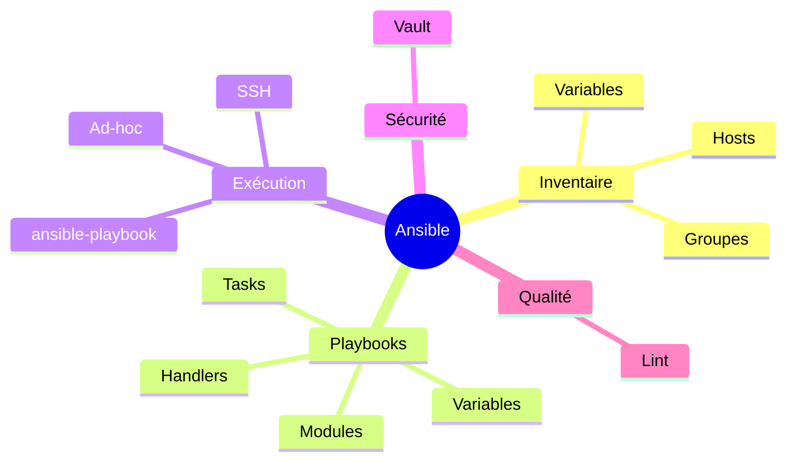
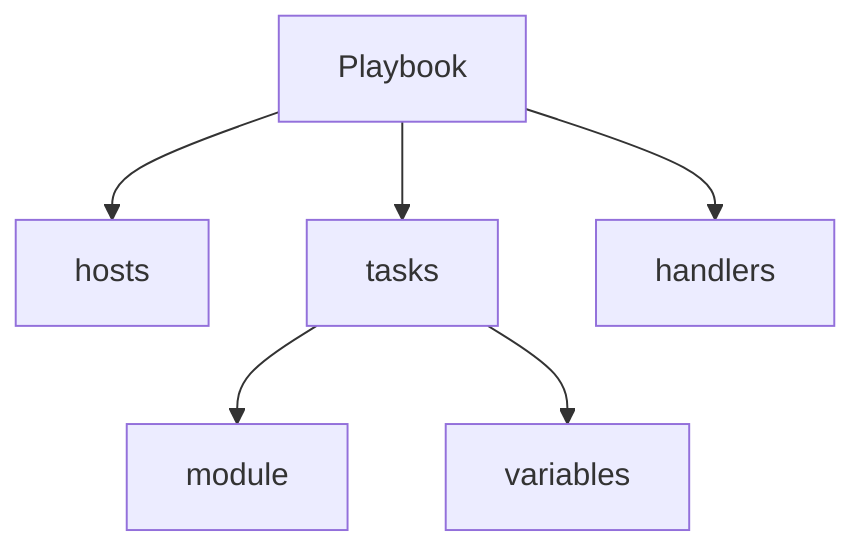
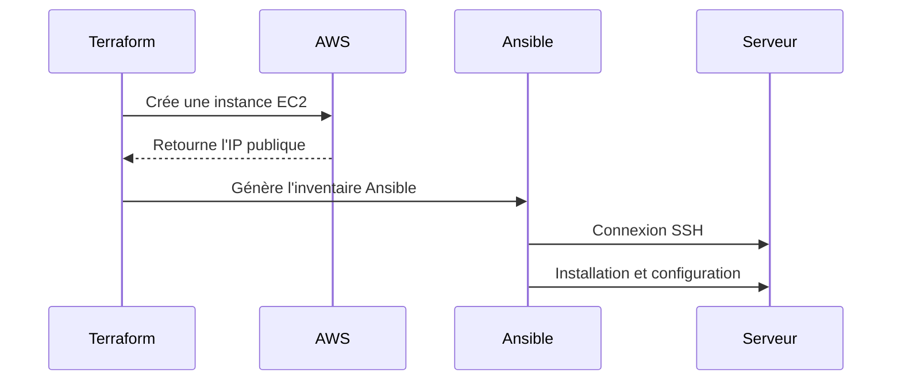

# 🧠 ANSIBLE — Automatisation déclarative & complément naturel de Terraform

---

## 1. Introduction — pourquoi Ansible dans une stack DevOps moderne ?

Quand tu mets en place une infrastructure cloud avec **Terraform**, tu crées :

- ⚙️ des machines virtuelles,
- 🕸️ un VPC,
- 📡 des sous-réseaux,
- 🔐 des groupes de sécurité,
- 📦 des bases de données,
- 🚀 un cluster Kubernetes…

👉 **Mais Terraform ne configure pas l’intérieur des serveurs.**

C’est là qu’**Ansible** intervient.

Il prend le relais quand l’infrastructure *existe*, afin de :

- installer des paquets,
- créer des utilisateurs,
- déployer une application,
- configurer un service web,
- modifier des fichiers,
- appliquer des politiques de sécurité.

### 🧩 **Terraform gère *l’infrastructure*. Ansible gère *la configuration*.**

Ils sont complémentaires et souvent utilisés ensemble dans toutes les équipes DevOps.

Voici le cycle classique :


```mermaid
flowchart LR
    A[Terraform — Crée l'infrastructure] --> B[Machines prêtes]
    B --> C[Ansible — Configure les serveurs]
    C --> D[Application déployée & fonctionnelle]

```

---

## 2. Contexte & philosophie d’Ansible

Ansible fonctionne avec trois principes clés :

### 2.1 🧩 **Agentless**

Contrairement à Puppet, Chef ou SaltStack :

👉 **aucun agent à installer** sur les serveurs gérés.

Il suffit que la machine cible accepte une connexion SSH (ou WinRM pour Windows).

### 2.2 🧩 **Déclaratif**

Tu décris *l’état final souhaité* :

> “nginx doit être installé et démarré”.
> 

Ansible s’assure que l’état est respecté.

### 2.3 🧩 **Idempotent**

Exécuter le même playbook 10 fois :

👉 **résultat identique**.

Pas de doublons, pas de réinstallations inutiles.

---

## 3. Les briques fondamentales d’Ansible


```mermaid
mindmap
  root((Ansible))
    Inventaire
      Hosts
      Groupes
      Variables
    Playbooks
      Tasks
      Handlers
      Modules
      Variables
    Exécution
      SSH
      Ad-hoc
      ansible-playbook
    Sécurité
      Vault
    Qualité
      Lint

```

## 4. Installation d’Ansible — la base indispensable

Ansible est disponible :

- via `apt` (Debian/Ubuntu),
- via `pip` (méthode universelle),
- via `brew` (macOS),
- via **WSL2** pour Windows (recommandé),
- via le module Windows “Ansible Automation Platform” (moins utilisé pour débuter).

Dans une stack DevOps standard, **on installe toujours Ansible sur la machine de contrôle**, jamais sur les serveurs cibles.

---

### 🟦 Installation sur Debian / Ubuntu (méthode recommandée)

#### ✔️ Option 1 — Installation officielle via APT (PPA Ansible)

C’est la méthode la plus propre.

##### 1️⃣ Ajouter le dépôt officiel Ansible

```bash
sudo apt update
sudo apt install -y software-properties-common
sudo add-apt-repository --yes --update ppa:ansible/ansible

```

##### 2️⃣ Installer Ansible

```bash
sudo apt install -y ansible

```

##### 3️⃣ Vérifier

```bash
ansible --version

```

Tu dois voir quelque chose comme :

```
ansible [core 2.16.x]

```

---

#### ✔️ Option 2 — Installation via `pip` (flexible, pour environnements custom)

```bash
sudo apt update
sudo apt install -y python3 python3-pip
pip3 install ansible

```

Vérification :

```bash
ansible --version

```

👉 Avantage : tu peux gérer tes versions via `pip install ansible==2.15.0`.

---

### 🟧 Installation sur Windows

**Important** :

👉 **Ansible ne tourne pas nativement sur Windows.**

La méthode *propre, industrielle et recommandée* : **installer Ansible dans WSL2 (Ubuntu)**.

---

#### ✔️ Option 1 — Installation via WSL2 + Ubuntu (recommandé)

##### 1️⃣ Activer WSL2

Dans PowerShell admin :

```powershell
wsl --install

```

(Windows redémarre)

##### 2️⃣ Installer Ubuntu

Dans Microsoft Store : **Ubuntu 22.04 LTS**

##### 3️⃣ Dans Ubuntu → installer Ansible (méthode APT)

```bash
sudo apt update
sudo apt install -y software-properties-common
sudo add-apt-repository --yes --update ppa:ansible/ansible
sudo apt install -y ansible

```

Vérification :

```bash
ansible --version

```

Et tu peux piloter toute ton infra cloud directement depuis Windows 🤝 grâce à Ubuntu sous WSL2.

---

#### ✔️ Option 2 — Par Python sur Windows (possible mais déconseillé)

Si tu veux absolument l’installer directement sur Windows :

```powershell
pip install ansible

```

**MAIS** :

- certains modules ne fonctionnent pas
- SSH via Windows est moins stable
- tu ne peux pas lancer ansible-lint correctement

Donc → pas idéal pour du DevOps sérieux.

---

### 🟩 Installation sur macOS (Homebrew)

Super simple :

```bash
brew update
brew install ansible

```

Vérification :

```bash
ansible --version

```

---

### 🟨 Installation dans Docker (pour CI/CD)

Pratique quand tu veux exécuter Ansible dans un pipeline :

```bash
docker run -it --rm \
  -v $(pwd):/work \
  ubuntu:22.04 bash

```

Dans le conteneur :

```bash
apt update
apt install -y software-properties-common
add-apt-repository --yes --update ppa:ansible/ansible
apt install -y ansible

```

Ou : image prête à l’emploi :

```bash
docker pull cytopia/ansible

```

---

# 🧱 5. L’inventaire Ansible (source de vérité)

L’inventaire est **le cœur d’Ansible**.

Il recense **toutes les machines cibles** : serveurs, bastion, docker hosts, VM Terraform, bases de données, etc.

Ansible sait *où* agir grâce à lui.

### 5.1 Inventaire simple (INI)

```
mail.example.com

[webservers]
www.example.com
172.65.48.255

[dbservers]
database.example.com
172.65.48.254

```

### 5.2 Inventaire avec variables par hôte

```
[webservers]
web1 ansible_host=54.12.88.10 ansible_user=admin
web2 ansible_host=54.12.88.11 ansible_user=admin

```

### 5.3 Inventaire structuré en YAML (recommandé)

```yaml
all:
  hosts:
    bastion:
      ansible_host: 51.12.33.44

  children:
    webservers:
      hosts:
        web1:
          ansible_host: 10.0.1.10
        web2:
          ansible_host: 10.0.1.11

    database:
      hosts:
        db1:
          ansible_host: 10.0.2.20

```

### 5.4 Variables dans host_vars / group_vars

Arborescence :

```
inventory/
  hosts.yml
  group_vars/
    webservers.yml
  host_vars/
    db1.yml

```

Exemple :

**group_vars/webservers.yml**

```yaml
nginx_port: 8080
env: production

```

**host_vars/db1.yml**

```yaml
postgres_version: 15

```

👉 **Cela permet d’avoir un inventaire propre, lisible et scalable.**

---

# 🧱 6. Playbooks — le “programme” qu’Ansible exécute

Un playbook est un fichier **YAML** qui décrit :

- les hôtes ciblés
- les tâches à exécuter
- les variables
- les handlers
- les tags

Format minimal :

```yaml
- hosts: webservers
  become: true
  tasks:
    - name: installer nginx
      apt:
        name: nginx
        state: present

```

### 6.1 Structure d’un Playbook (schéma simple)


```mermaid
flowchart TD
    A[Playbook] --> B[hosts]
    A --> C[tasks]
    A --> D[handlers]
    C --> E[module]
    C --> F[variables]

```

---

# 🧱 7. Tasks — l’unité d’action

Une **task** = une action idempotente.

Exemples :

### Installer un paquet

```yaml
- name: Installer nginx
  apt:
    name: nginx
    state: present

```

### Copier un fichier de configuration

```yaml
- name: Copier la conf nginx
  copy:
    src: nginx.conf
    dest: /etc/nginx/nginx.conf

```

### Démarrer un service

```yaml
- name: Démarrer nginx
  service:
    name: nginx
    state: started
    enabled: true

```

---

# 🧱 8. Modules Ansible — les “fonctions” à appeler

Quelques modules essentiels :

| Module | Rôle |
| --- | --- |
| `apt` | gérer les packages Debian/Ubuntu |
| `yum` | gérer les packages CentOS/RHEL |
| `service` | gérer les services systemd |
| `copy` | copier un fichier |
| `template` | templating Jinja2 |
| `shell` | exécuter une commande shell |
| `user` | créer/modifier des utilisateurs |
| `file` | gérer permissions, dossiers |

Exemple avec `template` (Jinja2) :

```yaml
- name: Template de configuration
  template:
    src: app.conf.j2
    dest: /etc/app/app.conf

```

---

# 🧱 9. Handlers — exécutés uniquement lorsqu’un changement survient

Exemple :

```yaml
tasks:
  - name: Modifier la configuration
    copy:
      src: nginx.conf
      dest: /etc/nginx/nginx.conf
    notify: restart nginx

handlers:
  - name: restart nginx
    service:
      name: nginx
      state: restarted

```

👉 L’intérêt : éviter les redémarrages inutiles.

Si le fichier n’a pas changé → handler non appelé.

---

# 🧱 10. Exécution d’un playbook

Commandes :

```bash
ansible-playbook -i inventory/hosts.yml site.yml

```

Afficher plus de détails :

```bash
ansible-playbook -i hosts.yml site.yml -vvv

```

Forcer une variable :

```bash
ansible-playbook -e "env=prod"

```

Dry run :

```bash
ansible-playbook --check

```

---

# 🧱 11. Commandes ad-hoc (actions rapides)

Pour tester, sans écrire de playbook :

### Ping

```bash
ansible all -i hosts.yml -m ping

```

### Uptime

```bash
ansible webservers -m shell -a "uptime"

```

### Installer un paquet

```bash
ansible dbservers -m apt -a "name=htop state=present" -b

```

---

# 🧱 12. Variables : rendre la configuration dynamique

Définition dans un playbook :

```yaml
vars:
  username: engineer
  home: /home/engineer

tasks:
  - name: print variables
    debug:
      msg: "User : {{ username }} | Home : {{ home }}"

```

Définition depuis la CLI :

```bash
ansible-playbook -e "env=prod region=eu-west-1"

```

---

# 🧱 13. Ansible Vault — gérer les secrets

Vault permet de **chiffrer** des fichiers YAML :

- mots de passe,
- clés API,
- credentials DB,
- secrets cloud…

### 13.1 Créer un fichier chiffré

```bash
ansible-vault create secrets.yml

```

### 13.2 Chiffrer un fichier existant

```bash
ansible-vault encrypt vars.yml

```

### 13.3 Modifier un fichier

```bash
ansible-vault edit vars.yml

```

### 13.4 Déchiffrer temporairement lors d’un playbook

```bash
ansible-playbook site.yml --ask-vault-pass

```

Ou :

```bash
ansible-playbook site.yml --vault-password-file .vault-pass

```

---

# 🧱 14. Qualité : Ansible Lint

Outil indispensable dans une démarche DevOps CI/CD.

### Installation

```bash
pip install ansible-lint

```

### Vérification d’un projet

```bash
ansible-lint .

```

Cela détecte :

- mauvaises pratiques,
- erreurs YAML,
- handlers inutiles,
- modules obsolètes,
- syntaxe améliorables.

---

# 🧱 15. Interaction Terraform ↔ Ansible (essentiel)

Voici la manière **propre** d’enchaîner les deux outils.

### 15.1 Terraform crée l’infra…

Exemple :

```hcl
resource "aws_instance" "web" {
  ami           = "ami-123"
  instance_type = "t2.micro"

  tags = {
    Name = "web1"
  }
}

output "web_ip" {
  value = aws_instance.web.public_ip
}

```

### 15.2 … puis génère un inventaire Ansible

On peut générer automatiquement :

```bash
terraform output -raw web_ip > inventory/hosts

```

### 15.3 Et lancer Ansible ensuite

```bash
ansible-playbook -i inventory/hosts playbook.yml

```

### 15.4 Graphique de complémentarité Terraform ↔ Ansible


```mermaid
sequenceDiagram
    participant TF as Terraform
    participant AWS as AWS
    participant AN as Ansible
    participant VM as Serveur

    TF->>AWS: Crée une instance EC2
    AWS-->>TF: Retourne l'IP publique
    TF->>AN: Génère l'inventaire Ansible
    AN->>VM: Connexion SSH
    AN->>VM: Installation et configuration

```

---

# 🧱 16. Projet type DevOps (Terraform + Ansible)

Un cycle réel dans un projet DevOps/S1000D :

1. **Terraform**
    - crée Bastion + VM API + VM DB
    - ouvre les bons ports
    - configure réseau privé
2. **Ansible**
    - installe nginx sur VM API
    - installe python3, git, docker
    - déploie ton API S1000D
    - configure systemd
    - applique les règles SSH
    - durcit les serveurs (fail2ban, firewall)
3. **CI/CD**
    - déclenche `ansible-playbook` via GitLab/Jenkins

---

# 🧱 17. Exemple complet de playbook (simple & propre)

```yaml
- hosts: webservers
  become: true

  vars:
    nginx_port: 8080

  tasks:

    - name: Installer nginx
      apt:
        name: nginx
        state: present
        update_cache: yes

    - name: Copier la conf nginx
      template:
        src: nginx.conf.j2
        dest: /etc/nginx/nginx.conf
      notify: restart nginx

    - name: Démarrer nginx
      service:
        name: nginx
        state: started
        enabled: true

  handlers:
    - name: restart nginx
      service:
        name: nginx
        state: restarted

```

---

# 🧱 18. Check-list pour bien structurer un projet Ansible

```
project/
  inventory/
    hosts.yml
    group_vars/
    host_vars/
  roles/
    nginx/
      tasks/
      handlers/
      templates/
      files/
      vars/
  playbooks/
    site.yml
  files/
  templates/

```

---

# 🎉 Conclusion

Tu sais maintenant :

- comprendre la philosophie d’Ansible,
- écrire un inventaire propre,
- construire un playbook structuré,
- utiliser modules / tasks / handlers,
- manipuler variables & vault,
- exécuter Ansible (CLI & ad-hoc),
- associer Ansible et Terraform (complémentarité complète),
- utiliser ansible-lint pour la qualité.

Ton module avancé pourra ensuite couvrir :

- les **rôles** en profondeur,
- les **collections**,
- les **plugins**,
- l’inventaire **dynamique**,
- la création d’un **Ansible Controller**,
- la gestion d’environnements multi-cloud,
- la structure **production-grade**.


---

<!-- snippet
id: ansible_install_ppa
type: command
tech: ansible
level: beginner
importance: high
format: knowledge
tags: ansible,install,ubuntu,ppa
title: Ajouter le dépôt PPA officiel d'Ansible
context: avant d'installer Ansible sur Ubuntu/Debian
command: sudo add-apt-repository --yes --update ppa:ansible/ansible
description: Ajoute le dépôt PPA pour obtenir la dernière version stable, plus récente que celle des dépôts Ubuntu par défaut.
-->

<!-- snippet
id: ansible_install_ubuntu
type: command
tech: ansible
level: beginner
importance: high
format: knowledge
tags: ansible,install,ubuntu,ppa
title: Installer Ansible sur Ubuntu/Debian
context: après avoir ajouté le PPA ansible/ansible
command: sudo apt install -y ansible
description: À exécuter sur la machine de contrôle uniquement, jamais sur les serveurs cibles. Vérifier ensuite avec ansible --version.
-->

<!-- snippet
id: ansible_playbook_run
type: command
tech: ansible
level: beginner
importance: high
format: knowledge
tags: ansible,playbook,inventaire,exécution
title: Lancer un playbook Ansible avec un inventaire
context: déployer une configuration sur des serveurs distants via un playbook Ansible
command: ansible-playbook -i inventory/hosts.yml site.yml
description: Exécute le playbook site.yml en utilisant l'inventaire hosts.yml. Ajoutez -v, -vv ou -vvv pour augmenter la verbosité et déboguer. Ajoutez --check pour un dry-run sans modification réelle.
-->

<!-- snippet
id: ansible_vault_create
type: command
tech: ansible
level: intermediate
importance: high
format: knowledge
tags: ansible,vault,secrets,chiffrement
title: Créer un fichier de secrets chiffré avec Ansible Vault
context: stocker des mots de passe ou clés API chiffrés dans Git
command: ansible-vault create group_vars/prod/vault.yml
description: Ouvre un éditeur pour saisir des variables YAML sensibles, puis les chiffre avec un mot de passe. Le fichier résultant peut être versionné dans Git sans exposer les secrets. Pour l'utiliser lors d'un playbook : ajoutez --ask-vault-pass.
-->

<!-- snippet
id: ansible_ad_hoc_ping
type: command
tech: ansible
level: beginner
importance: medium
format: knowledge
tags: ansible,ad-hoc,ping,test-connexion
title: Tester la connectivité SSH avec Ansible ad-hoc
context: vérifier qu'Ansible peut joindre tous les serveurs de l'inventaire
command: ansible all -i inventory/hosts.yml -m ping
description: Fait une vraie connexion SSH et vérifie Python sur chaque hôte. Répond "pong" si tout est OK.
-->

<!-- snippet
id: ansible_terraform_inventory_chain
type: concept
tech: ansible
level: intermediate
importance: high
format: knowledge
tags: ansible,terraform,inventaire,pipeline,intégration
title: Enchaîner Terraform et Ansible dans un pipeline DevOps
context: configurer automatiquement des serveurs après leur création par Terraform
content: Après terraform apply, récupérez l'IP avec terraform output -raw web_ip > inventory/hosts. Puis lancez ansible-playbook -i inventory/hosts playbook.yml. Cette chaîne Terraform (crée l'infra) → Ansible (configure les serveurs) est le pattern standard DevOps. Terraform peut aussi générer un fichier d'inventaire YAML complet via un local-exec ou un module dédié.
-->

<!-- snippet
id: ansible_handlers_concept
type: concept
tech: ansible
level: beginner
importance: medium
format: knowledge
tags: ansible,handlers,notify,idempotence,service
title: Handlers Ansible : déclenchement conditionnel par notify
content: Un handler n'est exécuté que si une tâche l'a notifié (état `changed`). Il s'exécute une seule fois en fin de play, même si plusieurs tâches le déclenchent. Évite les redémarrages inutiles de services.
-->

---
[Module suivant →](M35_ansible-avancé.md)
---
