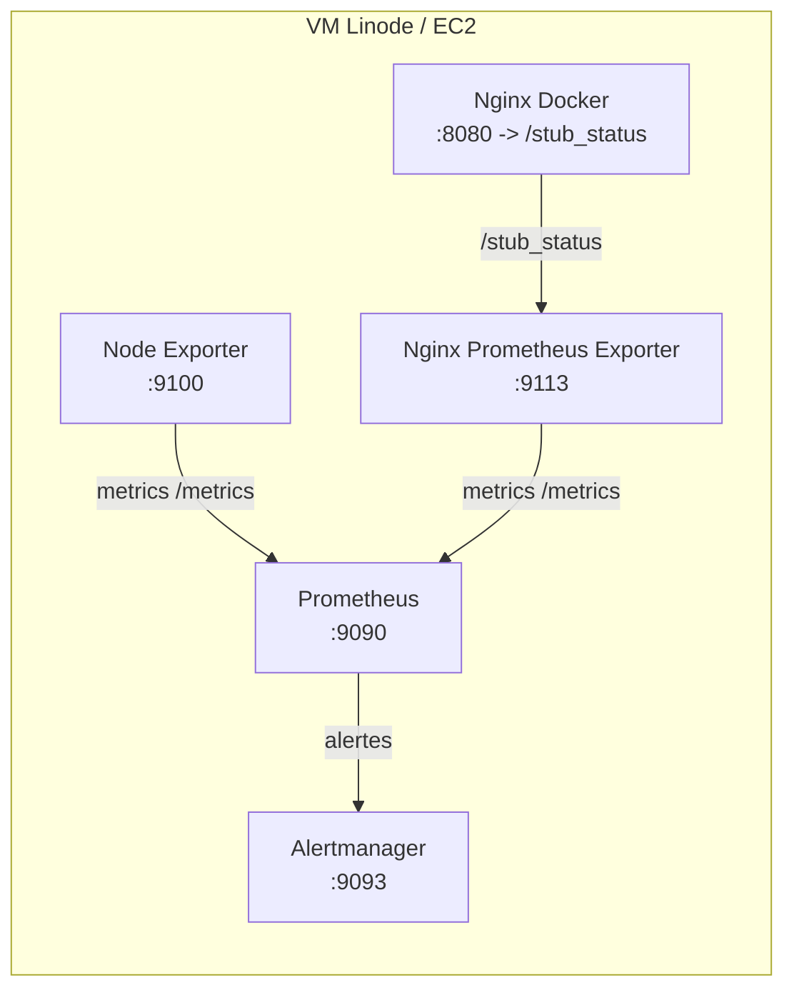
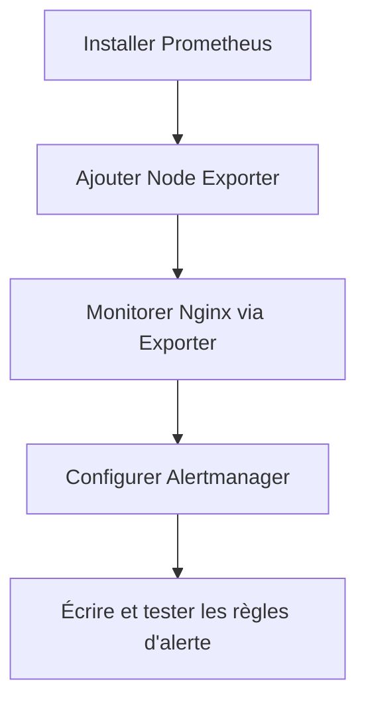

# 📡 Prometheus — Pratiques complètes (1 → 4)

On va transformer tout ce que tu as fait en **fiche pratique claire et rejouable** :  
installation de Prometheus, ajout de Node Exporter, supervision de Nginx via exporter, puis Alertmanager + alertes.  

Je garde la structure de tes autres pratiques : **Objectif → Architecture → Étapes détaillées → Vérifications → Explications**. :contentReference[oaicite:0]{index=0}  
Et j’ajoute quelques **diagrammes mermaid** comme prévu dans ton projet de cours. :contentReference[oaicite:1]{index=1}  

---

## 🧠 1. Vue d’ensemble des 4 pratiques

### 🎯 Objectif global

À la fin de ces 4 pratiques, tu sais :

- Installer **Prometheus** à partir du binaire.
- Ajouter un **Node Exporter** pour monitorer la VM (CPU, RAM, disque, réseau).
- Monitorer **Nginx** via `nginx-prometheus-exporter`.
- Déployer **Alertmanager** et écrire des **règles d’alertes** (Nginx down, disque > 80%).

### 🏗 Architecture globale


---

## 🟢 Pratique 1 – Installation & découverte de Prometheus

### 🎯 Objectif

- Installer Prometheus sur une VM Debian.
- Comprendre **comment il s’exécute** (binaire + config).
- Explorer **/metrics**, **/targets** et la console **PromQL**.

### 🛠 Préparation de l’environnement

- VM Debian 12 (Linode ou EC2).
- Ports ouverts dans le **Security Group** / firewall :
    - TCP **22** : SSH
    - TCP **9090** : interface Prometheus

### 🧱 Étape 1 — Télécharger et extraire Prometheus

```bash
wget https://github.com/prometheus/prometheus/releases/download/v3.7.3/prometheus-3.7.3.linux-amd64.tar.gz
tar xvf prometheus-3.7.3.linux-amd64.tar.gz
cd prometheus-3.7.3.linux-amd64

```

**Explications :**

- `wget URL` : télécharge l’archive du binaire.
- `tar xvf` :
    - **x** : eXtract (extraire),
    - **v** : verbose (affiche les fichiers),
    - **f** : file (prend le fichier donné).
- `cd prometheus-...` : tu rentres dans le dossier qui contient :
    - le binaire `prometheus`,
    - le binaire `promtool`,
    - la config `prometheus.yml` (exemple).

### 🧱 Étape 2 — Lancer Prometheus

```bash
./prometheus --config.file=prometheus.yml

```

- `./prometheus` : exécute le binaire **dans le répertoire courant**.
- `-config.file=` : indique explicitement **quel fichier YAML** utiliser.

👉 En l’état, Prometheus tourne **en foreground** : si tu fermes le terminal, il s’arrête.

### Le lancer en arrière-plan (simple)

```bash
./prometheus --config.file=prometheus.yml &

```

- Le `&` indique au shell de lancer la commande **en tâche de fond** :
    - tu récupères ta main,
    - mais le process continue de tourner tant que la session n’est pas détruite (ou que tu ne le `pkill`).

> Plus propre pour la prod : créer un service systemd, mais pour la pratique, le & suffit.
> 

### 🧱 Étape 3 — Accès à l’interface web

Depuis ton navigateur :

- `http://<IP_PUBLIC>:9090` → interface Prometheus
- `http://<IP_PUBLIC>:9090/metrics` → toutes les **métriques internes** de Prometheus
- `http://<IP_PUBLIC>:9090/targets` → liste des **cibles surveillées**

Par défaut, tu vois un seul job :

```yaml
scrape_configs:
  - job_name: "prometheus"
    static_configs:
      - targets: ["localhost:9090"]

```

👉 Ça veut dire : **Prometheus se scrute lui-même.**

### 🧪 Étape 4 — Premières requêtes PromQL

Dans l’onglet **Graph → Console** :

### 1. Nombre total de requêtes HTTP

```
prometheus_http_requests_total

```

- Métrique en **compteur cumulatif** (`_total`).
- Avec des labels : `handler`, `code`, etc.

Pour **voir uniquement les requêtes sur /metrics** :

```
prometheus_http_requests_total{handler="/metrics"}

```

Actualise `/metrics` plusieurs fois dans ton navigateur, puis relance la requête : le compteur **augmente**.

### 2. Timestamp de démarrage du processus Prometheus

```
process_start_time_seconds

```

- Valeur = timestamp Unix (secondes depuis 1970).
- Tu peux convertir en date avec un outil externe, ou comparer avec `time()`.

---

## 🔵 Pratique 2 – Node Exporter & metrics système

### 🎯 Objectif

- Exposer des métriques **système** (CPU, RAM, disque, réseau).
- Lancer Node Exporter en Docker.
- Ajouter un **job** dans Prometheus (`node`).

### 🧱 Étape 1 — Installer Docker

```bash
sudo apt update
sudo apt install docker.io

```

Vérifier :

```bash
docker --version

```

### 🧱 Étape 2 — Lancer Node Exporter en mode host

```bash
docker run -d \
  --net="host" \
  --pid="host" \
  -v "/:/host:ro,rslave" \
  quay.io/prometheus/node-exporter:latest \
  --path.rootfs=/host

```

**Décomposition :**

- `d` : **detached** (arrière-plan).
- `-net="host"` :
    - le conteneur partage le **réseau de la machine hôte**,
    - pas besoin de `p 9100:9100`,
    - Node Exporter écoute directement sur `:9100` de la VM.
- `-pid="host"` :
    - partage l’**espace de PID** avec l’host,
    - permet de voir les process système.
- `v "/:/host:ro,rslave"` :
    - monte la **racine /** de la VM dans `/host` dans le conteneur,
    - **ro** : read-only (sécurité),
    - `rslave` : mode de propagation des montages.
- `-path.rootfs=/host` :
    - dit à Node Exporter de considérer `/host` comme racine,
    - il va lire les fichiers `/host/proc`, `/host/sys`, etc.,
    - ce qui équivaut à `/proc`, `/sys` de la VM.

👉 URL de Node Exporter : `http://<IP_PUBLIC>:9100/metrics`

### 🧱 Étape 3 — Ajouter le job `node` à Prometheus

Dans `prometheus.yml` :

```yaml
scrape_configs:
  - job_name: "prometheus"
    static_configs:
      - targets: ["localhost:9090"]
        labels:
          app: "prometheus"

  - job_name: "node"
    static_configs:
      - targets: ["localhost:9100"]
        labels:
          app: "node"

```

- `job_name` : nom logique (visible dans Prometheus).
- `static_configs` : liste de targets à scrapper.
- `labels` : tags supplémentaires (ici `app=node`).

> Important : comme tu utilises --net=host, le target est bien localhost:9100.
> 

Redémarre Prometheus (si lancé en binaire) :

```bash
ps aux | grep prometheus
sudo pkill prometheus

cd /chemin/vers/prometheus-3.7.3.linux-amd64
./prometheus --config.file=prometheus.yml &

```

Vérifie dans **Status → Targets** : le job **node** doit être **UP**.

### 🧪 Étape 4 — Requêtes PromQL utiles

### 1. RAM totale (bytes)

```
node_memory_MemTotal_bytes

```

### 2. RAM libre (bytes)

```
node_memory_MemFree_bytes

```

Tu peux calculer la **RAM utilisée** :

```
node_memory_MemTotal_bytes - node_memory_MemFree_bytes

```

### 3. Nombre de cœurs CPU

```
count(node_cpu_seconds_total{mode="idle"})

```

- `node_cpu_seconds_total` : cumul de temps CPU.
- `mode="idle"` : on ne garde que les lignes en mode **idle**.
- `count(...)` : nombre de séries → **nombre de cœurs**.

Vérifie avec la commande :

```bash
nproc

```

### 4. Trafic réseau transmis (bytes/s, moyenne 5min) sur `ens5`

```
rate(node_network_transmit_bytes_total{device="ens5"}[5m])

```

- `rate()` : taux de variation par seconde.
- `[5m]` : fenêtre de 5 minutes.

---

## 🟠 Pratique 3 – Monitoring de Nginx via Exporter

### 🎯 Objectif

- Lancer un **Nginx** dans Docker.
- Activer la page de statut `/stub_status`.
- Lancer `nginx-prometheus-exporter`.
- Ajouter un job `nginx` dans Prometheus.

### 🧱 Étape 1 — Conteneur Nginx

```bash
docker run -d -p 8080:80 --name nginx-server nginx

```

- `p 8080:80` : mappe le port **80 du conteneur** sur **8080 de la VM**.
- Test :

```bash
curl http://localhost:8080

```

Tu dois voir la page d’accueil Nginx.

### 🧱 Étape 2 — Entrer dans le conteneur + config /stub_status

Liste des conteneurs :

```bash
docker ps

```

Puis :

```bash
docker exec -it b6b24264d981 bash   # ou sh selon l’image

```

Pas de `nano` ni `vi` → tu as utilisé un **here-doc** depuis l’host (très bien 👍) :

```bash
cat > /etc/nginx/conf.d/default.conf << 'EOF'
server {
    listen       80;
    listen  [::]:80;
    server_name  localhost;

    # Page web par défaut
    location / {
        root   /usr/share/nginx/html;
        index  index.html index.htm;
    }

    # Page de statut Nginx pour l’exporter Prometheus
    location /stub_status {
        stub_status;
        access_log off;
    }

    error_page   500 502 503 504  /50x.html;
    location = /50x.html {
        root   /usr/share/nginx/html;
    }
}
EOF

```

**Explications importantes :**

- `location /stub_status` : nouvelle route HTTP.
- `stub_status;` :
    - active le module **ngx_http_stub_status_module**,
    - expose des infos comme :
        - connexions actives,
        - requêtes traitées…
- `access_log off` : évite de polluer les logs.

Vérifie la config Nginx :

```bash
nginx -t

```

Recharge :

```bash
nginx -s reload

```

Si tu préfères, tu peux aussi :

```bash
exit
docker restart b6b24264d981

```

Teste :

```bash
curl http://localhost:8080/stub_status

```

Tu dois voir quelque chose comme :

```
Active connections: 1
server accepts handled requests
 2 2 2
Reading: 0 Writing: 1 Waiting: 0

```

### 🧱 Étape 3 — Lancer Nginx Prometheus Exporter

Tu as d’abord essayé :

```bash
docker run -d -p 9113:9113 \
  nginx/nginx-prometheus-exporter:0.10.0 \
  -nginx.scrape-uri=http://15.188.63.66:8080/stub_status

```

Problèmes possibles :

- L’IP publique (15.188.x.x) **ne répond pas** depuis le conteneur (routage, firewall, SG).
- Le port 8080 est bloqué depuis l’extérieur.

Tu as ensuite trouvé la bonne solution :

```bash
docker run -d --name nginx-exporter \
  --network host \
  nginx/nginx-prometheus-exporter:0.10.0 \
  -nginx.scrape-uri=http://localhost:8080/stub_status

```

**Pourquoi ça marche mieux :**

- `-network host` :
    - le conteneur partage directement le réseau de la VM,
    - `localhost:8080` **depuis le conteneur** = `localhost:8080` de la VM.
- `nginx.scrape-uri=...` :
    - URL que l’exporter va appeler pour récupérer les stats Nginx,
    - doit pointer vers la route `/stub_status`.

Vérifie l’exporter :

```bash
curl http://localhost:9113/metrics

```

### 🧱 Étape 4 — Ajouter le job Nginx à Prometheus

Dans `prometheus.yml` :

```yaml
scrape_configs:
  - job_name: "prometheus"
    static_configs:
      - targets: ["localhost:9090"]
        labels:
          app: "prometheus"

  - job_name: "node"
    static_configs:
      - targets: ["localhost:9100"]
        labels:
          app: "node"

  - job_name: "nginx"
    static_configs:
      - targets: ["localhost:9113"]
        labels:
          app: "nginx"

```

Redémarre Prometheus, puis vérifie dans **Status → Targets** : `job="nginx"` doit être **UP**.

### 🧪 Étape 5 — Requêtes PromQL Nginx

- **Statut du serveur Nginx** (up / down) :

```
nginx_up

```

1 = OK, 0 = problème.

- **Nombre total de requêtes HTTP** :

```
nginx_http_requests_total

```

- **Connexions actives** :

```
nginx_connections_active

```

Tu peux faire un **graph** de `nginx_connections_active` et ouvrir plusieurs onglets / navigateurs en `http://<IP>:8080` pour voir le nombre évoluer.

---

## 🔴 Pratique 4 – Alertmanager & alertes Prometheus

### 🎯 Objectif

- Lancer **Alertmanager** en Docker.
- Déclarer Alertmanager dans `prometheus.yml`.
- Ajouter un fichier `alert.rules.yml`.
- Créer deux alertes :
    - Nginx down > 1 minute,
    - Disque racine > 80%.

### 🧱 Étape 1 — Lancer Alertmanager

Tu as fait :

```bash
docker run -d --name alertmanager \
  -p 127.0.0.1:9093:9093 \
  -v /etc/alertmanager/alertmanager.yml:/etc/alertmanager/alertmanager.yml \
  quay.io/prometheus/alertmanager \
  --config.file=/etc/alertmanager/alertmanager.yml

```

**Explications :**

- `p 127.0.0.1:9093:9093` :
    - expose le port **9093** seulement sur `127.0.0.1` (loopback),
    - donc accessible depuis la VM (et donc par Prometheus) mais **pas** depuis Internet (bon point sécurité 👍).
- `v /etc/alertmanager/alertmanager.yml:/etc/alertmanager/alertmanager.yml` :
    - tu montes ton fichier de config local dans le conteneur.
- `-config.file=` : précise à Alertmanager où est son fichier de config.

Pour la pratique, même sans configuration de **receiver email**, Prometheus doit déjà pouvoir **déclarer** ses alertes vers Alertmanager.

### 🧱 Étape 2 — Lier Prometheus à Alertmanager

Dans `prometheus.yml`, tu as ajouté :

```yaml
alerting:
  alertmanagers:
    - static_configs:
        - targets: ["localhost:9093"]

```

✔ C’est ce qui indique à Prometheus **où envoyer** les alertes.

---

### 🧱 Étape 3 — Créer les règles d’alerte

Tu as créé `alert.rules.yml` :

```yaml
groups:
  - name: Nginx indispo
    rules:
      - alert: NginxDown
        expr: up{job="nginx"} == 0
        for: 2m
        labels:
          severity: critical
        annotations:
          summary: "Nginx indisponible sur {{ $labels.instance }}"
          description: Le job Nginx ne répond plus depuis plus de 2 minutes.

      - alert: DiskAlmostFull
        expr: (
          1 -
          (1 - (node_filesystem_avail_bytes{mountpoint="/"} / node_filesystem_size_bytes{mountpoint="/"})) < 0.2
        for: 5m
        labels:
          severity: warning
        annotations:
          summary: "Espace disque supérieur à 80% sur {{ $labels.instance }} ({{ $labels.mountpoint }})"
          description: Le système de fichiers utilise plus de 80% de sa capacité.

```

👉 Il y a deux soucis typiques qui expliquent pourquoi **les alertes restent “Inactives”** :

1. **Le fichier de règles n’est pas chargé** par Prometheus.
2. L’expression, notamment pour `DiskAlmostFull`, est incorrecte (syntaxe + logique).

### 3.1. Charger le fichier de règles dans `prometheus.yml`

Ajoute (au même niveau que `scrape_configs`) :

```yaml
rule_files:
  - "alert.rules.yml"

```

Ou un chemin complet, selon l’emplacement du fichier.

Sans ce bloc, Prometheus **voit** zéro règle → onglet “Alerts” vide ou règles affichées mais jamais évaluées si tu as un mauvais chemin.

### 3.2. Corriger l’expression de disque

Tu veux : **“plus de 80% utilisé”**, donc :

```
1 - (avail / size) > 0.8

```

Une version plus propre :

```yaml
      - alert: DiskAlmostFull
        expr: (
          1 - (node_filesystem_avail_bytes{mountpoint="/"}
               / node_filesystem_size_bytes{mountpoint="/"})
        ) > 0.8
        for: 5m
        labels:
          severity: warning
        annotations:
          summary: "Espace disque > 80% sur {{ $labels.instance }} ({{ $labels.mountpoint }})"
          description: "Le système de fichiers utilise plus de 80% de sa capacité."

```

Tu peux aussi filtrer les filesystems temporaires (optionnel) :

```
1 - (node_filesystem_avail_bytes{mountpoint="/", fstype!~"tmpfs|overlay"}
     / node_filesystem_size_bytes{mountpoint="/", fstype!~"tmpfs|overlay"}) > 0.8

```

---

### 🧪 Étape 4 — Tester les alertes

1. **Redémarre Prometheus** (pour prendre en compte `rule_files`).
2. Va dans **Status → Rules** : vérifie que tes règles apparaissent.
3. Dans l’onglet **Alerts** :
    - état potentiel :
        - `inactive` : condition pas vraie,
        - `pending` : condition vraie mais période `for` pas encore atteinte,
        - `firing` : condition vraie depuis au moins `for`.

### 4.1. Tester NginxDown

- Arrête Nginx (le conteneur) :

```bash
docker stop nginx-server

```

- Dans la console Prometheus :

```
up{job="nginx"}

```

Tu dois voir `0`.

- Patiente plus que la durée du `for` (ici **2 minutes**).
- Retourne dans l’onglet **Alerts** :
    - `NginxDown` passe normalement en **FIRING**.

### 4.2. Tester DiskAlmostFull

Simule un disque plein :

```bash
fallocate -l 10G /tmp/fake_file

```

→ reviens ensuite dans Prometheus, vérifie l’expression :

```
1 - (node_filesystem_avail_bytes{mountpoint="/"}
     / node_filesystem_size_bytes{mountpoint="/"})

```

Tu dois voir une valeur > 0.8 pour certains systèmes de fichiers si ton disque est vraiment rempli.

> Si l’alerte ne “fire” pas :
> 
> - vérifie que le **mountpoint** match bien `/`,
> - adapte éventuellement le filtre sur `fstype`,
> - vérifie dans **Status → Targets** que job `node` est UP.

---

## 🔍 5. Résumé & checklist de reproduction



### 🔁 Checklist rapide

- [ ]  Prometheus téléchargé et lancé avec `-config.file`.
- [ ]  Port 9090 ouvert (Security Group / firewall).
- [ ]  Node Exporter lancé en Docker (host network).
- [ ]  `prometheus.yml` :
    - [ ]  job `prometheus`,
    - [ ]  job `node`,
    - [ ]  job `nginx`,
    - [ ]  bloc `alerting` → `alertmanagers`,
    - [ ]  bloc `rule_files` → `alert.rules.yml`.
- [ ]  Nginx en Docker + `/stub_status` activé.
- [ ]  `nginx-prometheus-exporter` lancé avec la bonne `nginx.scrape-uri`.
- [ ]  Alertmanager lancé et écoute sur `localhost:9093`.
- [ ]  `alert.rules.yml` :
    - [ ]  `NginxDown` avec `up{job="nginx"} == 0` et `for: 1m` (ou 2m),
    - [ ]  `DiskAlmostFull` avec `1 - avail/size > 0.8`.
- [ ]  Arrêt de Nginx → alerte `NginxDown` passe en **FIRING** après le délai.
- [ ]  Optionnel : `fallocate` pour tester le disque.

---
[← Module précédent](M36_prometheus.md)
---
