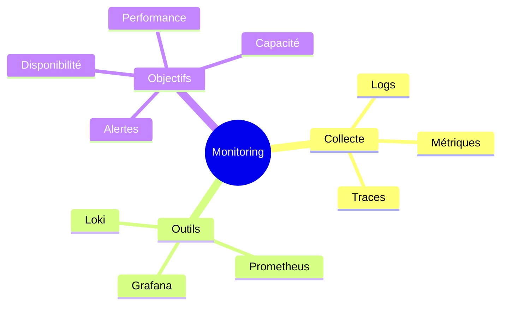
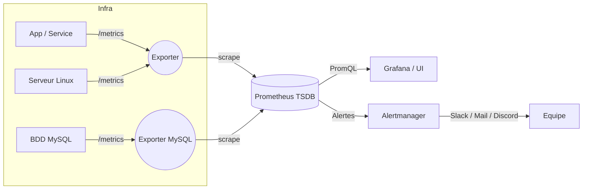

# 🧠 Prometheus – Collecter, analyser et alerter sur tes métriques

---

## 1. Objectifs du cours 🎯

À la fin de ce module, tu seras capable de :

- Expliquer **le rôle de Prometheus** dans une stack de monitoring moderne (collecte → stockage → requêtes → alertes).
- Installer et lancer Prometheus sur :
    - **Debian / Ubuntu**
    - **Windows** (et comprendre l’intérêt de WSL / Linux pour la prod)
    - **Docker**
- Configurer les **exporters** (node_exporter, Windows exporter, exporters BDD, services custom).
- Lire et modifier le fichier `prometheus.yml` (scrape_configs, jobs, targets, labels).
- Utiliser **PromQL** pour :
    - lire des métriques simples,
    - faire des agrégations,
    - calculer des taux et des moyennes,
    - différencier **instant queries** et **range queries**.
- Mettre en place des **règles d’alerting** et comprendre le rôle de **Alertmanager**.
- Connecter Prometheus à **Grafana** pour la visualisation.

---

## 2. Contexte : pourquoi un outil comme Prometheus ?

Tu es DevOps dans une boîte avec :

- un **reverse proxy** (Nginx / Traefik),
- plusieurs **microservices**,
- une ou plusieurs **BDD** (MySQL, PostgreSQL…),
- des **queues** (RabbitMQ, Kafka),
- des **outils de logs** (ELK, Loki, etc.).

Chacun génère des **métriques** (CPU, latence, erreurs, connexions, requêtes SQL…), dans des **formats différents** et souvent **non centralisés**.

Sans outil dédié :

- tu vas chercher des info dans 10 dashboards différents,
- tu fais des exports CSV / Excel,
- tu perds du temps et tu ne vois pas les **tendances**.

👉 Le monitoring devient un bloc à part entière dans le rôle du DevOps.

### 2.1 Vue d’ensemble (carte mentale)



**Prometheus** se place clairement dans la branche **Métriques** : c’est un système qui **scrape** des endpoints, stocke les données en **séries temporelles**, et expose une API + un langage de requêtes (**PromQL**). :contentReference[oaicite:1]{index=1}

---

## 3. Architecture et vocabulaire Prometheus

### 3.1 Schéma global



**Rôles :**

- **Exporter** : petit programme qui expose un endpoint HTTP `/metrics` au format Prometheus.
- **Prometheus** :
  - interroge régulièrement (`scrape`) les exporters,
  - stocke les données dans une **TSDB** (Time Series DataBase),
  - expose une API HTTP + une UI simple.
- **Grafana** : se connecte à Prometheus pour faire de beaux dashboards.
- **Alertmanager** : reçoit les alertes de Prometheus et les envoie vers Slack, email, etc.

### 3.2 Vocabulaire de base

- **Target** : une adresse scrappée (ex : `node-exporter:9100`).
- **Job** : regroupement logique de targets (ex : tous les `node_exporter` du cluster).
- **Sample** : un point de donnée unique (timestamp + valeur).
- **Time series** : une métrique (nom + labels) au fil du temps.
- **Label** : clé/valeur qui enrichit une métrique (ex : `instance`, `job`, `status`).

---

## 4. Modèle de données : métriques & labels

Une **série temporelle** Prometheus est définie par :

```text
<metric_name>{label1="val1", label2="val2", ...}  valeur  timestamp

```

Exemples :

```
http_requests_total{job="frontend", method="GET", status="200"}  15432  1718373200
node_cpu_seconds_total{instance="app-01", mode="idle"}          12345  1718373200

```

### 4.1 Types de métriques

- **Counter**
    - Toujours croissant (sauf reset).
    - Exemple : `http_requests_total`, `process_start_time_seconds`.
    - Utilisation : taux (`rate()` / `irate()`), erreurs dans les X dernières minutes.
- **Gauge**
    - Monte et descend.
    - Exemple : `node_memory_Active_bytes`, `temperature_celsius`.
    - Utilisation : valeur actuelle (RAM, charge, etc.).
- **Histogram**
    - Compte combien de requêtes tombent dans des **buckets** de latence.
    - Exemple : `http_request_duration_seconds_bucket`.
    - Utilisation : `histogram_quantile()` pour des p90, p95, p99.
- **Summary**
    - Similaire à Histogram, mais calcule localement des quantiles.
    - Moins souvent utilisé en prod moderne (histogram + `histogram_quantile` souvent préférés).

---

## 5. Installation de Prometheus

### 5.1 Méthode “propre” : binaires officiels (Linux)

Prometheus fournit des binaires précompilés pour Linux, Windows, etc. [prometheus.io](https://prometheus.io/download/?utm_source=chatgpt.com)

1. **Téléchargement**

```bash
cd /tmp
wget https://github.com/prometheus/prometheus/releases/latest/download/prometheus-*-linux-amd64.tar.gz
tar xvf prometheus-*-linux-amd64.tar.gz
cd prometheus-*-linux-amd64

```

Tu obtiens :

- `prometheus` (binaire),
- `promtool` (outil de validation),
- des fichiers d’exemple (`prometheus.yml`, consoles…).
1. **Création d’un utilisateur système**

```bash
sudo useradd --no-create-home --shell /usr/sbin/nologin prometheus
sudo mkdir -p /etc/prometheus /var/lib/prometheus

sudo chown prometheus:prometheus /etc/prometheus /var/lib/prometheus

```

1. **Copier les binaires et la config**

```bash
sudo cp prometheus promtool /usr/local/bin/
sudo chown prometheus:prometheus /usr/local/bin/prometheus /usr/local/bin/promtool

sudo cp -r consoles console_libraries /etc/prometheus/
sudo cp prometheus.yml /etc/prometheus/prometheus.yml
sudo chown -R prometheus:prometheus /etc/prometheus

```

1. **Service systemd**

`/etc/systemd/system/prometheus.service` :

```
[Unit]
Description=Prometheus Monitoring
Wants=network-online.target
After=network-online.target

[Service]
User=prometheus
Group=prometheus
Type=simple
ExecStart=/usr/local/bin/prometheus \
  --config.file=/etc/prometheus/prometheus.yml \
  --storage.tsdb.path=/var/lib/prometheus \
  --web.listen-address=0.0.0.0:9090 \
  --storage.tsdb.retention.time=15d

Restart=on-failure

[Install]
WantedBy=multi-user.target

```

**Options importantes expliquées :**

- `-config.file` : chemin du fichier de config principal.
- `-storage.tsdb.path` : dossier où la TSDB va stocker les données.
- `-web.listen-address` : IP:port d’écoute HTTP (par défaut `:9090`).
- `-storage.tsdb.retention.time` : durée de conservation des données (15 jours ici).
1. **Activer et démarrer**

```bash
sudo systemctl daemon-reload
sudo systemctl enable prometheus
sudo systemctl start prometheus
sudo systemctl status prometheus

```

Puis, depuis ton navigateur : http://<ip_serveur>:9090

---

### 5.2 Installation via apt (Debian / Ubuntu)

Les dépôts Debian/Ubuntu proposent souvent un paquet `prometheus`, au prix d’une version parfois un peu en retard.

```bash
sudo apt update
sudo apt install prometheus

```

En général, ça installe :

- le service `prometheus` (systemd),
- un fichier de config `/etc/prometheus/prometheus.yml`,
- les données sous `/var/lib/prometheus`.

Tu peux vérifier :

```bash
systemctl status prometheus

```

⚠️ **Attention :** les chemins/nom de service peuvent varier selon la distribution. L’approche **binaire officiel** reste la plus portable.

---

### 5.3 Installation sur Windows

Prometheus tourne nativement sous Windows. Les grandes étapes sont :

1. Aller sur la page de **download** officielle. [prometheus.io+1](https://prometheus.io/download/?utm_source=chatgpt.com)
2. Télécharger le `.zip` pour Windows (`prometheus-*-windows-amd64.zip`).
3. Extraire dans un répertoire, par exemple : `C:\Prometheus`.
4. Lancer Prometheus depuis PowerShell :

```powershell
cd C:\Prometheus
.\prometheus.exe --config.file=prometheus.yml --storage.tsdb.path=data

```

Tu accéderas ensuite à l’UI via : `http://localhost:9090`.

Pour en faire un **service Windows** :

- soit tu passes par un outil comme **NSSM** (Non-Sucking Service Manager) [Medium](https://medium.com/%40pinaki.pm/installing-grafana-and-prometheus-on-windows-10-system-f55d67eb356c?utm_source=chatgpt.com)
- soit tu utilises un service wrapper similaire.

💡 **Bon réflexe DevOps :**

En prod, tu auras rarement Prometheus sur Windows. Tu préféreras :

- soit une VM Linux,
- soit un conteneur Docker,
- soit Kubernetes.

Sur Windows “desktop”, tu peux aussi simplement utiliser **WSL2 + Linux** et installer Prometheus comme sur Debian.

---

### 5.4 Installation via Docker

Les images officielles sont disponibles sur Docker Hub. [prometheus.io](https://prometheus.io/docs/prometheus/latest/installation/?utm_source=chatgpt.com)

```bash
docker volume create prometheus-data

docker run -d \
  --name prometheus \
  -p 9090:9090 \
  -v /path/to/prometheus.yml:/etc/prometheus/prometheus.yml \
  -v prometheus-data:/prometheus \
  prom/prometheus

```

- `p 9090:9090` : expose l’interface web.
- `v /path/to/prometheus.yml:/etc/prometheus/prometheus.yml` : injecte ta config.
- `v prometheus-data:/prometheus` : persiste les données dans un volume Docker.

---

## 6. Exporters : relier Prometheus à tes systèmes

### 6.1 Principe

Un **exporter** :

- se connecte à une source (OS, BDD, serveur HTTP…),
- expose un endpoint HTTP, souvent `/metrics`,
- au format texte “Prometheus”.

**Prometheus** ne “pousse” pas les métriques, il les **récupère** (pull) via ces endpoints.

### 6.2 Node Exporter (Linux)

Installé sur tes serveurs Linux, il expose des métriques système :

- CPU, RAM, disque, réseau,
- nombre de process, load average…

**Version binaire simple :**

```bash
cd /tmp
wget https://github.com/prometheus/node_exporter/releases/latest/download/node_exporter-*-linux-amd64.tar.gz
tar xvf node_exporter-*-linux-amd64.tar.gz
cd node_exporter-*-linux-amd64
./node_exporter

```

Par défaut, il écoute sur `:9100` → http://<ip_serveur>:9100/metrics

Tu feras ensuite une entrée `scrape_configs` côté Prometheus (section 7).

### 6.3 Windows Exporter

Sur Windows, tu peux utiliser le **Windows exporter** (anciennement *WMI exporter*), installable par exemple via Chocolatey. [Chocolatey Software+1](https://community.chocolatey.org/packages/prometheus-windows-exporter.install?utm_source=chatgpt.com)

```powershell
choco install prometheus-windows-exporter.install -y

```

Il expose aussi des métriques système, typiquement sur `http://<host>:9182/metrics`.

### 6.4 Exporters BDD / services

Exemples :

- **MySQL / MariaDB** exporter,
- **Postgres** exporter,
- **Redis** exporter,
- **Nginx / Apache** exporters spécifiques,
- Exporters pour **applications custom** via libs client (Python, Go, Java…).

---

## 7. Fichier de configuration `prometheus.yml`

C’est le cœur de la configuration. Structure type :

```yaml
global:
  scrape_interval: 15s     # Fréquence de collecte par défaut
  evaluation_interval: 15s # Fréquence d’évaluation des règles d’alertes

scrape_configs:
  - job_name: "prometheus"
    static_configs:
      - targets: ["localhost:9090"]

```

### 7.1 Bloc `global`

- `scrape_interval` : intervalle par défaut entre deux scrapes (ex : `15s`, `30s`).
- `evaluation_interval` : fréquence à laquelle Prometheus réévalue les règles d’alerting.

Tu peux surcharger ces valeurs par job (option `scrape_interval` dans un job particulier).

### 7.2 `scrape_configs`

Chaque entrée décrit **quoi** et **comment** scrapper.

Exemple avec Prometheus + node_exporter :

```yaml
scrape_configs:
  - job_name: "prometheus"
    static_configs:
      - targets: ["localhost:9090"]

  - job_name: "nodes"
    scrape_interval: 10s
    static_configs:
      - targets:
          - "10.0.0.10:9100"
          - "10.0.0.11:9100"
        labels:
          env: "prod"
          role: "web"

```

Explications :

- `job_name` : nom logique, visible dans le label `job`.
- `static_configs.targets` : liste de targets (host:port).
- `labels` : labels ajoutés automatiquement à toutes les métriques de ces targets.

💡 D’autres mécanismes existent (service discovery Kubernetes, Consul, EC2…), mais on reste sur **static_configs** dans ce cours.

---

## 8. Commandes de base & options importantes

### 8.1 Lancer Prometheus à la main (Linux / WSL / Windows)

```bash
prometheus \
  --config.file=/etc/prometheus/prometheus.yml \
  --storage.tsdb.path=/var/lib/prometheus \
  --web.listen-address=0.0.0.0:9090 \
  --storage.tsdb.retention.time=30d \
  --web.enable-lifecycle

```

**Options clés :**

- `-config.file` : chemin de config (peut être un `prometheus.yml` custom pour des tests).
- `-storage.tsdb.path` : dossier des données.
- `-storage.tsdb.retention.time` :
    - durée de rétention (ex : `30d`, `15d`, `720h`),
    - impacte la **taille disque**.
- `-web.listen-address` :
    - `0.0.0.0:9090` → écoute sur toutes les interfaces,
    - `127.0.0.1:9090` → accessible uniquement en local.
- `-web.enable-lifecycle` :
    - autorise des appels `/-/reload` via HTTP pour recharger la config sans restart.

### 8.2 `promtool` – vérifier la config

Outil compagnon très utile :

```bash
promtool check config /etc/prometheus/prometheus.yml

```

- Vérifie la **syntaxe** du YAML,
- Vérifie la validité des **règles d’alerting**,
- Permet d’éviter un crash au démarrage à cause d’une faute.

Tu peux aussi l’utiliser pour tester des règles d’alertes sur des fichiers de samples, mais c’est plus avancé.

---

## 9. Types de requêtes PromQL

Prometheus propose plusieurs “types” de données manipulables dans PromQL :

- **Instant vector** : ensemble de séries, chacune avec **une seule valeur**, à un instant donné.
- **Range vector** : ensemble de séries, chacune avec un **intervalle temporel** (fenêtre).
- **Scalar** : un nombre simple (ex : résultat d’un `count()`).
- **String** : peu utilisé dans le quotidien.

### 9.1 Sélecteurs simples (instant vector)

```
http_requests_total
http_requests_total{job="frontend"}
http_requests_total{job="frontend", status="500"}

```

Tu peux **filtrer** les labels avec :

- `=` : égal,
- `!=` : différent,
- `=~` : regex qui matche,
- `!~` : regex qui ne matche pas.

Exemple :

```
http_requests_total{status=~"5.."}

```

→ Toutes les métriques où le label `status` commence par `5` (erreurs 5xx).

### 9.2 Range vector

On ajoute `[durée]` après le sélecteur :

```
http_requests_total{job="frontend"}[5m]
node_cpu_seconds_total{instance="app-01"}[1h]

```

Durée possible : `s`, `m`, `h`, `d`, `w`, `y`.

Les **fonctions temporelles** (rate, increase, etc.) s’appliquent sur des **range vectors**.

### 9.3 Fonctions courantes

### `rate()` – taux moyen par seconde

```
rate(http_requests_total[5m])

```

- Prend un **counter**,
- calcule le **taux de croissance par seconde** sur les 5 dernières minutes.

Tu peux ensuite agréger :

```
sum(rate(http_requests_total[5m]))
sum(rate(http_requests_total[5m])) by (status)

```

### `irate()` – taux instantané

```
irate(http_requests_total[1m])

```

- Se base sur les **deux derniers points** du range,
- plus “réactif”, mais plus “bruyant”.

### `increase()` – augmentation sur une période

```
increase(http_requests_total{status="500"}[15m])

```

→ Nombre d’erreurs 500 dans les 15 dernières minutes.

### 9.4 Agrégations

Agrégateurs principaux :

- `sum(...)` : somme,
- `avg(...)` : moyenne,
- `max(...)`, `min(...)`,
- `count(...)`,
- `topk(k, metric)`, `bottomk(k, metric)`.

Exemples :

```
# CPU total sur tous les cœurs
sum(rate(node_cpu_seconds_total{mode!="idle"}[5m])) by (instance)

# Top 5 instances par nombre d'erreurs
topk(5, rate(http_requests_total{status=~"5.."}[5m]))

```

### 9.5 Opérateurs

Tu peux **combiner** des expressions :

- arithmétiques : `+`, , , `/`, `%`, `^`
- comparaisons : `==`, `!=`, `>`, `<`, `>=`, `<=`
- booléens : `and`, `or`, `unless`

Exemple : **ratio d’erreurs** :

```
sum(rate(http_requests_total{status=~"5.."}[5m]))
/
sum(rate(http_requests_total[5m]))

```

→ Pourcentage d’erreurs 5xx (tu peux multiplier par 100).

---

## 10. Quelques requêtes type (avec explication)

### 10.1 Nombre de requêtes HTTP par seconde

```
sum(rate(http_requests_total[5m]))

```

- `http_requests_total` : compteur global.
- `rate(...[5m])` : taux par seconde.
- `sum(...)` : somme sur toutes les instances.

### 10.2 Erreurs 500 par seconde, par service

```
sum(rate(http_requests_total{status="500"}[5m])) by (job)

```

- Filtre sur `status="500"`,
- Aggrège par label `job`.

### 10.3 Charge CPU par machine

```
100 * (1 - avg(rate(node_cpu_seconds_total{mode="idle"}[5m])) by (instance))

```

- `node_cpu_seconds_total{mode="idle"}` : temps CPU en idle,
- `1 - idle` → pourcentage d’utilisation,
- `100` → pourcentage.

---

## 11. Visualisation : UI Prometheus & Grafana

### 11.1 UI de Prometheus

Sur `http://<host>:9090` :

- Onglet **Graph** :
    - tu peux saisir des requêtes PromQL,
    - choisir entre :
        - **Graph** (courbe dans le temps),
        - **Console** (valeur instantanée).

Tu peux :

- cliquer sur le bouton **Execute**,
- passer en mode **Table** pour voir les labels,
- zoomer dans la timeline.

### 11.2 Connexion à Grafana (très rapide)

Dans Grafana :

1. **Add data source** → type **Prometheus**.
2. URL : `http://prometheus:9090` (ou `http://localhost:9090`).
3. Sauvegarder & tester.

Ensuite, dans un dashboard :

- tu crées un panel,
- tu saisis une requête PromQL,
- Grafana gère la visualisation (lignes, barres, gauge, tables, etc.). [mkevenaar.github.io](https://mkevenaar.github.io/chocolatey-packages/packages/grafana.install.html?utm_source=chatgpt.com)

---

## 12. Alerting : être prévenu quand ça va mal

Prometheus **évalue des expressions PromQL** selon un `evaluation_interval`. Quand une condition est vraie pendant un certain temps, il **déclenche une alerte** vers **Alertmanager**, qui se charge ensuite de la notification. [prometheus.io](https://prometheus.io/docs/introduction/first_steps/?utm_source=chatgpt.com)

### 12.1 Fichier de règles d’alertes

Exemple `alerts.yml` :

```yaml
groups:
  - name: instances_down
    rules:
      - alert: InstanceDown
        expr: up == 0
        for: 5m
        labels:
          severity: critical
        annotations:
          summary: "Instance {{ $labels.instance }} down"
          description: "La target {{ $labels.instance }} (job {{ $labels.job }}) ne répond plus depuis 5 minutes."

```

- `groups.name` : groupe logique d’alertes.
- `alert` : nom de l’alerte.
- `expr` : expression PromQL.
- `for` : durée pendant laquelle l’expression doit être vraie avant de déclencher l’alerte.
- `labels` : métadonnées (severity, environment…).
- `annotations` : texte d’explication, utilisé dans les messages Slack / mail.

### 12.2 Référence dans `prometheus.yml`

```yaml
rule_files:
  - "/etc/prometheus/alerts.yml"

```

Prometheus chargera ces règles et les évaluera à chaque `evaluation_interval`.

### 12.3 Alertmanager (vue globale)

- Prometheus ne sait **pas** envoyer de Slack/mail directement.
- Il envoie les alertes à un ou plusieurs **Alertmanager**.
- Alertmanager :
    - regroupe (grouping),
    - dé-duplique,
    - gère le silence (silencing),
    - envoie vers :
        - Slack,
        - Email,
        - Webhook (Discord, Teams, n8n, etc.),
        - PagerDuty…

---

## 13. Mini stack complète via Docker Compose (optionnel mais utile)

Petit exemple pour te faire un **atelier** :

```yaml
version: "3.8"

services:
  prometheus:
    image: prom/prometheus
    command:
      - "--config.file=/etc/prometheus/prometheus.yml"
      - "--storage.tsdb.path=/prometheus"
      - "--storage.tsdb.retention.time=15d"
    volumes:
      - ./prometheus.yml:/etc/prometheus/prometheus.yml
      - prometheus-data:/prometheus
    ports:
      - "9090:9090"

  node_exporter:
    image: prom/node-exporter
    ports:
      - "9100:9100"

  grafana:
    image: grafana/grafana
    ports:
      - "3000:3000"
    volumes:
      - grafana-data:/var/lib/grafana

volumes:
  prometheus-data: {}
  grafana-data: {}

```

- Tu ajoutes un job `node_exporter` dans `prometheus.yml`,
- Tu lances `docker compose up -d`,
- Tu as une stack **Prometheus + node_exporter + Grafana** prête à jouer.

---

## 14. Kit de survie Prometheus / PromQL 🧰

### 14.1 Commandes utiles

```bash
# Service
systemctl status prometheus
systemctl restart prometheus

# Vérifier la config
promtool check config /etc/prometheus/prometheus.yml

# Voir les séries (dans l'UI /metrics)
curl http://localhost:9090/metrics

```

### 14.2 Requêtes PromQL “de base”

```
# Toutes les métriques d'un job
{job="prometheus"}

# Taux de requêtes HTTP sur 5 minutes
sum(rate(http_requests_total[5m]))

# Erreurs 500 sur 10 minutes
sum(increase(http_requests_total{status="500"}[10m])) by (job)

# CPU usage par instance
100 * (1 - avg(rate(node_cpu_seconds_total{mode="idle"}[5m])) by (instance))

# Mémoire RAM utilisée (si tu as les métriques)
node_memory_MemTotal_bytes - node_memory_MemAvailable_bytes

```

---

## 15. Résumé – Ce qu’il faut retenir 🧩

- **Prometheus** est un système de **monitoring par métriques** avec :
    - un modèle en **séries temporelles**,
    - un mode de collecte **pull** (scrape),
    - un langage de requêtes **PromQL**,
    - une intégration facile avec **Grafana** et **Alertmanager**.
- Tu sais :
    - l’installer sur **Linux**, **Windows**, **Docker**,
    - configurer des **exporters** (node_exporter, Windows exporter),
    - écrire des **scrape_configs** pour ajouter des targets,
    - utiliser les fonctions PromQL les plus courantes (`rate`, `increase`, `sum`, `avg`…),
    - définir des **règles d’alertes** et les envoyer à Alertmanager.