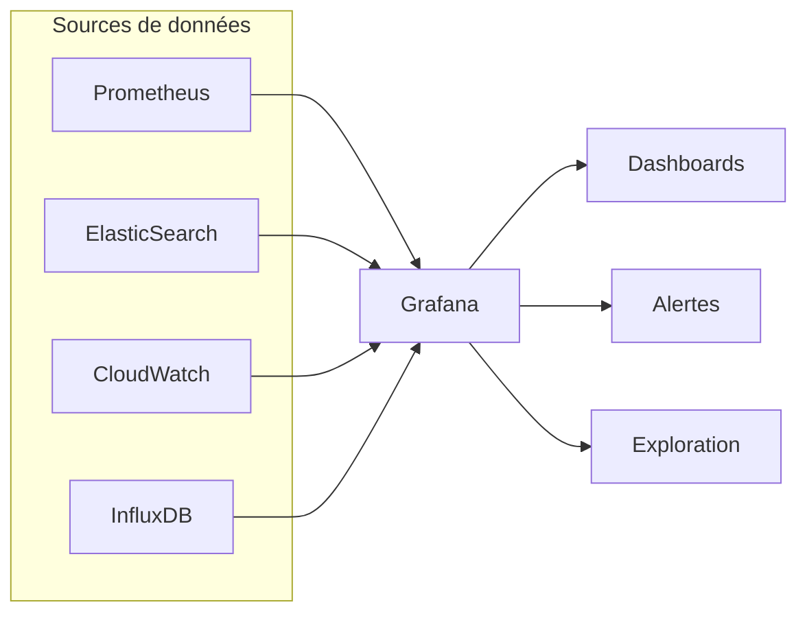
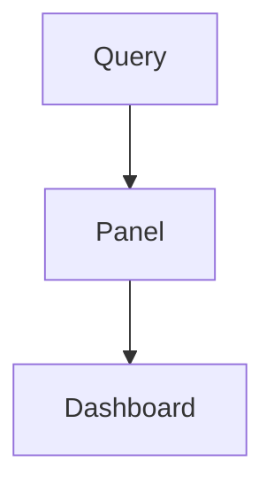
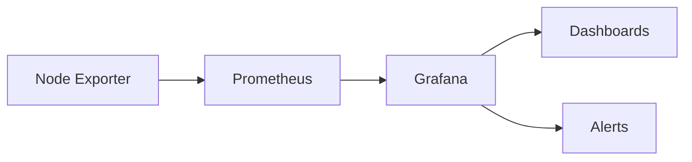

# 📘 **Module : Grafana — Visualisation, Analyse & Automatisation (CLI & API)**

---

# 🎯 Objectifs du cours

À la fin, tu seras capable de :

- 👉 Comprendre le rôle précis de Grafana dans une stack de monitoring.
- 👉 Installer Grafana correctement sur un serveur dédié.
- 👉 Connecter plusieurs datasources (Prometheus, CloudWatch, Elasticsearch…).
- 👉 Construire des dashboards interactifs, filtrables et dynamiques.
- 👉 Utiliser PromQL pour exploiter les métriques dans Grafana.
- 👉 Gérer permissions, dossiers, organisations et alertes avancées.
- 👉 **Utiliser la CLI Grafana pour administrer les plugins**.
- 👉 **Automatiser Grafana via l’API HTTP (datasources, dashboards, alertes, users)**.

---

# 1️⃣ Contexte : Pourquoi Grafana ?

Les systèmes modernes génèrent **énormément de données brutes** : CPU, mémoire, latence, erreurs, charge réseaux…

Ces données sont :

- 🟠 volumineuses
- 🟠 difficiles à lire
- 🟠 impossibles à analyser sans visualisation

Grafana répond à ces problèmes en offrant :

- **Dashboarding multi-source**
- **Exploration en temps réel**
- **Alerting moderne**
- **Analyse graphique**

---

# 2️⃣ Architecture générale


```mermaid
graph LR
  subgraph Sources de données
    A[Prometheus]
    B[ElasticSearch]
    C[CloudWatch]
    D[InfluxDB]
  end

  A --> G[Grafana]
  B --> G
  C --> G
  D --> G

  G --> H[Dashboards]
  G --> I[Alertes]
  G --> J[Exploration]

```

---

# 3️⃣ Installation Grafana (Linux)

### Installation APT :

```bash
sudo apt-get install -y apt-transport-https software-properties-common wget
wget -q -O - https://packages.grafana.com/gpg.key | sudo apt-key add -
echo "deb https://packages.grafana.com/oss/deb stable main" \
  | sudo tee /etc/apt/sources.list.d/grafana.list

sudo apt update
sudo apt install grafana -y
sudo systemctl enable --now grafana-server

```

### Vérification :

```bash
sudo systemctl status grafana-server

```

### Interface :

```
http://<IP>:3000
user: admin
pass: admin

```

### 💡 Bonnes pratiques (prod)

- Mettre Grafana **sur un serveur dédié**
- Activer HTTPS (Nginx + Certbot)
- Séparer Grafana du nœud Prometheus
- Sauvegarder `/var/lib/grafana/` régulièrement

---

# 4️⃣ Concepts fondamentaux

## 4.1 Datasources

Une datasource = une source de données.

Exemples :

| Source | Type |
| --- | --- |
| Prometheus | Time-series |
| MySQL | SQL |
| ElasticSearch | Document store |
| CloudWatch | Cloud metrics |
| Loki | Logs |
| Tempo | Traces |

Dans Grafana :

👉 **Configuration → Datasources → Add**

Tu choisis la source, puis tu ajoutes l’URL, le port, et les credentials.

---

## 4.2 Dashboards

Un **dashboard** est un ensemble de panneaux : grafana utilise une approche modulaire.

Structure :

- ➤ Dossiers
- ➤ Dashboards
- ➤ Panels

Un dashboard contient :

- graphiques temporels
- jauges
- barres
- heatmaps
- tableaux
- alertes
- variables

---

## 4.3 Panels


```mermaid
flowchart TD
    Query-->Panel
    Panel-->Dashboard

```

### Types :

- Time series 📈 (le classique)
- Stat 🧮
- Gauge ⭕
- Table 📋
- Heatmap 🔥
- Bar chart 📊

Chaque panel contient :

- une requête (ex : PromQL)
- une transformation
- une visualisation
- un style

---

# 5️⃣ Construire un Dashboard

### 5.1 Ajouter Prometheus

Dans Grafana :

1. *Configuration → Datasources*
2. *Add datasource*
3. Choisir **Prometheus**
4. Mettre l’URL :
    
    ```
    http://<IP_PROMETHEUS>:9090
    
    ```
    
5. Tester & Save ✔️

### 5.2 PromQL indispensable

Exemple : le total des requêtes HTTP observées par Prometheus

```
prometheus_http_requests_total

```

Exemple : taux de requêtes HTTP sur 5 minutes

```
rate(prometheus_http_requests_total[5m])

```

Exemple : usage mémoire :

```
node_memory_Active_bytes

```

## 💡 Rappel PromQL (logique indispensable)

| Fonction | Rôle |
| --- | --- |
| `rate(metric[5m])` | Taux d’évolution |
| `sum(metric)` | Addition de plusieurs séries |
| `avg(metric)` | Moyenne |
| `max(metric)` | Maximum |
| `by(label)` | Agrégation par label |
| `irate()` | Instantané |
| `topk(n, metric)` | Top N |

---

# 6️⃣ Variables (dashboards dynamiques)

## Étape 1 : Nouveau dashboard

**Dashboards → New → New Dashboard**

## Étape 2 : Ajouter un panel

**Add new panel**

## Étape 3 : Écrire la requête

Exemple CPU :

```
rate(node_cpu_seconds_total{mode!="idle"}[2m])

```

## Étape 4 : Choisir une visualisation

- Time Series
- Bar gauge
- Heatmap
- Table

## Étape 5 : Personnalisation

- Unités (bytes, %…)
- Coloriage (vert, jaune, rouge)
- Titre, description
- Intervalle de temps (panel vs global dashboard)

## Étape 6 : Variables (super important)

Les variables permettent de faire des dashboards dynamiques.

Exemples :

- `$instance`
- `$job`
- `$env`

Tu peux créer une variable :

**Dashboard settings → Variables → Add variable**

Type : **Query**

Source : Prometheus

Exemple :

```
label_values(node_cpu_seconds_total, instance)

```

Tu obtiens un dropdown dans ton dashboard 🎉

---

# 7️⃣ Alerting Grafana (Unified Alerting)

⚠️ Dans les versions modernes, Grafana ne dépend plus d’Alertmanager par défaut.

## 7.1 Composants d’une alerte Grafana

- **Rule** → Condition, expression, fenêtre
- **Contact point** → Slack, Discord, Email…
- **Notification policy** → workflow d’envoi
- **Silences** → pauses

## 7.2 Exemple d’alerte simple (CPU > 80%)

Expression :

```
avg(rate(node_cpu_seconds_total{mode!="idle"}[5m])) > 0.8

```

Fenêtre : 5 minutes

Destination : Slack ou mail

Requête : Datasource Prometheus

---

# 8️⃣ Permissions & Organisation

Grafana fonctionne dans un modèle à **organisation → dossiers → dashboards → permissions**.

### 👤 Rôles utilisateurs

- Viewer (lecture)
- Editor (éditer dashboards)
- Admin (tout)

### 📁 Dossiers

Tu peux créer des dossiers par :

- Environnement (prod, staging, dev)
- Équipe (DevOps, Backend, Infra)
- Projet (S1000D, Gateway, Kubernetes…)

Très utile pour scaler ton organisation.

---

# 9️⃣ Sécurisation (Production)

Quelques règles essentielles :

## 🔒 9.1 Authentification

- Activer login fort
- SSO (OAuth2, Google, GitLab, Azure AD) possible
- Désactiver création automatique de comptes publics

## 🔐 9.2 HTTPS obligatoire

Placer Grafana derrière Nginx ou Traefik :

```
server {
    listen 443 ssl;
    server_name monitor.mondomaine.com;

    location / {
        proxy_pass http://localhost:3000;
    }
}

```

## 🛡 9.3 Restrict IP (optionnel)

Limiter l’accès à Grafana :

Nginx :

```
allow 1.2.3.4;
deny all;

```

---

# 🔟 Intégration complète avec Prometheus


```mermaid
flowchart LR
    A[Node Exporter] --> B[Prometheus]
    B --> C[Grafana]
    C --> D[Dashboards]
    C --> E[Alerts]

```
### Résumé du flux :

1. **Exporters** exposent les métriques
2. **Prometheus** scrape et stocke
3. **Grafana** requête Prometheus
4. Graphique → Panel → Dashboard
5. Alertes déclenchées

---

# 🟦 11. `grafana-cli` — la CLI native Grafana

La CLI officielle existe, mais elle est **limitée aux plugins**.

## 11.1 Vérifier l’installation

```bash
grafana-cli --version

```

## 11.2 Lister les plugins

```bash
grafana-cli plugins list-remote

```

## 11.3 Installer un plugin

```bash
grafana-cli plugins install grafana-clock-panel

```

## 11.4 Mettre à jour

```bash
grafana-cli plugins update-all

```

## 11.5 Supprimer

```bash
grafana-cli plugins uninstall grafana-clock-panel

```

### ❌ Limites importantes

`grafana-cli` NE PEUT PAS :

- créer un dashboard
- créer une datasource
- créer une alerte
- gérer les utilisateurs
- importer/exporter des dashboards

➡️ Pour tout cela → **API HTTP Grafana**

---

# 🟥 12. Automatiser Grafana via API HTTP (LA vraie CLI DevOps)

Tout ce qui est manipulable dans l’UI est manipulable **en CLI via API**.

🔸 Méthode : appels HTTP avec `curl`

🔸 Authentification : API Key (Configuration → API Keys)

Exemple header :

```bash
-H "Authorization: Bearer <API_KEY>"

```

---

# 🟪 12.1 Gestion des Datasources via API

## Lister :

```bash
curl -H "Authorization: Bearer <API_KEY>" \
     http://localhost:3000/api/datasources

```

## Créer Prometheus :

```bash
curl -X POST http://localhost:3000/api/datasources \
  -H "Authorization: Bearer <API_KEY>" \
  -H "Content-Type: application/json" \
  -d '{
    "name": "Prometheus",
    "type": "prometheus",
    "url": "http://localhost:9090",
    "access": "proxy"
  }'

```

## Supprimer :

```bash
curl -X DELETE \
     -H "Authorization: Bearer <API_KEY>" \
     http://localhost:3000/api/datasources/1

```

---

# 🟩 12.2 Gestion des Dashboards via API

## Exporter un dashboard :

```bash
curl -H "Authorization: Bearer <API_KEY>" \
  http://localhost:3000/api/dashboards/uid/<UID> \
  | jq '.' > dashboard.json

```

## Importer un dashboard :

```bash
curl -X POST http://localhost:3000/api/dashboards/db \
  -H "Authorization: Bearer <API_KEY>" \
  -H "Content-Type: application/json" \
  -d @dashboard.json

```

---

# 🟧 12.3 Créer un Dashboard (JSON → API)

Exemple `dashboard.json` :

```json
{
  "dashboard": {
    "title": "Monitoring Serveur",
    "panels": [
      {
        "type": "timeseries",
        "title": "CPU Usage",
        "targets": [
          { "expr": "rate(node_cpu_seconds_total{mode!='idle'}[2m])" }
        ],
        "gridPos": { "x": 0, "y": 0, "w": 24, "h": 8 }
      }
    ]
  },
  "overwrite": true}

```

Importer :

```bash
curl -X POST http://localhost:3000/api/dashboards/db \
  -H "Authorization: Bearer <API_KEY>" \
  -d @dashboard.json

```

---

# 🟥 12.4 Gestion des Alertes via API

Exemple alerte CPU > 80 % :

```bash
curl -X POST http://localhost:3000/api/v1/provisioning/alert-rules \
  -H "Authorization: Bearer <API_KEY>" \
  -H "Content-Type: application/json" \
  -d '{
    "title": "CPU High",
    "condition": "C",
    "data": [
      {
        "refId": "A",
        "relativeTimeRange": { "from": 600, "to": 0 },
        "datasourceUid": "prometheus",
        "model": {
          "expr": "avg(rate(node_cpu_seconds_total{mode!=\"idle\"}[5m])) > 0.8"
        }
      }
    ]
  }'

```

---

# 🟨 12.5 Gestion Dossiers / Utilisateurs

### Créer un dossier :

```bash
curl -X POST http://localhost:3000/api/folders \
  -H "Authorization: Bearer <API_KEY>" \
  -d '{"title": "Production"}'

```

### Créer un utilisateur :

```bash
curl -X POST http://localhost:3000/api/admin/users \
  -H "Authorization: Bearer <API_KEY>" \
  -d '{
    "name":"devops",
    "email":"devops@example.com",
    "login":"devops",
    "password":"StrongPass123"
  }'

```

---

# 🟦 13. Provisioning complet Grafana — Script Bash

```bash
#!/bin/bash
API=http://localhost:3000/api
KEY="Bearer <API_KEY>"

echo "==> Création datasource Prometheus"
curl -X POST $API/datasources \
  -H "Authorization: $KEY" \
  -H "Content-Type: application/json" \
  -d @prometheus.json

echo "==> Import du dashboard"
curl -X POST $API/dashboards/db \
  -H "Authorization: $KEY" \
  -d @dashboard.json

echo "==> Création alerte CPU"
curl -X POST $API/v1/provisioning/alert-rules \
  -H "Authorization: $KEY" \
  -d @alert_cpu.json

```

---

# 🎓 Conclusion – version finale enrichie

Tu maîtrises maintenant :

- le Grafana **graphique**
- le Grafana **CLI (plugins seulement)**
- le Grafana **API (automation, CI/CD, DevOps)**

Ce cours est désormais **complet**, DevOps-ready, et un vrai module formateur 🔥.

---

<!-- snippet
id: grafana_install_apt
type: command
tech: grafana
level: beginner
importance: high
format: knowledge
tags: grafana,install,apt,linux,systemd
title: Installer Grafana sur Ubuntu/Debian via le dépôt officiel
context: déployer Grafana sur un serveur Linux pour visualiser les métriques Prometheus
command: sudo apt-get install -y apt-transport-https software-properties-common wget && wget -q -O - https://packages.grafana.com/gpg.key | sudo apt-key add - && echo "deb https://packages.grafana.com/oss/deb stable main" | sudo tee /etc/apt/sources.list.d/grafana.list && sudo apt update && sudo apt install grafana -y && sudo systemctl enable --now grafana-server
description: Ajoute le dépôt officiel Grafana, installe Grafana OSS et démarre le service. Interface accessible sur le port 3000 (login admin/admin à changer).
-->

<!-- snippet
id: grafana_api_create_datasource
type: command
tech: grafana
level: intermediate
importance: high
format: knowledge
tags: grafana,api,datasource,prometheus,automatisation
title: Créer une datasource Prometheus dans Grafana via l'API HTTP
context: automatiser la configuration d'une datasource Grafana dans un pipeline CI/CD
command: curl -X POST http://localhost:3000/api/datasources -H "Authorization: Bearer <API_KEY>" -H "Content-Type: application/json" -d '{"name": "Prometheus", "type": "prometheus", "url": "http://localhost:9090", "access": "proxy"}'
example: curl -X POST http://localhost:3000/api/datasources -H "Authorization: Bearer glsa_abc123xyz" -H "Content-Type: application/json" -d '{"name": "Prometheus", "type": "prometheus", "url": "http://localhost:9090", "access": "proxy"}'
description: Crée une datasource Prometheus via l'API Grafana. Remplacez <API_KEY> par une clé générée dans Configuration → API Keys. L'accès proxy signifie que Grafana interroge Prometheus depuis le serveur, pas depuis le navigateur client.
-->

<!-- snippet
id: grafana_api_export_dashboard
type: command
tech: grafana
level: intermediate
importance: medium
format: knowledge
tags: grafana,api,dashboard,export,json
title: Exporter un dashboard Grafana en JSON via l'API
context: sauvegarder un dashboard Grafana pour le versionner dans Git ou le restaurer
command: curl -H "Authorization: Bearer <API_KEY>" http://localhost:3000/api/dashboards/uid/<UID> | jq '.' > dashboard.json
example: curl -H "Authorization: Bearer glsa_abc123xyz" http://localhost:3000/api/dashboards/uid/abc1de2f | jq '.' > dashboard.json
description: Récupère le JSON complet d'un dashboard identifié par son UID. Ce fichier peut être versionné dans Git et réimporté via POST /api/dashboards/db. L'UID est visible dans l'URL du dashboard dans l'interface.
-->

<!-- snippet
id: grafana_plugin_install_cli
type: command
tech: grafana
level: beginner
importance: low
format: knowledge
tags: grafana,plugin,grafana-cli,install
title: Installer un plugin Grafana avec grafana-cli
context: ajouter un panneau ou une datasource non inclus dans l'installation de base
command: grafana-cli plugins install grafana-clock-panel && sudo systemctl restart grafana-server
description: Installe un plugin depuis le catalogue Grafana et redémarre le service pour l'activer. Pour les datasources et dashboards, utiliser l'API HTTP à la place.
-->

<!-- snippet
id: grafana_variable_query_promql
type: concept
tech: grafana
level: intermediate
importance: high
format: knowledge
tags: grafana,variable,dashboard,promql,dynamique
title: Variable de dashboard Grafana depuis les labels Prometheus
context: rendre un dashboard dynamique avec un menu déroulant pour sélectionner l'instance ou l'environnement
content: Dans Dashboard settings → Variables → Add variable, choisissez le type Query, sélectionnez Prometheus et entrez label_values(node_cpu_seconds_total, instance). Grafana génère un dropdown avec toutes les valeurs du label. Utilisez $instance dans vos requêtes PromQL pour filtrer dynamiquement.
-->

<!-- snippet
id: grafana_alert_cpu_high
type: concept
tech: grafana
level: intermediate
importance: high
format: knowledge
tags: grafana,alerte,cpu,unified-alerting,contact-point
title: Configurer une alerte Grafana pour CPU supérieur à 80%
context: recevoir une notification Slack ou email quand l'utilisation CPU dépasse un seuil critique
content: Dans Alerting → Alert rules, créez une règle avec l'expression PromQL avg(rate(node_cpu_seconds_total{mode!="idle"}[5m])) > 0.8, une fenêtre de 5 minutes et une condition d'évaluation toutes les 1 minute. Configurez un Contact point (Slack ou email) dans Alerting → Contact points, puis assignez-le via une Notification policy. Dans les versions modernes de Grafana (Unified Alerting), Alertmanager n'est plus requis.
-->

<!-- snippet
id: grafana_nginx_reverse_proxy_https
type: concept
tech: grafana
level: intermediate
importance: medium
format: knowledge
tags: grafana,nginx,https,reverse-proxy,sécurité
title: Placer Grafana derrière Nginx avec HTTPS en production
context: sécuriser l'accès à Grafana avec un certificat TLS et un domaine dédié
content: Configurez un bloc server Nginx avec listen 443 ssl, server_name monitor.mondomaine.com et location / { proxy_pass http://localhost:3000; proxy_set_header Host $host; proxy_set_header X-Real-IP $remote_addr; }. Obtenez un certificat avec certbot --nginx -d monitor.mondomaine.com. Bloquez l'accès direct au port 3000 avec un firewall ou un Security Group AWS. En production, désactivez aussi l'accès anonyme dans /etc/grafana/grafana.ini.
-->