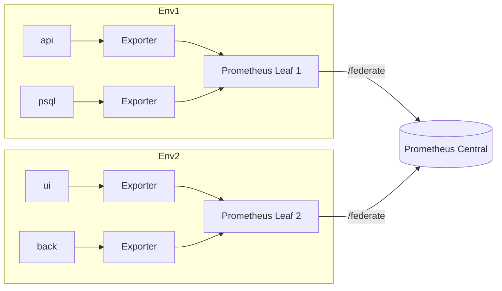
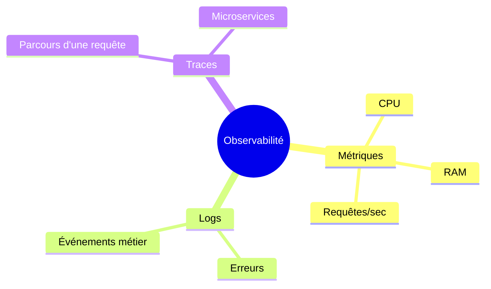
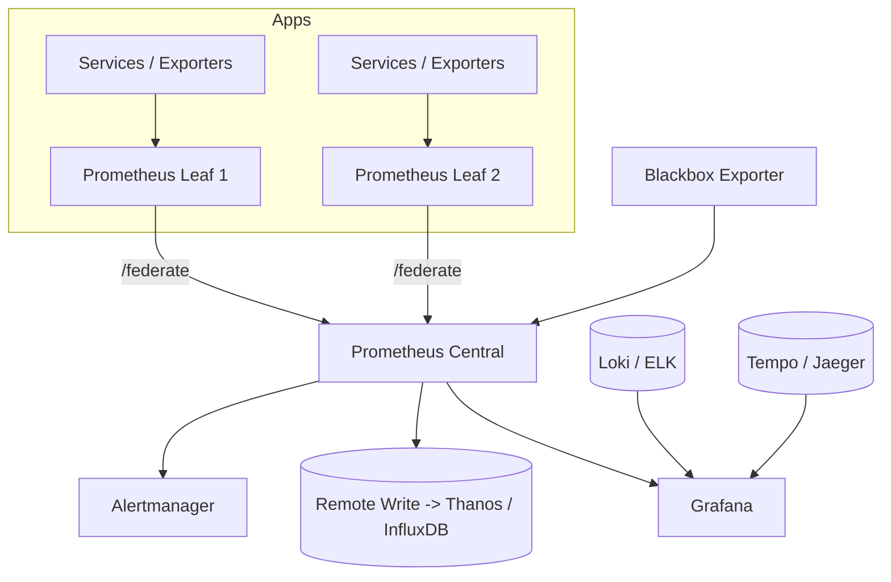

# 🎓 Monitoring avancé – Prometheus & Grafana

## Ce que tu sauras faire

À la fin de ce cours, tu sauras :

- Mettre en place une **fédération Prometheus** (central + leaf).
- Exporter des métriques vers un **stockage longue durée** (Thanos, InfluxDB, Cortex…).
- Créer et utiliser des **métriques personnalisées** dans ton code (Counter, Gauge, Histogram…).
- Configurer un **alerting avancé** avec Alertmanager (routing, grouping, inhibition, silences, `amtool`).
- Superviser tes services **depuis l’extérieur** avec le **Blackbox Exporter**.
- Construire des **dashboards Grafana avancés** : multi data-sources, variables, liens entre dashboards.
- Comprendre comment articuler **métriques, logs et traces** dans une vraie stratégie d’observabilité.

> Idée visuelle : pour l’architecture Prometheus, tu peux utiliser un graph mermaid (architecture) ou un flowchart dans ton markdown.
> 

---

## 1. Rappel – Pourquoi “monitoring avancé” ?

Les premiers cours Prometheus / Grafana t’ont donné les bases :

- Un serveur Prometheus qui scrape des cibles.
- Un Alertmanager qui envoie des mails / messages.
- Un Grafana branché sur Prometheus pour afficher des graphes.

Ça fonctionne très bien… **tant que** :

- tu n’as pas 36 environnements (dev, stg, prod, clients A/B/C),
- tu n’as pas plusieurs datacenters ou clusters,
- tu ne gardes pas les métriques plus que quelques semaines,
- tu ne fais pas d’observabilité “complète” (métriques + logs + traces).

Ce module va donc t’apprendre à passer du **laboratoire** à quelque chose de plus proche de la **prod d’entreprise**.

---

## 2. Fédération Prometheus

### 2.1. Architecture en fédération

Dès que tu as plusieurs environnements ou clusters, une seule instance de Prometheus devient :

- un **goulot d’étranglement** (trop de cibles à scrapper),
- un **risque de panne unique**,
- difficile à dimensionner et à sauvegarder.

On découpe donc l’architecture :

- **Leaf Prometheus** (ou “shard”)
    
    ➜ Prometheus locaux, **proches des applications**.
    
    Ils scrappent les exporters des VMs, pods, bases, etc.
    
- **Prometheus central (federation)**
    
    ➜ Ne scrappe **pas les apps directement**, mais les **Prometheus leaf** via `/federate`.
    
    Il n’importe **qu’une partie** des métriques (les plus utiles pour une vue globale).
    

Schéma possible en markdown :



Chaîne de collecte :

> Service → Exporter → Prometheus Leaf → Prometheus Central
> 

### 2.2. Requêtes fédérées & configuration

Le Prometheus central **ne copie pas tout**.

Il interroge les leaf avec des requêtes filtrées, par exemple :

- “Je veux la métrique `up` pour le job `api`.”
- “Je veux les erreurs HTTP 5xx agrégées par cluster.”

Dans le `prometheus.yml` du **central** :

```yaml
scrape_configs:
  - job_name: 'leaf-federation'
    scrape_interval: 30s
    metrics_path: /federate
    params:
      'match[]':
        - '{job="api"}'
        - 'up'
        - 'rate(http_requests_total[5m])'
    static_configs:
      - targets:
          - 'leaf1:9090'
          - 'leaf2:9090'

```

Ici :

- `metrics_path: /federate` ➜ Prometheus sait qu’il s’agit d’une fédération.
- `match[]` ➜ liste des expressions PromQL que tu veux importer.

Tu peux par exemple :

- importer `up{job="api"}` pour superviser la santé globale,
- importer `rate(http_requests_total[5m])` pour une vision trafic globale.

### 2.3. Avantages / limites

✅ **Avantages :**

- Scalabilité : plusieurs Prometheus se partagent la charge.
- Résilience : chaque leaf garde **son historique local**.
- Vue globale : le central devient **un point d’entrée unique** pour tes dashboards ou ton alerting.

⚠️ **Limites :**

- Le central **ne connaît que ce qu’il importe** (pas l’historique complet).
- Si tu changes les expressions de fédération, ton historique central change.
- Mauvaise idée d’importer des séries à **haute cardinalité** (ex : label `user_id`).

🧠 **Bonnes pratiques :**

- Utiliser la fédération pour :
    - les **KPIs globaux**,
    - l’**alerting global**,
    - les **vues cross-cluster**.
- Garder les **analyses détaillées** sur les leaf.

---

## 3. Export de métriques & stockage longue durée

### 3.1. Pourquoi exporter ?

Prometheus n’est pas conçu pour :

- stocker des années de données,
- faire du big data ou de l’analytics massif.

Son travail : **scraper et répondre vite**.

Pour l’historique long terme, on s’appuie sur des solutions spécialisées :

- **Thanos** (extension Prometheus, stockage objet + requêtes distribuées),
- **Cortex / Mimir** (multi-tenant, très orienté SaaS),
- **InfluxDB**, **VictoriaMetrics**, **AWS Timestream**, etc.

### 3.2. Remote Write / Remote Read

- `remote_write` ➜ Prometheus **pousse** ses samples vers une base externe.
- `remote_read` ➜ Prometheus **lit** des données externes **comme si elles étaient à lui**.

`prometheus.yml` simplifié avec InfluxDB :

```yaml
global:
  scrape_interval: 15s

scrape_configs:
  - job_name: 'node'
    static_configs:
      - targets: ['node-exporter:9100']

remote_write:
  - url: "http://influxdb:8086/api/v1/prom/write"
    remote_timeout: 30s
    write_relabel_configs:
      - source_labels: [__name__]
        regex: ".*"
        action: keep

remote_read:
  - url: "http://influxdb:8086/api/v1/prom/read"
    remote_timeout: 30s
    read_recent: true

```

Points importants :

- `write_relabel_configs` te permet de **filtrer** ce que tu exportes.
- Tu peux par exemple n’envoyer que :
    - les métriques avec `env="prod"`,
    - les séries de type `http_requests_total`, `cpu_usage_seconds_total`, etc.

### 3.3. Cas d’usage typiques

- **Infra prod** :
    - 15 jours de rétention dans Prometheus,
    - 1 an dans Thanos / Cortex.
- **Data / BI** :
    - dashboards mensuels sur 12 mois,
    - entraînement de modèles ML sur des métriques historiques.
- **Audit / conformité** :
    - garder certains KPI de disponibilité plusieurs années.

🧠 **Checklist :**

- [ ]  Choisir une base longue durée adaptée (coût, cloud, complexité).
- [ ]  Définir **quelles séries** sont vraiment utiles long terme.
- [ ]  Monitorer la pipeline elle-même (métriques exportées / erreurs d’écriture).

---

## 4. Métriques personnalisées

### 4.1. Pourquoi ne pas se contenter des exporters ?

Les exporters (Node Exporter, cAdvisor, etc.) donnent :

- CPU, mémoire, disque,
- métriques système, réseau, etc.

Mais **ton métier** ne parle pas de “CPU à 80 %”, il parle de :

- commandes traitées,
- paniers validés,
- erreurs API,
- temps de réponse, etc.

Les **métriques personnalisées** permettent d’exposer cette réalité métier.

### 4.2. Clients Prometheus par langage

Quelques librairies standard :

| Langage | Client |
| --- | --- |
| Node.js | `prom-client` |
| Python | `prometheus_client` |
| Java | `simpleclient` |
| Go | support natif (`prometheus` package) |

### 4.3. Types de métriques

- **Counter**
    
    ➜ Compte uniquement vers le haut.
    
    Ex : `http_requests_total`, `orders_created_total`.
    
- **Gauge**
    
    ➜ Monte et descend.
    
    Ex : `connected_users`, `queue_length`.
    
- **Histogram**
    
    ➜ Distribue des valeurs dans des **buckets**.
    
    Ex : temps de réponse répartis en tranches (0–100ms, 100–300ms…).
    
- **Summary**
    
    ➜ Fournit des quantiles (p50, p90…) calculés côté client.
    
    Moins pratique en fédération, on préfère souvent `Histogram`.
    

### 4.4. Exemple en Node.js (prom-client)

```jsx
const express = require('express');
const client = require('prom-client');

const app = express();
const register = new client.Registry();

// Counter : nombre total de requêtes HTTP
const httpRequestsTotal = new client.Counter({
  name: 'http_requests_total',
  help: 'Total des requêtes HTTP',
  labelNames: ['method', 'route', 'status']
});

// Histogram : durée des requêtes HTTP
const httpRequestDuration = new client.Histogram({
  name: 'http_request_duration_seconds',
  help: 'Durée des requêtes HTTP en secondes',
  labelNames: ['route'],
  buckets: [0.05, 0.1, 0.3, 0.5, 1, 3]
});

register.registerMetric(httpRequestsTotal);
register.registerMetric(httpRequestDuration);

// Middleware d'instrumentation
app.use((req, res, next) => {
  const end = httpRequestDuration.startTimer({ route: req.path });

  res.on('finish', () => {
    httpRequestsTotal.inc({
      method: req.method,
      route: req.path,
      status: res.statusCode
    });
    end(); // enregistre la durée
  });

  next();
});

// Endpoint métier
app.get('/api/hello', (req, res) => {
  res.json({ message: 'Hello' });
});

// Endpoint /metrics
app.get('/metrics', async (req, res) => {
  res.set('Content-Type', register.contentType);
  res.end(await register.metrics());
});

app.listen(3000);

```

Prometheus n’a plus qu’à scrapper `http://service:3000/metrics`.

### 4.5. Bonnes pratiques

- **Noms clairs** : `app_orders_total`, `api_errors_total`, etc.
- **Labels stables** : pas de `user_id`, `request_id`, `email`… → sinon **explosion de cardinalité**.
- **Unités explicites** dans le nom :
    - `_seconds`, `_bytes`, `_total`, etc.

---

## 5. Alerting avancé avec Alertmanager

L’objectif n’est pas d’avoir **plus d’alertes**, mais des alertes :

- pertinentes,
- bien routées,
- regroupées,
- silencées au bon moment.

### 5.1. Rappel du flux

1. Prometheus évalue des **rules** (`alerting_rules.yml`).
2. Quand une condition est vraie, une alerte est envoyée à **Alertmanager**.
3. Alertmanager :
    - route l’alerte,
    - la groupe,
    - peut en inhiber d’autres,
    - peut la rendre silencieuse.

### 5.2. Routing par labels

Dans `alertmanager.yml` :

```yaml
route:
  receiver: default
  group_by: ['alertname', 'cluster', 'service']
  group_wait: 30s
  group_interval: 5m
  routes:
    - matchers:
        - env="prod"
        - severity="critical"
      receiver: pagerduty

    - matchers:
        - env="staging"
        - team="backend"
      receiver: slack-backend-staging

receivers:
  - name: default
    email_configs:
      - to: "ops@example.com"

  - name: pagerduty
    pagerduty_configs:
      - routing_key: "<clé>"

  - name: slack-backend-staging
    slack_configs:
      - channel: "#staging-backend"
        api_url: "https://hooks.slack.com/services/..."

```

Les **labels** de l’alerte (`env`, `team`, `severity`, etc.) déterminent le **receiver**.

### 5.3. Grouping

`group_by`, `group_wait`, `group_interval` évitent le spam :

- `group_by: ['job', 'severity']`
    
    ➜ 1 message pour “8 instances de l’API down” plutôt que 8 messages.
    

### 5.4. Inhibition

Ne pas envoyer une alerte “InstanceDown” si “ClusterDown” est déjà active :

```yaml
inhibit_rules:
  - source_match:
      alertname: "ClusterDown"
    target_match:
      alertname: "InstanceDown"
    equal: ["cluster"]

```

### 5.5. Silences temporaires (`amtool`)

`amtool` (installé avec Alertmanager) permet de gérer les silences en CLI.

Exemple : silence de 2h sur l’alerte `InstanceDown` du cluster `prod-eu` :

```bash
amtool silence add \
  alertname="InstanceDown" \
  cluster="prod-eu" \
  --duration=2h \
  --comment="Maintenance planifiée prod-eu" \
  --author="goose"

```

Listes les silences :

```bash
amtool silence query

```

Supprimer un silence :

```bash
amtool silence expire <ID>

```

🧠 **Idées d’usage :**

- Avant un déploiement risqué ➜ silence sur `env="staging"`.
- Pendant une opération réseau ➜ silence sur les alertes `InstanceDown` liées.

---

## 6. Surveiller de l’extérieur : Blackbox Exporter

### 6.1. Principe

Même si tout est vert côté Prometheus interne, **tes utilisateurs**, eux, voient :

- un site HTTP,
- un port TCP,
- un certificat TLS,
- une résolution DNS.

Le **Blackbox Exporter** simule cette vision “côté client” :

- ping ICMP,
- requête HTTP/HTTPS,
- test TCP,
- vérification TLS, DNS, etc.

Il expose ensuite des métriques que Prometheus scrappe.

### 6.2. Types de sondes

Modules courants (dans `blackbox.yml`) :

- `http_2xx` ➜ HTTP OK attendu.
- `tcp_connect` ➜ port accessible.
- `icmp` ➜ ping.
- `tls` ➜ détails du certificat.

### 6.3. Exemple de config Prometheus

```yaml
scrape_configs:
  - job_name: 'blackbox'
    metrics_path: /probe
    params:
      module: [http_2xx]     # module défini dans blackbox.yml
    static_configs:
      - targets:
          - https://example.com
          - https://api.monsite.com/health
    relabel_configs:
      - source_labels: [__address__]
        target_label: __param_target
      - target_label: instance
        replacement: blackbox
      - target_label: __address__
        replacement: blackbox-exporter:9115

```

Ici, c’est **Prometheus** qui appelle Blackbox, en lui passant la `target` à tester.

### 6.4. Idées d’alertes

- HTTP non 2xx / temps de réponse > X secondes.
- Certificat TLS expirant dans moins de 15 jours.
- Nom de domaine qui ne résout plus en DNS.
- Port SSH d’un bastion devenu inaccessible.

---

## 7. Grafana – Dashboards avancés

### 7.1. Multiplication des data-sources

Grafana peut se connecter à :

- **Prometheus** ➜ métriques.
- **Loki / ELK** ➜ logs.
- **Tempo / Jaeger** ➜ traces.
- **CloudWatch, Azure Monitor** ➜ métriques cloud.
- Bases SQL (PostgreSQL, MySQL…) pour exposer des indicateurs métier.

L’idée : **une seule interface** pour croiser :

- un pic de CPU (Prometheus),
- un message d’erreur précis (Loki),
- la trace détaillée de la requête (Tempo).

Visuel simple des 3 piliers :



### 7.2. Variables dynamiques

Les variables Grafana rendent un dashboard **réutilisable** :

- `$env` ➜ `dev`, `staging`, `prod`
- `$cluster` ➜ `k8s-eu`, `k8s-us`
- `$job` ➜ `api`, `ui`, `worker`

Tu définis tes variables dans l’onglet **Dashboard settings → Variables**, par exemple :

- Type : `Query`
- Data source : Prometheus
- Query : `label_values(up, env)`

Tu peux ensuite utiliser `$env` dans :

- tes requêtes PromQL :
    
    `rate(http_requests_total{env="$env", job="$job"}[5m])`
    
- les titres de panels,
- les liens de dashboards.

### 7.3. Liaisons entre dashboards

Exemples de navigation utile :

- Dashboard “Vue globale” ➜ liste de services.
- En cliquant sur un service, tu vas sur “Détail service” avec `$job` pré-rempli.
- Depuis “Détail service”, lien vers :
    - un dashboard “Logs du service” (Loki),
    - un dashboard “Traces lentes” (Tempo).

Tu peux créer :

- des **Panel links** (clic sur un graphe),
- des **Dashboard links** (barre en haut),
- des “drill-downs” qui passent des variables via l’URL (`?var-env=prod&var-job=api`).

---

## 8. Synthèse & checklist

### 8.1. Architecture type “Monitoring avancé”



### 8.2. Checklist perso

- [ ]  Mettre en place **au moins 2 Prometheus Leaf + 1 central** pour tester la fédération.
- [ ]  Configurer **Remote Write** vers une petite base longue durée (ex : InfluxDB docker).
- [ ]  Instrumenter **une vraie appli** avec des **métriques métier**.
- [ ]  Ajouter des **alertes avancées** (routing, grouping, inhibition).
- [ ]  Installer le **Blackbox Exporter** et ajouter :
    - un check HTTP sur ton site,
    - un check TLS sur ton domaine.
- [ ]  Créer **un dashboard Grafana multi-data-sources** (Prometheus + logs).
- [ ]  Utiliser **au moins 2 variables** (`$env`, `$job`) et **un lien** vers un second dashboard.