# 🧭 Schémas d’infrastructure — Du macro au micro

## 1. 🎯 Objectifs du module

À la fin de ce module, tu seras capable de :

- Comprendre **ce qu’est un schéma d’infrastructure** et pourquoi il est indispensable dans un projet technique.
- Distinguer les **3 niveaux de schéma** : macro, méso, micro, et savoir à quel public ils s’adressent.
- Identifier les **composants clés** d’une architecture moderne : utilisateurs, applications, bases de données, réseau, sécurité, outils tiers.
- Construire des schémas **clairs et lisibles** à chaque niveau, avec le bon niveau de détail.
- Utiliser **Mermaid** (dans tes fichiers Markdown) et [**draw.io**](http://draw.io/) pour produire des schémas professionnels.
- Adapter tes schémas à ton **audience** (non-technique, développeurs, DevOps, jury) et anticiper les questions.

---

## 2. Pourquoi faire un schéma d’infrastructure ?

Un schéma d’infrastructure, c’est la **carte** de ton système :

- Au lieu de routes et de villes, tu montres :
    - des **utilisateurs**,
    - des **applications**,
    - des **serveurs**,
    - des **bases de données**,
    - des **services externes**,
    - et les **flux** entre eux.

### 2.1 Les bénéfices concrets

Un bon schéma :

- ✅ **Clarifie** les idées : tu vois d’un coup d’œil ce qui existe.
- ✅ **Aligne** tout le monde (dev, ops, chef de projet, client, jury).
- ✅ **Évite les oublis** : en dessinant, tu te rends compte de ce qui manque (logs, sécurité, sauvegardes…).
- ✅ **Aide à décider** : on voit où sont les faiblesses, les goulots d’étranglement.
- ✅ **Prépare la prod** : c’est une base pour planifier le déploiement et les responsabilités.

### 2.2 Pour qui ?

- Développeurs : comprendre où se branche leur code.
- DevOps / Ops : préparer le déploiement, la supervision, la sécurité.
- Chefs de projet / Product : suivre les flux fonctionnels.
- Clients / jury : comprendre le **fonctionnement global** sans lire du code.

> 💡 Retenir : un schéma n’est pas décoratif. C’est un outil de pilotage du projet.
> 

---

## 3. Les 3 niveaux de schéma : Macro, Méso, Micro

On va découper ta vision en **3 niveaux complémentaires**.

### 3.1 Vue d’ensemble des 3 niveaux

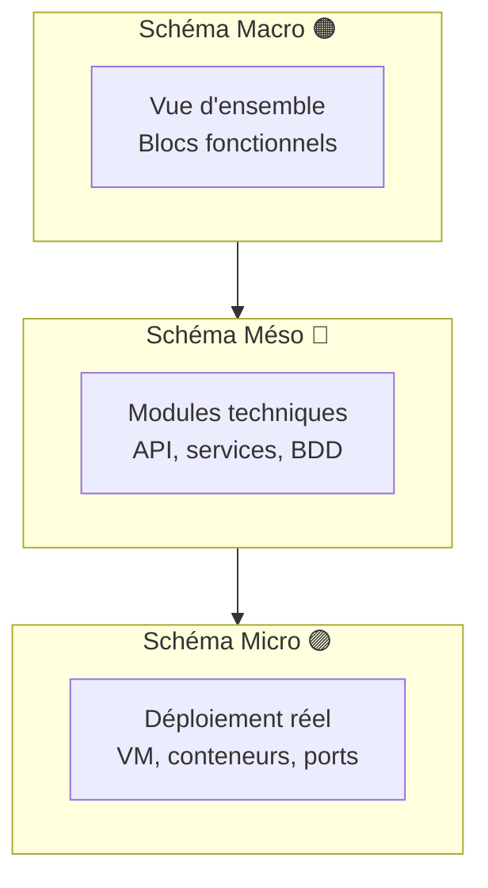
- **Macro** : raconte l’histoire de ton système pour un public large.
- **Méso** : zoom sur les **modules techniques**.
- **Micro** : détail du **déploiement réel**, adressé aux **DevOps / infra**.

### 3.2 À qui s’adresse chaque niveau ?

- 🟠 **Macro**
    
    Public : client, jury non-technique, management.
    
    Message : *« Voilà comment mon projet fonctionne, en gros. »*
    
- 🔵 **Méso**
    
    Public : développeurs, leads techniques.
    
    Message : *« Voilà comment on a découpé l’application et les services. »*
    
- 🟣 **Micro**
    
    Public : DevOps, SRE, cloud engineers.
    
    Message : *« Voilà ce qui tourne vraiment, où et comment. »*
    

---

## 4. Identifier les composants clés

Avant de dessiner, tu dois **faire l’inventaire** de ce qui existe.

### 4.1 Les acteurs humains

- Utilisateurs finaux (client, visiteur, étudiant…)
- Administrateurs (support, équipe interne)
- Systèmes clients (autres applis qui consomment ton API)

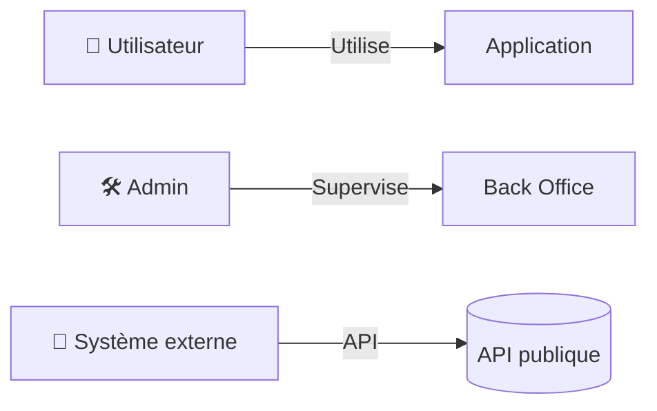

Ce petit graphe te sert de **point de départ** pour placer clairement qui utilise quoi.

---

### 4.2 Applications, services et APIs

- **Applications** : front web, appli mobile, dashboard interne…
- **Services** : authentification, facturation, notifications…
- **APIs** : points d’entrée standardisés (REST, gRPC…) pour communiquer.

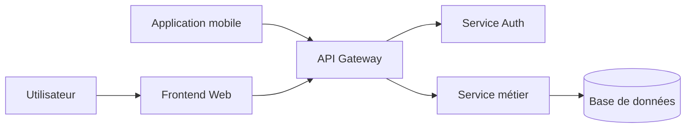

Ce type de schéma sera souvent ton **schéma macro** initial.

---

### 4.3 Bases de données et stockage

- Bases de données relationnelles (PostgreSQL, MySQL…)
- Bases NoSQL (MongoDB, Redis…)
- Stockage de fichiers (S3, NAS, bucket objet…)

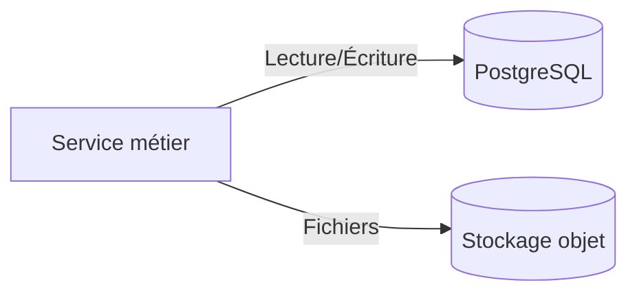

Le but est de rendre **visible** où vont les données, pour penser **sécurité** et **sauvegardes**.

---

### 4.4 Réseau, sécurité, VPN, DNS

- Zones réseau (Internet, DMZ, réseau privé…)
- DNS, certificats TLS, firewalls, VPN, bastion SSH…

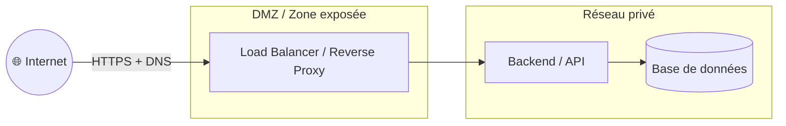

Ici tu montres **les zones** et **les chemins** plutôt que tous les détails.

---

### 4.5 Outils tiers, SaaS, intégrations

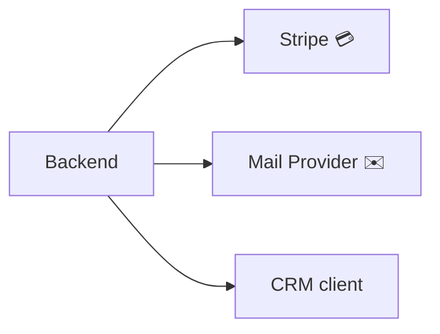

Important : bien montrer que ces services sont **externes** (limites de responsabilité, flux de données sortants).

---

## 5. Construire un schéma **Macro**

Le schéma macro = **vue d’ensemble** + **flux principaux**.

### 5.1 Vue d’ensemble

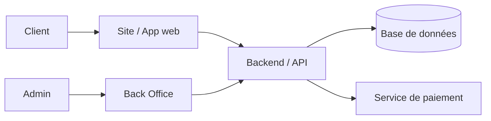

Ce schéma doit être :

- simple,
- lisible en **30 secondes**,
- montrable à quelqu’un de non technique.

### 5.2 Ajouter les flux principaux

Tu peux annoter les flèches pour raconter l’histoire :

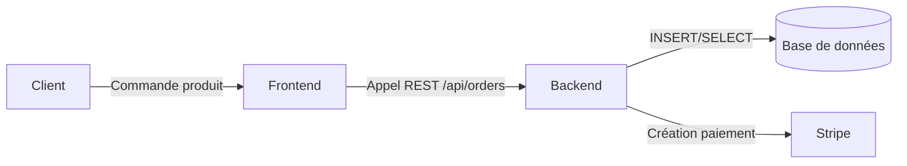

Chaque flèche = **une action lisible** : “commande produit”, “appel REST”, “lecture/écriture BDD”, etc.

### 5.3 Contextualiser le projet

Au-dessus ou en dessous du schéma, ajoute toujours 1 phrase :

> « Schéma macro d’un site e-commerce permettant à des clients de passer commande et à des admins de gérer le catalogue. »
> 

Ça ancre ton schéma dans **un cas réel**, ce que les jurys apprécient beaucoup.

---

## 6. Construire un schéma **Méso**

Le schéma méso = **zoom technique** : on passe de “Backend” à *comment il est organisé*.

### 6.1 Modules techniques internes

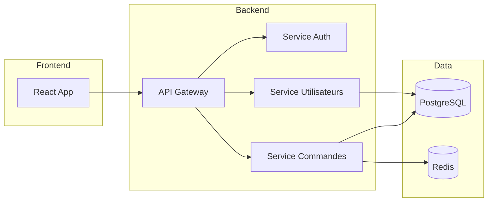

Ici tu montres :

- le **découpage par service**,
- comment ils s’appuient sur la BDD et le cache,
- le rôle de l’API Gateway.

### 6.2 Représenter les interactions et protocoles

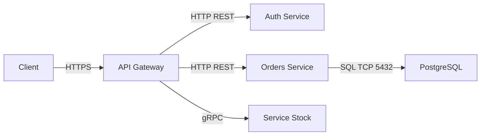

Tu peux indiquer :

- protocoles (`HTTPS`, `HTTP`, `gRPC`),
- ports (`TCP 5432`), si c’est utile,
- nature des flux (synchrone / asynchrone).

### 6.3 Choix d’infrastructure (cloud, on-prem, hybride)

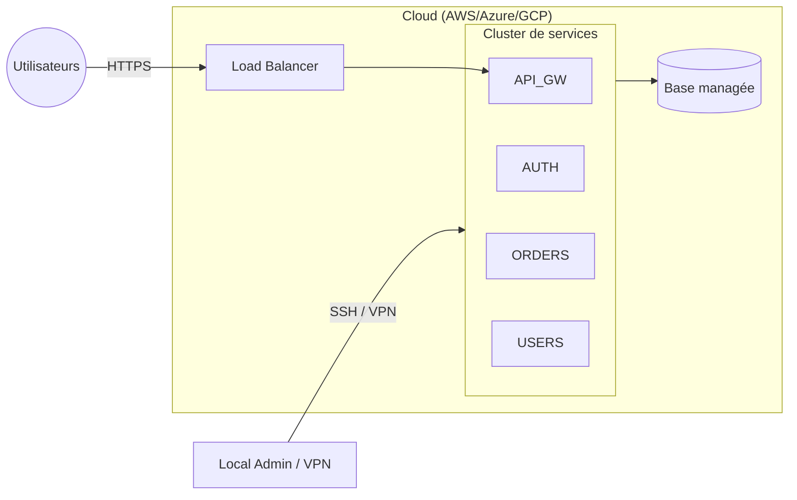

Ce genre de schéma méso te permet d’expliquer **où tourne quoi** sans encore descendre au niveau conteneur/VM.

---

## 7. Construire un schéma **Micro**

Le schéma micro = **ce qui tourne vraiment** : VM, conteneurs, ports, volumes, etc.

### 7.1 Composants déployés (VM, conteneurs)

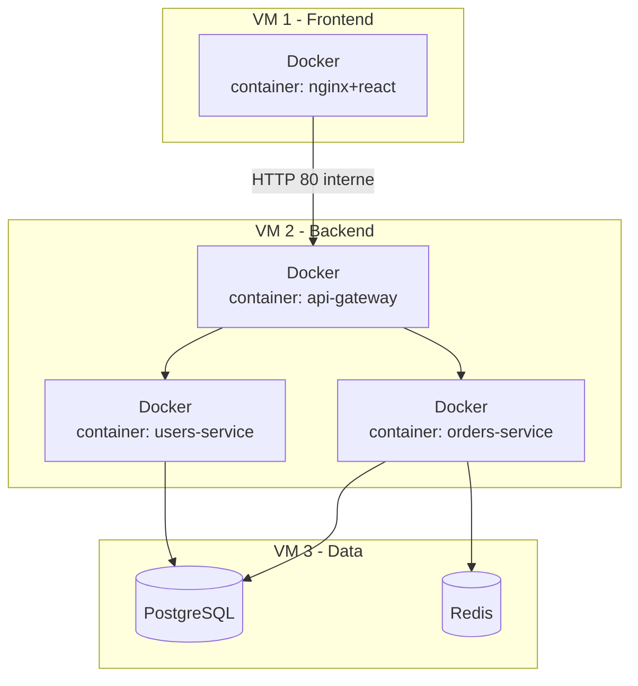

Tu montres ici :

- le découpage par **VM / nœud**,
- les conteneurs qui tournent sur chaque VM,
- les liens entre eux.

### 7.2 Réseau interne et ports

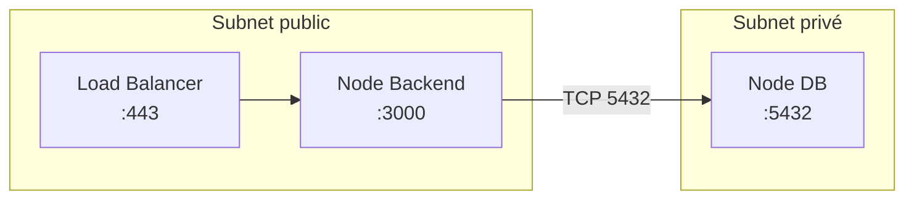

Tu peux expliciter :

- les **subnets** (public / privé),
- les **ports exposés**,
- les chemins d’accès (seul le backend peut parler à la DB).

### 7.3 Détails de configuration (optionnel visuellement)

Pour ne pas surcharger le schéma, tu peux :

- mettre les détails (env vars, volumes, IAM, etc.) dans une **légende** à côté,
- ou dans un **tableau texte**.

Exemple de tableau d’appoint :

| Composant | Variables d’environnement importantes | Volumes |
| --- | --- | --- |
| `orders-service` | `DB_URL`, `REDIS_URL`, `JWT_SECRET` | `/var/log/orders` (logs) |
| `api-gateway` | `RATE_LIMIT`, `AUTH_URL`, `ORDERS_URL`, `USERS_URL` | `/etc/nginx/conf.d` |
| `postgres` | `POSTGRES_DB`, `POSTGRES_USER`, `POSTGRES_PASSWORD` | `/var/lib/postgresql/data` |

---

## 8. Utiliser Mermaid efficacement dans tes cours

### 8.1 Types de schémas Mermaid utiles pour l’infra

- `flowchart` → pour 90 % des schémas d’infrastructure (macro, méso, micro).
- `sequenceDiagram` → pour expliquer le **parcours d’une requête**.
- `stateDiagram` → pour montrer les **états d’un déploiement** (Draft → Staging → Prod).

### Exemple : parcours d’une requête (sequenceDiagram)

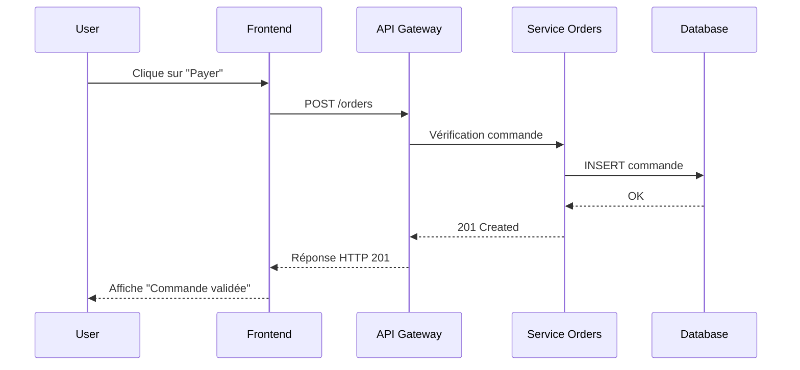

Tu peux utiliser ce diagramme **en complément** du schéma macro/méso pour bien expliquer un cas d’usage.

---

## 9. Utiliser draw.io pour les schémas “jolis”

Mermaid est parfait pour :

- la **doc technique** versionnée dans Git,
- les cours en Markdown.

Draw.io (diagrams.net) est idéal pour :

- les slides,
- les documents graphiques “stylés”.

### 9.1 Formes et couleurs (rappel)

- **Couleurs par type** :
    - UI / Frontend : bleu
    - Backend / services : orange
    - Bases de données : vert
    - Réseau / sécurité : rouge ou gris foncé
    - Outils tiers : violet
- **Formes** :
    - Rectangles → services / applications.
    - Cylindres → bases de données.
    - Icônes ou pictos → utilisateurs, SaaS, cloud.

> 🧠 Règle d’or : peu de formes, peu de couleurs, toujours les mêmes conventions d’un schéma à l’autre.
> 

### 9.2 Organisation visuelle

- Lecture **gauche → droite**, **haut → bas**.
- Utilise l’alignement automatique et les grilles.
- Regroupe les éléments dans des **zones** : “Frontend”, “Backend”, “Data”, “Cloud Provider”.

Tu peux te servir de Draw.io comme **brouillon visuel**, puis traduire certains schémas importants en **Mermaid** dans ta doc.

---

## 10. Vérifier la cohérence des 3 niveaux

Tes trois schémas doivent **raconter la même histoire**, avec des niveaux de zoom différents.

- Macro : “Frontend → Backend → BDD → services externes”
- Méso : “Backend = API Gateway + services X/Y/Z”
- Micro : “Service X tourne dans tel conteneur sur telle VM, avec telle BDD”

Checklist rapide :

- [ ]  Les noms des blocs restent cohérents d’un niveau à l’autre.
- [ ]  Chaque bloc du macro a son “équivalent” dans le méso.
- [ ]  Le micro ne contredit pas le méso (même services, mêmes rôles).
- [ ]  La palette de couleurs / symboles reste la même.

---

## 11. Adapter ton discours à la cible

- **Client / jury non technique** → reste surtout au **macro**, éventuellement un méso simple.
- **Développeurs** → méso détaillé, éventuellement micro simplifié.
- **DevOps / jury très technique** → méso + micro, avec focus sur :
    - sécurité,
    - déploiement,
    - monitoring,
    - scalabilité.

Tu peux préparer **les 3 schémas à l’avance** et choisir en live ceux que tu montres, selon les questions.

---

## 12. Anticiper les questions du jury

Pour chaque schéma, prépare mentalement (ou sur une fiche) des réponses à :

1. **Pourquoi cette architecture ?**
    
    → simplicité, coûts, évolutivité, contraintes de la formation / du client.
    
2. **Que se passe-t-il si ce composant tombe ?**
    
    → redondance, backup, plan de reprise.
    
3. **Comment est gérée la sécurité ?**
    
    → HTTPS, bastion, firewall, auth, droits.
    
4. **Est-ce que ça scale ?**
    
    → conteneurs, autoscaling, load balancer, DB gérée…
    
5. **Pourquoi ce service externe ?**
    
    → stabilité, time-to-market, standard du marché.
    

---

## 13. Modèles Mermaid prêts à adapter

Tu peux copier/coller ces snippets et les adapter à ton projet.

### 13.1 Template Macro générique

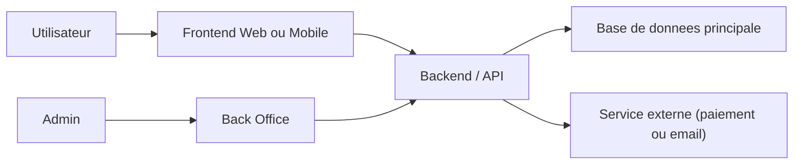

### 13.2 Template Méso générique

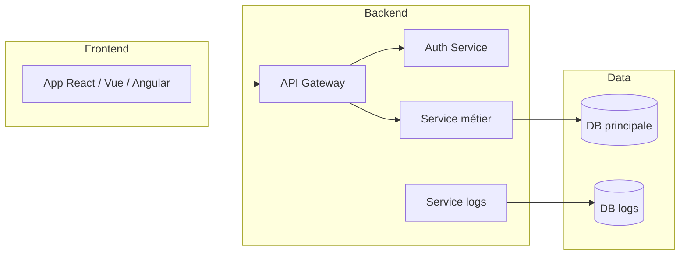

### 13.3 Template Micro générique

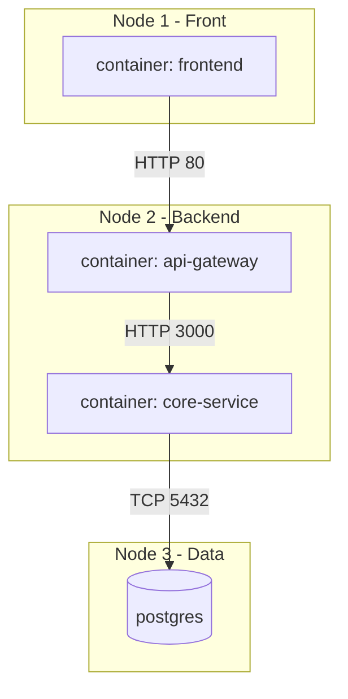

---

## 14. À retenir

- Un schéma d’infrastructure est **une carte**, pas une œuvre d’art.
- Les **3 niveaux** (macro, méso, micro) sont complémentaires et s’adressent à des publics différents.
- Tu dois toujours :
    - identifier les **composants clés**,
    - choisir le **bon niveau de détail**,
    - garder un **style visuel cohérent**,
    - adapter ton discours à l’audience.

Avec ça, tu as une base solide pour **tous tes projets** (formation, jury, clients) et tu peux exploiter à fond **Mermaid + draw.io** pour documenter ton architecture. 💪