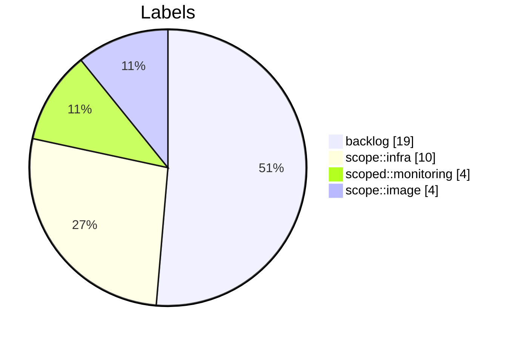
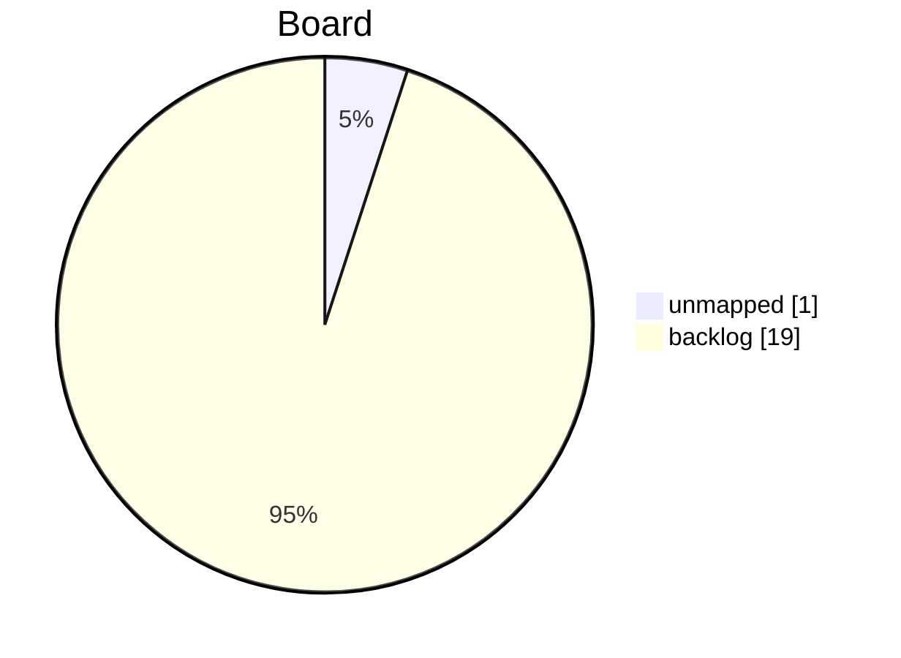
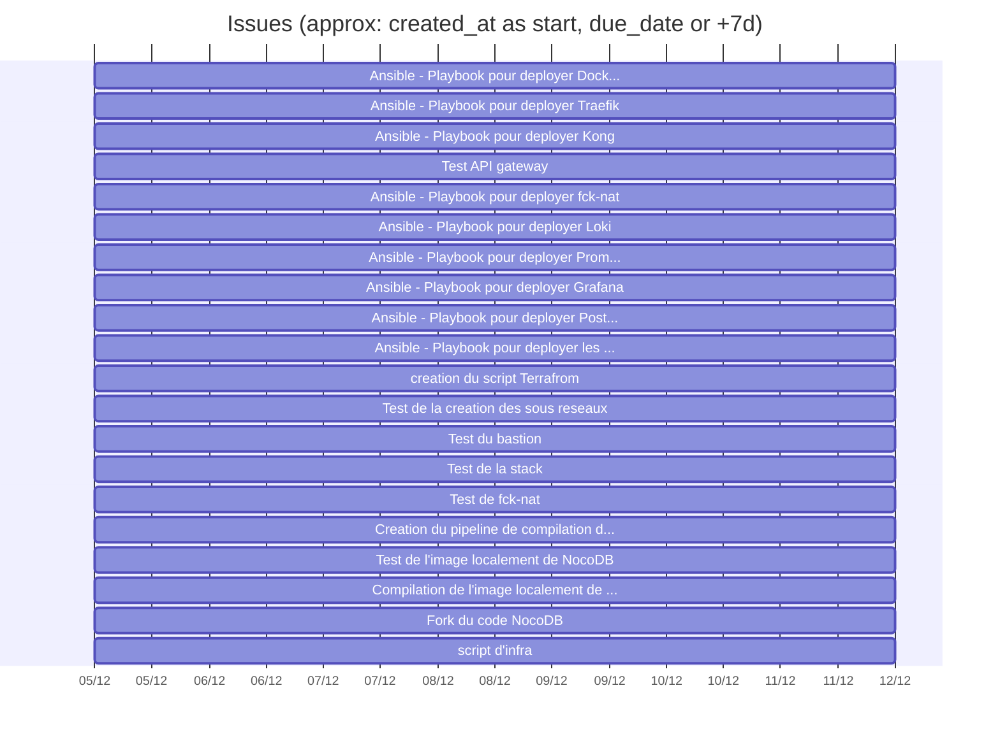

# Tableau de bord GitLab (offline)

## Synthese rapide
- Issues: 20
- Milestones: 0
- Etats des issues: {'opened': 20}
- Labels uniques: 4

## Distribution des labels

## Colonnes du board (inference par label)

## Gantt (approximatif)
Utilise created_at comme debut et due_date ou une duree par defaut.

## Top 10 labels

| Label | Nb issues |
|-------|-----------|
| backlog | 19 |
| scope::infra | 10 |
| scoped::monitoring | 4 |
| scope::image | 4 |

---
[Module suivant →](M40_methode-agile.md)
---
