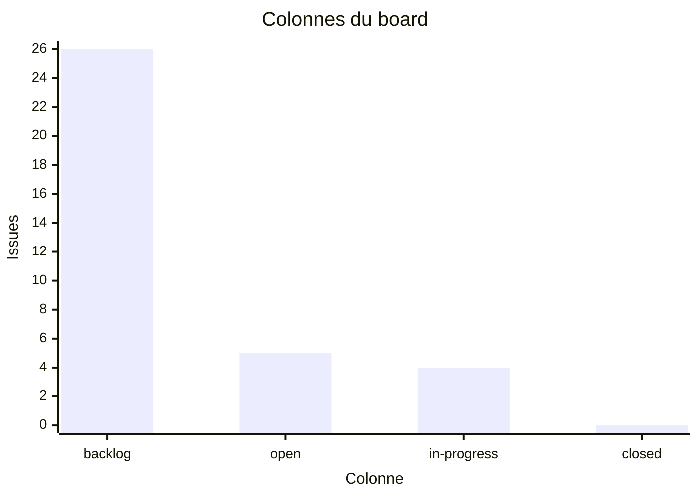
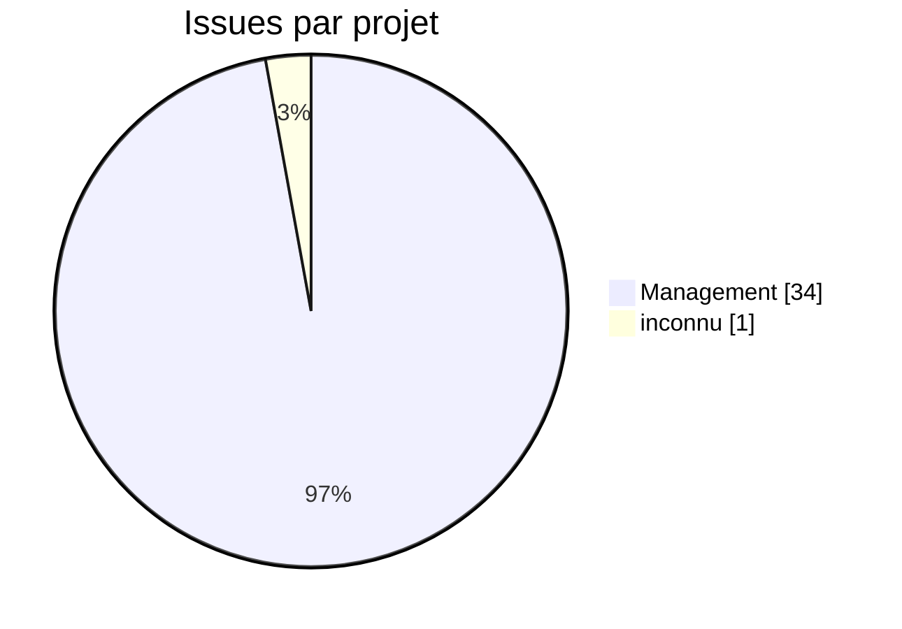
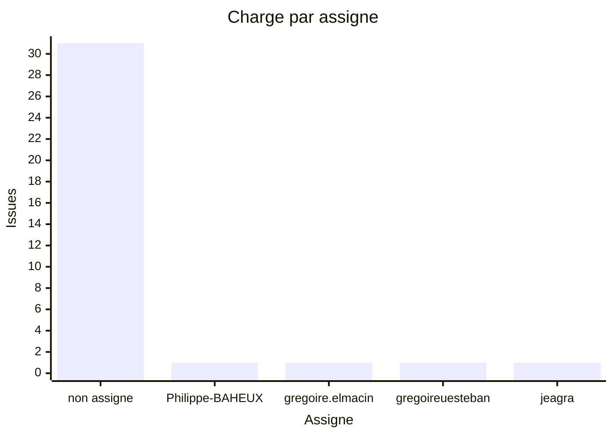
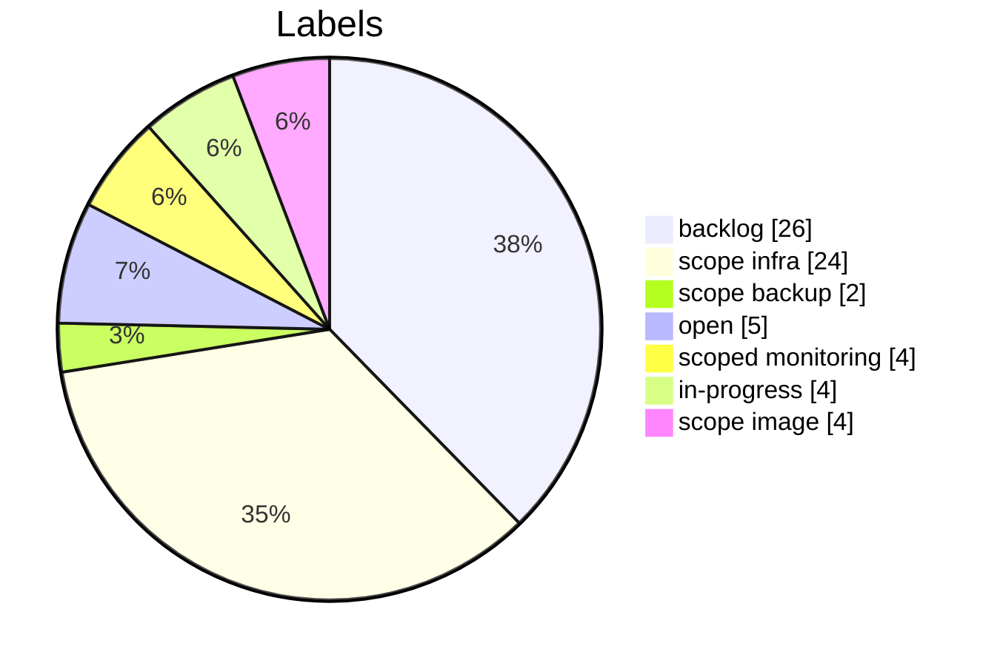
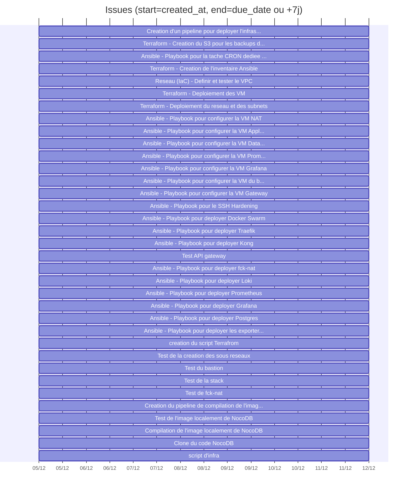
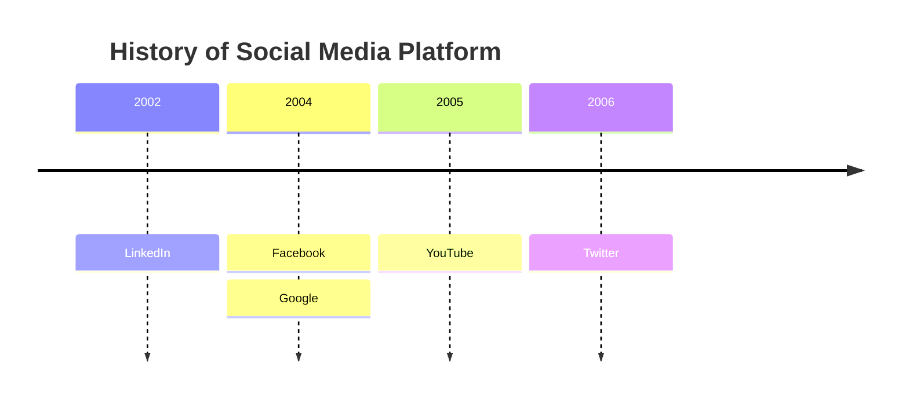
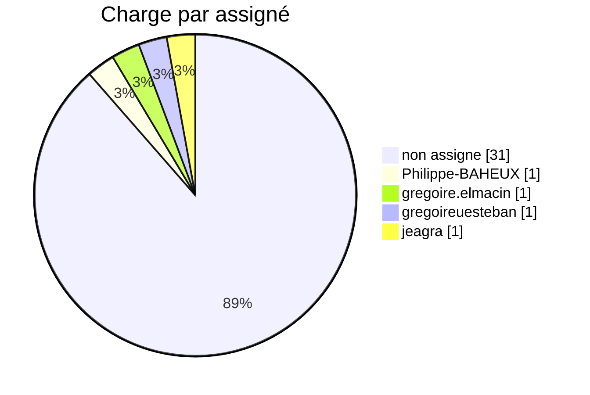
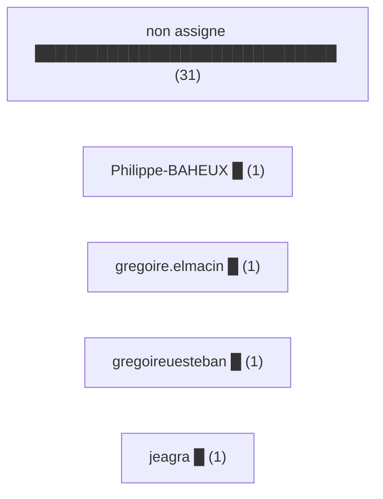

# Tableau de bord GitLab (v2 - enrichi)

## KPIs
- Issues: 35 (etat GitLab: {'opened': 35})
- Etat derive via labels backlog/open/in-progress/closed: {'backlog': 26, 'open': 5, 'in-progress': 4}
- Milestones: 0
- Projets: 2
- Labels uniques: 7 (issues sans label: 0)
- Issues avec due_date: 0/35

## Qualite des donnees (actionable)
- Ajouter due_date et assigne pour fiabiliser le pilotage.
- Aligner les labels sur les colonnes du board pour eviter 'unmapped'.
- Ajouter milestones (avec start/end) pour une vision planning realiste.

## Board / flux (repartition actuelle)


| Colonne | Description | Compte | % du total |
|---------|-------------|--------|------------|
| backlog | Task to be picked up during sprint planning | 26 | 74.3% |
| open | Issues within a sprint, awating to be taken for development | 5 | 14.3% |
| in-progress | On-going work (must be assigned to somebody) | 4 | 11.4% |
| closed | Issue reached completion | 0 | 0.0% |

## Repartition par projet


## Charge par assigne (barres xychart)


## Distribution des labels


## Timeline des creations (par jour)

| Date | Issues creees |
|------|---------------|
| 05-12-2025 | 35 |


## Aging des issues (temps depuis creation)

| Tranche | Nb issues |
|---------|-----------|
| 0-7j | 35 |
| 8-14j | 0 |
| 15-30j | 0 |
| 30j+ | 0 |


## Gantt (approximatif)
Utilise created_at comme debut et due_date ou une duree par defaut.


## Top labels (12)

| Label | Nb issues |
|-------|-----------|
| backlog | 26 |
| scope::infra | 24 |
| open | 5 |
| scoped::monitoring | 4 |
| in-progress | 4 |
| scope::image | 4 |
| scope::backup | 2 |


## Test 1 :


## Test 2 :
# ✅ **1) Pie Chart (presque toujours compatible)**

La solution la plus stable quand `xychart` est désactivé.



➡️ **Très bonne chance que ça marche.**

---

# ✅ **2) Graphique “fausse barre verticale” avec flowchart (technique universelle)**

Chaque barre est une pile de blocs.

Toujours compatible car c’est juste un flowchart.

```mermaid
flowchart TD
    title["Charge par assigné"]

    subgraph Non_Assigne [non assigne (31)]
      A1
      A2
      A3
      A4
      A5
    end

    subgraph Philippe [Philippe-BAHEUX (1)]
      B1
    end

    subgraph G1 [gregoire.elmacin (1)]
      C1
    end

    subgraph G2 [gregoireuesteban (1)]
      D1
    end

    subgraph J [jeagra (1)]
      E1
    end

```

➡️ Ce n’est pas beau, mais **ça marche partout**.

---

# ✅ **3) Graphique en tableau Markdown (aucune dépendance Mermaid)**

Toujours supporté.

```markdown
### Charge par assigné

| Assigné             | Issues |
|---------------------|--------|
| non assigne         | 31     |
| Philippe-BAHEUX     | 1      |
| gregoire.elmacin    | 1      |
| gregoireuesteban    | 1      |
| jeagra              | 1      |

```

➡️ Simple, robuste.

---

# ✅ **4) Flowchart horizontal “barres horizontales fake”**

Utilise la taille des labels pour donner un effet “bar chart”.



➡️ Très compatible et lisible.

---
[← Module précédent](M40_methode-agile.md)
---
