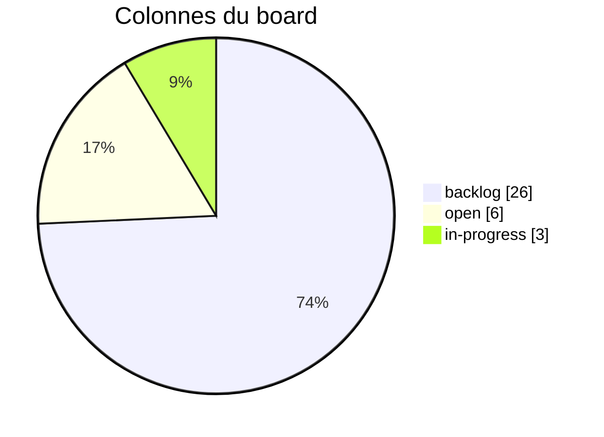
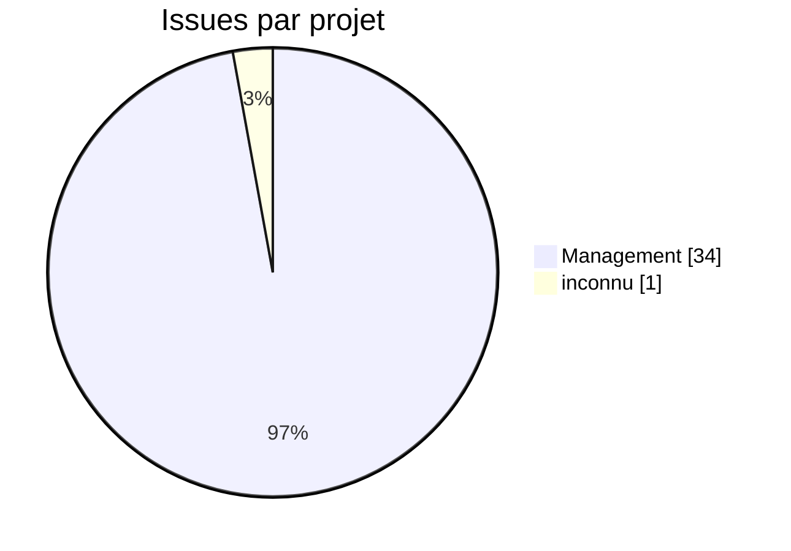
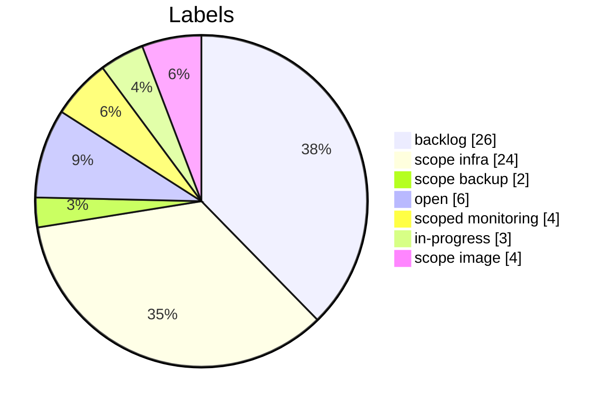
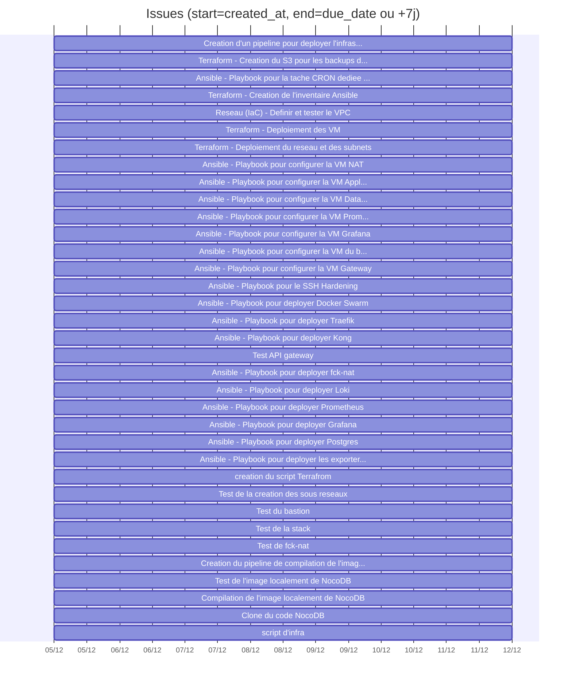

# Tableau de bord GitLab (v2 - enrichi)

## KPIs
- Issues: 35 (etat GitLab: {'opened': 35})
- Etat derive via labels backlog/open/in-progress/closed: {'backlog': 26, 'open': 6, 'in-progress': 3}
- Milestones: 0
- Projets: 2
- Labels uniques: 7 (issues sans label: 0)
- Issues avec due_date: 0/35

## Qualite des donnees (actionable)
- Ajouter due_date et assigne pour fiabiliser le pilotage.
- Aligner les labels sur les colonnes du board pour eviter 'unmapped'.
- Ajouter milestones (avec start/end) pour une vision planning realiste.

## Board / flux (repartition actuelle)


| Colonne | Description | Compte |
|---------|-------------|--------|
| backlog | Task to be picked up during sprint planning | 26 |
| open | Issues within a sprint, awating to be taken for development | 6 |
| in-progress | On-going work (must be assigned to somebody) | 3 |
| closed | Issue reached completion | 0 |
| unmapped | issues sans label de colonne | 0 |

## Repartition par projet


## Charge par assigne (barres verticales)
```mermaid
bar
  title: Assigne
  orientation: vertical
  yAxisTitle: Issues
  "non assigne": 31
  "Philippe-BAHEUX": 1
  "gregoire.elmacin": 1
  "gregoireuesteban": 1
  "jeagra": 1
```

## Distribution des labels


## Timeline des creations (par jour)

| Date | Issues creees |
|------|---------------|
| 2025-12-05 | 35 |


## Aging des issues (temps depuis creation)

| Tranche | Nb issues |
|---------|-----------|
| 0-7j | 35 |
| 8-14j | 0 |
| 15-30j | 0 |
| 30j+ | 0 |


## Gantt (approximatif)
Utilise created_at comme debut et due_date ou une duree par defaut.


## Top labels (12)

| Label | Nb issues |
|-------|-----------|
| backlog | 26 |
| scope::infra | 24 |
| open | 6 |
| scoped::monitoring | 4 |
| scope::image | 4 |
| in-progress | 3 |
| scope::backup | 2 |

---
[← Module précédent](M40_methode-agile.md)
---
