# Tableau de bord GitLab (offline)

## Synthese rapide
- Issues: 20
- Milestones: 0
- Etats des issues: {'opened': 20}
- Labels uniques: 4

## Distribution des labels
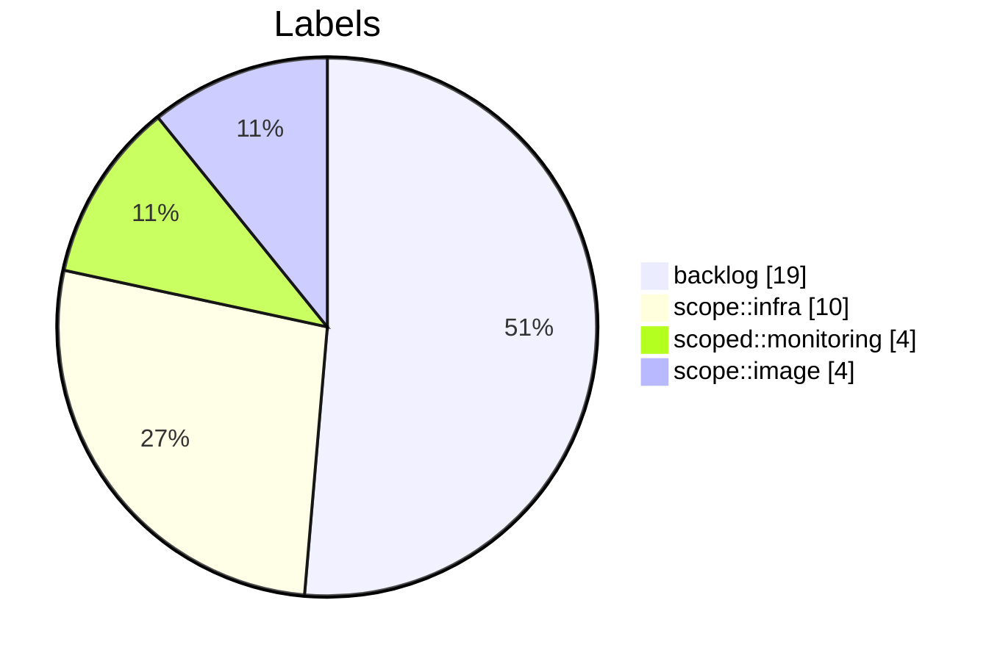

## Colonnes du board (inference par label)
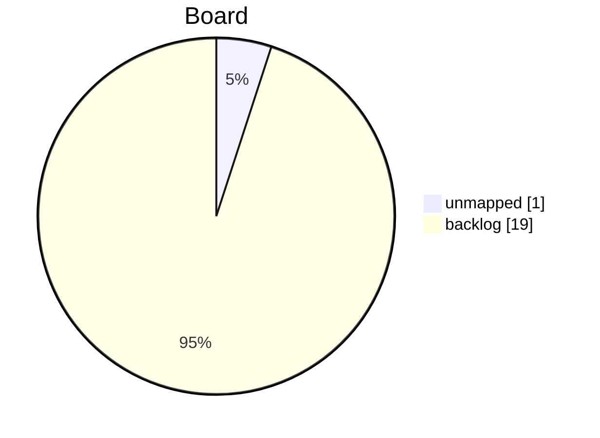

## Gantt (approximatif)
Utilise created_at comme debut et due_date ou une duree par defaut.
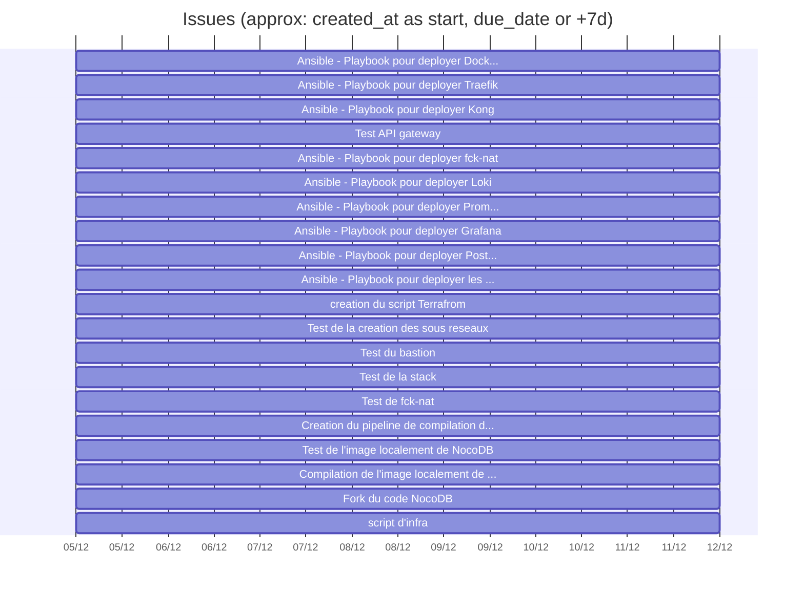

## Top 10 labels

| Label | Nb issues |
|-------|-----------|
| backlog | 19 |
| scope::infra | 10 |
| scoped::monitoring | 4 |
| scope::image | 4 |

# Tableau de bord GitLab (offline)

## Synthese rapide
- Issues: 35
- Milestones: 0
- Etats des issues: {'opened': 35}
- Labels uniques: 5

## Distribution des labels
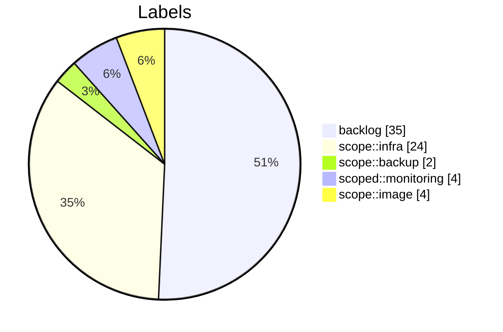

## Colonnes du board (inference par label)
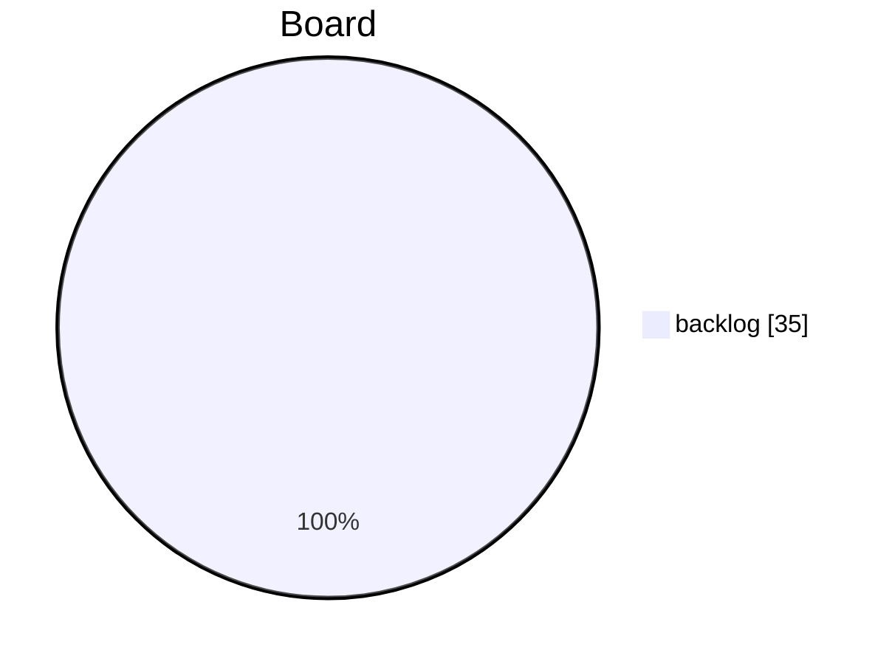

## Gantt (approximatif)
Utilise created_at comme debut et due_date ou une duree par defaut.
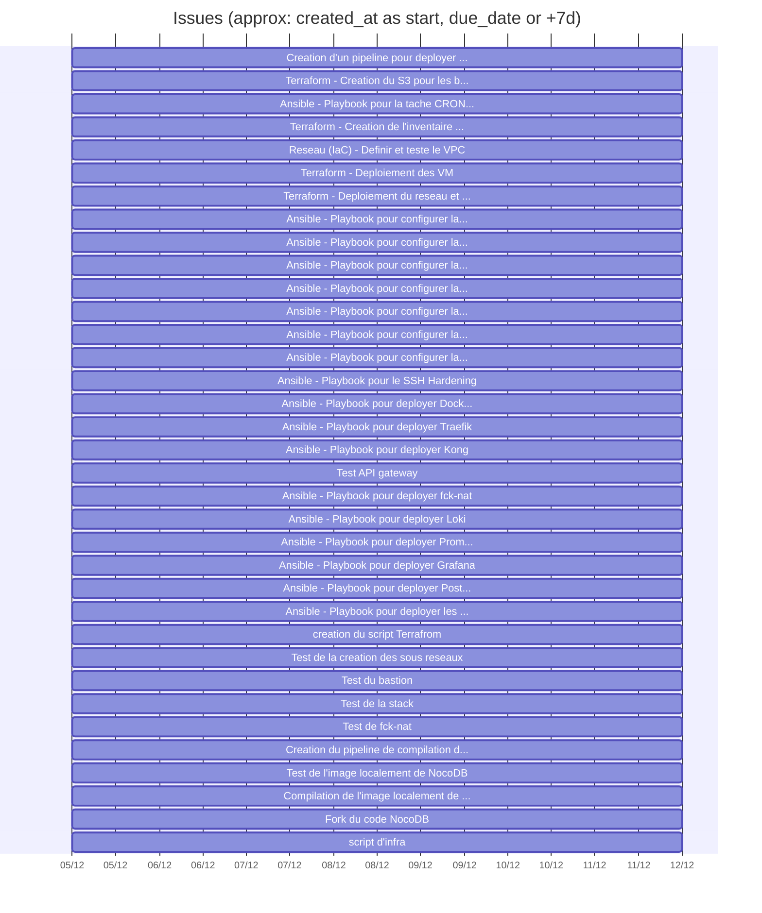

## Top 10 labels

| Label | Nb issues |
|-------|-----------|
| backlog | 35 |
| scope::infra | 24 |
| scoped::monitoring | 4 |
| scope::image | 4 |
| scope::backup | 2 |

# Tableau de bord GitLab (v2 - enrichi)

## KPIs
- Issues: 35 (etat: {'opened': 35})
- Milestones: 0
- Projets: 2
- Labels uniques: 5 (issues sans label: 0)
- Issues avec due_date: 0/35

## Qualite des donnees (actionable)
- Ajouter due_date et assigne pour fiabiliser le pilotage.
- Aligner les labels sur les colonnes du board pour eviter 'unmapped'.
- Ajouter milestones (avec start/end) pour une vision planning realiste.

## Board / flux (repartition actuelle)
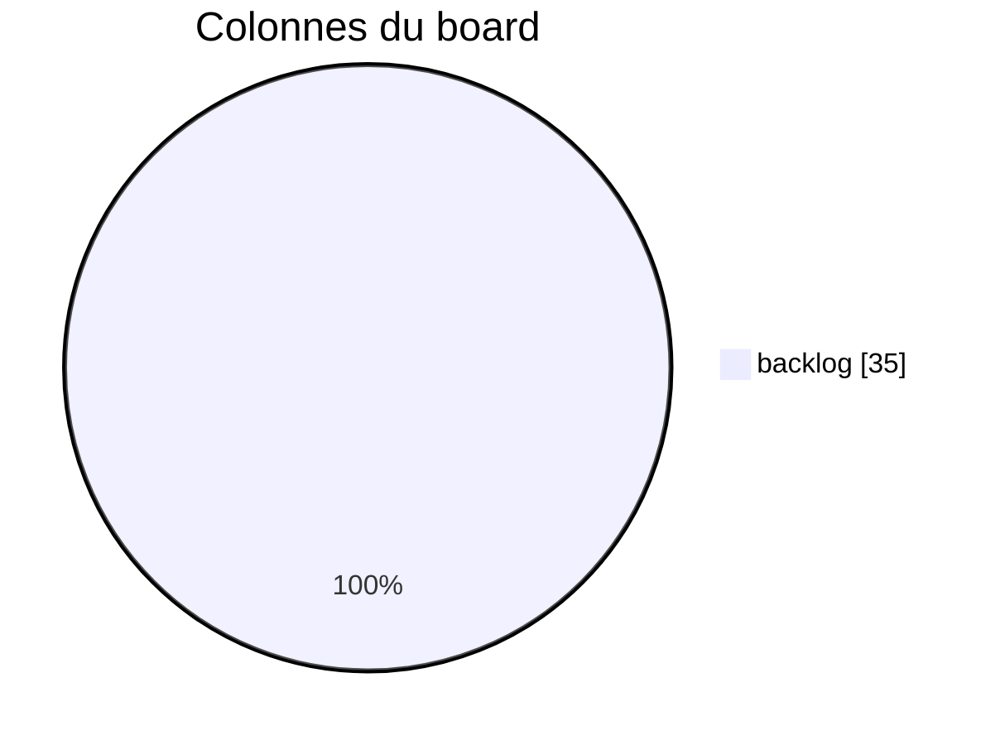

| Colonne | Description | Compte |
|---------|-------------|--------|
| backlog | Task to be picked up during sprint planning | 35 |
| open | Issues within a sprint, awating to be taken for development | 0 |
| in-progress | On-going work (must be assigned to somebody) | 0 |
| closed | Issue reached completion | 0 |
| unmapped | issues sans label de colonne | 0 |

## Repartition par projet
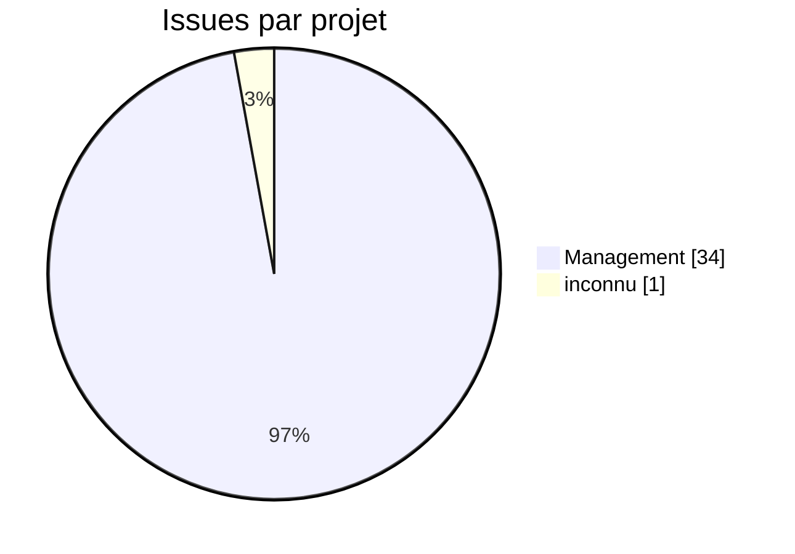

## Charge par assigne
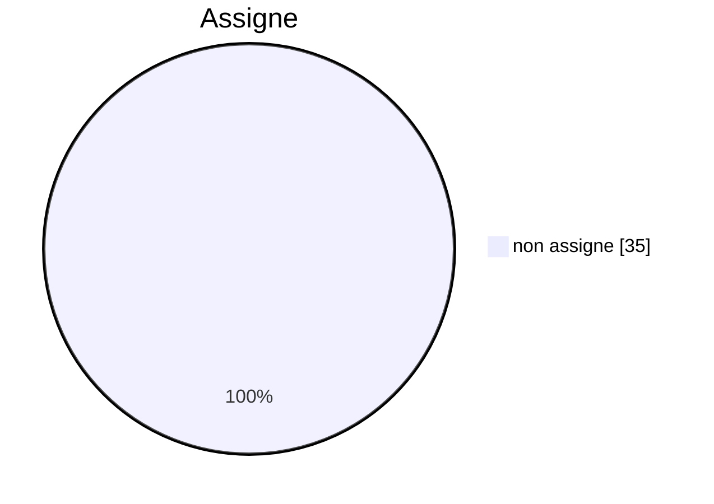

## Distribution des labels
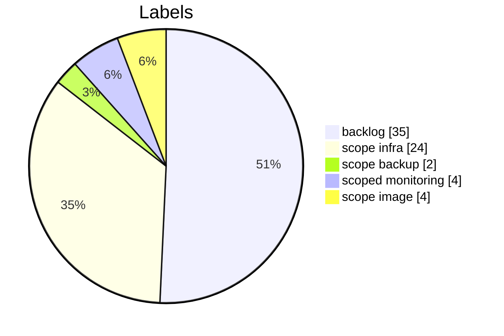

## Timeline des creations (par jour)
| Date | Issues creees |
|------|---------------|
| 2025-12-05 | 35 |

## Aging des issues (temps depuis creation)
| Tranche | Nb issues |
|---------|-----------|
| 0-7j | 35 |
| 8-14j | 0 |
| 15-30j | 0 |
| 30j+ | 0 |

## Gantt (approximatif)
Utilise created_at comme debut et due_date ou une duree par defaut.
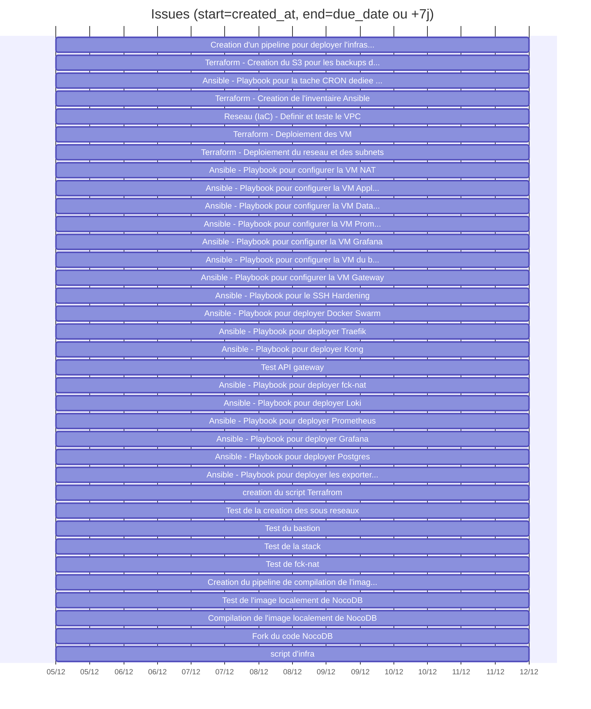

## Top labels (12)

| Label | Nb issues |
|-------|-----------|
| backlog | 35 |
| scope::infra | 24 |
| scoped::monitoring | 4 |
| scope::image | 4 |
| scope::backup | 2 |

# Tableau de bord GitLab (v2 - enrichi)

## KPIs
- Issues: 35 (etat GitLab: {'opened': 35})
- Etat derive via labels backlog/open/in-progress/closed: {'backlog': 35}
- Milestones: 0
- Projets: 2
- Labels uniques: 5 (issues sans label: 0)
- Issues avec due_date: 0/35

## Qualite des donnees (actionable)
- Ajouter due_date et assigne pour fiabiliser le pilotage.
- Aligner les labels sur les colonnes du board pour eviter 'unmapped'.
- Ajouter milestones (avec start/end) pour une vision planning realiste.

## Board / flux (repartition actuelle)

| Colonne | Description | Compte |
|---------|-------------|--------|
| backlog | Task to be picked up during sprint planning | 35 |
| open | Issues within a sprint, awating to be taken for development | 0 |
| in-progress | On-going work (must be assigned to somebody) | 0 |
| closed | Issue reached completion | 0 |
| unmapped | issues sans label de colonne | 0 |

## Repartition par projet

## Charge par assigne

## Distribution des labels

## Timeline des creations (par jour)
| Date | Issues creees |
|------|---------------|
| 2025-12-05 | 35 |

## Aging des issues (temps depuis creation)
| Tranche | Nb issues |
|---------|-----------|
| 0-7j | 35 |
| 8-14j | 0 |
| 15-30j | 0 |
| 30j+ | 0 |

## Gantt (approximatif)
Utilise created_at comme debut et due_date ou une duree par defaut.

## Top labels (12)

| Label | Nb issues |
|-------|-----------|
| backlog | 35 |
| scope::infra | 24 |
| scoped::monitoring | 4 |
| scope::image | 4 |
| scope::backup | 2 |

---
[← Module précédent](M40_methode-agile.md)
---
