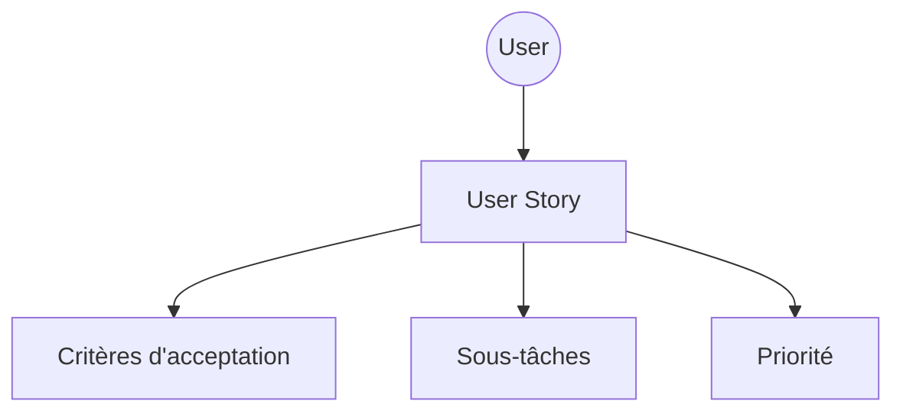
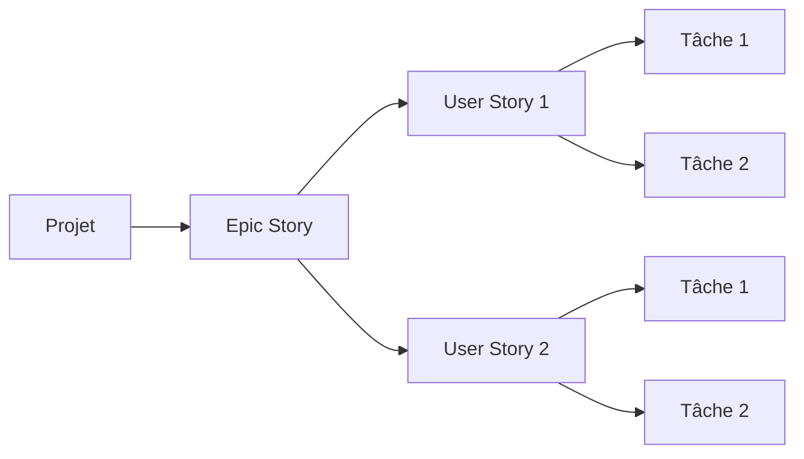
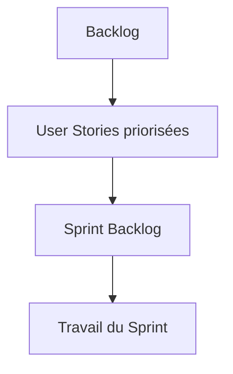
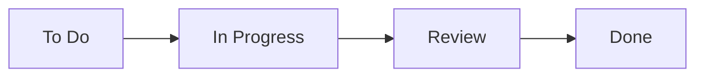
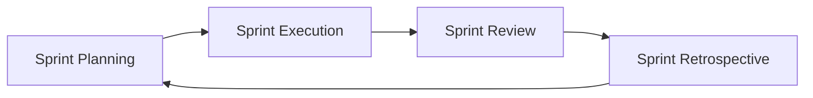
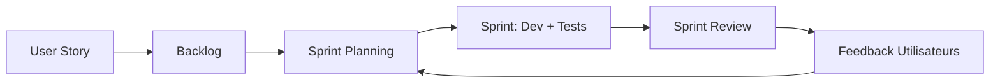
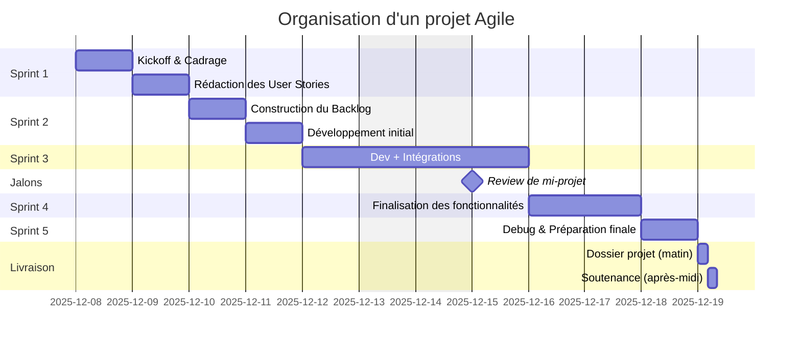

# 🎓 **Cours complet : Gestion de Projet Agile — approche SCRUM**

---

# 1. 🌍 Pourquoi l’Agile ?

Dans les projets informatiques modernes, les besoins changent vite : nouveaux utilisateurs, nouvelles contraintes, corrections inattendues, évolution du marché…

Les méthodes traditionnelles (séquentielles, linéaires) manquent de flexibilité : une fois la planification initiale figée, toute modification devient coûteuse.

L’Agile répond précisément à ce problème.

Elle repose sur plusieurs piliers :

- **Livraison rapide et régulière**
- **Adaptation continue**
- **Feedback fréquent**
- **Travail en petites fonctionnalités**
- **Vision centrée utilisateur**

L’objectif : **réduire la distance entre l’idée et la valeur livrée**.

---

# 2. 🚀 Principes fondamentaux de l’Agile

### Les méthodologies Agile partagent un socle commun :

- Travailler par **itérations courtes**
- Prioriser selon la **valeur apportée**
- Collaborer étroitement entre métier et technique
- Rendre visible l’avancement
- S’adapter plutôt que résister au changement

---

# 3. 🧠 SCRUM : le cadre Agile le plus utilisé

SCRUM organise le projet autour de cycles courts appelés **sprints**.

Chaque sprint vise à produire un **incrément du produit**, une partie utilisable et testable.

SCRUM repose sur trois éléments principaux :

1. **Des rôles**
2. **Des artefacts**
3. **Des événements (rituels)**

---

# 4. 👥 Les rôles dans SCRUM

## 🧑‍🏫 4.1. Product Owner (PO)

Il détient la vision du produit et représente les besoins des utilisateurs.

Ses responsabilités :

- Définir ce qui doit être développé
- Prioriser les fonctionnalités
- Alimenter et maintenir le backlog
- Valider la valeur livrée

## 🤝 4.2. L’équipe de développement

L’équipe est responsable de :

- la conception,
- le développement,
- les tests,
- la mise en production des fonctionnalités.

Elle met à jour l’état d’avancement en continu.

## 🧭 4.3. Scrum Master

Facilitateur du processus SCRUM :

- aide à respecter les rituels,
- supprime les obstacles,
- veille à la collaboration.

---

# 5. 📦 Les artefacts SCRUM

## 5.1. User Story

La User Story représente **une fonctionnalité simple exprimée du point de vue de l’utilisateur**.

Formulation standard :

> En tant que <UTILISATEUR>,
> 
> 
> **je veux** <FONCTIONNALITÉ>,
> 
> **afin de** <OBJECTIF>.
> 

Une bonne User Story est :

- simple,
- testable,
- centrée sur la valeur,
- suffisamment petite pour être réalisée en un sprint.

### Exemple de structure visuelle

Ce diagramme montre les différentes informations qui gravitent autour d'une User Story.

---

## 5.2. Epic Story (ou Épopée)

Une Epic représente une **grande fonctionnalité**, trop volumineuse pour être réalisée en un seul sprint.

Elle doit être **découpée** en plusieurs User Stories cohérentes.

Voici une représentation structurelle :

**Pourquoi découper ?**

- Pour éviter les gros blocs interminables
- Pour livrer plus régulièrement
- Pour respecter le rythme itératif
- Pour simplifier les tests et validations

---

## 5.3. Le Backlog

Le backlog est la **liste complète de toutes les fonctionnalités** à développer.

Il contient :

- Epic Stories
- User Stories
- Tâches techniques
- Bugs
- Améliorations

Il évolue constamment en fonction :

- de la priorisation métier,
- de la valeur,
- des feedbacks,
- des contraintes techniques.

Représentation simplifiée :

---

# 6. 🔁 Le fonctionnement d’un Sprint

Le sprint est une période courte (souvent 1 à 3 semaines) pendant laquelle l'équipe s'engage à réaliser un ensemble de User Stories.

---

## 6.1. Sprint Planning

Au début du sprint :

- Le PO propose les User Stories les plus prioritaires.
- L’équipe évalue la faisabilité et la charge.
- Chaque User Story est découpée en sous-tâches.

Le résultat : **le Sprint Backlog**, la liste des tâches prévues pour le sprint.

---

## 6.2. Déroulé du Sprint

Durant le sprint :

- L’équipe développe les fonctionnalités.
- Chacun met à jour l’état des tâches dans le tableau Kanban.
- Les tests sont réalisés au fur et à mesure.
- L’équipe se coordonne quotidiennement.

Illustration du mouvement des tâches :

---

## 6.3. Daily Scrum

Réunion rapide (10-15 minutes).

Chaque membre répond à trois questions :

1. Qu’ai-je fait depuis hier ?
2. Que vais-je faire aujourd’hui ?
3. Ai-je un blocage ?

Cela permet de maintenir une cadence fluide, de repérer tôt les risques et d’ajuster le travail.

---

## 6.4. Sprint Review

À la fin du sprint, l’équipe présente :

- les fonctionnalités réalisées,
- la démo du produit,
- les modifications éventuelles,
- les tests effectués.

Le PO et les utilisateurs donnent leur feedback.

---

## 6.5. Sprint Retrospective

Réunion interne à l’équipe, pour améliorer l’organisation.

Objectifs :

- identifier ce qui a bien fonctionné,
- identifier ce qui doit être amélioré,
- définir des actions concrètes pour le prochain sprint.

---

## 6.6. Fin du Sprint

Une fois le feedback intégré, un nouveau Sprint Planning démarre.

Le projet avance donc par **boucles successives**, chacune apportant de la valeur.

Représentation du cycle complet :

---

# 7. 🎯 Avantages & limites de l’Agile

## Avantages

- **Évolution rapide du produit**
- **Feedback utilisateur quasi immédiat**
- **Livraisons régulières**
- **Meilleure visibilité métier**
- **Adaptation en temps réel aux changements**

## Limites

- Délais parfois difficiles à chiffrer précisément
- Coûts plus variables
- Nécessite une forte collaboration PO ↔ équipe
- Demande une bonne discipline dans l’organisation

---

# 8. 🧩 Visualisation : le processus complet SCRUM

Voici un diagramme global :

---

# 9. 📆 Illustration : Organisation d’un projet en sprints

Voici un exemple d’organisation complète du projet en sprints consécutifs :

Ce diagramme montre comment un projet se décompose naturellement en plusieurs itérations, chacune ayant un objectif clair.

---

# 10. 🧠 Synthèse générale

L’Agile et SCRUM permettent de :

- livrer plus rapidement,
- réduire les risques,
- impliquer réellement l'utilisateur,
- améliorer le produit en continu,
- adapter le projet aux changements,
- garder une vision claire de l’avancement.

Chaque sprint est une **mini-aventure complète** : planification → réalisation → tests → démonstration → amélioration.