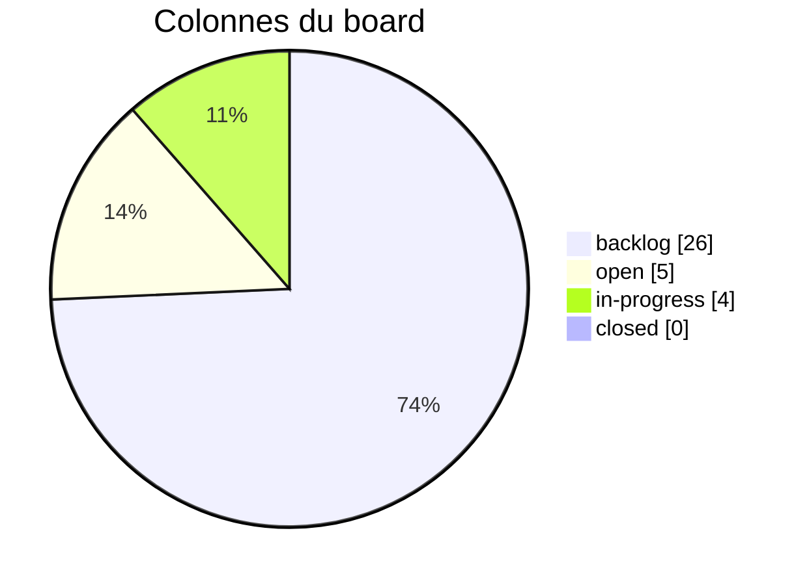
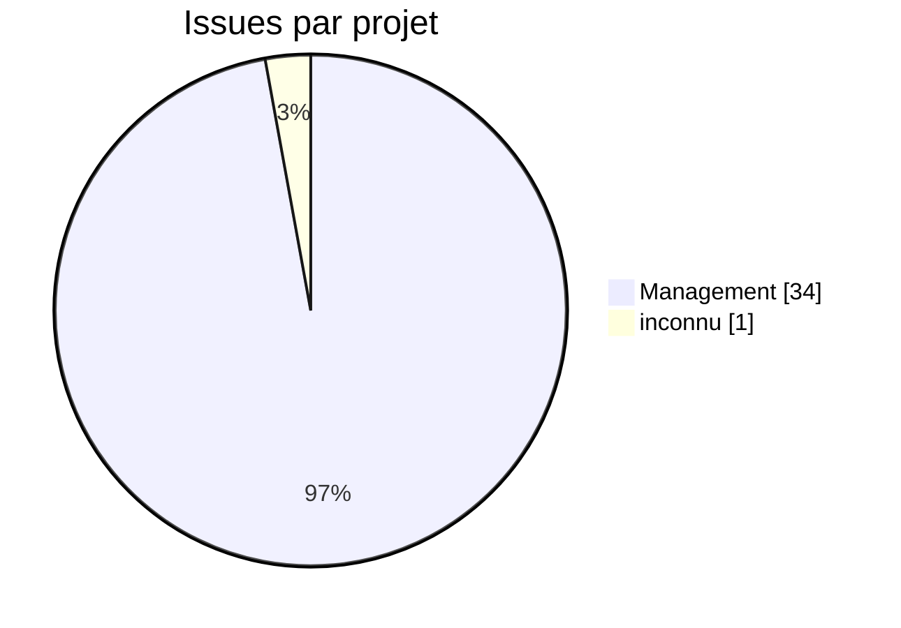
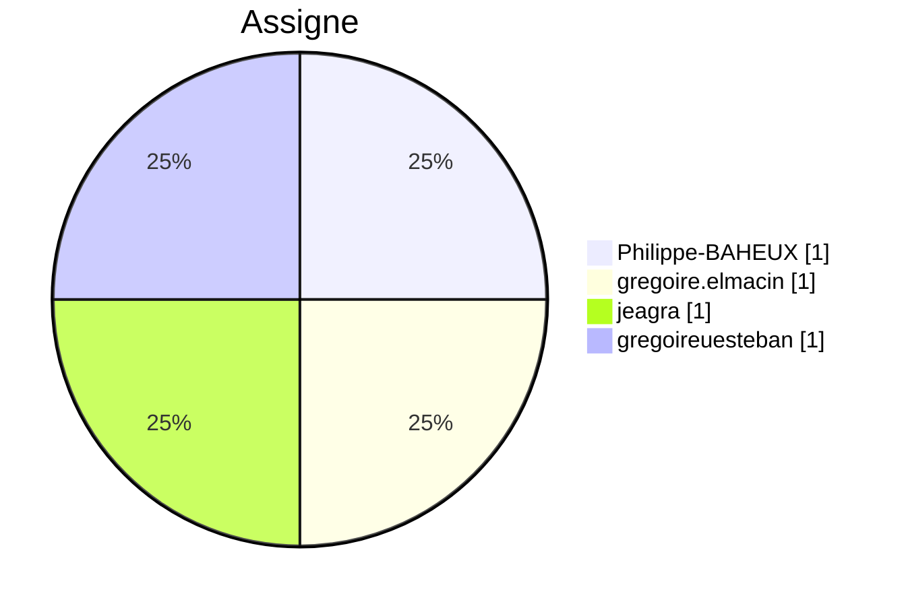
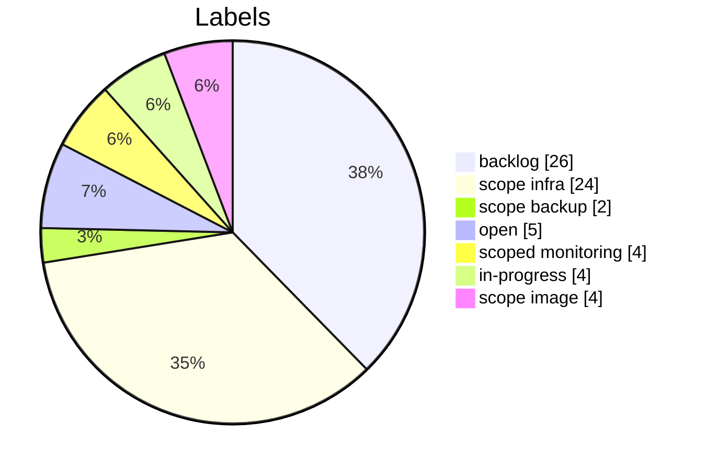
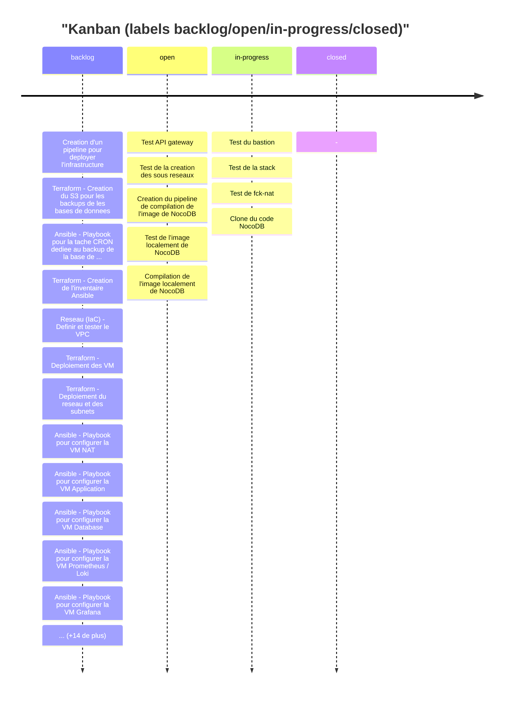
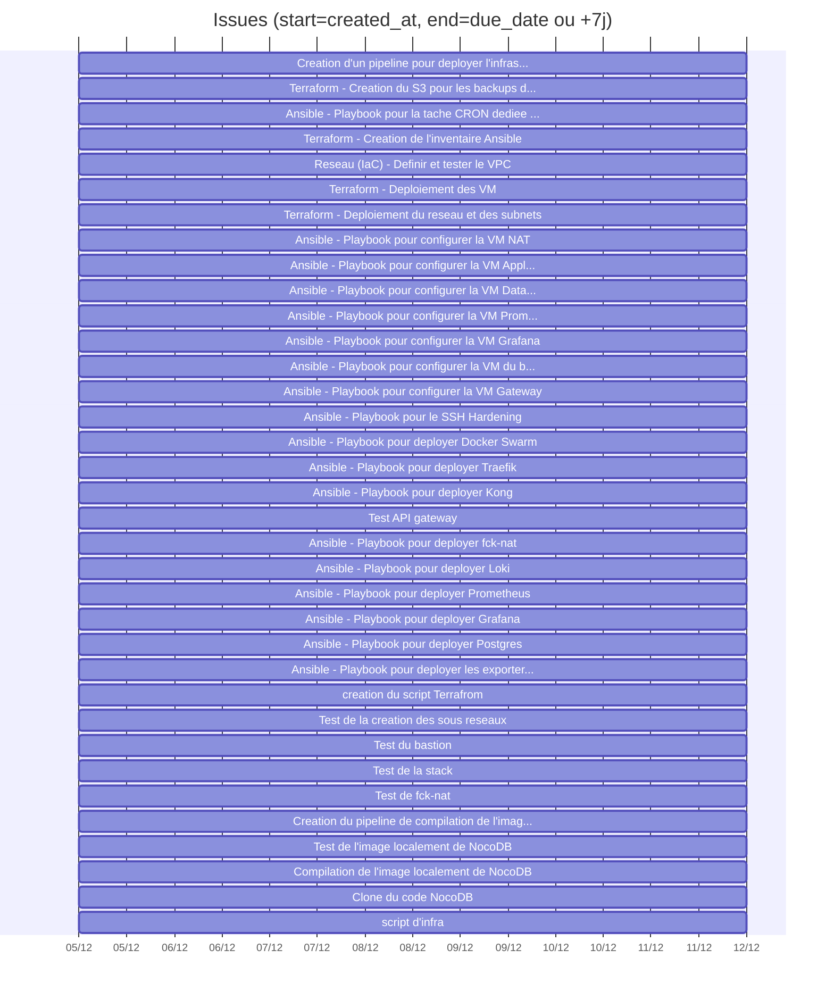

# Tableau de bord GitLab (v2 - enrichi)

## KPIs
- Issues: 35 (etat GitLab: {'opened': 35})
- Etat derive via labels backlog/open/in-progress/closed: {'backlog': 26, 'open': 5, 'in-progress': 4}
- Milestones: 0
- Projets: 2
- Labels uniques: 7 (issues sans label: 0)
- Issues avec due_date: 0/35

## Qualite des donnees (actionable)
- Ajouter due_date et assigne pour fiabiliser le pilotage.
- Aligner les labels sur les colonnes du board pour eviter 'unmapped'.
- Ajouter milestones (avec start/end) pour une vision planning realiste.

## Board / flux (repartition actuelle)

| Colonne | Description | Compte | % du total |
|---------|-------------|--------|------------|
| backlog | Task to be picked up during sprint planning | 26 | 74.3% |
| open | Issues within a sprint, awating to be taken for development | 5 | 14.3% |
| in-progress | On-going work (must be assigned to somebody) | 4 | 11.4% |
| closed | Issue reached completion | 0 | 0.0% |

## Repartition par projet

## Charge par assigne

| Assigne | Nb issues | % du total |
|---------|-----------|------------|
| non assigne | 31 | 88.6% |
| Philippe-BAHEUX | 1 | 2.9% |
| gregoire.elmacin | 1 | 2.9% |
| gregoireuesteban | 1 | 2.9% |
| jeagra | 1 | 2.9% |

## Distribution des labels

## Timeline des creations (par jour)

| Date | Issues creees |
|------|---------------|
| 05-12-2025 | 35 |

## Kanban (timeline Mermaid)

## Aging des issues (temps depuis creation)

| Tranche | Nb issues |
|---------|-----------|
| 0-7j | 35 |
| 8-14j | 0 |
| 15-30j | 0 |
| 30j+ | 0 |

## Gantt (approximatif)
Utilise created_at comme debut et due_date ou une duree par defaut.

## Top labels (12)

| Label | Nb issues |
|-------|-----------|
| backlog | 26 |
| scope::infra | 24 |
| open | 5 |
| scoped::monitoring | 4 |
| in-progress | 4 |
| scope::image | 4 |
| scope::backup | 2 |