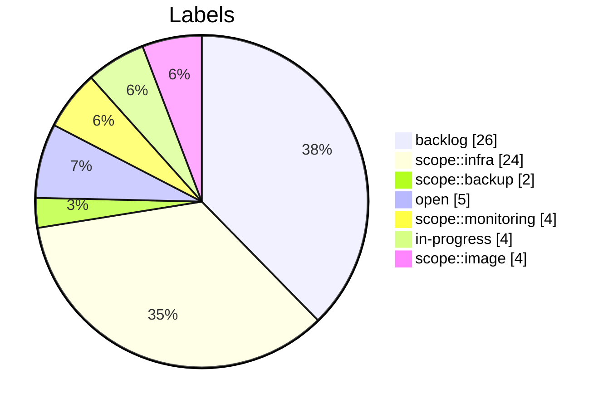

# Tableau de bord GitLab – Projet QuickData (v3)

> Objectif : en un coup d'œil, répondre à 3 questions :
> 1. Où en est le projet ?
> 2. Quelle est la qualité de nos données (backlog, assignees, due_date) ?
> 3. Qui fait quoi, sur quels scopes ?

---

## 1. Sante du projet (qualite des donnees)
Ces indicateurs servent à savoir si le board est pilotable : sans assignees, sans due_date, sans milestones, on ne peut pas parler de charge, de retard ou de priorites.

**KPIs globaux**
- Issues : **35**
- Milestones : **0**
- Projets couverts : **2**
- Labels uniques : **7**
- Issues sans label : **0**

### 1.1. % d'issues assignees

### 1.2. % d'issues avec due_date

## 2. Avancement (flux de travail & temps)
### 2.1 Repartition par colonne du board

Colonne | Description | Nb issues | % du total
|---------|-------------|--------|------------|
| backlog | Task to be picked up during sprint planning | 26 | 74.3% |
| open | Issues within a sprint, awating to be taken for development | 5 | 14.3% |
| in-progress | On-going work (must be assigned to somebody) | 4 | 11.4% |
| closed | Issue reached completion | 0 | 0.0% |

### 2.2 Kanban (vue synthetique)

### 2.3 Timeline des creations

| Date | Issues creees |
|------|---------------|
| 05-12-2025 | 35 |

### 2.4 Aging des issues (anciennete)

| Tranche | Nb issues |
|---------|-----------|
| 0-7j | 35 |
| 8-14j | 0 |
| 15-30j | 0 |
| 30j+ | 0 |

### 2.5 Gantt des taches (approximatif)
Utilise start_date si renseignee, sinon created_at comme debut, et due_date/closed_at ou une duree par defaut.

## Charge & focus

### Repartition par projet

### Charge par assigne (pie hors non assigne)

| Assigne | Nb issues | % du total |
|---------|-----------|------------|
| non assigne | 31 | 88.6% |
| Philippe-BAHEUX | 1 | 2.9% |
| gregoire.elmacin | 1 | 2.9% |
| gregoireuesteban | 1 | 2.9% |
| jeagra | 1 | 2.9% |

### Distribution des labels

### Top labels par assigne (3 premiers)
| Assigne | Top labels |
|---------|------------|
| Philippe-BAHEUX | in-progress:1, scope::infra:1 |
| gregoire.elmacin | in-progress:1, scope::infra:1 |
| gregoireuesteban | in-progress:1, scope::image:1 |
| jeagra | in-progress:1, scope::infra:1 |

### Top labels global (12)

| Label | Nb issues |
|-------|-----------|
| backlog | 26 |
| scope::infra | 24 |
| open | 5 |
| scope::monitoring | 4 |
| in-progress | 4 |
| scope::image | 4 |
| scope::backup | 2 |

## 4. Limites actuelles & pistes d'amelioration
- Assigner toutes les issues actives (open / in-progress) pour piloter la charge.
- Renseigner des due_date sur les taches critiques (infra, bastion, NAT, monitoring, etc.).
- Ajouter des milestones (MVP, demo, soutenance) avec start/end pour suivre les echeances.
- Enrichir les labels scopes pour mieux segmenter (scope::infra, scope::monitoring, etc.).