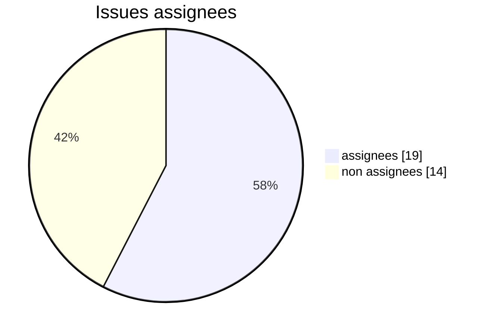
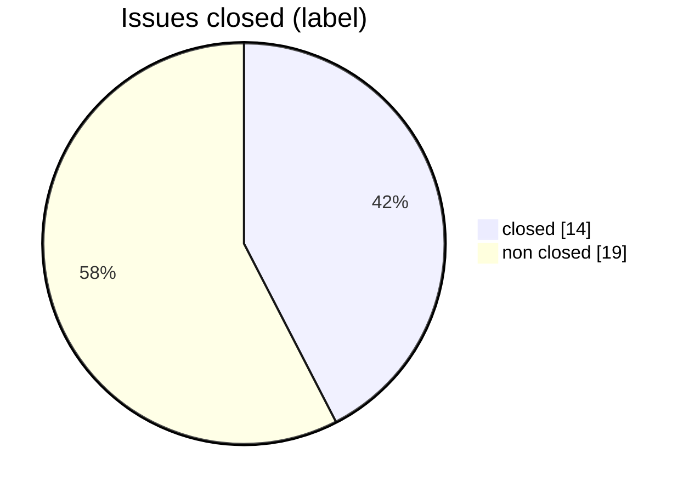
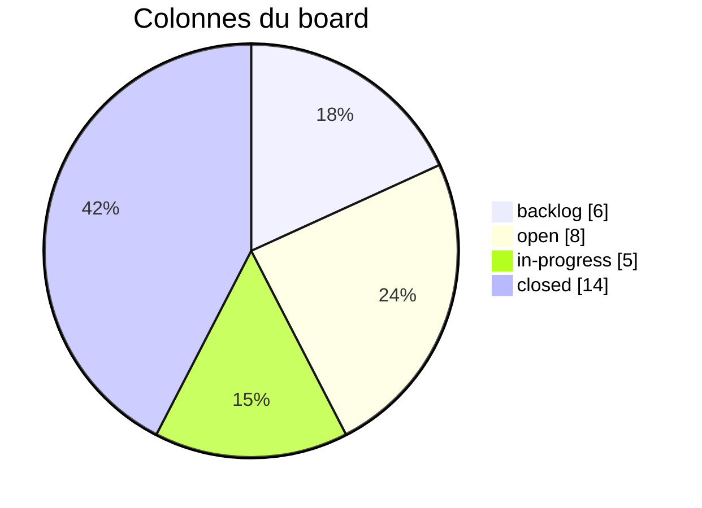
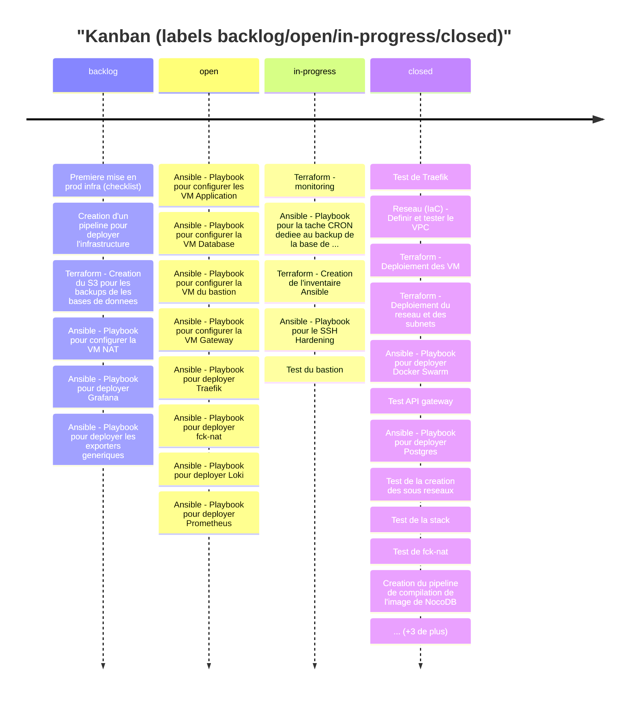
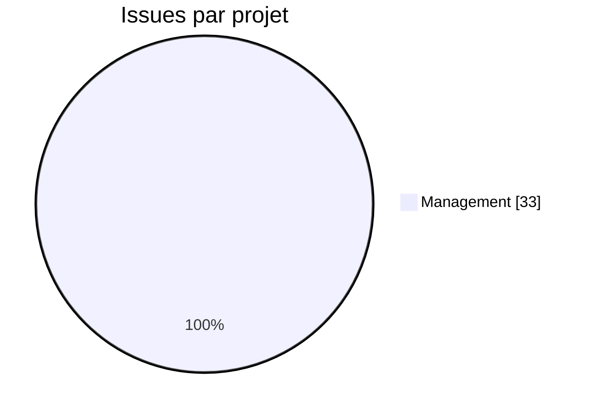
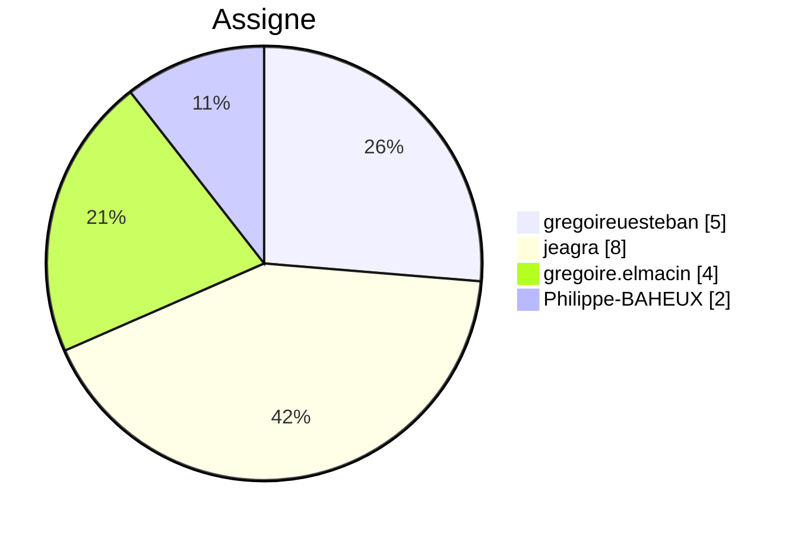
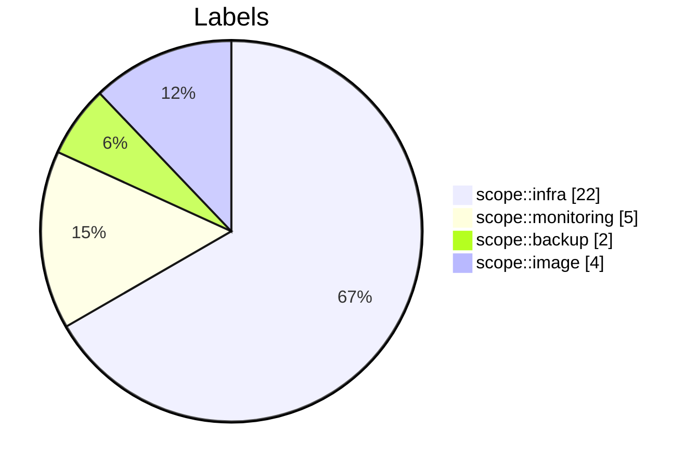

# Tableau de bord GitLab – Projet QuickData (v3)

> Objectif : en un coup d'œil, répondre à 3 questions :
> 1. Où en est le projet ?
> 2. Quelle est la qualité de nos données (backlog, assignees, due_date) ?
> 3. Qui fait quoi, sur quels scopes ?

---

## 1. Sante du projet (qualite des donnees)
Ces indicateurs servent à savoir si le board est pilotable : sans assignees, sans due_date, sans milestones, on ne peut pas parler de charge, de retard ou de priorites.

**KPIs globaux**
- Issues : **33**
- Milestones : **0**
- Projets couverts : **1**
- Labels uniques : **8**
- Issues sans label : **0**
- Issues prêtes (assignee + due_date) : **0**

### 1.1. Pourcentage d'issues assignees

### 1.2. Pourcentage d'issues en closed (label)

## 2. Avancement (flux de travail & temps)
### 2.1. Repartition par colonne du board

> Lecture :
> - **backlog** : 6 issues (18.2 %)
> - **open** : 8 issues (24.2 %)
> - **in-progress** : 5 issues (15.2 %)
> - **closed** : 14 issues (42.4 %)

### 2.2. Kanban (vue synthetique)

### 2.3. Timeline des creations

| Date | Issues creees |
|------|---------------|
| 05-12-2025 | 30 |
| 10-12-2025 | 2 |
| 11-12-2025 | 1 |

### 2.4. Aging des issues (anciennete)

| Tranche | Nb issues |
|---------|-----------|
| 0-2j | 3 |
| 3-8j | 30 |
| 9-14j | 0 |
| 15j+ | 0 |

## 3. Charge & focus

### 3.1. Repartition par projet

### 3.2. Charge par assigne (pie hors non assigne)

| Assigne | Nb issues | % du total |
|---------|-----------|------------|
| non assigne | 14 | 42.4% |
| jeagra | 8 | 24.2% |
| gregoireuesteban | 5 | 15.2% |
| gregoire.elmacin | 4 | 12.1% |
| Philippe-BAHEUX | 2 | 6.1% |

### 3.3. Distribution des labels (scopes fonctionnels)

### 3.4. Top labels par assigne (max 2, sans labels d'etat)

| Assigne | Label #1 | Label #2 |
|---------|----------|----------|
| Philippe-BAHEUX | scope::infra (2) |  |
| gregoire.elmacin | scope::infra (3) | scope::backup (1) |
| gregoireuesteban | scope::image (4) | scope::infra (1) |
| jeagra | scope::infra (7) |  |

### 3.5. Top labels globaux (fonctionnels, max 5)

| Label | Nb issues |
|-------|-----------|
| scope::infra | 22 |
| scope::monitoring | 5 |
| scope::image | 4 |
| scope::backup | 2 |

---
[← Module précédent](M45_ansible-backup.md)
---
