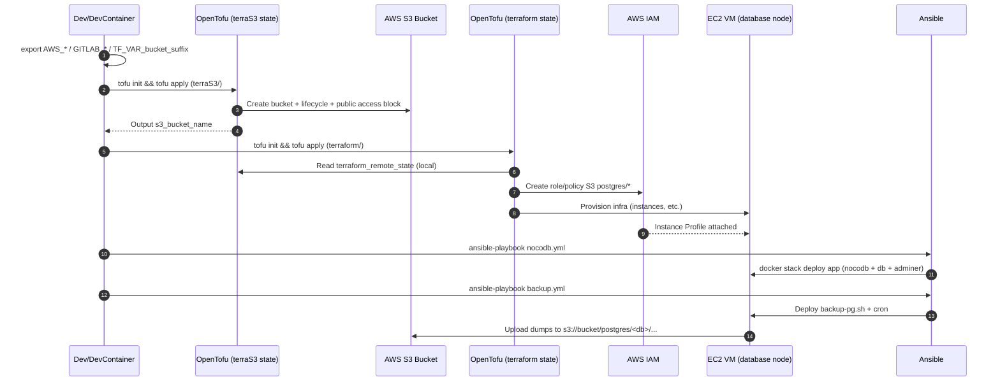

# 🔁 Suite – Externalisation du stockage des backups PostgreSQL avec S3 (Terraform + Ansible)

Dans la partie précédente de ce module, nous avons mis en place un **système de sauvegarde PostgreSQL automatisé** via Ansible, reposant sur :

- un script `pg_dump` exécuté depuis la VM database,
- un stockage distant des dumps,
- une planification via `cron`.

La suite logique consistait à **industrialiser et fiabiliser le stockage des backups**, en particulier dans un contexte :

- **multi-collaborateurs**,
- **cloud AWS**,
- **infra déclarative (Terraform)**.

---

## 🎯 Objectifs de cette évolution

1. Déployer un **bucket S3 AWS** pour stocker les sauvegardes PostgreSQL.
2. Gérer ce bucket via **Terraform** (Infrastructure as Code).
3. Résoudre la contrainte majeure :
    
    👉 **les noms de buckets S3 sont uniques au niveau mondial**.
    
4. Éviter toute suppression accidentelle des backups lors d’un `terraform destroy`.
5. Connecter proprement **Terraform → Ansible → scripts bash**, sans saisie manuelle.

---

## 🧱 Mise en place du bucket S3 avec Terraform

### Pourquoi Terraform ?

- Reproductibilité
- Versioning Git
- Alignement avec le reste de l’infrastructure
- Séparation claire infra / config / exploitation

---

### ⚠️ Problème rencontré : unicité mondiale des buckets S3

Lors des premiers tests, plusieurs collaborateurs ont rencontré l’erreur suivante :

```
Error: creating S3 Bucket (...) BucketAlreadyExists

```

👉 Chaque collaborateur essayait de créer **le même bucket**, dans **son propre compte AWS**.

---

## ✅ Solution retenue : suffixe dynamique par utilisateur

Nous avons choisi une solution **simple, explicite et maîtrisée** :

- Le nom du bucket est composé de :
    - un **nom de base commun**
    - un **suffixe unique par personne**

### Exemple

```
quickdata-pg-backups-storage-bucket-ppr
quickdata-pg-backups-storage-bucket-grego
quickdata-pg-backups-storage-bucket-philippe

```

---

### 🔧 Variable Terraform utilisée

Le suffixe est injecté via une **variable d’environnement Terraform** :

```bash
export TF_VAR_bucket_suffix="ppr"

```

Terraform construit alors dynamiquement le nom du bucket.

---

### 📄 Exemple de code (terraS3)

**`variables.tf`**

```hcl
variable "s3_bucket_base_name" {
  description = "Nom de base du bucket (sans suffixe)"
  type        = string
  default     = "quickdata-pg-backups-storage-bucket"
}

variable "bucket_suffix" {
  description = "Suffixe unique par personne"
  type        = string
}

```

**`locals.tf`**

```hcl
locals {
  s3_bucket_name = "${var.s3_bucket_base_name}-${lower(var.bucket_suffix)}"
}

```

---

## 🗂️ Séparation des states Terraform : choix clé du projet

### Problème identifié

Si le bucket S3 est géré dans le **même state Terraform que l’infrastructure applicative**, alors :

```bash
terraform destroy

```

➡️ **supprime aussi les backups**, ce qui est inacceptable.

---

## ✅ Solution retenue : un state Terraform dédié au stockage

Nous avons choisi de **séparer le bucket S3 dans un autre répertoire Terraform**, avec son propre state.

### Arborescence finale

```
infrastructure/
├── terraform/        # Infra applicative (VM, IAM, Swarm, etc.)
│
├── terraS3/          # Stockage long terme (bucket S3)
│   ├── main.tf
│   ├── s3.tf
│   ├── variables.tf
│   ├── locals.tf
│   └── outputs.tf
│
└── ansible/

```

---

### Avantages de ce choix

- 🔐 Le bucket **n’est jamais supprimé par erreur**
- 🔁 L’infra applicative peut être détruite/recréée librement
- 📦 Le stockage devient un composant **long-lived**
- 👥 Approche parfaitement adaptée au travail en équipe

---

## 🔗 Connexion entre les deux states : `terraform_remote_state`

L’infrastructure applicative a quand même besoin de :

- connaître le **nom du bucket**,
- créer des **policies IAM** ciblées.

Pour cela, nous utilisons `terraform_remote_state`.

### Exemple (`terraform/remote_state.tf`)

```hcl
data "terraform_remote_state" "s3" {
  backend = "local"
  config = {
    path = "../terraS3/terraform.tfstate"
  }
}

locals {
  s3_bucket_name = data.terraform_remote_state.s3.outputs.s3_bucket_name
  s3_bucket_arn  = "arn:aws:s3:::${local.s3_bucket_name}"
}

```

---

## 🔐 IAM : accès minimal au bucket depuis la VM database

Dans le state **app**, nous créons :

- un rôle IAM attaché à la VM database,
- une policy limitée strictement à :
    - `ListBucket`
    - `PutObject / GetObject / DeleteObject` sur `postgres/*`

➡️ **Principe du moindre privilège respecté**.

---

## 🔄 Adaptations côté Ansible

### 1. Plus de nom de bucket “en dur”

Le bucket est désormais :

- créé par Terraform,
- exporté via un `output`,
- récupéré dans Ansible comme variable.

### Exemple injecté dans les logs de déploiement

```
DB host/service : db
DB name        : nocodb_db
DB user        : admin
S3 bucket      : quickdata-pg-backups-storage-bucket-ppr

```

👉 Cela permet de **valider visuellement** la cohérence du déploiement.

---

### 2. Scripts bash inchangés dans leur logique

Les scripts :

- `backup-pg.sh`
- `restore-pg-latest.sh`

fonctionnent toujours de la même manière, mais :

- reçoivent désormais un **bucket dynamique**,
- sont découplés de la création de l’infrastructure.

---

## 🧪 Ordre d’exécution recommandé

### 1️⃣ Déploiement du stockage

```bash
cd terraS3
tofu init
tofu apply -auto-approve

```

### 2️⃣ Déploiement de l’infrastructure applicative

```bash
cd terraform
tofu init
tofu apply -auto-approve

```

### 3️⃣ Configuration logicielle

```bash
cd ansible
ansible-playbook nocodb.yml --ask-vault-password

```

---

## 🔐 Variables d’environnement nécessaires

Avant toute exécution :

```bash
export AWS_ACCESS_KEY_ID=
export AWS_SECRET_ACCESS_KEY=
export GITLAB_USER=
export GITLAB_PAT=
export TF_VAR_bucket_suffix=

```
---
## Diagramme de séquence du déploiement



---

## 🧠 Bilan des choix techniques

| Problème | Solution retenue | Justification |
| --- | --- | --- |
| Unicité S3 | Suffixe dynamique | Simple, lisible, collaboratif |
| Risque de perte | State Terraform séparé | Sécurité des backups |
| Couplage infra / stockage | `terraform_remote_state` | Découplage propre |
| Droits AWS | IAM minimal | Sécurité |
| Exploitation | Logs enrichis | Observabilité |

---

👉 Cette évolution marque une **étape clé** :

on ne parle plus seulement de backup, mais de **gestion durable des données**, intégrée proprement à une chaîne DevOps complète.

---
[Module suivant →](M51_image-infra.md)
---
