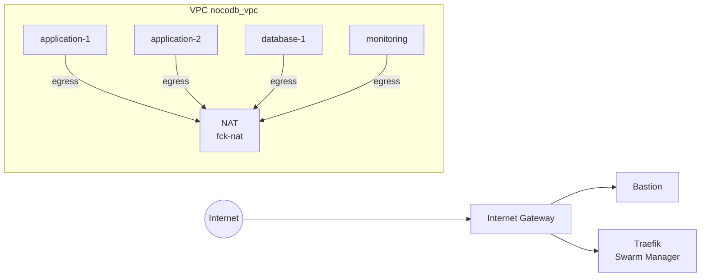
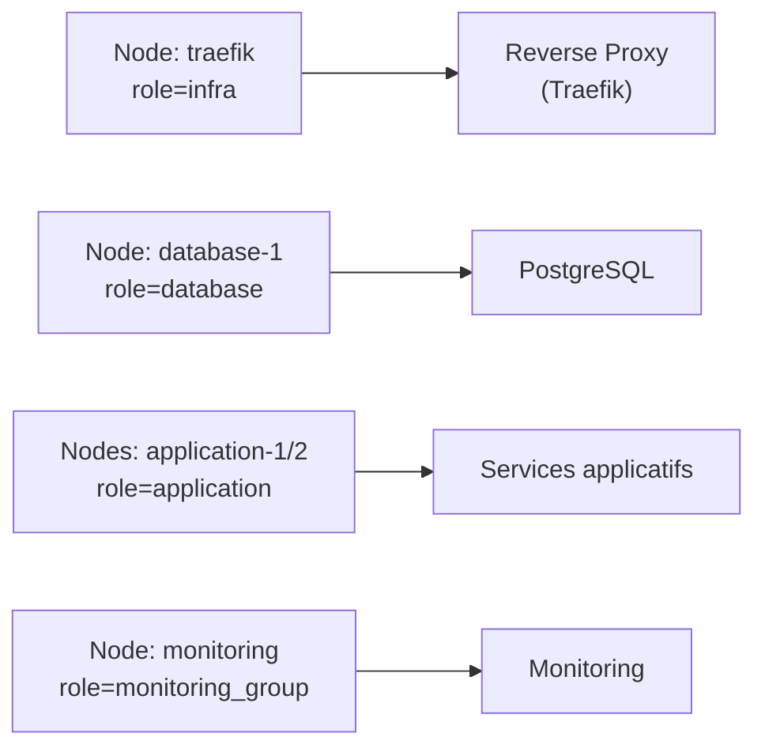
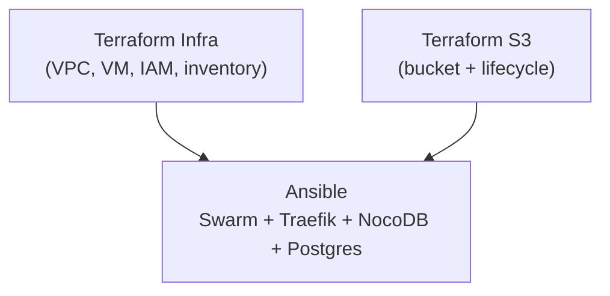

# État de l’infrastructure DevOps – 18 décembre

## 1. Objectif de l’infrastructure au 18/12

À cette date, l’objectif est d’avoir une **infrastructure AWS complète, reproductible et exploitable**, permettant :

- le déploiement d’une application NocoDB en environnement distribué,
- l’orchestration via Docker Swarm,
- une exposition sécurisée via Traefik,
- une séparation claire des rôles réseau et applicatifs,
- un système de sauvegarde PostgreSQL externalisé sur S3,
- et une base d’observabilité minimale.

L’infrastructure est désormais **fonctionnelle, testée et stabilisée**.

---

## 2. Découpage Terraform actuel

L’infrastructure est volontairement découpée en **deux states Terraform distincts**, chacun ayant une responsabilité claire.

### 2.1 Terraform – Infra applicative (`terraform/infra`)

Ce state est responsable de tout ce qui est **volatile / reconstructible** :

- Réseau AWS (VPC, subnets, routes, NAT, IGW)
- Machines virtuelles
- Security Groups
- Clés SSH
- Rôles IAM liés à l’exploitation
- Inventaire Ansible

👉 Ce state peut être **détruit et recréé** sans perte de données critiques.

### 2.2 Terraform – Stockage S3 (`terraform/S3`)

Ce state est responsable **uniquement du stockage de sauvegarde** :

- Bucket S3 PostgreSQL
- Blocage total de l’accès public
- Politique de rétention automatique
- Outputs exposant le nom du bucket

👉 Ce state est **déployé à part** et considéré comme **long-lived**.

---

## 3. Infrastructure réseau AWS (photo au 18/12)

### 3.1 VPC et segmentation réseau

L’infrastructure repose sur un VPC unique avec plusieurs subnets fonctionnels :

- subnet bastion
- subnet gateway / traefik
- subnet application
- subnet database
- subnet monitoring

Un **NAT dédié** permet la sortie internet des subnets privés.

### Schéma réseau



👉 Cette architecture permet :

- un point d’entrée maîtrisé,
- une séparation des rôles,
- une sortie internet contrôlée pour les services internes.

---

## 4. Machines virtuelles et rôles

Terraform provisionne les instances suivantes :

| VM | Rôle |
| --- | --- |
| bastion | Accès administratif |
| traefik | Swarm manager + reverse proxy |
| application-1 / application-2 | Services applicatifs |
| database-1 | PostgreSQL |
| monitoring | Supervision |
| nat | Sortie internet privée |

Chaque VM dispose :

- d’un **Security Group dédié**,
- d’une **clé SSH générée automatiquement**,
- d’un nom cohérent avec l’inventaire Ansible.

---

## 5. Docker Swarm (orchestration)

### 5.1 Organisation du cluster

- `traefik` : **manager Swarm**
- `application-*`, `database-1`, `monitoring` : **workers**

Des **labels Swarm** sont appliqués automatiquement :

- `role=infra`
- `role=application`
- `role=database`
- `role=monitoring_group`

👉 Ces labels permettent un **placement strict** des services.

### Schéma de placement Swarm



---

## 6. Déploiement applicatif

### 6.1 Reverse proxy

- Traefik déployé via `docker stack`
- TLS activé
- Routage centralisé

### 6.2 Stack NocoDB

- Image NocoDB versionnée depuis GitLab Registry
- PostgreSQL déployé sur le nœud `database`
- Réseaux overlay `backend` et `proxy`
- Attente active sur la réplication Swarm

👉 Le déploiement est **idempotent** et tolérant aux délais Swarm.

---

## 7. Sauvegarde PostgreSQL – état final

### 7.1 Stockage S3

Le bucket est désormais :

- créé via `terraform/S3`,
- nommé dynamiquement avec suffixe utilisateur,
- protégé contre l’accès public,
- doté d’une politique de rétention.

Exemple réel au 18/12 :

```bash
export TF_VAR_bucket_suffix=grego
tofu apply -auto-approve

```

Résultat :

```
quickdata-pg-backups-storage-bucket-grego

```

### 7.2 Logique DevOps

- Le **bucket n’est pas détruit** lors d’un `destroy` de l’infra.
- Les backups survivent aux reconstructions complètes.
- Le nom du bucket est injecté dans Ansible via outputs / remote state.

👉 Le stockage devient une **brique indépendante**, comme en production.

---

## 8. Chaîne d’exploitation validée



---

## 9. Conclusion (photo au 18/12)

À la date du 18 décembre, l’infrastructure présente :

- une séparation claire **infra / stockage**,
- une orchestration Swarm fonctionnelle,
- un déploiement applicatif stable,
- une gestion sécurisée des accès,
- une approche DevOps réaliste et industrialisable.

Cette version constitue une **base solide**, proche d’une architecture de production, sur laquelle peuvent désormais s’ajouter :

- la restauration automatisée,
- la supervision avancée,
- ou des pipelines CI/CD.

---
[← Module précédent](M51_backup-S3-terra.md) | [Module suivant →](M51_projet-board-J11.md)
---
